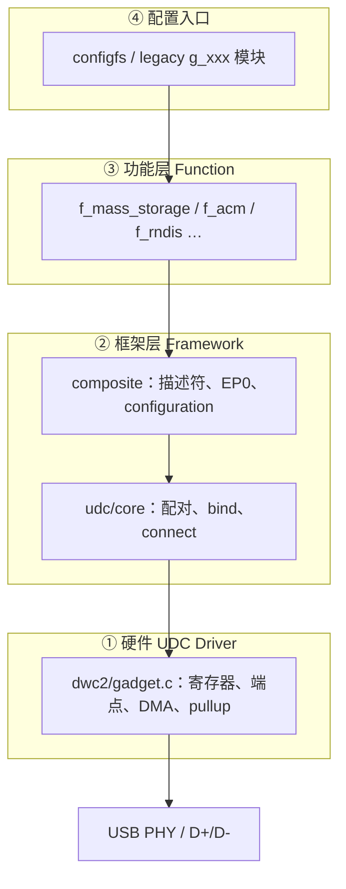

# 02 · 架构总览

| | |
|---|---|
| **前置** | 可选 [`01-acm-practice.md`](01-acm-practice.md) |
| **本文** | 四层架构、四对象、probe/bind 分离、控制/数据面划分 |
| **下一步** | [`03-configfs-assembly.md`](03-configfs-assembly.md)；框架深入 [`06-udc-core-bind.md`](06-udc-core-bind.md) |

> 层：**全栈 D0**。系列：[`README.md`](README.md) · [`SERIES-GUIDE.md`](SERIES-GUIDE.md)

---

## 0. 本系列在整体中的位置

矩阵与扩展规则：[`SERIES-GUIDE.md`](SERIES-GUIDE.md) · 文档清单：[`SERIES-MANIFEST.md`](SERIES-MANIFEST.md)

| 阶段 | 文档 | 层 | 深度 |
|------|------|-----|------|
| 入门 | 01 | L0 | 实践 |
| **框架** | **02（本文）** | 全栈 | D0 |
| 组装/走读/速查 | 03–05 | L1–L2 | D1–D3 |
| 关键实现 | 06–08 | L2–L4 | D4 |
| 附录 | A1–A6 | L5–L6 | D4–D5 |

完整路线见 [`README.md` §5](README.md#5-推荐阅读路线)。

---

## 1. 核心问题

USB Gadget 子系统要回答：

> **一块 USB 控制器硬件，如何在内核里变成 Host 可枚举、可使用的 USB 从机设备？**

设计答案：**分层 + 延迟绑定**——硬件先注册，功能后装配，两者在运行时配对；pullup 在装配完成后再接通。

---

## 2. 四层架构



| 层 | 主要路径 | 职责 | 不应做 |
|---|---|---|---|
| 硬件 UDC | `drivers/usb/dwc2/gadget.c` | 端点、EP0、中断、pullup、Buffer DMA | 不知道自己是 U 盘还是串口 |
| 框架 | `drivers/usb/gadget/udc/core.c`<br>`drivers/usb/gadget/composite.c` | UDC 配对、EP0 分发、描述符框架 | 不实现具体 USB 类协议 |
| 功能 Function | `drivers/usb/gadget/function/f_*.c` | USB 类协议与业务逻辑 | 不直接写 SoC 寄存器 |
| 配置入口 | `drivers/usb/gadget/configfs.c`<br>`drivers/usb/gadget/legacy/` | 用户决定「扮演什么设备」 | 不参与 bulk/int 传输 |

**抽象边界**：功能层只通过 `usb_gadget`、`usb_ep`、`usb_request` 访问硬件（`include/linux/usb/gadget.h`），与具体 UDC 驱动解耦。

---

## 3. 四个关键对象

每个对象只回答一个问题，勿混用：

| 对象 | 回答的问题 | 谁创建 | 生命周期 |
|---|---|---|---|
| `struct usb_gadget` | 这块硬件有哪些端点、能跑多快？ | UDC 驱动（dwc2） | 随 UDC probe/remove |
| `struct usb_udc` | 内核如何管理、sysfs 暴露、绑定功能驱动？ | `usb_add_gadget_udc()` | 与 `usb_gadget` 1:1 |
| `struct usb_gadget_driver` | 这块硬件要扮演什么 USB 设备？ | configfs / legacy 模块 | 写 UDC / insmod 时绑定 |
| `struct usb_composite_dev` | 枚举需要哪些描述符、config、function？ | `bind()` 回调内装配 | bind 期间建立，unbind 销毁 |

关系：

```
usb_udc  ──管理──► usb_gadget
usb_gadget_driver  ──绑定到──► usb_udc
usb_composite_dev  ──挂在──► usb_gadget（bind 时）
usb_function  ──属于──► usb_configuration
```

`usb_udc` 定义于 `drivers/usb/gadget/udc/core.c`（非公开头文件）；`usb_gadget` 内嵌 `struct usb_udc *udc` 反向指针。

---

## 4. 两阶段生命周期

### 4.1 阶段 A：硬件注册（boot / dwc2 probe）

```
dwc2_driver_probe()                    // platform.c
  … dr_mode 判定、dwc2_get_hwparams …
  if (dr_mode != HOST)
      dwc2_gadget_init()               // gadget.c
          初始化 hsotg->gadget、端点
          usb_add_gadget_udc(dev, &hsotg->gadget)
              创建 usb_gadget + usb_udc
              加入 udc_list
              /sys/class/udc/<name> 出现
  if (dr_mode != PERIPHERAL)
      dwc2_hcd_init()
  dwc2_drd_init()                      // OTG + role-switch
```

此时：**有控制器抽象，无 USB 设备功能**，通常尚未 pullup。

示例平台：`dr_mode = "otg"`（`stm32mp151.dtsi`）→ Gadget 与 HCD **均初始化**；实际 Host/Device 角色由 `usb-role-switch` + Type-C extcon 切换（`drd.c`）。

### 4.2 阶段 B：功能绑定（用户写 UDC / insmod）

```
echo "49000000.usb-otg" > .../UDC       // configfs
  gadget_dev_desc_UDC_store()           // configfs.c
    usb_gadget_probe_driver(&gi->composite.gadget_driver)
      udc_bind_to_driver(udc, driver)   // udc/core.c
        ① udc->driver = driver
        ② driver->bind(gadget, driver)  // configfs_composite_bind
        ③ usb_gadget_udc_start()        // dwc2: hsotg->driver = driver
        ④ usb_udc_connect_control()     // pullup
```

**设计意图**：
- 功能驱动与 UDC 驱动 **probe 顺序无关** → `gadget_driver_pending_list`（`udc/core.c`）
- pullup 在 bind 成功 **之后**，避免 Host 枚举半成品

### 4.3 probe 顺序无关：pending 列表

| 谁先发生 | 行为 |
|---|---|
| 功能驱动先（insmod / 写 UDC 时 UDC 未就绪） | `usb_gadget_probe_driver()` → 加入 `gadget_driver_pending_list` |
| UDC 后（`usb_add_gadget_udc`） | `check_pending_gadget_drivers()` 补绑 |
| UDC 删除时仍有绑定驱动 | `usb_del_gadget_udc()` → unbind 后驱动重新入 pending |

---

## 5. 三条「绑定链」（勿混为一谈）

| 链 | 位置 | 绑定内容 |
|---|---|---|
| ① UDC 管理 | `udc_bind_to_driver()` 1352–1354 行 | `udc->driver`、`gadget->dev.driver` |
| ② Composite 装配 | `driver->bind()` → `configfs_composite_bind()` | `cdev->gadget`、`usb_add_function()`、描述符/端点 |
| ③ 硬件 dispatch | `usb_gadget_udc_start()` → dwc2 `udc_start()` | `hsotg->driver`（EP0 中断调 `->setup()`） |

```
① 管理关系（谁驱动这块 UDC）
② 软件装配（Host 看到什么设备）
③ 硬件回调（中断里找 setup）
④ pullup（物理可见）—— 在 ②③ 之后
```

---

## 6. `dr_mode` 的确定（与运行角色区分）

**配置能力**（probe 时一次确定）：

```
usb_get_dr_mode(dev)          // DTS dr_mode 属性
  缺省 → USB_DR_MODE_OTG
× dwc2_hw_is_host/device()    // GHWCFG2.OTG_MODE
× Kconfig                     // DUAL_ROLE / HOST / PERIPHERAL
→ hsotg->dr_mode
```

示例平台典型结果：`dr_mode = OTG`（DTS `"otg"` + `CONFIG_USB_DWC2_DUAL_ROLE`）。

**运行角色**（运行时切换）：`dwc2_drd_init()` + `usb-role-switch`，与 `dr_mode` 不同——`dr_mode=otg` 表示 **能力**，非当前是 Host 还是 Device。

---

## 7. configfs 在架构中的位置

configfs 是 **④ 配置入口**（见 §2），用户通过 `/sys/kernel/config/usb_gadget/` 动态填写 `struct gadget_info`，内嵌 `usb_composite_dev cdev` 与 `usb_composite_driver composite`；`echo UDC` 触发 bind 与 pullup。

| 用户操作（摘要） | 内核效果 |
|---|---|
| `mkdir` gadget 目录 | `gadgets_make()` → 分配 `gadget_info` |
| `mkdir configs` / `ln` function | 链入 `cdev.configs`、`func_list` |
| `echo UDC` | `usb_gadget_probe_driver()` → `configfs_composite_bind()` |

**目录树、字段映射、组装时序** 见 [`03-configfs-assembly.md`](03-configfs-assembly.md)；**逐行 walkthrough** 见 [`04-create-kernel-map.md`](04-create-kernel-map.md)。  
UDC bind 框架语义 → [`06-udc-core-bind.md`](06-udc-core-bind.md)。

---

## 8. 控制面 vs 数据面

### 8.1 控制面（枚举，EP0）

```
Host Setup Token
  → dwc2 EP0 中断
  → dwc2 处理 SET_ADDRESS、GET/SET_FEATURE 等
  → hsotg->driver->setup()          // composite_setup
  → GET_DESCRIPTOR / SET_CONFIGURATION / SET_INTERFACE
  → function 描述符与 set_alt
```

Composite 框架 EP0：[`07-composite-ep0-enumeration.md`](07-composite-ep0-enumeration.md)。  
硬件 EP0 阶段机：[`A4-dwc2-ep0-control.md`](A4-dwc2-ep0-control.md)。

### 8.2 数据面（bulk / interrupt / isoch）

```
Host IN/OUT
  → dwc2 端点中断
  → usb_request.complete 回调
  → f_mass_storage / f_acm 等业务逻辑
```

Function 数据路径：[`08-function-acm-path.md`](08-function-acm-path.md)。  
Gadget DMA（示例平台）：[`A5-dwc2-buffer-dma.md`](A5-dwc2-buffer-dma.md)。

---

## 9. 与 Host 侧（HCD）的对称

| | Host 侧 | Device 侧（Gadget） |
|---|---|---|
| 硬件驱动 | `dwc2/hcd.c` | `dwc2/gadget.c` |
| 核心框架 | `usbcore`、`hub` | `udc/core`、`composite` |
| 「设备驱动」 | `usb-storage`、`cdc_acm` | `f_mass_storage`、`f_acm` |
| 枚举 | Host 发 Setup | Device 回描述符 |
| 绑定回调 | `usb_probe()` / `probe()` | `driver->bind()` |

同一块 STM32MP157 DWC2：`dr_mode=otg` 时两套栈均初始化，role-switch 切换。

---

## 10. 典型时序（泛化示例：U 盘）

> **机制与 ACM 相同**，仅 function 不同。本系列实验主线见 [`01-acm-practice.md`](01-acm-practice.md)。

```
[内核启动]
  dwc2 probe → usb_add_gadget_udc → /sys/class/udc/49000000.usb-otg

[用户空间]
  mkdir /sys/kernel/config/usb_gadget/g1
  … 填写 idVendor / functions / configs …
  echo 49000000.usb-otg > UDC          ← bind + pullup

[Host]
  枚举 → SET_CONFIGURATION → 业务 I/O
```

板级 probe / Type-C role-switch 时序见 [`A1-dwc2-board-probe.md`](A1-dwc2-board-probe.md) §8。

---

## 11. 源码阅读顺序（按设计，非按目录）

| 顺序 | 文件 | 关注点 |
|---|---|---|
| 1 | `include/linux/usb/gadget.h` | `usb_gadget`、`usb_ep`、`usb_gadget_driver` 抽象 |
| 2 | `drivers/usb/gadget/udc/core.c` | `usb_add_gadget_udc`、`udc_bind_to_driver`、pending 列表 |
| 3 | `drivers/usb/gadget/composite.c` | `usb_add_config_only`、`usb_add_function`、`composite_setup` |
| 4 | `drivers/usb/gadget/configfs.c` | `gadget_info`、`gadget_dev_desc_UDC_store`、`configfs_composite_bind` |
| 5 | `drivers/usb/dwc2/gadget.c` | `dwc2_gadget_init`、`udc_start`、`setup` 转发、pullup |
| 6 | `drivers/usb/dwc2/platform.c` | probe 中 Gadget/HCD/DRD 分支 |
| 7 | `drivers/usb/gadget/function/f_mass_storage.c` | 单一 function 示例 |

---

## 12. 关键函数速查

| 函数 | 文件 | 作用 |
|---|---|---|
| `dwc2_get_dr_mode()` | `dwc2/platform.c` | 确定 `hsotg->dr_mode` |
| `dwc2_gadget_init()` | `dwc2/gadget.c` | 初始化 gadget、注册 UDC |
| `usb_add_gadget_udc()` | `udc/core.c` | 创建 `usb_udc`，加入 `udc_list` |
| `gadget_dev_desc_UDC_store()` | `configfs.c` | 写 UDC → probe/unregister driver |
| `usb_gadget_probe_driver()` | `udc/core.c` | 匹配 UDC 或入 pending |
| `udc_bind_to_driver()` | `udc/core.c` | 管理绑定 + 调 `bind` + `udc_start` + connect |
| `configfs_composite_bind()` | `configfs.c` | 装配 composite、function、描述符 |
| `usb_add_function()` | `composite.c` | function bind、端点 autoconfig |
| `composite_setup()` | `composite.c` | EP0 标准请求分发 |
| `dwc2_hsotg_ep0_setup()` | `dwc2/gadget.c` | 硬件 EP0 → `driver->setup()` |

---

## 13. 总览图

```
[用户] configfs 配置 + echo UDC
           │
           ▼
[gadget_info] ──gadget_driver──► usb_gadget_probe_driver
           │                              │
           │                      udc_bind_to_driver
           │                       ├─ udc ↔ driver
           │                       ├─ bind: cdev/function/EP
           │                       ├─ udc_start: hsotg->driver
           │                       └─ connect: pullup
           ▼
[Host EP0] ──setup──► composite_setup ──► function
[Host 数据] ──bulk/int──► dwc2 EP ──request──► function
```

---

## 14. 三句话总结

1. **硬件与功能解耦**：UDC 驱动只提供 `usb_gadget`；U 盘/串口由 function 决定。
2. **注册与绑定分离**：`usb_add_gadget_udc` 先注册硬件；`bind` 后装配软件；pullup 最后。
3. **控制与数据分离**：EP0 走 composite 统一枚举；数据 EP 各 function 独立 queue request。

`gadget_info`、`gadget_driver_pending_list`、`dr_mode` 等均服务于 **动态配置、probe 顺序无关、双角色**，宜在此框架下理解，而非孤立记 API。

---

## 15. 关联文档

完整索引：[`README.md`](README.md)
