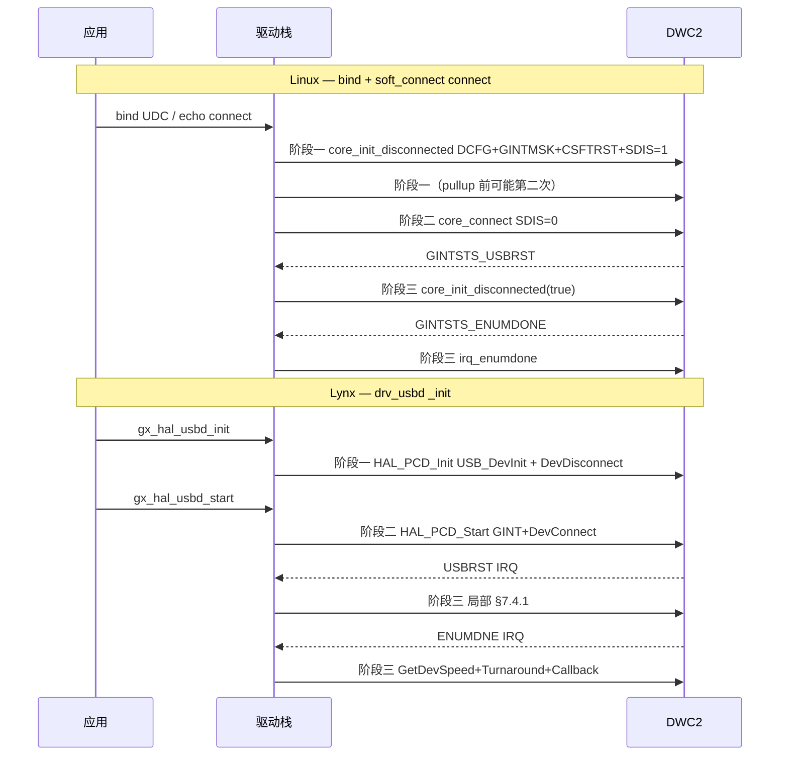

# A2 · PG §7.1 初始化

| | |
|---|---|
| **前置** | [`A1-dwc2-board-probe.md`](A1-dwc2-board-probe.md) |
| **本文** | PG §7.1 三阶段：init / connect / 中断；Linux vs Lynx |
| **下一步** | [`A3-dwc2-soft-connect.md`](A3-dwc2-soft-connect.md) |

> 依据 `DWC_otg_programming.pdf` **§7.1**；源码 Linux `drivers/usb/dwc2/`，Lynx `robotos/scpu/drivers/`。  
> **系列总索引**：[`README.md`](README.md)

---

## 与 A1 / A3 的边界

| 内容 | A1 | **本文 A2** | A3 |
|------|-----|--------------|-----|
| platform probe、`usb_add_gadget_udc` | ✓ | 不重复 | — |
| PG 阶段一 `core_init_disconnected` | 提及 | **✓ 寄存器级** | reconnect 时引用 |
| PG 阶段二 清 `SftDiscon` | 提及 | **✓ 函数级** | sysfs / 栈卸载 / §7.3.1 |
| `soft_connect` 用户态语义 | — | 不展开 | **✓** |

本文 **不** 再讲 DTS 与 fusb302；**不** 展开 A3 的 disconnect 路径对比表。

---

## 1. 总览：PG §7.1 与三阶段模型

### 1.1 Programming Guide §7.1 步骤（锚点）

| PG 步骤 | 要求 |
|---------|------|
| 前置 | Slave：`GINTMSK.NPTxFEmpMsk`、`RxFLvlMsk` **不屏蔽**；DMA：二者 **必须屏蔽** |
| 1 | 写 `DCFG`：DescDMA、DevSpd、NZStsOUTShk、Periodic Frame Interval、`ipgisocSupt` |
| 2 | ISOC IN：`DCTL.IgnrFrmNum` / `ServInt`；`GREFCLK.RefClkMode` |
| 3 | **清除** `DCTL.SftDiscon` → 总线连接 |
| 4 | ADP：等 20 PHY clk → `GPWRDN.PMUActiv` |
| 5 | `GINTMSK` 打开 USBRST、EnumDone、Early Suspend、Suspend、SOF |
| 6 | 等 `GINTSTS.USBReset` → §7.4.1 |
| 7 | 等 `GINTSTS.EnumerationDone` → 读 `DSTS` → §7.4.2 |

### 1.2 两栈共同的三阶段划分

两栈都把 PG §7.1 落成三个 **可分开调用的阶段**；与手册逐步编号不一一对应，但语义一致：

```
阶段一  初始化     PG 前置 + 步骤 1/2/5（+ EP0）   SDIS=1，总线不可见
   ↓
阶段二  发起连接   PG 步骤 3                      清 SftDiscon，D+ 上拉
   ↓
阶段三  中断收尾   PG 步骤 6/7（§7.4.1/§7.4.2）   USBRST / EnumDone 里继续初始化
```

| 阶段 | Linux 主函数 | Lynx 主函数 | 典型触发 |
|------|--------------|-------------|----------|
| 一 | `dwc2_hsotg_core_init_disconnected()` | `USB_DevInit()`（`HAL_PCD_Init` 内） | bind/`udc_start`；`_init` → `gx_hal_usbd_init` |
| 二 | `dwc2_hsotg_core_connect()` | `HAL_PCD_Start()` → `USB_DevConnect()` | `pullup(1)`；`gx_hal_usbd_start` / `usbd_connect` |
| 三 | `dwc2_hsotg_irq()` → USBRST / `irq_enumdone()` | `HAL_PCD_IRQHandler` USBRST / ENUMDNE | 主机复位与枚举 |

### 1.3 跨阶段最大差异（先读此表）

| 维度 | Linux dwc2 | Lynx HAL |
|------|------------|----------|
| 阶段一与二是否拆清 | 是：init 末尾 **强制 SDIS=1**，connect 另调 | 是：`USB_DevInit` 后 `DevDisconnect`；`Start` 才 connect |
| **reconnect 时阶段一** | **重跑** `core_init_disconnected(false)`（含 **CSFTRST**） | **不重跑** `USB_DevInit`，仅阶段二 |
| 阶段三 USBRST | **整段重调** `core_init_disconnected(true)` | IRQ 内 **局部** flush / 清 stall / `USB_EP0_OutStart` |
| disconnect | 轻量：`SDIS=1` + `udc_stop` 关 EP；**不关** `GAHBCFG.GINT` | 轻量：`SDIS=1` + 关 `GINT` + flush Tx FIFO |
| 相对 PG §7.3.1 完整软断开链 | 均未实现（见 `A3-dwc2-soft-connect.md`） | 同左 |

---

## 2. 阶段一：设备初始化（PG 前置 + 步骤 1/2/5）

**PG 目标**：配置 `DCFG`、`GINTMSK`、EP0 等，控制器处于 Device 模式就绪态，但 **尚未** 在总线上可见（步骤 3 之前应保持 `SftDiscon=1`）。

### 2.1 Linux 实现

| 项 | 内容 |
|----|------|
| 入口 | `dwc2_hsotg_udc_start()` → `dwc2_hsotg_core_init_disconnected(hsotg, false)` |
| 文件 | `drivers/usb/dwc2/gadget.c` |
| 另一次调用 | `pullup(1)` 前 **可能再跑一遍**（reconnect 保守策略） |
| Probe 轻量路径 | `dwc2_hsotg_init()` 仅 `DCTL_SFTDISCON=1`，**非**完整 §7.1 |

```c
static void dwc2_hsotg_core_init_disconnected(struct dwc2_hsotg *hsotg,
					      bool is_usb_reset)
{
	u32 dcfg = dwc2_readl(hsotg, DCFG);
	u32 gintmsk;

	dcfg &= ~DCFG_DEVSPD_MASK;
	dcfg |= DCFG_DEVSPD_HS;          /* 步骤 1：DevSpd */
	dcfg |= DCFG_EPMISCNT(1);        /* EPMisCnt = 1 */

	gintmsk = dwc2_readl(hsotg, GINTMSK);
	if (!using_desc_dma(hsotg))
		gintmsk |= INT_RX_FIFO_LVL;   /* 前置：Slave 打开 RxFLvl */
	gintmsk |= (INT_USBRESET | INT_ENUMDONE | INT_GOUTNAKEFF |
		    INT_GINNAKEFF | INT_ERLYSUSP | INT_USBSUSP | INT_RESETDET);

	/* EP0 OUT/IN、DIEPMSK/DOEPMSK 初始化 … */

	if (!is_usb_reset) {
		dwc2_writel(hsotg, 0, GRSTCTL);
		dwc2_writel(hsotg, GRSTCTL_CSFTRST, GRSTCTL);  /* Core Soft Reset */
		dwc2_wait_bit_clear(hsotg, GRSTCTL, GRSTCTL_CSFTRST, 0);
	}

	dwc2_writel(hsotg, dcfg, DCFG);
	dwc2_writel(hsotg, gintmsk, GINTMSK);
	dwc2_set_bit(hsotg, GAHBCFG, GAHBCFG_GLBL_INTR_EN);   /* 阶段一即开 GINT */

	dwc2_hsotg_enqueue_setup(hsotg);
	dwc2_set_bit(hsotg, DCTL, DCTL_SFTDISCON);            /* 保持软断开 */
}
```

**相对 PG 的顺序差异**：步骤 1/5 与 CSFTRST、写寄存器、开 `GINT`、**末尾 SDIS=1** 合在一次函数里；**步骤 3 推迟到阶段二**。非 USBRST 路径 **必定 CSFTRST**。

### 2.2 Lynx 实现

| 项 | 内容 |
|----|------|
| 入口 | `HAL_PCD_Init()` → `USB_DevInit()`；末尾 `USB_DevDisconnect()` |
| 文件 | `stm32f7xx_hal_pcd.c`、`stm32f7xx_ll_usb.c` |
| 前置 Core | `USB_CoreInit` + `USB_SetCurrentMode(DEVICE)` |
| 应用触发 | `drv_usbd.c` `_init()` → `gx_hal_usbd_init()` |

```c
HAL_StatusTypeDef USB_DevInit(USB_OTG_GlobalTypeDef *USBx, USB_OTG_CfgTypeDef cfg)
{
  if (cfg.vbus_sensing_enable == 0U) {
    USBx_DEVICE->DCTL |= USB_OTG_DCTL_SDIS;
    USBx->GCCFG &= ~USB_OTG_GCCFG_VBDEN;
    USBx->GOTGCTL |= USB_OTG_GOTGCTL_BVALOEN | USB_OTG_GOTGCTL_BVALOVAL;
  }

  USBx_PCGCCTL = 0U;                           /* PHY 时钟 */
  USBx_DEVICE->DCFG |= DCFG_FRAME_INTERVAL_80; /* 步骤 1：Periodic Frame Interval */
  (void)USB_SetDevSpeed(USBx, USB_OTG_SPEED_HIGH);

  USB_FlushTxFifo(USBx, 0x10U);
  USB_FlushRxFifo(USBx);
  /* 清各 EP、DIEPMSK/DOEPMSK/DAINTMSK … */

  USBx->GINTMSK = 0U;
  USBx->GINTSTS = 0xBFFFFFFFU;

  if (cfg.dma_enable == 0U)
    USBx->GINTMSK |= USB_OTG_GINTMSK_RXFLVLM;

  USBx->GINTMSK |= USB_OTG_GINTMSK_USBSUSPM | USB_OTG_GINTMSK_USBRST |
                   USB_OTG_GINTMSK_ENUMDNEM | USB_OTG_GINTMSK_IEPINT |
                   USB_OTG_GINTMSK_OEPINT   | USB_OTG_GINTMSK_IISOIXFRM |
                   USB_OTG_GINTMSK_PXFRM_IISOOXFRM | USB_OTG_GINTMSK_WUIM;
  if (cfg.Sof_enable != 0U)
    USBx->GINTMSK |= USB_OTG_GINTMSK_SOFM;

  return HAL_OK;
}

/* HAL_PCD_Init 末尾 */
(void)USB_DevDisconnect(hpcd->Instance);   /* 再次 SDIS=1 */
```

**相对 PG**：步骤 1/5 在 `USB_DevInit` 完成；**不写** `GAHBCFG.GINT`（留到阶段二）；**无 CSFTRST**；步骤 2（ISOC IN）、步骤 4（ADP）两栈均未配置。

### 2.3 阶段一实现差异

| 对照项 | Linux | Lynx |
|--------|-------|------|
| PG 步骤 1 `DCFG` | `DevSpd` + `DCFG_EPMISCNT(1)` | `DCFG_FRAME_INTERVAL_80` + `USB_SetDevSpeed` |
| PG 步骤 5 `GINTMSK` | 同函数写入；含 Early Suspend、ResetDet 等 | 同函数写入；含 IEPINT/OEPINT/WUIM 等 |
| PG 前置 Slave/DMA | 非 desc DMA 时 `INT_RX_FIFO_LVL` | `dma_enable==0` 时 `RXFLVLM` |
| Core Soft Reset | `is_usb_reset==false` 时 **CSFTRST** | **不做** |
| `GAHBCFG.GINT` | 阶段一 **即开启** | 阶段二 `HAL_PCD_Start` 才 `__HAL_PCD_ENABLE` |
| 阶段末 `SDIS` | `DCTL_SFTDISCON=1` | `USB_DevDisconnect` → `SDIS=1` |
| reconnect 是否重跑阶段一 | **是**（`pullup(1)` 前） | **否**（仅首次 `HAL_PCD_Init`；PM resume 例外） |

---

## 3. 阶段二：发起连接（PG 步骤 3）

**PG 目标**：清除 `DCTL.SftDiscon`，控制器在 USB 总线上呈现连接（D+ 上拉），主机可发起复位与枚举。

### 3.1 Linux 实现

| 项 | 内容 |
|----|------|
| 入口 | `dwc2_hsotg_pullup(1)` → `core_init_disconnected(false)` + `core_connect()` |
| 文件 | `drivers/usb/dwc2/gadget.c` |
| 上层 | `usb_gadget_connect` / `echo connect > .../soft_connect` |

```c
static int dwc2_hsotg_pullup(struct usb_gadget *gadget, int is_on)
{
	if (is_on) {
		if (dwc2_hw_is_device(hsotg)) {
			dwc2_hsotg_core_init_disconnected(hsotg, false);  /* 阶段一再次 */
			dwc2_hsotg_core_connect(hsotg);                     /* 阶段二 */
		}
		hsotg->enabled = 1;
	}
	/* is_on==0 → core_disconnect()，见 §5 */
}

void dwc2_hsotg_core_connect(struct dwc2_hsotg *hsotg)
{
	if (!hsotg->role_sw || (dwc2_readl(hsotg, GOTGCTL) & GOTGCTL_BSESVLD))
		dwc2_clear_bit(hsotg, DCTL, DCTL_SFTDISCON);
}
```

bind + connect 调用链：

```
udc_start() → core_init_disconnected(false)     /* 阶段一 */
pullup(1)   → core_init_disconnected(false)     /* 阶段一（第二次）*/
            → core_connect()                    /* 阶段二 */
```

### 3.2 Lynx 实现

| 项 | 内容 |
|----|------|
| 入口 | `HAL_PCD_Start()` |
| 文件 | `stm32f7xx_hal_pcd.c`、`stm32f7xx_ll_usb.c` |
| 应用 | `_init()` → `gx_hal_usbd_start()`；`usbd_connect()` |

```c
HAL_StatusTypeDef HAL_PCD_Start(PCD_HandleTypeDef *hpcd)
{
  __HAL_PCD_ENABLE(hpcd);                 /* GAHBCFG.GINT = 1 */
  (void)USB_DevConnect(hpcd->Instance);
  return HAL_OK;
}

HAL_StatusTypeDef USB_DevConnect(USB_OTG_GlobalTypeDef *USBx)
{
  USBx_DEVICE->DCTL &= ~USB_OTG_DCTL_SDIS;
  return HAL_OK;
}
```

### 3.3 阶段二实现差异

| 对照项 | Linux | Lynx |
|--------|-------|------|
| PG 步骤 3 寄存器操作 | `dwc2_clear_bit(DCTL, DCTL_SFTDISCON)` | `DCTL &= ~SDIS` |
| connect 前是否重跑阶段一 | **是**（含 CSFTRST） | **否** |
| 全局中断开启时机 | 阶段一已开 `GINT`；阶段二只清 SDIS | 阶段二 **同时** 开 `GINT` + 清 SDIS |
| role-switch / BSV 检查 | `core_connect` 查 `GOTGCTL_BSESVLD` | 无同等逻辑（板级 BVAL 覆盖在 DevInit） |
| 首次上电 | `udc_start` 后另需 `pullup(1)` 才进阶段二 | `_init` 内 init 后立即 `start`，阶段一、二连续 |

---

## 4. 阶段三：中断驱动收尾（PG 步骤 6/7）

**PG 目标**：主机复位与枚举完成后，设备能收 SOF、在 EP0 完成控制传输。阶段三 **不是空等**，而是在 **USBRST**、**EnumDone** 中断里执行 §7.4.1 / §7.4.2。

### 4.1 PG 步骤 6 — USB Reset（§7.4.1）

#### Linux

```c
/* dwc2_hsotg_irq() */
if (gintsts & GINTSTS_USBRST) {
	dwc2_writel(hsotg, GINTSTS_USBRST, GINTSTS);
	dwc2_hsotg_core_init_disconnected(hsotg, true);
}
```

`is_usb_reset=true`：**跳过 CSFTRST**，但仍重写 `DCFG`/`GINTMSK`、重初始化 EP0、`enqueue_setup`，末尾再次 `SFTDISCON=1`。

#### Lynx

```c
if (__HAL_PCD_GET_FLAG(hpcd, USB_OTG_GINTSTS_USBRST)) {
  USBx_DEVICE->DCTL &= ~USB_OTG_DCTL_RWUSIG;
  (void)USB_FlushTxFifo(hpcd->Instance, 0x10U);

  for (i = 0U; i < hpcd->Init.dev_endpoints; i++) {
    USBx_INEP(i)->DIEPINT = 0xFB7FU;
    USBx_INEP(i)->DIEPCTL &= ~USB_OTG_DIEPCTL_STALL;
    USBx_INEP(i)->DIEPCTL |= USB_OTG_DIEPCTL_SNAK;
    USBx_OUTEP(i)->DOEPINT = 0xFB7FU;
    USBx_OUTEP(i)->DOEPCTL &= ~USB_OTG_DOEPCTL_STALL;
    USBx_OUTEP(i)->DOEPCTL |= USB_OTG_DOEPCTL_SNAK;
  }
  USBx_DEVICE->DAINTMSK |= 0x10001U;
  /* DOEPMSK/DIEPMSK … */
  USBx_DEVICE->DCFG &= ~USB_OTG_DCFG_DAD;
  (void)USB_EP0_OutStart(hpcd->Instance, …);
  __HAL_PCD_CLEAR_FLAG(hpcd, USB_OTG_GINTSTS_USBRST);
}
```

#### 步骤 6 差异

| 对照项 | Linux | Lynx |
|--------|-------|------|
| 处理粒度 | **整函数** `core_init_disconnected(true)` | **就地** 清 EP / mask / EP0 OutStart |
| 是否重写 `DCFG`/`GINTMSK` | 是 | 否（仅清 `DCFG.DAD` 设备地址） |
| FIFO | 依赖 init 路径 | 显式 `USB_FlushTxFifo` |
| EP0 SETUP | `enqueue_setup` | `USB_EP0_OutStart` |

### 4.2 PG 步骤 7 — Enumeration Done（§7.4.2）

#### Linux：`dwc2_hsotg_irq_enumdone()`

```c
static void dwc2_hsotg_irq_enumdone(struct dwc2_hsotg *hsotg)
{
	u32 dsts = dwc2_readl(hsotg, DSTS);

	switch ((dsts & DSTS_ENUMSPD_MASK) >> DSTS_ENUMSPD_SHIFT) {
	case DSTS_ENUMSPD_FS:
	case DSTS_ENUMSPD_FS48:
		hsotg->gadget.speed = USB_SPEED_FULL;
		ep0_mps = EP0_MPS_LIMIT; ep_mps = 1023;
		break;
	case DSTS_ENUMSPD_HS:
		hsotg->gadget.speed = USB_SPEED_HIGH;
		ep0_mps = EP0_MPS_LIMIT; ep_mps = 1024;
		break;
	}

	dwc2_hsotg_set_ep_maxpacket(hsotg, 0, ep0_mps, 0, 1);
	dwc2_hsotg_set_ep_maxpacket(hsotg, 0, ep0_mps, 0, 0);
	/* EP1..N maxpacket … */
	dwc2_hsotg_enqueue_setup(hsotg);
}
```

#### Lynx：ENUMDNE 分支

```c
if (__HAL_PCD_GET_FLAG(hpcd, USB_OTG_GINTSTS_ENUMDNE)) {
  (void)USB_ActivateSetup(hpcd->Instance);
  hpcd->Init.speed = USB_GetDevSpeed(hpcd->Instance);
  (void)USB_SetTurnaroundTime(hpcd->Instance, 0, (uint8_t)hpcd->Init.speed);
  HAL_PCD_ResetCallback(hpcd);
  __HAL_PCD_CLEAR_FLAG(hpcd, USB_OTG_GINTSTS_ENUMDNE);
}
```

#### 步骤 7 差异

| 对照项 | Linux | Lynx |
|--------|-------|------|
| 读 `DSTS` 定速度 | `DSTS_ENUMSPD_*` → `gadget.speed` | `USB_GetDevSpeed` |
| EP `maxpacket` | 内核内 `set_ep_maxpacket` 全 EP | 未在此分支批量设置 |
| Turnaround time | 未在此函数显式设置（在 `dwc2_phy_init` 写 `USBTrdTim`） | `USB_SetTurnaroundTime`（详见 `A6-dwc2-usbtrdtim.md`） |
| 上层通知 | gadget 框架内部 | `HAL_PCD_ResetCallback` → 协议栈 |
| EP0 SETUP | 再次 `enqueue_setup` | `USB_ActivateSetup` |

---

## 5. 阶段外：Disconnect / Reconnect（相对 PG §7.3.1）

PG §7.3.1 完整软断开：关所有 EP → `SftDiscon` → 等 5ms → `CSFTRST` → 重走 §7.1。  
**两栈日常 disconnect 均未走完整链**（详见 `A3-dwc2-soft-connect.md`）。

### 5.1 Disconnect（两边均轻量，均 **不** 重跑阶段一）

| | Linux | Lynx |
|---|-------|------|
| 入口 | `pullup(0)` / `soft_connect disconnect` | `usbd_disconnect()` → `HAL_PCD_Stop()` |
| 硬件 | `core_disconnect()`：`SDIS=1`；`udc_stop` 关 EP | `__HAL_PCD_DISABLE`；`DevDisconnect`；flush Tx FIFO |
| 阶段一 | **不调用** | **不调用** |
| `GAHBCFG.GINT` | **保持开启** | **关闭** |

```c
/* Linux */
void dwc2_hsotg_core_disconnect(struct dwc2_hsotg *hsotg)
{
	dwc2_set_bit(hsotg, DCTL, DCTL_SFTDISCON);
}

/* Lynx */
HAL_StatusTypeDef HAL_PCD_Stop(PCD_HandleTypeDef *hpcd)
{
  __HAL_PCD_DISABLE(hpcd);
  (void)USB_DevDisconnect(hpcd->Instance);
  (void)USB_FlushTxFifo(hpcd->Instance, 0x10U);
  return HAL_OK;
}
```

### 5.2 Reconnect（不对称：Linux 重阶段一，Lynx 仅阶段二）

| | Linux | Lynx |
|---|-------|------|
| 入口 | `udc_start` + `pullup(1)` | `usbd_connect()` → `HAL_PCD_Start()` |
| 阶段一 | **重跑** `core_init_disconnected(false)` + CSFTRST | **跳过** |
| 阶段二 | `core_connect()` | `EnableGlobalInt` + `DevConnect` |
| 阶段三 | 仍靠后续 USBRST / EnumDone IRQ | 同左 |

```mermaid
sequenceDiagram
    participant App as 应用
    participant Drv as 驱动栈
    participant HW as DWC2

    Note over App,HW: disconnect（两栈均轻量）
    App->>Drv: disconnect
    Drv->>HW: SDIS=1
    Note right of HW: 无 CSFTRST / 无 USB_DevInit

    rect rgb(240,248,255)
    Note over App,HW: reconnect — Linux
    App->>Drv: connect
    Drv->>HW: 阶段一 core_init_disconnected + CSFTRST
    Drv->>HW: 阶段二 core_connect SDIS=0
    end

    rect rgb(255,248,240)
    Note over App,HW: reconnect — Lynx
    App->>Drv: usbd_connect
    Drv->>HW: 阶段二 only GINT + SDIS=0
    end
```



**Lynx 例外**：PM resume 可能再次 `gx_hal_usbd_init()`（完整阶段一），不属于日常 `usbd_connect()`。

---

## 6. 全链路时序（首次 bring-up）



---

## 7. PG 实现差异总表

| PG 条目 | Linux dwc2 | Lynx HAL | 一致？ |
|---------|------------|----------|--------|
| 前置 Slave/DMA | `core_init_disconnected` | `USB_DevInit` | 语义一致 |
| 步骤 1 DCFG | `DevSpd` + `EPMisCnt(1)` | `PerFrInt(80%)` + `SetDevSpeed` | 各写不同字段 |
| 步骤 2 ISOC IN | 未配置 | 未配置 | — |
| 步骤 3 清 SDIS | 阶段二 `core_connect` | 阶段二 `DevConnect` | 一致；**reconnect 前是否重阶段一不同** |
| 步骤 4 ADP | 未用 | 未用 | — |
| 步骤 5 GINTMSK | 阶段一写入 + 阶段一开 GINT | 阶段一写 mask；阶段二开 GINT | **GINT 时机不同** |
| CSFTRST | 阶段一（非 USBRST）+ reconnect | 均不做 | **重大差异** |
| 步骤 6 §7.4.1 | 整段 `core_init_disconnected(true)` | IRQ 局部清理 | **策略不同** |
| 步骤 7 §7.4.2 | `irq_enumdone` 设 MPS + setup | `GetDevSpeed` + `SetTurnaroundTime` + Callback | 分工不同 |
| §7.3.1 disconnect | 仅 SDIS + 关 EP | SDIS + 关 GINT + flush | 均未完整 §7.3.1 |
| reconnect | 重阶段一 + 阶段二 | 仅阶段二 | **重大差异** |

---

## 8. 相关文档

[`README.md`](README.md)
