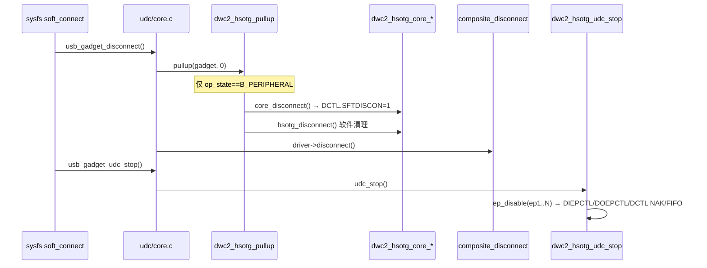
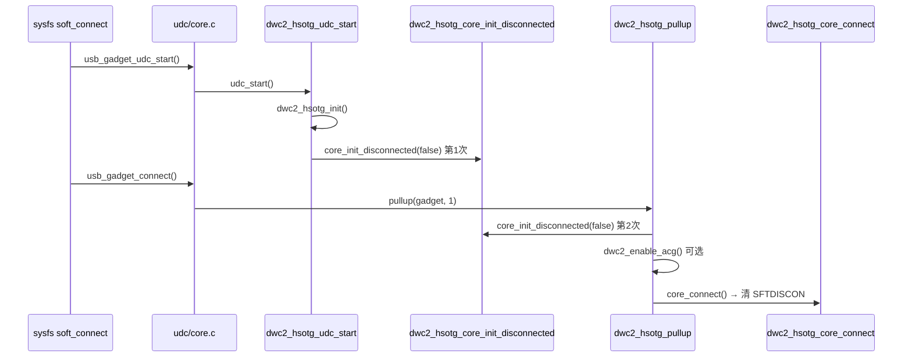

# A3 · 软连接与断开

| | |
|---|---|
| **前置** | [`A2-dwc2-pg71-init.md`](A2-dwc2-pg71-init.md) §3（PG 步骤 3） |
| **本文** | `soft_connect`、`DCTL.SFTDISCON`、软断开 vs 栈卸载 |
| **下一步** | [`A4-dwc2-ep0-control.md`](A4-dwc2-ep0-control.md) 与 [`A5-dwc2-buffer-dma.md`](A5-dwc2-buffer-dma.md) |

> 对照 PG §7.1 / §7.3.1；示例 UDC `49000000.usb-otg`。  
> **系列总索引**：[`README.md`](README.md)

---

## 与 A2 的边界

- **A2** 已讲：PG 阶段一/二/三、`core_init_disconnected` / `core_connect` 在 bind 链中的位置。  
- **本文** 专讲：`SFTDISCON` 语义、**所有** 会置位/清位的入口（`soft_connect`、`echo "" > UDC`、role-switch、composite disconnect）、与 PG §7.3.1 完整链的差异。  
- **不重复** A2 的 Lynx 对照表与 `DCFG`/`GINTMSK` 逐步编程。

---

## 1. 命名与寄存器

| 来源 | 名称 | 位置 |
|---|---|---|
| STM32 HAL / databook | `DCTL.SDIS` / `DCTL.SftDiscon` | Device Control Register bit 1 |
| Linux dwc2 | `DCTL_SFTDISCON` | `drivers/usb/dwc2/hw.h`，偏移 `DCTL` = `0x804` |

内核树中**无** `USB_OTG_DCTL_SDIS` 符号；搜索应使用 `DCTL_SFTDISCON` 或 `SFTDISCON`。

### 1.1 位的语义（databook §7.1 / §7.3.1）

| 值 | 总线表现 |
|---|---|
| **SftDiscon = 1** | 软断开：D+ 下拉，主机认为设备拔出（无需物理拔线） |
| **SftDiscon = 0** | 软连接：控制器发起 connect，D+ 上拉，主机可开始枚举 |

databook 要求从断开恢复到可重新枚举时，完整序列为：

**置 SftDiscon → 等 5ms → `GRSTCTL.CSftRst` → 轮询 CSftRstDone → 清位 → 按 §7.1 重新初始化**。

Linux `soft_connect` **不严格遵循**该 5ms + 软复位序列；见下文各路径对比。

### 1.2 dwc2 封装 API

```c
// gadget.c
void dwc2_hsotg_core_disconnect(struct dwc2_hsotg *hsotg);  // 置 DCTL.SFTDISCON
void dwc2_hsotg_core_connect(struct dwc2_hsotg *hsotg);     // 清 DCTL.SFTDISCON（有条件）
```

`dwc2_hsotg_core_connect()` 在存在 `usb-role-switch` 时检查 `GOTGCTL.BSESVLD`：**VBUS 无效则不清 SFTDISCON**（示例平台典型配置）。

---

## 2. 用户态入口：`/sys/class/udc/*/soft_connect`

实现：`drivers/usb/gadget/udc/core.c` → `soft_connect_store()`。

```c
if (sysfs_streq(buf, "connect")) {
    usb_gadget_udc_start(udc);
    usb_gadget_connect(udc->gadget);
} else if (sysfs_streq(buf, "disconnect")) {
    usb_gadget_disconnect(udc->gadget);
    usb_gadget_udc_stop(udc);
}
```

前提：`udc->driver` 非空（configfs gadget 已通过 `echo <udc_name> > .../UDC` 绑定）。

| 命令 | 是否 bind/unbind 功能驱动 | 是否卸 UDC 设备节点 |
|---|---|---|
| `echo disconnect > soft_connect` | 否 | 否 |
| `echo connect > soft_connect` | 否 | 否 |
| `echo "" > .../config/usb_gadget/*/UDC` | 是（unbind） | 否 |
| `echo <dev> > .../bus/platform/drivers/dwc2/unbind` | 是 | 是 |

---

## 3. `echo disconnect` 调用链与寄存器

### 3.1 时序概览



### 3.2 阶段 ① `usb_gadget_disconnect()`

| 步骤 | 函数 | 写寄存器？ |
|---|---|---|
| 727 | `dwc2_hsotg_pullup(0)` | 见下 |
| 730 | `composite_disconnect()` | **否**（composite 软件状态） |

`dwc2_hsotg_pullup(0)`（`op_state == OTG_STATE_B_PERIPHERAL` 时）：

| 函数 | 寄存器 |
|---|---|
| `dwc2_hsotg_core_disconnect()` | **DCTL.SFTDISCON = 1** |
| `dwc2_hsotg_disconnect()` | 不写 IP 寄存器；`kill_all_requests`；若 `hsotg->connected` 则 `call_gadget(disconnect)` |

注意：`hsotg->connected` 在收到 **SET_ADDRESS** 后置 1；此时 `call_gadget(disconnect)` 与 730 行 `composite_disconnect()` **可能各调一次**。

### 3.3 阶段 ② `usb_gadget_udc_stop()` → `dwc2_hsotg_udc_stop()`

对每个 **非 EP0** 端点调用 `dwc2_hsotg_ep_disable()`：

| 寄存器 | 典型操作 |
|---|---|
| **DIEPCTLn / DOEPCTLn** | SNAK、EPDIS、清 EPENA/USBACTEP |
| **DCTL** | SGNPInNAK / SGOUTNAK / CGNPINNAK / CGOUTNAK |
| **DIEPINTn / DOEPINTn** | 轮询/清 EPDISBLD |
| **GRSTCTL** | TXFFLSH（`dwc2_flush_tx_fifo`） |
| **DAINTMSK** | 屏蔽端点中断 |

**不做**：`GRSTCTL.CSftRst`、`GAHBCFG`/`GINTMSK` 全局关闭、`dwc2_lowlevel_hw_disable`（OTG 双角色模式）。

软件：`hsotg->driver = NULL`；`udc->driver`（composite）**仍保留**，可再 `connect`。

---

## 4. `echo connect` 调用链与寄存器

### 4.1 时序概览



**重要**：`dwc2_hsotg_core_init_disconnected(false)` 在单次 `connect` 中最多执行 **两次**（`udc_start` + `pullup(1)` 各一次），均含 `dwc2_core_reset()`（`GRSTCTL.CSFTTRST`）。

### 4.2 阶段 ① `dwc2_hsotg_udc_start()`

| 函数 | 主要寄存器操作 |
|---|---|
| `dwc2_hsotg_init()` | **DIEPMSK/DOEPMSK**、**DAINTMSK=0**、**DCTL.SFTDISCON=1**、**GRXFSIZ/GNPTXFSIZ/DPTXFSIZn/GDFIFOCFG**、**GRSTCTL** flush、**GAHBCFG.DMA_EN** |
| `dwc2_hsotg_core_init_disconnected(false)` | 见 §4.4 |

OTG 模式**不**调用 `dwc2_lowlevel_hw_enable()`。结束时 `hsotg->enabled = 0`。

### 4.3 阶段 ② `dwc2_hsotg_pullup(1)`

| 函数 | 主要寄存器操作 |
|---|---|
| `dwc2_hsotg_core_init_disconnected(false)` | 同 §4.4（第二次） |
| `dwc2_enable_acg()` | **PCGCCTL1.GATEEN**（`params.acg_enable` 时） |
| `dwc2_hsotg_core_connect()` | 读 **GOTGCTL.BSESVLD**；清 **DCTL.SFTDISCON** |

`usb_gadget_connect()` **不**调用 composite `bind()`；功能配置在初次绑 UDC 时已建立。

### 4.4 `dwc2_hsotg_core_init_disconnected(false)` 寄存器清单

| 寄存器 | 操作 |
|---|---|
| **GRSTCTL** | **CSFTRST** + 等 **AHBIDLE** |
| **GUSBCFG** | TOUTCAL、清 HNP/SRP；`dwc2_phy_init()` 可能改 UTMI 相关位 |
| **DCFG** | DevSpd、`DCFG_EPMISCNT(1)` 等 |
| **GOTGINT / GINTSTS** | 写全 1 清 pending |
| **GINTMSK** | USBRST、ENUMDONE、SUSPEND 等 |
| **GAHBCFG** | GLBL_INTR_EN（+ DMA） |
| **DIEPMSK / DOEPMSK / DAINTMSK** | 端点中断配置 |
| **DCTL** | PWRONPRGDONE 脉冲；**CGOUTNAK\|CGNPINNAK\|SFTDISCON** |
| **DOEPTSIZ0 / DOEPCTL0 / DIEPCTL0** | EP0 初始化 |
| **GLPMCFG** 等 | LPM 启用时 |
| — | **`mdelay(3)`** |
| EP0 queue | `dwc2_hsotg_enqueue_setup()` → 可能再写 **DOEPTSIZ0/DOEPCTL0** |

### 4.5 connect 后异步路径（中断）

`soft_connect` 同步路径结束后，主机 Reset/枚举由中断处理，例如：

- **GINTSTS.USBRst** → §7.4.1 初始化
- **GINTSTS.EnumDone** → 读 **DSTS**
- **SET_ADDRESS** → **DCFG.DevAddr**
- **SetConfiguration** → **DIEPCTLn/DOEPCTLn**

---

## 5. 软断开 vs 栈卸载：层次对照

Gadget 栈四层：

```
configfs / composite 功能驱动
        ↓
UDC 核心（/sys/class/udc/）
        ↓
dwc2 gadget（udc_start/stop、pullup）
        ↓
dwc2 平台驱动 + PHY/时钟
```

| 操作 | DCTL.SFTDISCON | 端点 disable | composite | UDC 节点 | dwc2 驱动 | PHY/时钟 |
|---|---|---|---|---|---|---|
| `core_disconnect()` 仅 | 置 1 | ✗ | ✗ | 保留 | 保留 | 保留 |
| `soft_connect disconnect` | 置 1 | ep1..N | disconnect 回调 | 保留 | 保留 | 保留（OTG） |
| `echo "" > UDC` | 置 1 | ✓ | unbind | 保留 | 保留 | 保留（OTG） |
| `dwc2_hsotg_remove()` | 间接* | 间接* | 间接* | **删除** | 保留 | 保留（OTG） |
| unbind dwc2 平台驱动 | ✓ | ✓ | unbind | 删除 | **卸载** | **关闭** |

\* `dwc2_hsotg_remove()` 本身不写寄存器；若 `udc->driver` 仍挂着，`usb_del_gadget_udc()` 会触发与 `echo "" > UDC` 类似的 `usb_gadget_remove_driver()` 链。

### 5.1 `dwc2_hsotg_remove()` 与 `dwc2_driver_remove()`

```c
// gadget.c
int dwc2_hsotg_remove(struct dwc2_hsotg *hsotg)
{
    usb_del_gadget_udc(&hsotg->gadget);
    dwc2_hsotg_ep_free_request(...);
    return 0;
}

// platform.c — dwc2_driver_remove() 顺序
dwc2_hcd_remove(hsotg);
dwc2_hsotg_remove(hsotg);
dwc2_drd_exit(hsotg);
dwc2_lowlevel_hw_disable(hsotg);
reset_control_assert(hsotg->reset);
```

---

## 6. `lsusb` 与软断开

| 谁跑 `lsusb` | 软断开后 |
|---|---|
| **对端 PC**（MP157 当 Device） | **看不到**设备（D+ 下拉） |
| **MP157 本机** | 本机 UDC **本来就不会**出现在 `lsusb`（`lsusb` 只列 Host 口外设） |

软断开 ≠ 卸驱动：`/sys/class/udc/49000000.usb-otg` 可能仍在。

验证建议：

```bash
# 对端 PC
lsusb

# MP157 上看 gadget 状态（非 lsusb）
ls /sys/class/udc/
cat /sys/class/udc/*/state
```

---

## 7. databook §7.1 与 Linux `connect` 对照

| databook §7.1 步骤 | Linux `soft_connect connect` |
|---|---|
| 配置 DCFG | `core_init_disconnected()` 内写 **DCFG** |
| 清 DCTL.SftDiscon | `dwc2_hsotg_core_connect()`（最后一步） |
| 配置 GINTMSK | `core_init_disconnected()` |
| 等 USBReset / EnumDone | 中断异步处理 |
| 软断开后 5ms + CSftRst 再初始化 | **不严格遵循**；用 `mdelay(3)` + 最多 **2 次** `dwc2_core_reset` |

---

## 8. 实践建议（示例平台 + configfs）

### 8.1 临时断开总线、保留 gadget 配置

```bash
echo disconnect > /sys/class/udc/49000000.usb-otg/soft_connect
# 恢复
echo connect > /sys/class/udc/49000000.usb-otg/soft_connect
```

需 **VBUS 有效**（role-switch / Type-C）才能成功 `connect`。

### 8.2 卸功能驱动、保留 dwc2 控制器

```bash
echo "" > /sys/kernel/config/usb_gadget/<name>/UDC
```

### 8.3 彻底关闭 USB（含 HCD + 硬件）

```bash
echo "" > /sys/kernel/config/usb_gadget/<name>/UDC
echo 49000000.usb-otg > /sys/bus/platform/drivers/dwc2/unbind
```

### 8.4 内核代码选型

| 目标 | 推荐 |
|---|---|
| 仅软断开 | `dwc2_hsotg_core_disconnect(hsotg)` |
| 软断开 + 端点停 + 保留 composite | 用户态 `soft_connect disconnect` 或 `usb_gadget_disconnect` + `udc_stop` |
| 卸功能驱动 | `usb_gadget_unregister_driver()` / `echo "" > UDC` |
| 卸 UDC + dwc2 gadget 子模块 | `dwc2_hsotg_remove(hsotg)` |
| 关 PHY/时钟/复位 | `dwc2_driver_remove()` 整链或 `dwc2_lowlevel_hw_disable()` |

---

## 9. 关键源码索引

| 主题 | 文件:行号（约） |
|---|---|
| sysfs `soft_connect` | `drivers/usb/gadget/udc/core.c:1474` |
| `usb_gadget_connect/disconnect` | `drivers/usb/gadget/udc/core.c:667, 709` |
| `dwc2_hsotg_pullup` | `drivers/usb/dwc2/gadget.c:4526` |
| `dwc2_hsotg_core_connect/disconnect` | `drivers/usb/dwc2/gadget.c:3534, 3540` |
| `dwc2_hsotg_core_init_disconnected` | `drivers/usb/dwc2/gadget.c:3327` |
| `dwc2_hsotg_udc_start/stop` | `drivers/usb/dwc2/gadget.c:4408, 4474` |
| `dwc2_hsotg_remove` | `drivers/usb/dwc2/gadget.c:4906` |
| `dwc2_driver_remove` | `drivers/usb/dwc2/platform.c:305` |
| `DCTL_SFTDISCON` 定义 | `drivers/usb/dwc2/hw.h:480` |
| configfs 解绑 UDC | `drivers/usb/gadget/configfs.c:241` |
| composite disconnect | `drivers/usb/gadget/composite.c:1990` |

---

## 10. 参考资料

- 系列索引：[`README.md`](README.md)
- Databook 译文：`~/文档/测试记录/USB/DWC_otg_programming_第7章_中英对照.html`（§7.1、§7.3.1）
