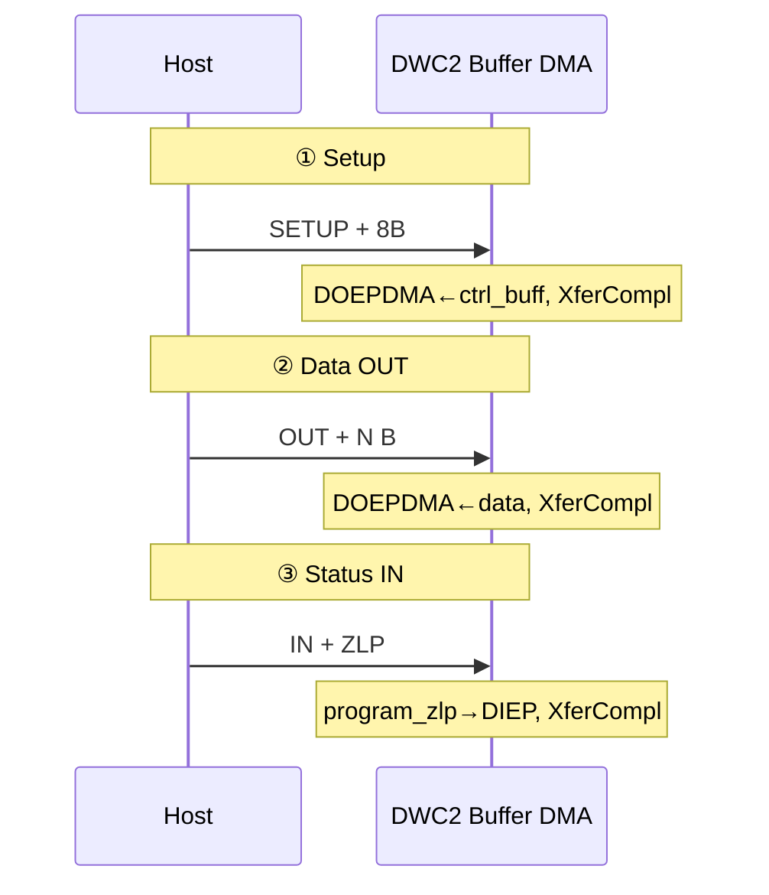

# A4 · 硬件 EP0 控制传输

| | |
|---|---|
| **前置** | [`A2-dwc2-pg71-init.md`](A2-dwc2-pg71-init.md)、[`A5-dwc2-buffer-dma.md`](A5-dwc2-buffer-dma.md) §4 |
| **本文** | PG §9.1 Control Write/Read；`ep0_state` 状态机 |
| **下一步** | 框架 [`07-composite-ep0-enumeration.md`](07-composite-ep0-enumeration.md) |

> PG §9.1；Linux 5.4 `gadget.c`；Buffer DMA（`g_dma=1`）。系列索引：[`README.md`](README.md)。

---

## 1. PG 说了什么

### 1.1 §9.1 Control Transfers in Buffer DMA Mode

PG 把控制传输分为三类（§9.1，PDF p.243）：

| PG 名称 | 总线阶段 | 对应 USB 方向 |
|---------|----------|---------------|
| **Control Write**（Ctrl_Wr） | Setup → Data OUT → Status IN | Host 写 Data |
| **Control Read**（Ctrl_Rd） | Setup → Data IN → Status OUT | Host 读 Data |
| **2-Stage** | Setup → **Status IN**（**无 Data**） | SETUP 里 **`wLength = 0`** |

**Write / Read** 才有 Data 阶段（SETUP 的 `wLength > 0`）。**2-Stage** 只有 Setup + Status，PG §9.1.1.4 原文：*"These transfers only have Setup and Status stages. No Data stage is present."*

Linux 对应：`process_control()` 见 `wLength == 0` 直接设 `ep0_state = DWC2_EP0_STATUS_IN`，跳过 Data：

```1908:1910:drivers/usb/dwc2/gadget.c
	if (ctrl->wLength == 0) {
		ep0->dir_in = 1;
		hsotg->ep0_state = DWC2_EP0_STATUS_IN;
```

典型例子：`SET_CONFIGURATION`、`SET_INTERFACE`（参数在 SETUP 的 `wValue`/`wIndex`，无额外数据包）。

有 Data 的阶段，Buffer DMA 编程与 Bulk 相同：**`DxEPTSIZ` + `DxEPDMA` + `DxEPCTL(EPENA|CNAK)`**（PG §9.2.1 IN、§9.3.1 OUT）。

### 1.2 两条编程路径（Linux 走哪条）

| 配置 | PG 章节 | 特点 |
|------|---------|------|
| `OTG_EXCP_CNTL_XFER_FLOW=1` | §9.1.1 | **Table 9-2**：`XferCompl` / `SetUp` / `StsPhseRcvd` 组合解码；Case A–E |
| `OTG_EXCP_CNTL_XFER_FLOW=0` | §9.1.2 | PG 注明不推荐；**Control IN/OUT 与 Bulk 编程相同**（§9.1.2.1） |

Linux composite 栈 + `gadget.c` **未实现 Table 9-2 全部分支**，而是用软件 **`ep0_state`** 状态机简化（与 `A5-dwc2-buffer-dma.md` §4.5 一致）。Data/Status 的寄存器操作在形式上接近 **§9.1.2 + §9.2.1/§9.3.1**（按 Bulk 启 DMA）。

### 1.3 SETUP 阶段：PG vs Linux

PG §9.1.2.1 *Control Setup Transactions*（p.261）要求：

1. `DOEPTSIZ0.SUPCnt = 3`
2. `DOEPCTL0.EPENA = 1`
3. DMA 模式：`DOEPDMA0` 指向收 SETUP 的内存

Linux `enqueue_setup()` **通过 `ep_queue` 挂 8 字节请求**，由 `start_req()` 写 `DOEPTSIZ` / `DOEPDMA` / `DOEPCTL`，**未显式写 `SUPCnt=3`**（依赖复位默认值）。PG 与驱动的差异见 `A5-dwc2-buffer-dma.md` §4.5。

Buffer DMA 下 **不读 `RxFLVL`**（PG Chapter 8 Slave 路径）；SETUP 完成走 **`DOEPINT` + `handle_outdone`**（`using_dma()` 分支）。

---

## 2. Linux 侧：`ep0_state` 与两类 request

| `ep0_state` | 方向 | 挂上的 request | PG 阶段 |
|-------------|------|----------------|---------|
| `DWC2_EP0_SETUP` | OUT | `hsotg->ctrl_req` → `ctrl_buff[8]` | Setup |
| `DWC2_EP0_DATA_OUT` | OUT | 上层 `ep_queue` 的 buffer | Data（Write） |
| `DWC2_EP0_DATA_IN` | IN | 同上 | Data（Read） |
| `DWC2_EP0_STATUS_IN` | IN | **无**（`program_zlp`） | Status（Write） |
| `DWC2_EP0_STATUS_OUT` | OUT | **无**（`program_zlp`） | Status（Read） |

`process_control()` 根据 SETUP 包设初态：

```1908:1917:drivers/usb/dwc2/gadget.c
	if (ctrl->wLength == 0) {
		ep0->dir_in = 1;
		hsotg->ep0_state = DWC2_EP0_STATUS_IN;
	} else if (ctrl->bRequestType & USB_DIR_IN) {
		ep0->dir_in = 1;
		hsotg->ep0_state = DWC2_EP0_DATA_IN;
	} else {
		ep0->dir_in = 0;
		hsotg->ep0_state = DWC2_EP0_DATA_OUT;
	}
```

---

## 3. 通用 DMA 路径（Setup / Data 共用）

每次 `ep_queue` → `start_req`（PG §9.2.1 / §9.3.1 的 Without Thresholding）：

```
dwc2_hsotg_ep_queue()
  ├─ dwc2_hsotg_map_dma()          → req->dma
  └─ dwc2_hsotg_start_req()
       ├─ dwc2_writel(epsize, DxEPTSIZ)
       ├─ dwc2_writel(ureq->dma, DxEPDMA)    /* length≠0 且非 continuing */
       └─ dwc2_writel(EPENA|CNAK, DxEPCTL)   /* SETUP 阶段不清 CNAK，见下 */
```

```1175:1180:drivers/usb/dwc2/gadget.c
	/* For Setup request do not clear NAK */
	if (!(index == 0 && hsotg->ep0_state == DWC2_EP0_SETUP))
		ctrl |= DXEPCTL_CNAK;
	dwc2_writel(hsotg, ctrl, epctrl_reg);
```

完成：**Host token → AHB DMA → `DXEPINT_XFERCOMPL`** → `complete_in`（IN）或 `handle_outdone`（OUT，仅 DMA 模式）。

---

## 4. Control Write（Setup → Data OUT → Status IN）

**前提**：短包 N ≤ EP0 MPS（HS 64B）→ **3 次 EP 中断**。

### 4.1 总线与寄存器概览



### 4.2 三次中断（仅 `gadget.c`）

| # | 中断 | `ep0_state` 变化 | 关键函数 | PG 对应 |
|---|------|------------------|----------|---------|
| 0 | — | → `SETUP` | `enqueue_setup()` | §9.1.2.1：挂 SETUP buffer |
| 1 | OEPINT | `SETUP`→`DATA_OUT` | `handle_outdone`→`complete_setup`→`process_control`；上层 `ep_queue` Data | Setup 完成；Data 按 §9.3.1 OUT |
| 2 | OEPINT | `DATA_OUT`→`STATUS_IN` | `handle_outdone`：`ep0_zlp(true)` + `complete_request` | Data OUT 完成；准备 Status IN |
| 3 | IEPINT | → `SETUP` | `complete_in`（无 req）→ `epint` 里 `enqueue_setup` | Status IN ZLP 完成 |

**① 等待 SETUP**

```2020:2024:drivers/usb/dwc2/gadget.c
	hsotg->ep0_state = DWC2_EP0_SETUP;
	ret = dwc2_hsotg_ep_queue(&hsotg->eps_out[0]->ep, req, GFP_ATOMIC);
```

**② SETUP 8B 收齐** → `process_control` 设 `DATA_OUT` → 上层 queue Data OUT → `start_req(DOEP*)`。

**③ Data OUT 完成** — 先 Status、后 complete Data req：

```2411:2434:drivers/usb/dwc2/gadget.c
	if (!using_desc_dma(hsotg) && epnum == 0 &&
	    hsotg->ep0_state == DWC2_EP0_DATA_OUT) {
		if (!hsotg->delayed_status)
			dwc2_hsotg_ep0_zlp(hsotg, true);
	}
	dwc2_hsotg_complete_request(hsotg, hs_ep, hs_req, result);
```

`ep0_zlp(true)` → `program_zlp` 写 `DIEPTSIZ`/`DIEPCTL`，**不挂 `hs_ep->req`**（PG Status IN：零长度 IN）。

**④ Status IN** — `complete_in` 见 `!hs_req` 直接 return；`epint` 再 `enqueue_setup`：

```3031:3036:drivers/usb/dwc2/gadget.c
			dwc2_hsotg_complete_in(hsotg, hs_ep);
			if (idx == 0 && !hs_ep->req)
				dwc2_hsotg_enqueue_setup(hsotg);
```

PG §9.1.1（EXCP=1）在 Write Data 完成后可能报 **`DOEPINT.StsPhseRcvd`**；Linux **未单独处理该位**，用 `ep0_state` + `ep0_zlp` 代替。

---

## 5. Control Read（Setup → Data IN → Status OUT）

### 5.1 三次中断

| # | 中断 | `ep0_state` | 关键函数 | 与 Write 的差别 |
|---|------|-------------|----------|-----------------|
| 1 | OEPINT | → `DATA_IN` | 同 Write Setup 路径 | `process_control` 设 `DATA_IN`；`start_req(DIEP*)` |
| 2 | IEPINT | → `STATUS_OUT` | `complete_in`：`ep0_zlp(false)` 后 **return** | **不** `complete_request` |
| 3 | OEPINT | → `SETUP` | `handle_outdone(STATUS_OUT)`：`complete_request` + `enqueue_setup` | Data req 此时才完成 |

**Data IN 发完 — 只切 Status：**

```2738:2741:drivers/usb/dwc2/gadget.c
	if (hs_ep->index == 0 && hsotg->ep0_state == DWC2_EP0_DATA_IN) {
		dwc2_hsotg_ep0_zlp(hsotg, false);
		return;
	}
```

**Status OUT ZLP 收到：**

```2367:2371:drivers/usb/dwc2/gadget.c
	if (epnum == 0 && hsotg->ep0_state == DWC2_EP0_STATUS_OUT) {
		dwc2_hsotg_complete_request(hsotg, hs_ep, hs_req, 0);
		dwc2_hsotg_enqueue_setup(hsotg);
		return;
	}
```

PG §9.1.1 Control Read（p.251）要求 Data IN 完成后编程 Status OUT；Linux 合并为 **`ep0_zlp(false)`**（`DOEP` + `program_zlp`）。

---

## 6. Write vs Read（驱动行为）

| | Control Write | Control Read |
|--|---------------|--------------|
| Data 完成 ISR | `handle_outdone`（OEPINT） | `complete_in`（IEPINT） |
| Status 启动 | `ep0_zlp(true)` → DIEP | `ep0_zlp(false)` → DOEP |
| Data `req` 何时 `complete_request` | Data DMA **结束立刻** | **Status OUT 后** |
| Status 时 `hs_ep->req` | NULL | 仍指向 Data req |
| 整笔结束 | IEPINT → `enqueue_setup` | OEPINT → `enqueue_setup` |

---

## 7. PG 与 Linux 差异速查

| 项 | PG | Linux 5.4 `gadget.c` |
|----|-----|----------------------|
| 控制流 | §9.1.1 Table 9-2（EXCP=1） | `ep0_state` 简化 |
| SETUP `SUPCnt` | 显式 = 3 | 未显式写 |
| SETUP 中断 | `DOEPINT.SETUP`（§9.1.2.1） | DMA 下常走 **`XferCompl` + `DXEPINT_SETUP`→`handle_outdone`** |
| Data 阶段 | 同 Bulk §9.2.1 / §9.3.1 | `start_req` + `DxEPDMA` |
| Status | 应用编程 IN/OUT ZLP | `ep0_zlp` / `program_zlp`，默认无 `usb_request` |
| Slave `RxFLVL` | Chapter 8 | **未用**（Buffer DMA） |
| Descriptor DMA | Chapter 10 | MP157 `g_dma_desc=0`，本文不展开 |

---

## 8. 代码索引

| 主题 | 符号 | 行（约） |
|------|------|----------|
| IRQ | `dwc2_hsotg_irq` | 3648 |
| EP 分发 | `dwc2_hsotg_epint` | 2972 |
| SETUP 等待 | `dwc2_hsotg_enqueue_setup` | 2002 |
| SETUP 解析 | `dwc2_hsotg_process_control` | 1896 |
| DMA queue | `dwc2_hsotg_ep_queue` / `map_dma` | 1361 / 1227 |
| 启 DMA | `dwc2_hsotg_start_req` | 1013 |
| OUT 完成 | `dwc2_hsotg_handle_outdone` | 2353 |
| IN 完成 | `dwc2_hsotg_complete_in` | 2657 |
| Status ZLP | `dwc2_hsotg_ep0_zlp` / `program_zlp` | 2291 / 2034 |

---

## 9. 小结

1. PG **§9.1** 定义 Control Write/Read 三阶段；Buffer DMA 下 Data 与 **§9.2.1/§9.3.1 Bulk** 同构。  
2. Linux 用 **`ep0_state` + `ctrl_req`/上层 req** 代替 PG **Table 9-2** 的大部分组合解码。  
3. **Write**：Data OUT 完 → `ep0_zlp(true)` + 立刻 complete Data → Status IN 无 req → `enqueue_setup`。  
4. **Read**：Data IN 完 → 仅 `ep0_zlp(false)` → Status OUT 后才 complete Data → `enqueue_setup`。  
5. 读源码：**OEPINT 看 `handle_outdone`，IEPINT 看 `complete_in`**；SETUP 入口 **`process_control`**。
