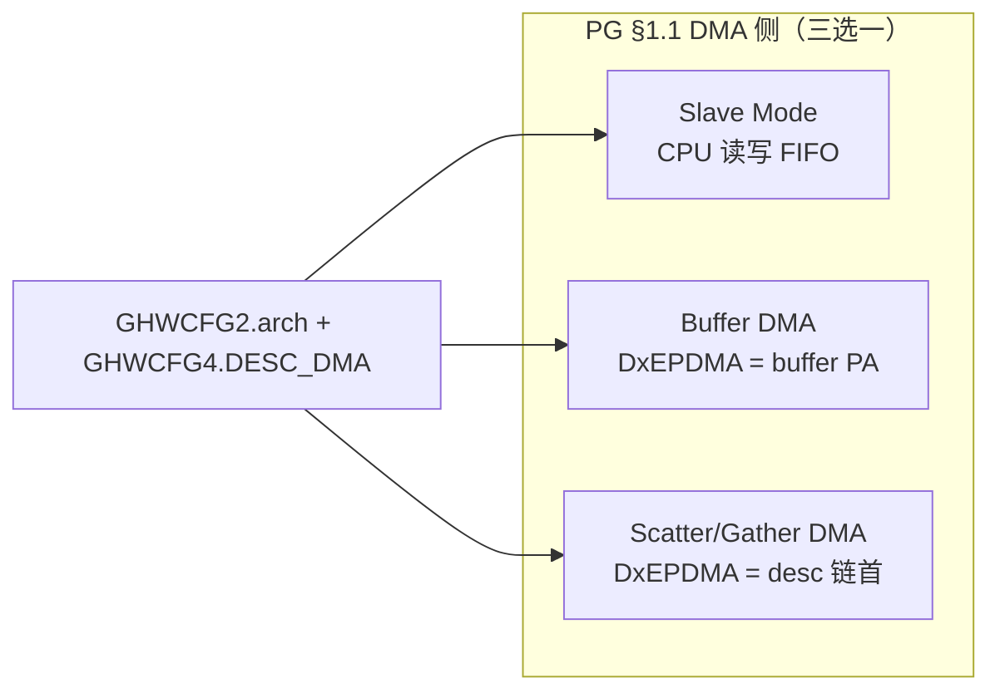
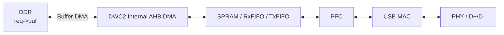
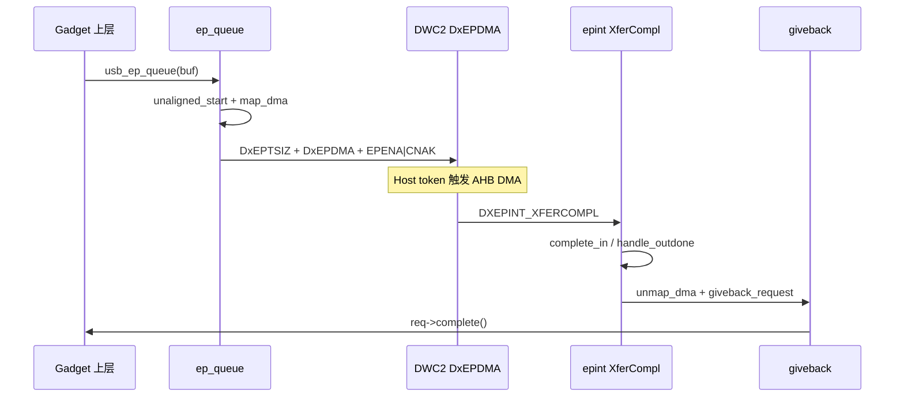

# A5 · Buffer DMA

| | |
|---|---|
| **前置** | [`A2-dwc2-pg71-init.md`](A2-dwc2-pg71-init.md) |
| **本文** | PG Chapter 9；`DxEPDMA`、bulk queue/complete |
| **下一步** | [`A4-dwc2-ep0-control.md`](A4-dwc2-ep0-control.md)；专项 [`A6-dwc2-usbtrdtim.md`](A6-dwc2-usbtrdtim.md) |

> STM32MP157（`st,stm32mp1-hsotg`）；对照 `gadget.c`。系列索引：[`README.md`](README.md)。

---

## 1. 总览：PG 锚点与本配置结论

### 1.1 Programming Guide 章节对照

| PG 章节 | 主题 | Linux 5.4 dwc2 gadget |
|---------|------|------------------------|
| **§1.1.1** DMA Mode | Internal Buffer DMA / Scatter-Gather / External DMA | **Internal Buffer DMA**（`GHWCFG2.arch` = INT_DMA） |
| **§7.1** Device Initialization 前置 | DMA 模式须 **屏蔽** `GINTMSK.RxFLvlMsk`、`NPTxFEmpMsk` | `core_init_disconnected()` 中 **不** enable `GINTSTS_RXFLVL` |
| **Chapter 8** Slave Mode | CPU 读写 FIFO、`RxFLVL` 中断 | **未用**（`g_dma=1`） |
| **Chapter 9** Buffer DMA Mode | `DxEPDMA` = buffer 物理地址；`XferCompl` 完成 | **实际路径** |
| **§9.1** Control Transfers | Setup/Data/Status 多阶段 + 复杂 OUT 中断组合 | 简化为 `ep0_state` 状态机 |
| **§9.2.1** Bulk IN Without Thresholding | `DIEPTSIZ` + `DIEPDMA` + `DIEPCTL(EPENA\|CNAK)` | `dwc2_hsotg_start_req()` |
| **§9.3.1** Bulk OUT Without Thresholding | `DOEPTSIZ` + `DOEPDMA` + `DOEPCTL(EPENA\|CNAK)` | 同上；完成走 `DXEPINT_XFERCOMPL` |
| **§7.7 / §9.2.2 / §9.3.2** Thresholding | `DTHRCTL` 阈值 DMA | Linux **未实现**（`hw.h` 无 `DTHRCTL`） |
| **Chapter 10** Scatter/Gather DMA | `DCFG.DESCDMA_EN`；`DxEPDMA` = 描述符链 | 代码完整；MP157 硬件通常 **不开** |

### 1.2 本配置结论速查

| 项 | 实际行为 |
|----|----------|
| DMA 模式 | **Internal Buffer DMA**（`using_dma()` = true） |
| Descriptor DMA | **未启用**（`using_desc_dma()` = false） |
| SoC DMA1/DMA2/MDMA | **不经** dmaengine；`usbotg_hs` 无 `dmas` 属性 |
| IN / OUT | 均 `DIEPDMA(n)` / `DOEPDMA(n)` + `DXEPINT_XFERCOMPL` |
| 缓存一致性 | 驱动无显式 cache 指令；`map_dma` / `unmap_dma` → ARM streaming DMA |
| 传输触发 | 软件写寄存器后，**Host token** 触发硬件 AHB DMA |

板上确认：

```bash
cat /sys/kernel/debug/49000000.usb-otg/params
# 预期：g_dma: 1，g_dma_desc: 0，arch: 2 (INT_DMA)
```

---

## 2. 硬件能力与软件参数（`hw_params` vs `params`）

### 2.1 PG §1.1.1：三种 DMA 侧数据路径

DWC2 Device 模式下 DMA 与 Slave **互斥**（不可混用）：



| 模式 | 硬件判定 | `GAHBCFG` | `DxEPDMA` 含义 | 本配置 |
|------|----------|-----------|----------------|--------|
| Slave | `arch` = SLAVE_ONLY 或 `g_dma=0` | 无 `DMA_EN`；开 `RXFLVL` / `TXFIFOEMPTY` | 不使用 | 否 |
| **Buffer DMA** | `using_dma()` && !`using_desc_dma()` | `DMA_EN` | `req->dma`（物理地址） | **是** |
| Scatter/Gather | `using_desc_dma()` | `DMA_EN` + `DCFG.DESCDMA_EN` | `desc_list_dma` | 否 |

PG 原文（§1.1.1）：Internal DMA 模式下，AHB Master 使用 programmed DMA address——Device 模式即 **`DIEPDMAn` / `DOEPDMAn`** 访问数据 buffer。

### 2.2 只读硬件能力 → `hw_params`

| 字段 | 寄存器来源 | 含义 |
|------|------------|------|
| `hw_params.arch` | `GHWCFG2[4:3]` | 0=SLAVE_ONLY，1=EXT_DMA，2=**INT_DMA** |
| `hw_params.dma_desc_enable` | `GHWCFG4` bit30 `DESC_DMA` | 是否支持 Descriptor DMA |

### 2.3 软件配置 → `params`

| 字段 | 默认来源（`params.c`） | 含义 |
|------|------------------------|------|
| `params.g_dma` | `!(arch == SLAVE_ONLY)` | Gadget 是否走 DMA |
| `params.g_dma_desc` | `hw->dma_desc_enable` | 是否走 Descriptor DMA |
| `params.ahbcfg` | DTS / `dwc2_set_stm32mp1_hsotg_params` | AHB burst（MP157：`INCR16`） |

源码判定（`gadget.c`）：

```c
using_dma(hsotg)       → hsotg->params.g_dma
using_desc_dma(hsotg)  → hsotg->params.g_dma_desc
```

### 2.4 PG §7.1 前置 + DMA 使能（Linux）

PG §7.1 要求：DMA 模式下 **`GINTMSK.RxFLvlMsk` 与 `NPTxFEmpMsk` 必须屏蔽**。

Linux 在 `dwc2_hsotg_core_init_disconnected()`（`gadget.c`）：

```c
if (using_dma(hsotg)) {
    dwc2_writel(hsotg, GAHBCFG_GLBL_INTR_EN | GAHBCFG_DMA_EN |
                hsotg->params.ahbcfg, GAHBCFG);
    if (using_desc_dma(hsotg))
        dwc2_set_bit(hsotg, DCFG, DCFG_DESCDMA_EN);
} else {
    dwc2_writel(hsotg, GAHBCFG_GLBL_INTR_EN | ..._TXF_EMP_LVL, GAHBCFG);
}

/* DMA 模式不 enable RxFLVL；Slave 才 enable */
if (!using_dma(hsotg))
    dwc2_hsotg_en_gsint(hsotg, GINTSTS_RXFLVL);
```

DMA 模式下 OUT 完成依赖 **`DOEPMSK_XFERCOMPLMSK`**（而非 `RXFLVL`）；`dwc2_hsotg_handle_rx()` 内有 `WARN_ON(using_dma)`。

---

## 3. 数据通路（Buffer DMA）

软件完成 buffer 映射与端点编程后，**CPU 不参与逐字节搬运**：



| 段 | 执行者 | PG 参考 |
|----|--------|---------|
| DDR ↔ FIFO | DWC2 内置 AHB DMA（`GAHBCFG.DMA_EN`） | Ch.9 Internal Data Flow |
| FIFO ↔ USB | PFC + MAC | §7.9 `USBTrdTim` → `A6-dwc2-usbtrdtim.md` |

| 方向 | Host 行为 | 硬件路径 |
|------|-----------|----------|
| **IN** | IN token | DDR → DMA → TxFIFO → PFC/MAC → 总线 |
| **OUT** | OUT 包 | 总线 → MAC/PFC → RxFIFO → DMA → DDR |

---

## 4. PG Chapter 9 ↔ Linux 寄存器编程对照

本配置对应 PG **§9.2.1（Bulk IN）** 与 **§9.3.1（Bulk OUT）Without Thresholding**；控制传输逻辑上等同 Bulk（PG §9.1.2.1 注：`*_EXCP_CNTL_XFER_FLOW=0` 时 Control IN/OUT 与 Bulk 相同）。

### 4.1 PG 通用编程序列

**IN（PG §9.2.1 Application Programming Sequence）**

| 步骤 | PG 要求 | 寄存器 | Linux |
|------|---------|--------|-------|
| 1 | 写 Transfer Size + Packet Count；DMA 模式写 DMA 地址 | `DIEPTSIZ(n)`、`DIEPDMA(n)` | `dwc2_hsotg_start_req()` |
| 2 | `DIEPCTL.CNAK` + `DIEPCTL.EPENA` | `DIEPCTL(n)` | 同上（SETUP 等待时不 CNAK） |
| 3 | `DIEPINT.XferCompl` 表示完成 | `DIEPINT(n)` | `dwc2_hsotg_epint()` → `dwc2_hsotg_complete_in()` |

**OUT（PG §9.3.1 Application Programming Sequence）**

| 步骤 | PG 要求 | 寄存器 | Linux |
|------|---------|--------|-------|
| 1 | 写 Transfer Size + Packet Count + DMA 地址 | `DOEPTSIZ(n)`、`DOEPDMA(n)` | `dwc2_hsotg_start_req()` |
| 2 | `DOEPCTL.EPENA` + `DOEPCTL.CNAK` | `DOEPCTL(n)` | 同上 |
| 3 | `DOEPINT.XferCompl`；读 `DOEPTSIZ` 算 payload | `DOEPINT(n)`、`DOEPTSIZ(n)` | `dwc2_hsotg_epint()` → `dwc2_hsotg_handle_outdone()` |

PG 强调：**无单独 “START DMA” 位**；写 `EPENA` 后，Host 发 token 时硬件自动启动 AHB 搬运。

### 4.2 Linux `dwc2_hsotg_start_req()` 写寄存器顺序

```c
/* Buffer DMA 分支（!using_desc_dma） */
dwc2_writel(hsotg, epsize, epsize_reg);          // DxEPTSIZ: XFERSIZE + PKTCNT [+ MC]
if (using_dma(hsotg) && !continuing && length)
    dwc2_writel(hsotg, ureq->dma, dma_reg);     // DxEPDMA（仅首次，续传不重写）
ctrl |= DXEPCTL_EPENA;
if (!(index == 0 && ep0_state == DWC2_EP0_SETUP))
    ctrl |= DXEPCTL_CNAK;
dwc2_writel(hsotg, ctrl, epctrl_reg);
```

| 寄存器 | 内容 |
|--------|------|
| `DIEPTSIZ` / `DOEPTSIZ` | `XFERSIZE` + `PKTCNT`（IN 非 ISO 时 `MC=1`） |
| `DIEPDMA` / `DOEPDMA` | `req->dma`（`continuing=true` 时通常 **不重写**） |
| `DIEPCTL` / `DOEPCTL` | `EPENA`；非 SETUP 等待时 `CNAK` |

Slave 模式 IN 才调用 `dwc2_hsotg_write_fifo()`；Buffer DMA **不写 FIFO 寄存器**。

### 4.3 IN 完成（PG §9.2.1 Internal Data Flow step 9）

```
Host IN token → DMA 预取数据入 TxFIFO → MAC 发 DATA → ACK
→ XferSize=0 且 PktCnt=0 → DIEPINT.XferCompl → EPENA 清除
```

Linux：`dwc2_hsotg_complete_in()` 读 `DIEPTSIZ` 剩余量；未传完则 `start_req(..., continuing=true)`；否则 `dwc2_hsotg_complete_request()`。

### 4.4 OUT 完成（PG §9.3.1）

PG：payload = 初始 `XferSize` − 硬件更新后的 `XferSize`；`XferCompl` 时读 `DOEPTSIZ`。

Linux DMA 模式 **不走 `RXFLVL`**，直接处理 `DOEPINT_XFERCOMPL`：

```c
/* dwc2_hsotg_handle_outdone() */
size_done = hs_ep->size_loaded - DXEPTSIZ_XFERSIZE_GET(epsize) + hs_ep->last_load;
req->actual = size_done;
/* 未传完 → start_req(continuing=true)；否则 complete_request */
```

注释说明：DMA 指针 32-bit 对齐可能导致 `actual` 与理论值略有偏差（PG §9.3.1 亦注：末包 `XferSize` 递减行为特殊）。

### 4.5 PG §9.1 / §9.1.2.1 控制传输 ↔ Linux EP0

PG §9.1 描述 `OTG_EXCP_CNTL_XFER_FLOW=1` 时复杂的 Setup/Data/Status 中断组合（Table 9-2 Case A–E）。Linux composite 栈走简化路径：

| `ep0_state` | 方向 | `usb_request` |
|-------------|------|---------------|
| `DWC2_EP0_SETUP` | OUT | `ctrl_req` → `ctrl_buff`（8B），`enqueue_setup()` |
| `DWC2_EP0_DATA_IN` | IN | composite `cdev->req` |
| `DWC2_EP0_DATA_OUT` | OUT | 同上 |
| `DWC2_EP0_STATUS_IN` / `OUT` | IN / OUT | ZLP（`dwc2_hsotg_program_zlp`） |

PG §9.1.2.1 SETUP 要求：`DOEPTSIZ.SUPCnt=3`、`DOEPCTL.EPENA=1`、DMA 写 SETUP 到 `DOEPDMA` 指向的内存。Linux `enqueue_setup()` 通过 `ep_queue` 挂 8B 请求，**未显式写 `DOEPTSIZ0.SUPCnt`**（依赖硬件复位默认值，与 PG 逐步写法有差异）。

**阶段互斥**：`enqueue_setup()` 后 EP0 只接 SETUP；无 request 时 EP0 IN/OUT → **NAK**。

典型 **GET_DESCRIPTOR（IN 控制）**：

```
SETUP → process_control → composite_ep0_queue
  → unaligned_start + map_dma + start_req(DIEPDMA)
  → XferCompl → complete_in → ep0_zlp(STATUS OUT)
  → handle_outdone → enqueue_setup
```

---

## 5. 软件全流程：queue → map → 寄存器 → 中断 → giveback

### 5.1 调用链

```
usb_ep_queue(ep, req)
  → dwc2_hsotg_ep_queue_lock()
       → dwc2_hsotg_ep_queue()
            ├─ dwc2_hsotg_handle_unaligned_buf_start()   // PG DWORD 对齐
            ├─ dwc2_hsotg_map_dma()                        // req->dma
            └─ dwc2_hsotg_start_req()                      // DxEPTSIZ + DxEPDMA + DxEPCTL
```

### 5.2 完成路径

```
dwc2_hsotg_irq()
  → GINTSTS_IEPINT / GINTSTS_OEPINT
       → dwc2_hsotg_epint(idx, dir_in)
            → DXEPINT_XFERCOMPL
                 ├─ IN:  dwc2_hsotg_complete_in()
                 └─ OUT: dwc2_hsotg_handle_outdone()    // 仅 DMA 模式
  → dwc2_hsotg_complete_request()
       ├─ dwc2_hsotg_unmap_dma()
       ├─ dwc2_hsotg_handle_unaligned_buf_complete()
       └─ usb_gadget_giveback_request()
```



---

## 6. PG DWORD 对齐要求与 Linux bounce buffer

### 6.1 PG 要求（§9.2.1 req 3 / §9.3.1 req 2–3）

- IN：DMA 从 **DWORD 边界**取数；MPS 非 4 倍数时须在包末 **padding**，使下一包仍 DWORD 对齐。
- OUT：`XferSize` 须按 DWORD 调整；硬件写内存从 DWORD 边界开始，非对齐 MPS 时硬件在包末 **插 pad**。

### 6.2 Linux 驱动策略（`gadget.c` 注释 82–89 行）

硬件 DMA 地址须 **32-bit（4 字节）对齐**。驱动检查 `(long)req->buf & 3`；未对齐时 `kmalloc` **bounce buffer**（天然对齐），而非要求上层自行对齐。

| 阶段 | IN | OUT |
|------|----|-----|
| `_start` | `memcpy(用户→bounce)` | 只分配 bounce，不读用户 buf |
| `map_dma` | `DMA_TO_DEVICE` | `DMA_FROM_DEVICE` |
| `_complete` | 仅 `kfree(bounce)` | 成功时 `memcpy(bounce→用户)` |

完成顺序：`unmap_dma`（OUT 时 invalidate）→ `handle_unaligned_buf_complete` → `giveback`。

常见已对齐 buffer：`ctrl_buff` / `ep0_buff`（`devm_kzalloc`，每次 queue 仍 `map_dma`）；`kmalloc` 一般已对齐；栈上/结构体嵌入字段易触发 bounce。

---

## 7. 缓存一致性（Linux 扩展，PG 不涉及）

DWC2 只认 `DxEPDMA` 物理地址，**不维护 CPU cache**。Gadget 路径无 `dma_sync_*`，完全委托：

```
dwc2_hsotg_map_dma()   → usb_gadget_map_request()   → dma_map_single()
dwc2_hsotg_unmap_dma() → usb_gadget_unmap_request() → dma_unmap_single()
```

`struct device *` = `gadget->dev.parent`（`49000000.usb-otg`）。STM32MP157 DTS **无** `dma-coherent` → ARM **非一致 streaming DMA**（`arch/arm/mm/dma-mapping.c`）。

| 方向 | `dma_map_single` dir | map 时 | unmap 时 |
|------|---------------------|--------|----------|
| **IN** | `DMA_TO_DEVICE` | D-cache clean + outer clean | 不 invalidate |
| **OUT** | `DMA_FROM_DEVICE` | 为设备写入准备 | outer + D-cache invalidate |

多包续传（`continuing=true`）：整段 buffer **map 一次 / unmap 一次**；传输中 CPU **不得**读写 `req->buf`。

| 内存来源 | 分配 API | cache 处理 |
|----------|----------|------------|
| 上层 `req->buf` | `kmalloc` 等 | 每次 queue map / 完成 unmap |
| `ctrl_buff` / `ep0_buff` | `devm_kzalloc` | 同上（非 coherent） |
| bounce | `kmalloc` | 同上 |
| Descriptor 链（未启用） | `dmam_alloc_coherent` | 免 map flush |

---

## 8. Linux 未实现的 PG 特性

| PG 章节 | 特性 | Linux 5.4 |
|---------|------|-----------|
| §7.7 / §9.2.2 / §9.3.2 | FIFO Threshold（`DTHRCTL`） | **未实现**；整包 Buffer DMA |
| Chapter 10 | Scatter/Gather Descriptor DMA | 代码在 `gadget.c` / `hw.h`；MP157 通常不开 |
| §9.1.1 | `OTG_EXCP_CNTL_XFER_FLOW=1` 复杂控制流 | composite + `ep0_state` 简化实现 |
| §9.1.2.1 | 显式 `DOEPTSIZ0.SUPCnt=3` | **未显式编程** |

---

## 9. 关键源码索引

| 功能 | 文件 | 函数 / 符号 |
|------|------|-------------|
| DMA 判定 | `gadget.c` | `using_dma()`, `using_desc_dma()` |
| 默认参数 | `params.c` | `dwc2_set_default_params()` |
| DMA 使能 / §7.1 前置 | `gadget.c` | `dwc2_hsotg_core_init_disconnected()` |
| queue 入口 | `gadget.c` | `dwc2_hsotg_ep_queue()` |
| DWORD bounce | `gadget.c` | `dwc2_hsotg_handle_unaligned_buf_{start,complete}()` |
| DMA 映射 / 缓存 | `gadget.c` / `udc/core.c` / `arch/arm/mm/dma-mapping.c` | `dwc2_hsotg_map_dma()`, `dwc2_hsotg_unmap_dma()`, `usb_gadget_map/unmap_request()` |
| 写寄存器 | `gadget.c` | `dwc2_hsotg_start_req()` |
| 完成 IN / OUT | `gadget.c` | `dwc2_hsotg_complete_in()`, `dwc2_hsotg_handle_outdone()` |
| 端点中断 | `gadget.c` | `dwc2_hsotg_epint()` — `DXEPINT_XFERCOMPL` |
| SETUP 监听 | `gadget.c` | `dwc2_hsotg_enqueue_setup()` |
| 寄存器定义 | `hw.h` | `GAHBCFG_DMA_EN`, `DIEPDMA`, `DOEPDMA`, `DCFG_DESCDMA_EN`, `DOEPTSIZ0_SUPCNT` |

---

## 10. 参考资料

- Synopsys：`DWC_otg_programming.pdf` §1.1.1、§7.1、Chapter 9（§9.1–§9.3.1）、§7.7
- 本机：`~/文档/测试记录/USB/DWC_otg_programming.pdf`、`DWC_otg_databook.pdf`
- 内核：`Documentation/devicetree/bindings/usb/dwc2.txt`
- 关联笔记：`A2-dwc2-pg71-init.md`、`A6-dwc2-usbtrdtim.md`
