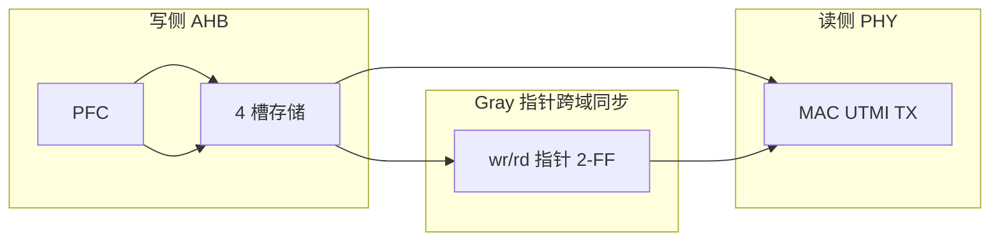
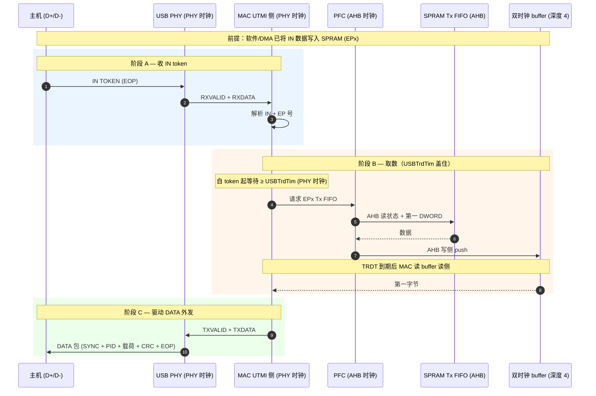

# A6 · USBTrdTim

| | |
|---|---|
| **前置** | [`A5-dwc2-buffer-dma.md`](A5-dwc2-buffer-dma.md) §3 |
| **本文** | PG §7.9；IN token 到首字节；Linux vs Lynx |
| **下一步** | —（体系外圈专项） |

> 对照 `core.c` `dwc2_hs_phy_init()` 与 Lynx `USB_SetTurnaroundTime()`。系列索引：[`README.md`](README.md)。

---

## 1. 是什么、不是什么

| 名称 | 层次 | 含义 |
|------|------|------|
| **`GUSBCFG.USBTrdTim`** | **芯片内部**（DWC2 MAC） | MAC 收到 **IN token** 后，到能从 PFC/FIFO 拿到 **第一笔数据**、开始 **UTMI 发送** 之前，至少等待的 **PHY 时钟拍数** |
| **USB 2.0 总线 turnaround** | **协议层** | TOKEN 与 DATA 之间主机/设备切换 D+/D- 驱动权的 **bit time** 间隔 |

二者名字都含 turnaround，**不是同一概念**。本文档讨论前者；软件 **不需要** `msleep`，只写寄存器字段。

PG §7.9 原文（摘要）：

> MAC 从收到 IN token，到从 PFC 拿到 FIFO 状态并得到第一笔数据的时间（PHY 时钟计）。过程：(1) PFC 将 token 信息同步到 AHB；(2) PFC 从 **SPRAM** 读数据写入双时钟 buffer；(3) MAC 从 buffer（深度 4）读出。

---

## 2. 硬件块与时钟域

```
  Host (D+/D-)
       ◄──► PHY (PHY 时钟, utmi_clk)
                ◄──UTMI──► MAC UTMI 侧 (PHY 时钟)
                                │
                         双时钟 FIFO (深度 4)
                                │
                PFC (AHB 时钟) ◄──► SPRAM Tx/Rx FIFO (AHB 时钟)
                                │
                           AHB ◄── CPU / DMA
```

| 块 | 时钟域 | 作用 |
|----|--------|------|
| **PHY** | PHY | D+/D- ↔ UTMI 并行信号 |
| **MAC UTMI 侧** | PHY | 收 token / 发 DATA 位流 |
| **PFC** | AHB | 按 EP 号读 Tx FIFO |
| **SPRAM** | AHB | 片内包缓冲；Rx + 各 EP Tx FIFO 共用一块 RAM |
| **双时钟 buffer** | 跨域 | PFC(AHB 写) ↔ MAC(PHY 读) |

**STM32MP157**：DWC2 挂 **AHB**（`USBO_K`，常见 48 MHz）；PHY 由 **USBPHYC** 出 `ck_usbo_48m` 等。**频率可相同，仍是两路时钟域**，中间必有同步器——`USBTrdTim` 补偿的就是这段固定流水线延迟。

---

## 3. 为何数据在 SPRAM 仍要等

软件 `enqueue` 把 IN 数据写入 **SPRAM 里对应 EP 的 Tx FIFO**（Slave：AHB 写 FIFO 寄存器；DMA：从 DDR 搬入 SPRAM）。**不是**直接写入 MAC/PHY 侧大 buffer。

| 原因 | 说明 |
|------|------|
| MAC 旁 buffer 仅 **深度 4** | 跨时钟域 **流水** 垫片（一包内后续字节边读边发），**放不下整包** |
| 发哪路 EP 由 **IN token 的 EP 号** 决定 | token 到达前硬件不知读哪块 FIFO |
| CPU 不能按 PHY 节拍逐字节写 | MAC 发 bit 必须跟 PHY 时钟 |

`USBTrdTim` 等的 **不是软件慢**，而是 **token 触发 PFC 读 SPRAM → 第一笔数据出现在双时钟 buffer 输出侧（MAC 可读）** 的固定硬件拍数。

**不必灌满 4 深 buffer**：PG §7.9 只要求等到 **first data** 就绪即可开头发 DATA；深度 4 用于发包过程中 SPRAM→buffer→MAC 的流水线，与 `USBTrdTim` 最小等待无关。

---

## 4. 双时钟 buffer 与 MAC 发送调度

### 4.1 PFC（Packet FIFO Controller）

**PFC** = PG 中的 **Packet FIFO Controller（包 FIFO 控制器）**，DWC2 IP **内部模块**，跑在 **AHB 时钟域**。Linux 驱动 **无** 同名寄存器/函数；软件通过 FIFO 寄存器、`RxFLvl` 中断等 **间接** 使用。

| 职责 | 说明 |
|------|------|
| 管理 SPRAM | Rx FIFO 写入、各 EP Tx FIFO 读出 |
| 按 token/EP 选路 | IN token 到达后，读 **对应 EP** 的 Tx FIFO 状态与数据 |
| 跨域衔接 | 把 MAC(PHY 域) 的「要发 EPx」同步到 AHB，再读 SPRAM |

### 4.2 双时钟 buffer（async FIFO）结构

PG §7.9 称 **dual-clock source buffer**，深度 **4**，**软件不可见、不可配**。



| 要素 | 说明 |
|------|------|
| 类型 | 标准 **异步 FIFO（CDC FIFO）** |
| 写时钟 | AHB — PFC 从 SPRAM 取字后 push |
| 读时钟 | PHY — MAC 按 UTMI 节拍 pop |
| 深度 4 | **流水**用：掩盖 AHB 读 SPRAM 的 bubble；**不是**存整包（整包在 SPRAM） |
| 空/满 | 指针 Gray 码 + 同步；**不等同于** MAC 发送调度的唯一依据（见 §4.3） |

PG 延迟公式中 **「+1 PHY clock（2-clock FIFO 输出）」** 指读侧从 RAM 到 `TXDATA` 有效的输出寄存延迟。

### 4.3 MAC 为何「不等 buffer 非空」而依赖 USBTrdTim

常见疑问：**第一字节若尚未到 buffer 读侧，MAC 不应一直等吗？**

**结论：MAC 会等，但只等 `USBTrdTim` 配置的 PHY 时钟拍数，不是闭环「等到 FIFO 非空再 TX」。**

| 模型 | MAC 实际行为 | 软件类比 |
|------|--------------|----------|
| **闭环（非本 IP 主路径）** | 每拍查 buffer 空/满，空则 stall | `while (empty);` |
| **开环（DWC2 IN 路径）** | token 到 → 启动 **固定延迟计数（USBTrdTim）** → 计数到则读 buffer / 拉 `TXVALID` | 按标定好的 N 拍去取货，**不是**无限等 |

```
IN token 到 MAC
    │
    ├─ 启动 USBTrdTim 计数（PHY 时钟）
    │
    ├─ 计数到 → 假定「PFC→SPRAM→buffer 读侧」流水线已完成
    │
    └─ 读 buffer / TXVALID → PHY 发 DATA
```

**TRDT 合适**：计数结束时，第一字 **刚好** 出现在 buffer 读侧 → 正常发 DATA。

**TRDT 过小**：计数结束时，PFC 仍在读 SPRAM 或数据尚在 buffer **写侧** → MAC **仍按时刻** 发起读/TXVALID → 无效读、错包或 underflow → 主机超时、重传。

**为何不用「永远等到非空」：**

| 因素 | 说明 |
|------|------|
| USB turnaround | IN token 后须在协议窗口内开始回 DATA，不能无限等 |
| AHB 频率因板而异 | 读 SPRAM 路径长度不同 → 须 **可配 TRDT** 标定流水线 |
| 硅片代价 | 全路径每字节「空/满 + 跨域握手」比 **TRDT + 4 深流水** 更重 |

**类比**：SPRAM = 仓库（数据已备好）；PFC→buffer = 传送带（固定需 N 拍）；`USBTrdTim` = 告诉 MAC「token 后至少 N 拍再去出口取」；**N 配小** = 货未到就取，**不是** MAC 故意无视空 buffer，而是 **信错了时间表**。

> PG 提供 §7.9 公式与 `USBTrdTim` 字段，即说明 MAC 侧为 **与 AHB 延迟对齐的开环定时**；具体 RTL 微架构未在 Linux 树中展开，以上依据 PG 叙述与通用 CDC FIFO 行为归纳。

---

## 5. IN token 收 + DATA 发（时序）



**为何量「token → 驱动 PHY」**：见 §4.3。USB 要求 IN token EOP 后设备尽快发 DATA；第一字节须经 **PFC→SPRAM→buffer** 才能到 UTMI 口；`USBTrdTim` 标定 MAC **开环等待** 长度，防止 **过早 TXVALID**。

---

## 6. PG §7.9 延迟预算（详述）

### 6.1 寄存器单位与总公式

PG 先按 **时间** 相加，再换算为 **PHY 时钟个数** 写入 `GUSBCFG[13:10]`（`USBTrdTim` 字段）：

```
T_total = 5.5 × T_AHB + 1 × T_PHY

USBTrdTim（寄存器值，PHY 时钟个数）
        = T_total / T_PHY
        = 5.5 × (f_PHY / f_AHB) + 1
```

**小数四舍五入**到整数。PG 注：AHB 比 PHY **快**时可用 **更小** TRDT。

### 6.2 PG 举例验算

| 场景 | f_AHB | f_PHY | f_PHY/f_AHB | 计算 | TRDT |
|------|-------|-------|-------------|------|------|
| HS 最坏 | 42 MHz | 30 MHz | ≈0.714 | 5.5×0.714+1 ≈ 4.93 | **5** |
| AHB 较慢 | 30 MHz | 60 MHz | 2 | 5.5×2+1 | **12** |

AHB **相对 PHY 越慢**，同样 5.5 拍 AHB 占的绝对时间越长 → 换成 PHY 时钟 **越多** → TRDT **越大**。

### 6.3 五项组成（按时间顺序）


| # | PG 项 | 时钟域 | 含义 |
|---|--------|--------|------|
| 1 | **2 × AHB** | AHB | **2-FF 同步器**（见 §6.4） |
| 2 | **1.5 × AHB** | AHB | PHY→AHB **失采样 / 相位裕量**（见 §6.5） |
| 3 | **1 × AHB** | AHB | SPRAM **地址相位**（PFC 选 EPx Tx FIFO 地址） |
| 4 | **1 × AHB** | AHB | SPRAM **读数据相位**（第一 DWORD 返回） |
| 5 | **1 × PHY** | PHY | 双时钟 buffer **读侧输出**到 MAC 可用（PG：2-clock FIFO output） |

**仅保证 first data**，**不必**灌满 4 深 buffer（见 §3）。

概念时间线：

```
─── AHB 域 ─────────────────────────────────────────────────────
    [2-FF][1.5 missample][addr][read SPRAM] → push buffer 写侧
─── PHY 域 ─────────────────────────────────── [1 PHY out] → MAC 读
```

### 6.4 2-FF 同步器（Two Flip-Flops）

**2-FF** = **两级 D 触发器**，跨时钟域（CDC）里最常用的 **单比特同步器**。

MAC 收 IN token 在 **PHY 时钟**；PFC 读 FIFO 在 **AHB 时钟**。「token 到了 / 读 EPx」这类事件 **不能直连**，否则可能 **亚稳态**（输出短暂既非 0 也非 1）。

```
PHY 域:  token_event ──► [DFF1] ──► [DFF2] ──► stable_req  (AHB 域)
                            ↑         ↑
                         AHB clk   AHB clk
                         └─ 2 个 AHB 周期 ─┘
```

| 级 | 作用 |
|----|------|
| 第 1 级 | 在 AHB 沿采 PHY 来的异步信号；可能亚稳 |
| 第 2 级 | 再采一级；输出在 AHB 域 **稳定** |
| PG「2×AHB」 | 对此路径占 **至少 2 个 AHB 时钟** 的预算 |

**与 §4.2 中 async FIFO 的 Gray 指针 2-FF 不同**：那边是 **空/满指针** 跨域；§7.9 的 2-FF 指 **token/取数请求** 从 MAC(PHY) 进 PFC(AHB)。二者都是 CDC，预算项只计 **token 路径**。

### 6.5 1.5 × AHB — 失采样裕量（missampling margin）

| 项目 | 说明 |
|------|------|
| **原因** | PHY 边沿相对 AHB 边沿 **相位随机**；2-FF 最坏可接近 **3 拍** 才稳定 |
| **PG 处理** | 在 2×AHB 之外另加 **1.5×AHB** 作 **工程裕量**（非可测的单周期事件） |
| **含义** | 避免 PFC 在「请求尚未在 AHB 域稳定」时就开始读 SPRAM |

同步相关合计约 **3.5×AHB** 量级（2 + 1.5）。

### 6.6 1 × AHB — 访问 SPRAM 地址

PFC 根据 IN token 的 **EP 号**，在 AHB 上发起对 **Tx FIFO** 的读事务 **地址相位**：

- 选通对应 EP 的 FIFO 基址 + 偏移  
- PG 按 **单次 AHB 传输 1 拍地址** 建模  

此时尚未返回数据。

### 6.7 1 × AHB — 从 SPRAM 读数据

**读数据相位**：SPRAM（单端口包 RAM）返回 **FIFO 状态 / 第一 DWORD**。

PG 按 **1 拍读延迟** 建模。读到的字随后由 PFC **push 到双时钟 buffer 写侧**（写入常与流水线重叠，不单列一拍）。

### 6.8 1 × PHY — 双时钟 buffer 读侧输出

数据已在 buffer **AHB 写侧**；MAC 从 **PHY 读侧** pop。PG 称 **「2-clock FIFO output」**，用 **1 个 PHY 时钟** 计入 TRDT，表示读侧输出寄存到 MAC `TXDATA` 可用的延迟。

这是公式中 **唯一用 PHY 时钟计** 的一项；前五项均为 AHB，需用 `f_PHY/f_AHB` 换算后相加。

### 6.9 与 Linux / STM32MP157 的关系

| 来源 | 行为 |
|------|------|
| **PG §7.9** | 按 **f_AHB、f_PHY** 用上式计算 |
| **Linux dwc2** | 不跑公式；device + UTMI：**16-bit → 5**，**8-bit → 9**（`core.c` `dwc2_hs_phy_init`） |
| **本配置** | `USBO_K` 常见 48 MHz；8-bit UTMI 写 **9** 为偏保守固定值 |
| **Lynx HAL** | 原设计按 `hclk` 查表；现 FS/HS 多写 **0xB** |

手算 TRDT 用于理解 **AHB 降频、时钟比变化** 时 IN 偶发错是否可疑；日常以驱动写入值为准。

---

## 7. Linux vs Lynx 谁写、何时写

### 7.1 Linux 5.4 dwc2

| 项 | 内容 |
|----|------|
| 寄存器 | `GUSBCFG.USBTRDTIM_MASK` / `GUSBCFG_USBTRDTIM_SHIFT`（`hw.h`） |
| 函数 | `dwc2_hs_phy_init()` → `core.c` |
| 时机 | **probe** `dwc2_phy_init()`；每次 `core_init_disconnected()` 也会调 `dwc2_phy_init(true)`（已写入则通常不再改） |
| 依据 | **UTMI 位宽**：16-bit → **5**；8-bit → **9** |
| **不在** `irq_enumdone()` | EnumDone 只设 speed / MPS / `enqueue_setup` |

```c
/* core.c — device + UTMI */
if (dwc2_is_device_mode(hsotg)) {
    usbcfg &= ~GUSBCFG_USBTRDTIM_MASK;
    if (hsotg->params.phy_utmi_width == 16)
        usbcfg |= 5 << GUSBCFG_USBTRDTIM_SHIFT;
    else
        usbcfg |= 9 << GUSBCFG_USBTRDTIM_SHIFT;
}
```

### 7.2 Lynx HAL

| 项 | 内容 |
|----|------|
| 函数 | `USB_SetTurnaroundTime()` — `stm32f7xx_ll_usb.c` |
| 时机 | **`ENUMDNE` 中断**（`HAL_PCD_IRQHandler`），`USB_GetDevSpeed()` 之后 |
| 依据 | 原设计按 `hclk` + `speed` 查表；当前树中 FS/HS **均写 `0xB`**，`hclk` 传 `0` |

```c
/* EnumDone 分支 — stm32f7xx_hal_pcd.c */
(void)USB_SetTurnaroundTime(hpcd->Instance, 0, (uint8_t)hpcd->Init.speed);
```

### 7.3 差异小结

| | Linux | Lynx |
|---|-------|------|
| 做不做 | **做** | **做** |
| 时机 | PHY init（阶段一） | EnumDone（阶段三） |
| 选型依据 | UTMI 8/16 bit | speed（表已简化） |
| PG §7.4.2 要求 | 否 | 否（ST 惯例） |

Linux 不在 EnumDone 重写的理由：**AHB/UTMI 宽度在枚举前后不变**；数据已在 SPRAM 时，瓶颈仍是固定硬件流水线，probe 时配置一次即可。Lynx 跟 ST 参考在速度确定后再设一遍，固定 48 MHz 时钟下两者通常都能工作。

---

## 8. 设错时的现象

| `USBTrdTim` | 现象 |
|-------------|------|
| **过小** | MAC 按 **过短的 TRDT** 到期读 buffer / 拉 TXVALID；**第一字节尚未到 buffer 读侧**（§4.3、§6）→ 错包、主机超时、重传、bulk 变慢；严重可枚举/传输失败 |
| **合适** | TRDT 与 PFC→SPRAM→buffer 流水线对齐；IN 第一包在协议 turnaround 内正常发出 |
| **偏大** | 多数情况仍可用；IN 响应略保守 |

与 **软件未及时 enqueue** 区分：后者 SPRAM 无数据，应 NAK/短包，**不是**调大 `USBTrdTim` 能单独解决的。

---

## 9. 源码索引

| 主题 | 路径 |
|------|------|
| 位定义 | `drivers/usb/dwc2/hw.h` — `GUSBCFG_USBTRDTIM_*` |
| Linux 写入 | `drivers/usb/dwc2/core.c` — `dwc2_hs_phy_init()` |
| 调用时机 | `drivers/usb/dwc2/gadget.c` — `dwc2_hsotg_core_init_disconnected()` → `dwc2_phy_init()` |
| Lynx 写入 | `robotos/.../stm32f7xx_ll_usb.c` — `USB_SetTurnaroundTime()` |
| Lynx 调用 | `robotos/.../stm32f7xx_hal_pcd.c` — `ENUMDNE` 分支 |
| PG 译文 | `~/文档/测试记录/USB/DWC_otg_programming_第7章_中英对照.html` — §7.9 |

---

## 10. 一句话

**`USBTrdTim` = IN token 到齐后，MAC 按开环定时等多拍 PHY 时钟（非等到 buffer 非空），使 PFC 从 SPRAM 经双时钟 buffer 把第一字节送到 UTMI 发送口后再驱动 PHY 发 DATA；Linux 在 `dwc2_phy_init` 写，Lynx 在 EnumDone 写，补偿的是硅片流水线而非软件延迟。**
