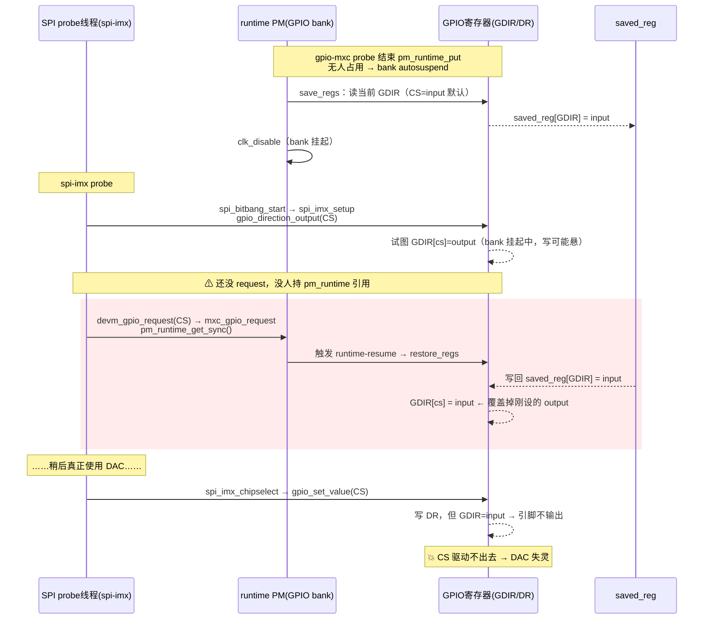

# IMX6ULL SPI 片选 GPIO「时好时坏」问题分析

> **环境**：NXP BSP linux-4.9.88（`gpio-mxc` 带 runtime PM）· IMX6ULL · SPI 接 DAC  
> **关联**：[STM32MP157 SPI 子系统](/analysis/kernel/spi/spi-sync-trace) · [STM32 GPIO 分析](/analysis/kernel/gpio/stm32-gpio)  
> **状态**：已解决（先 `request` 再设 output）

> **现象**：在 IMX6ULL 上用 SPI DAC，有时能操作模块、有时不行。  
> **根因**：`spi-imx` 在 `spi_bitbang_start`（→ `spi_imx_setup`）里**先把 CS 引脚设成 output，之后才 `devm_gpio_request` 申请该 GPIO**；而 NXP BSP（linux-4.9.88）的 `gpio-mxc` 给 GPIO bank 加了 **runtime PM**——「申请 GPIO」会触发 bank 恢复（resume），而恢复会把挂起前保存的旧寄存器（CS still input）灌回去，**覆盖掉刚设好的 output**。

---

## 1. 关键代码（NXP BSP linux-4.9.88，`drivers/gpio/gpio-mxc.c`）

1) `.request` 回调会 `pm_runtime_get_sync` —— 只有“申请 GPIO”才让 bank 上电/恢复：

```c
static int mxc_gpio_request(struct gpio_chip *chip, unsigned offset)
{
	...
	ret = pm_runtime_get_sync(chip->parent);   // 触发 bank runtime-resume
	return ret < 0 ? ret : 0;
}
static void mxc_gpio_free(struct gpio_chip *chip, unsigned offset)
{
	...
	pm_runtime_put(chip->parent);
}
```

2) runtime 挂起/恢复：挂起 save_regs + 关时钟；恢复 开时钟 + restore_regs：

```c
static int __maybe_unused mxc_gpio_runtime_suspend(struct device *dev)
{
	...
	mxc_gpio_save_regs(port);
	clk_disable_unprepare(port->clk);
}
static int __maybe_unused mxc_gpio_runtime_resume(struct device *dev)
{
	clk_prepare_enable(port->clk);
	...
	mxc_gpio_restore_regs(port);
}
```

3) 恢复时把 `saved_reg` 原样写回 `GDIR`（方向）/`DR`（电平）：

```c
	writel(port->saved_reg[3], port->base + GPIO_GDIR);
	writel(port->saved_reg[5], port->base + GPIO_DR);
```

> 注意：`gpio_direction_output()` 这类操作**不会**帮你 `pm_runtime_get`，
> 只有 `mxc_gpio_request()`（申请 GPIO）才会。

---

## 2. 会触发问题的时序图



---

## 3. 状态变化表

| 时刻 | bank runtime 状态 | `GDIR[cs]` | 说明 |
|---|---|---|---|
| bank autosuspend | suspended | input | save_regs 把默认 input 存进 saved_reg |
| spi 设 output | suspended | output(悬) | 未 request，没 pm_runtime 引用，写可能丢 |
| request→get_sync→resume | resumed | **input** | restore_regs 把 saved_reg(input) 灌回，覆盖 output |
| 用 DAC 时 | resumed | input | 写 DR 无效，CS 失效 💥 |

---

## 4. 为什么“时好时坏”

取决于 **spi 申请 CS 的那一刻，bank 是否已经 autosuspend**：

- bank **仍活动**（同 bank 有别的 GPIO 在用、持着 pm_runtime 引用）→ `pm_runtime_get_sync`
  只加引用计数、**不触发 resume** → 不 restore → 第 2 步的 output 保留 → **能用**；
- bank **已 autosuspend** → `pm_runtime_get_sync` **触发 resume → restore** → GDIR 被覆盖成 input
  → **不能用**。

是否 autosuspend 取决于同 bank 其它 GPIO 占用、autosuspend 延时、上电顺序等，
所以表现为偶发、时好时坏。

---

## 5. 为什么“先 request 再设 output”能修好

把顺序反过来：

1. 先 `devm_gpio_request` → `pm_runtime_get_sync` → bank resume → restore（GDIR 还原成 input）——**先发生**；
2. **再** `gpio_direction_output(CS)` 设成 output —— 这是最后一笔，且此时 bank 已 resume、
   引用计数 > 0，后面不会再有 resume 来覆盖它。

→ CS 稳定为 output，正常。这也是后来主线内核把 CS GPIO 申请提前、
改由 SPI 核心统一管理 `cs-gpios` 的原因。

---

## 6. 为什么主线 5.4 上复现不了

当前主线 5.4 的 `gpio-mxc.c` **没有这套 runtime PM**：
`.request` 用 `gpiochip_generic_request`（不碰 pm_runtime），bank 时钟在 probe 时
`clk_prepare_enable` 后**一直开着**，不会 autosuspend，也就没有
“request 触发 resume → restore → 覆盖 output”这条链。

因此同样的 spi-imx 顺序问题，在主线 5.4 上不发作；它是 **NXP BSP（runtime PM 版 gpio-mxc）特有的隐患**。
（且主线 5.4 的 save/restore 对 imx6ull 还因 `power_off=false` 而是空操作。）

---

## 7. 三个触发要件（缺一不可）

1. **顺序倒置**：先 `gpio_direction_output`、后 `devm_gpio_request`。
2. **GPIO bank 带 runtime PM 且已 autosuspend**：使 request 触发一次 resume+restore。
3. **saved_reg 里 CS 为 input**：restore 写回的旧值是上电默认 input，从而覆盖 output。

---

## 8. `pm_runtime_get_sync()` 触发 resume 的完整调用栈

`chip->parent` 是 gpio-mxc 的 platform device（`port->gc.parent = &pdev->dev`）。
该设备的 `.pm = &mxc_gpio_dev_pm_ops`，其中：

```c
static const struct dev_pm_ops mxc_gpio_dev_pm_ops = {
	SET_SYSTEM_SLEEP_PM_OPS(mxc_gpio_suspend, mxc_gpio_resume)
	SET_RUNTIME_PM_OPS(mxc_gpio_runtime_suspend,
			mxc_gpio_runtime_resume, NULL)
};
```

所以 `runtime_resume` 回调解析到 `mxc_gpio_runtime_resume`。完整链路如下：

```text
mxc_gpio_request(chip, offset)                         // drivers/gpio/gpio-mxc.c
└─ pm_runtime_get_sync(chip->parent)                   // include/linux/pm_runtime.h
   └─ __pm_runtime_resume(dev, RPM_GET_PUT)             // drivers/base/power/runtime.c
      ├─ atomic_inc(&dev->power.usage_count)            //  ① 引用计数 +1
      ├─ spin_lock_irqsave(&dev->power.lock)
      └─ rpm_resume(dev, RPM_GET_PUT)                   // drivers/base/power/runtime.c
         ├─ if (dev->power.runtime_status == RPM_ACTIVE) { retval = 1; goto out; }  // 已活动→只加计数，不跑回调(返回1)
         ├─ if (dev->parent) rpm_resume(parent, 0)      //  必要时先唤醒父设备
         ├─ __update_runtime_status(dev, RPM_RESUMING)
         ├─ cb = RPM_GET_CALLBACK(dev, runtime_resume)  //  ② 选回调：
         │      // pm_domain > type > class > bus > driver->pm
         │      // platform 设备 → dev->driver->pm = mxc_gpio_dev_pm_ops
         │      //              → .runtime_resume = mxc_gpio_runtime_resume
         └─ rpm_callback(cb, dev)
            └─ __rpm_callback(cb, dev)
               └─ mxc_gpio_runtime_resume(dev)          // ← 驱动回调 (gpio-mxc.c)
                  ├─ clk_prepare_enable(port->clk)       //  ③ 开 bank 时钟
                  └─ mxc_gpio_restore_regs(port)         //  ④ 回灌寄存器
                     ├─ writel(saved_reg[0], base+GPIO_ICR1)
                     ├─ writel(saved_reg[1], base+GPIO_ICR2)
                     ├─ writel(saved_reg[2], base+GPIO_IMR)
                     ├─ writel(saved_reg[3], base+GPIO_GDIR)  // ★ 方向被还原成旧值(input)
                     ├─ writel(saved_reg[4], base+GPIO_EDGE_SEL)
                     └─ writel(saved_reg[5], base+GPIO_DR)     // ★ 电平被还原成旧值
            // 之后 __update_runtime_status(dev, RPM_ACTIVE)
```

要点：

- **只有 bank 当前是 `RPM_SUSPENDED` 时，`rpm_resume` 才会真正走到回调**；若 bank 已 `RPM_ACTIVE`
  （同 bank 有别的脚被占用），则只做计数 +1、不 resume、不 restore —— 这就是“时好时坏”的分水岭。
- 精确说：判据是 **`runtime_status == RPM_ACTIVE`**，不是“计数 >0”本身。计数的作用是
  **顶住设备不让它挂起**（put 到 0 才会 suspend），从而保持在 `RPM_ACTIVE`；真正决定
  “跳过 resume”的是 `rpm_resume` 里那句 `if (runtime_status == RPM_ACTIVE) {retval=1; goto out;}`。
  （反例：bank 处于 SUSPENDED 时，本次 `get_sync` 把计数 0→1，计数已 >0，但仍会 resume。）
- 第 ④ 步里标 ★ 的两行（写 `GDIR`/`DR`）就是**把 CS 覆盖回旧值（input）**的地方，
  正好盖掉前面 `gpio_direction_output(CS)` 设的 output。
- 回调是按 `pm_domain → type → class → bus → driver->pm` 顺序解析的；
  gpio-mxc 是 platform 驱动，最终命中 `driver->pm` 里的 `mxc_gpio_runtime_resume`。

---

## 9. `mxc_gpio_probe` 结尾 `pm_runtime_put()` 触发挂起（保存寄存器）的完整调用栈

> ⚠ 先纠正一个常见误解：**这条路并不会“把 GPIO 设置成 input”**。
> `mxc_gpio_runtime_suspend` 只做两件事：`save_regs`（**读出并保存**当前寄存器）+ 关时钟。
> CS 之所以是 input，是因为**保存的那一刻它本就是上电复位默认值 input**（`GDIR` 复位值=0=输入），
> 并不是被这条路主动写成 input。真正让 CS 变回 input 的，是后面第 8 节那次 **resume 时的 restore**
> 把这里保存的 input 又灌了回去。

probe 末尾：

```c
	platform_set_drvdata(pdev, port);
	pm_runtime_put(&pdev->dev);   // 计数 1→0，触发 runtime 自动挂起
	return 0;
```

完整链路：

```text
mxc_gpio_probe() 末尾
└─ pm_runtime_put(&pdev->dev)                          // include/linux/pm_runtime.h:237
   └─ __pm_runtime_idle(dev, RPM_GET_PUT | RPM_ASYNC)  // drivers/base/power/runtime.c
      ├─ atomic_dec_and_test(&dev->power.usage_count)  //  ① 计数 -1，到 0 才继续
      └─ rpm_idle(dev, RPM_GET_PUT | RPM_ASYNC)        // runtime.c:299
         ├─ callback = RPM_GET_CALLBACK(dev, runtime_idle)  //  ② gpio-mxc 未提供 → NULL
         └─ return rpm_suspend(dev, rpmflags | RPM_AUTO)    // runtime.c:356 (无 idle 回调→直接去挂起)
            //  因带 RPM_ASYNC：不当场挂起，而是排进工作队列
            ├─ dev->power.request = RPM_REQ_SUSPEND
            └─ queue_work(pm_wq, &dev->power.work)
               └─ pm_runtime_work(work)               // pm_wq 工作线程
                  └─ rpm_suspend(dev, RPM_NOWAIT)      // runtime.c:415
                     ├─ __update_runtime_status(dev, RPM_SUSPENDING)
                     ├─ cb = RPM_GET_CALLBACK(dev, runtime_suspend) → mxc_gpio_runtime_suspend
                     ├─ rpm_callback(cb, dev)
                     │  └─ __rpm_callback
                     │     └─ mxc_gpio_runtime_suspend(dev)   // gpio-mxc.c
                     │        ├─ mxc_gpio_save_regs(port)      //  ③ 只读+保存，不写
                     │        │   ├─ readl(base+GPIO_GDIR) → saved_reg[3]  // ★此刻 CS=默认 input
                     │        │   └─ readl(base+GPIO_DR)   → saved_reg[5]
                     │        └─ clk_disable_unprepare(port->clk)          //  ④ 关 bank 时钟
                     └─ __update_runtime_status(dev, RPM_SUSPENDED)
```

要点：

- **没有任何“set direction input”的写操作**；★ 那行是 `readl(GDIR)` 把当前值（默认 input）**存进** `saved_reg`。
- `RPM_ASYNC` 决定了挂起是**异步**完成的（经 `pm_wq` 工作队列），不是在 `pm_runtime_put` 当场同步执行。
- gpio-mxc 没有 `runtime_idle` 回调，所以 `rpm_idle` 直接转去 `rpm_suspend`，计数一到 0 就会挂起。
- 配合第 8 节：**这里 save 的 input → 第 8 节 request 时 resume 的 restore 又写回 input**，
  二者一存一灌，才把 `spi_imx_setup` 设的 output 抹掉。“设成 input”是误解，准确说是
  **“保存了默认 input、之后又恢复了它”**。
