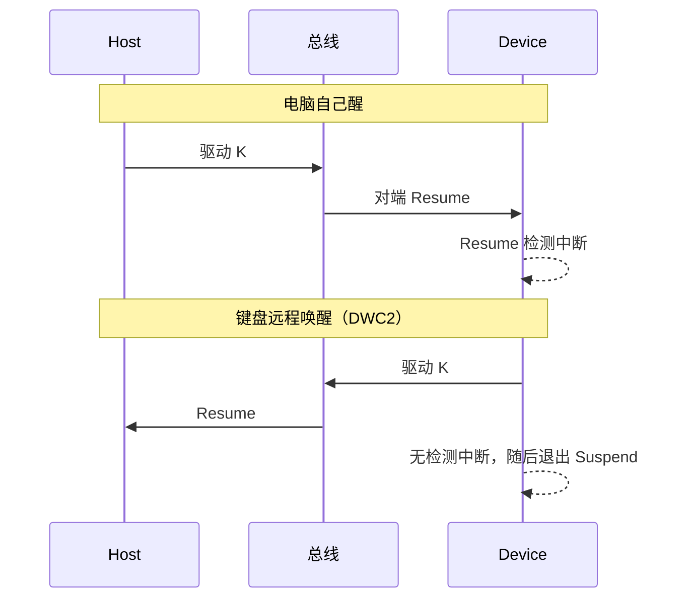

# USB HID 键盘 Remote Wakeup：Host 何时允许、Device 看到什么

> **环境**：USB 2.0 Device，枚举为 HID 键盘；对照 Ubuntu 20.04、Windows 7 / 10 / 11、macOS 10.13.6 High Sierra、macOS 15.7.7 Sequoia  
> **关联**：[USB 2.0 枚举流程](/analysis/kernel/usb/usb-enumeration) · [USB Device 公头悬空误报 Suspend](/analysis/kernel/debug/usb/floating-male-false-suspend)  
> **范围**：USB 2.0 Suspend / Resume（总线空闲约 3 ms 后挂起），不是 LPM Sleep

---

## 目录

- [1. 要看的两件事](#1-要看的两件事)
- [2. 协议：Host 什么时候 SET_FEATURE](#2-协议host-什么时候-set_feature)
- [3. 总线：Suspend / Resume 是线态](#3-总线suspend--resume-是线态)
- [4. Device 主动 Resume，在 DWC2 上为什么没有中断](#4-device-主动-resume在-dwc2-上为什么没有中断)
- [5. Linux：键盘默认开、鼠标默认关](#5-linux键盘默认开鼠标默认关)
- [6. 各系统实测](#6-各系统实测)
- [附录 A 线态](#附录-a-线态)
- [附录 B 要点](#附录-b-要点)

---

## 1. 要看的两件事

把电脑从休眠里唤醒，USB 键盘这边要同时成立两件事：

1. **协议上允许。** 配置描述符 `bmAttributes` 带 Remote Wakeup（常见值 `0xA0`：总线供电 + Remote Wakeup）。Host 再发 `SET_FEATURE(DEVICE_REMOTE_WAKEUP)`，设备才可以把这个功能打开。没有这条，Device 即使要把总线打成 K，协议栈也会拒绝。
2. **总线上发出 Resume。** USB 2.0 Full Speed 上这是把线驱动成 **K**，不是 SETUP / IN / DATA 那种带 PID 的包。

后面测的两条路径，协议可以相同，总线方向相反：

| 谁先动 | 总线上 | Device 侧（本次实测的 DWC2） |
|--------|--------|-----------|
| 键盘唤醒电脑 | Device 驱动 K（Remote Wakeup） | 随后退出 Suspend；驱动 K 当时 **没有** Resume 检测中断 |
| 电脑自己醒（电源键、开盖等） | Host 驱动 K | **有** Resume 检测中断 |

---

## 2. 协议：Host 什么时候 SET_FEATURE

USB 2.0 第 9 章允许 Configured 之后随时 `SET_FEATURE`。各操作系统实际发的时刻不一样：

- **Ubuntu / Windows 7 / 10 / 11**：枚举完成时不发；进入休眠前发 `SET_FEATURE(DEVICE_REMOTE_WAKEUP)`。醒后再发 `CLEAR_FEATURE`，关掉 Remote Wakeup。
- **macOS**（High Sierra、Sequoia）：枚举到 Configured 之后立刻 `SET_FEATURE`，休眠前不再发一次；醒后也没有 `CLEAR_FEATURE`。

进入休眠时，上面这些系统总线都会停在空闲；空闲够约 3 ms，设备进入 Suspend。

Windows 设备管理器里「允许此设备唤醒计算机」对应的就是 Host 会不会发这条 `SET_FEATURE`。Linux 上对应 `power/wakeup`，见 §5。

---

## 3. 总线：Suspend / Resume 是线态

和 [公头悬空误报 Suspend](/analysis/kernel/debug/usb/floating-male-false-suspend) 用的是同一套线态。Full Speed、Device 上拉在 D+：

| 线态 | 含义 |
|------|------|
| **J**（空闲）持续约 ≥ 3 ms | Suspend |
| **K** | Resume |
| **SE0** 持续约 ≥ 10 ms | Bus Reset |

`SET_FEATURE`、`CLEAR_FEATURE`、HID 报告都是总线已经回到空闲之后才出现的控制传输或中断传输。Resume 本身没有 PID，不会走进 EP0 的 SETUP 处理。

控制器上的 Resume 中断，语义因 IP 而异。USB 2.0 只规定总线上要出现 K，并不规定 Device 自己驱动 K 时一定再报一发「检测到 Resume」。本次用的 DWC2 把这条中断做成 **检测到对端把总线拉起来**，见 §4。

---

## 4. Device 主动 Resume，在 DWC2 上为什么没有中断

键盘唤醒时，Host 已经 `SET_FEATURE`、设备已 Suspend。Device 按规范把总线驱动成 K，持续 1～15 ms，再停止驱动。Host 可以被这段 K 唤醒。

**这不是 USB 2.0 的通用结论。** 规范只要求 Device 把总线打成 K；自己驱动 K 之后会不会再来一发 Resume 检测中断，取决于控制器。本次设备和常见的 Synopsys DWC2 / DWC OTG 一样：Suspend 期间 **Device 自己发出的 K 通常不触发这条中断**，中断留给 Host 把总线拉起来的那一次。

Raspberry Pi 上用 DWC2 做 HID gadget、从浏览器唤醒休眠 PC，也踩过同一类问题，见 [John Lian：I had to patch the Linux kernel to wake my PC using a browser](https://johnlian.net/posts/tinypilot-usb-wake/)。那边缺的是 gadget 在 Suspend 下把总线打成 K；发出去之后，Device 侧同样不能靠「Resume 检测中断」当完成通知。

所以在 DWC2 上看到的是：

- 电脑自己醒：PHY 看到对端的 K → 报 Resume 检测中断
- Device 主动唤醒：驱动 K 当时没有这条中断；随后设备退出 Suspend，软件把状态切回 Configured

没有检测中断不等于唤醒失败。Host 已经被 K 拉起来了，只是这条「检测到 Resume」没来，状态要软件切。换到别的 UDC（例如会把 Remote Wakeup 完成也报进 resume 回调的），现象可以不一样。



---

## 5. Linux：键盘默认开、鼠标默认关

配置描述符 `bmAttributes` 带 Remote Wakeup，只表示设备能把电脑从休眠里拉起来。Linux 进休眠时会不会发 `SET_FEATURE(DEVICE_REMOTE_WAKEUP)`，看的是这块 USB 设备 sysfs 里的 `power/wakeup`。`usbhid` 默认只给 **Boot Protocol 键盘** 写成 `enabled`。HID 规范里这是接口描述符 `bInterfaceSubClass = 1`（Boot Interface）、`bInterfaceProtocol = 1`（Keyboard）：BIOS 用固定键盘报告，不必解析完整 Report Descriptor。

```c
/* drivers/hid/usbhid/hid-core.c — usbhid_start() 一段，Linux 5.4 / 5.15 相同 */
if (interface->desc.bInterfaceSubClass == USB_INTERFACE_SUBCLASS_BOOT &&
    interface->desc.bInterfaceProtocol == USB_INTERFACE_PROTOCOL_KEYBOARD) {
    usbhid_set_leds(hid);
    device_set_wakeup_enable(&dev->dev, 1);
}
```

`usbhid_start()` 按这两个字段判断。命中后 `device_set_wakeup_enable()` 打开的是这块 USB 设备的 `power/wakeup`；随后 Host 发的 `SET_FEATURE(DEVICE_REMOTE_WAKEUP)` 也是设备级请求。

同一台机器上可以同时接一块这样的键盘和一块鼠标。两块设备的配置描述符都可以带 Remote Wakeup（`bmAttributes = 0xA0`），sysfs 里常见：

```text
1-7  1a2c:2d23  wakeup=enabled   USB Keyboard
1-8  1c4f:0034  wakeup=disabled  Usb Mouse
```

进入休眠时 Host 只给 `wakeup=enabled` 的设备发 `SET_FEATURE(DEVICE_REMOTE_WAKEUP)`。跟踪控制传输可以看到：键盘在端口挂起前有 `SET_FEATURE DEVICE_REMOTE_WAKEUP`，醒后有 `CLEAR_FEATURE`；鼠标没有这两条，端口照样会挂起、再 Resume。

---

## 6. 各系统实测

Device 为 HID 键盘。设备侧驱动 K 做 Remote Wakeup；需要确认 Host 已收到键时再发空格。

### 6.1 进入休眠

| 系统 | 枚举完成后立刻 SET_FEATURE | 进入休眠前 SET_FEATURE | 总线是否 Suspend |
|------|---------------------------|------------------------|------------------|
| Ubuntu 20.04 | 否 | 是 | 是 |
| Windows 7 | 否 | 是 | 是 |
| Windows 10 | 否 | 是 | 是 |
| Windows 11 | 否 | 是 | 是 |
| macOS 10.13.6 High Sierra | 是 | 否（枚举时已 SET） | 是 |
| macOS 15.7.7 Sequoia | 是 | 否（枚举时已 SET） | 是 |

### 6.2 键盘远程唤醒

Device 驱动 K 当时都没有 Resume 检测中断（DWC2）。随后设备退出 Suspend。Ubuntu / Windows 7–11 醒后有 `CLEAR_FEATURE`，macOS 没有。

| 系统 | 醒后 CLEAR_FEATURE | 现象 |
|------|-------------------|------|
| Ubuntu 20.04 | 有，无新的 SET_FEATURE | Remote Wakeup 后需再发空格，Host 才出键 |
| Windows 7 | 有，无新的 SET_FEATURE | 同上 |
| Windows 10 | 有，无新的 SET_FEATURE | USB 已恢复；亮屏 / 登录再发空格 |
| Windows 11 | 有，无新的 SET_FEATURE | Remote Wakeup 后紧接着发空格 |
| macOS 10.13.6 High Sierra | 无 | Remote Wakeup 即可 |
| macOS 15.7.7 Sequoia | 无 | Remote Wakeup 即可 |

### 6.3 电脑自己醒

Host 驱动 K，Device 有 Resume 检测中断。Ubuntu / Windows 7–11 醒后 `CLEAR_FEATURE`；macOS 枚举阶段已 SET，醒后仍无 CLEAR。

---

## 附录 A 线态

| 总线上 | Device 侧 |
|--------|-----------|
| 空闲约 ≥ 3 ms | 进入 Suspend |
| 对端驱动 K（Host Resume） | Resume 检测中断 |
| Device 自己驱动 K | 在 DWC2 上通常没有检测中断；随后退出 Suspend |
| SE0 约 ≥ 10 ms | Bus Reset |

---

## 附录 B 要点

- `bmAttributes` 有 Remote Wakeup 只表示设备**能**唤醒；Host 的 `SET_FEATURE` 才表示**这次允许**。
- SET 的时刻是 Host 策略：Windows / Ubuntu 在进入休眠前，macOS 在枚举后。
- Resume 是 K 线态。在 **DWC2** 上，Resume 检测中断表示控制器看到**对端**把总线拉起来了，不是 Device 自己驱动 K 的完成通知。
- Linux `usbhid` 默认只给 Boot Protocol 键盘把 `power/wakeup` 写成 `enabled`。
