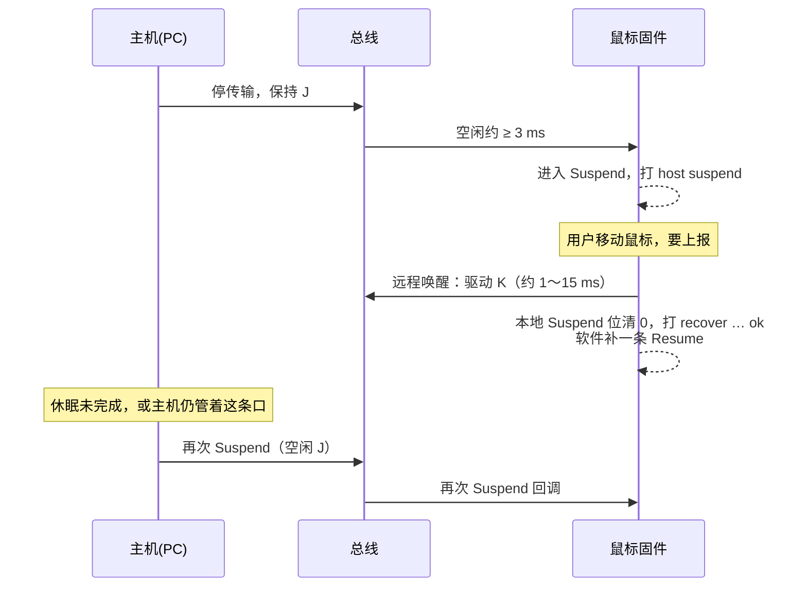

# PC 休眠时动一下鼠标，串口为何狂刷 Suspend / Resume

> **环境**：USB 2.0 HID 鼠标（设备侧）· Windows 7 主机 · DWC 类 UDC  
> **关联**：[HID 键盘 Remote Wakeup](/analysis/kernel/debug/usb/hid-remote-wakeup) · [USB 2.0 枚举流程](/analysis/kernel/usb/usb-enumeration)  
> **状态**：机理已理清；休眠进入阶段的反复打印多半是预期拉锯，假成功判断与总线卡在 K 才是实现问题

---

## 目录

- [1. 现象](#1-现象)
- [2. 线态与时序：先对齐名词](#2-线态与时序先对齐名词)
- [3. 结论先行](#3-结论先行)
- [4. 这些字是谁打的](#4-这些字是谁打的)
- [5. 为何会反复挂起又唤醒](#5-为何会反复挂起又唤醒)
- [6. 「恢复成功」为何经常是假的](#6-恢复成功为何经常是假的)
- [7. 边界：总线卡在 K](#7-边界总线卡在-k)
- [8. 边界：口被断电的窗口](#8-边界口被断电的窗口)
- [9. 和其他鼠标的差异](#9-和其他鼠标的差异)
- [10. 小结](#10-小结)
- [附录 A 线态速记](#附录-a-线态速记)
- [附录 B 要点速记](#附录-b-要点速记)

---

## 1. 现象

做 USB 鼠标固件时，有一类现象很唬人：电脑一点休眠，你还在动鼠标，设备串口就刷起 `host suspend` / `host resume`，中间还夹着「恢复成功」。字叠在一起，看着像状态机炸了。

在 Windows 7 上点休眠，**进入休眠的过程中**移动鼠标，串口日志大意如下：

- `event: host suspend`
- `event: host resume`
- `recover … configured: ok`
- 偶尔还有 `recover … configured: timeout`

两类打印抢着写同一条串口，字符会夹在一起：


实测里大约五次能碰到两次。刷起来大约十到二十秒就停；相对「点下休眠」的时刻也不固定——有时几乎贴着休眠开始，有时要过半分钟才冒出来。

直觉上很容易当成「固件把 Suspend / Resume 搞乱了」。要判断是不是真乱了，得先分清总线上的空闲（**J**）和远程唤醒（**K**）各自长什么样。

---

## 2. 线态与时序：先对齐名词

按 Full Speed 看即可；高速设备进入 Suspend 之后，线上也按 Full Speed 来认：

| 线态 | 线上大致样子 | 含义 |
|------|--------------|------|
| **J** | 空闲 | 大约保持 3 ms 以上，设备进入 Suspend |
| **K** | 恢复 / 远程唤醒 | 设备要喊醒主机时驱动的线态 |
| **SE0** | D+、D− 都拉低 | 较长表示复位；恢复结束时也会出现很短一段 |

一次「真正叫醒主机」的远程唤醒，规范上大致是：

1. 设备先打一段短 K（1～15 ms）
2. 主机接手，再打一段更长的 K（至少 20 ms）
3. 很短的 SE0 收尾，随后出现 SOF（帧起始，说明主机已恢复帧定时）

更完整的线态表见 [附录 A](#附录-a-线态速记)。键盘侧远程唤醒要具备哪些条件，见 [HID Remote Wakeup](/analysis/kernel/debug/usb/hid-remote-wakeup)。

---

## 3. 结论先行

| 问题 | 答案 |
|------|------|
| 根因是什么 | PC 进入休眠时总线被挂起；鼠标若仍要上报，就会做远程唤醒；主机若还没睡稳，又会再次挂起，两边拉锯 |
| 字为什么夹在一起 | 枚举回调和远程唤醒路径同时往串口写，彼此没有互斥 |
| `recover … ok` 等于主机醒了吗 | **不等于**。设备自己发远程唤醒就会清掉本地 Suspend 状态位 |
| 设备主动唤醒时有 Resume 中断吗 | 在 DWC 类控制器上，设备侧往往收不到；软件只好自己补一条 Resume 回调 |
| 刷屏突然停，是好了吗 | 不一定。总线可能卡在 K，Suspend 边沿没了，打印也就停了 |
| 为什么只刷十几秒、时刻还不固定 | 有的 PC 休眠后会给 USB 口断电；只在口还带电的窗口里拉锯，窗口可前可后 |
| 算不算固件缺陷 | 休眠进入阶段的拉锯多半是预期现象；假成功判断、卡在 K，才是实现问题 |

---

## 4. 这些字是谁打的

日志可以看成两条路同时往串口写：

| 打印（示意） | 从哪来 |
|------|------|
| `host suspend` / `host resume` | 总线进入或离开 Suspend 时的枚举回调，再转到应用事件 |
| `recover … configured: ok` | 应用要上报且发现已挂起时，先发远程唤醒，再轮询「已离开 Suspend」并成功 |
| `recover … configured: timeout` | 同上，轮询超时（常见几百毫秒） |

上报前的逻辑大致是：

```text
若当前已 Suspend:
    发远程唤醒()          // 打出 recover … ok / timeout
    标记为正在恢复
再写 HID IN 报告(...)
```

枚举回调负责把「已挂起 / 已恢复」记回应用状态。因此：**下一轮远程唤醒的前提，是主机再次把总线挂起，并再回调一次 Suspend**。日志刷屏，说明主机在那段窗口里反复挂起，设备每次上报都再唤醒一次。

字夹在一起，只是因为这两路打印没有互斥。这解释得了字乱，解释不了为什么会一直刷——还要看总线上挂起和远程唤醒怎样循环。

---

## 5. 为何会反复挂起又唤醒

对照 §2：真正叫醒主机，需要主机侧的长 K，随后还要有 SOF。刷屏窗口里，逻辑分析仪常见的却是另一幅图景：设备打一下短 K，随后较长时间停在空闲 **J**，既没有主机长 K，也没有 SOF。主机没有把远程唤醒走完，只是短暂离开 Suspend，又重新挂起。



一轮「喊醒一下又被挂回去」的波形：


刷屏时段抓到的一轮，数量级大致是：

| 线态 | 时长量级 | 含义 |
|------|----------|------|
| **K**（D+ 低、D− 高） | 约 2 ms | 设备远程唤醒（规范允许 1～15 ms） |
| **J**（空闲） | 约十几 ms | 设备停下驱动后回到空闲；没有主机侧的长 K，也没有 SOF |
| 再 **K** | … | 再次上报，又唤醒一次 |

周期落到十几毫秒时，若固件在唤醒路径里还有上百毫秒的忙等或打印，有效上报会远低于平时。串口上的风暴和总线上的拉锯，其实是同一件事的两面。

---

## 6. 「恢复成功」为何经常是假的

上一节里，设备刚打完短 K，日志就已经报「恢复成功」。在 DWC 类控制器上，这种判断很容易只在形式上成立。

手册对 Suspend 状态位（`DSTS.SuspSts`）的要点是：

- 总线长时间没有活动，置位 Suspend
- 退出 Suspend 的条件包括：线上重新有活动，或应用写了远程唤醒控制位（`DCTL.RmtWkUpSig`）

于是判断若写成：

```text
发完远程唤醒后：
  while 超时未到:
    if 本地已不在 Suspend:   // 读 Suspend 状态位
      打印「恢复成功」
      强制走 Resume 回调
      break
```

那么远程唤醒一返回，条件几乎立刻成立。它说明的是本地状态位已被清掉，并不说明主机已醒、并且开始发 SOF。

要判断主机是否真醒，更靠谱的是看这些：

| 看什么 | 说明什么 |
|------|------|
| Resume 检测中断（设备侧，Suspend / L2） | 多半只对主机发起的恢复置位；设备自己打 K 时常常没有 |
| 帧号或与 SOF 相关的计数在递增 | 主机已恢复帧定时 |
| 逻辑分析仪上主机接了长 K，随后有 SOF | 总线层握手成功 |
| HID 的 IN 报告真被主机取走 | 应用层可用 |

设备主动唤醒时常常没有 Resume 中断，与 [HID Remote Wakeup §4](/analysis/kernel/debug/usb/hid-remote-wakeup#4-device-主动-resume在-dwc2-上为什么没有中断) 是同一类问题。

---

## 7. 边界：总线卡在 K

刷屏有时会突然停住，不一定等于唤醒成功。休眠中如果一直在动、反复上报，设备可能把总线打成 K 之后，回不到空闲的 J。


读波形时看 D+ / D−：正常一轮是短脉冲后回到空闲；卡在 K 时，差分线长时间停在 K 对应的电平，再也凑不出「空闲 3 ms 以上」。

后面的连锁很简单：

1. 控制器看不到空闲够久，就不再报 Suspend  
2. 应用以为已经离开 Suspend，就不再发远程唤醒  
3. 串口刷屏突然停住，容易被当成「唤醒成功了」

实现上要核对：发起远程唤醒时如果动过 PHY 或时钟，结束时是否只清了远程唤醒控制位，却没有把驱动和 PHY 收回，结果线上一直被顶在 K。

---

## 8. 边界：口被断电的窗口

「只刷十到二十秒」以及「相对休眠时刻不固定」，在有的电脑上可以一起解释：进入休眠后会给 USB 口断电。

- 刷屏只出现在口还带电、总线还能挂起或恢复的那段窗口
- 这段窗口相对「点休眠」可前可后，和 Hub、驱动的节电策略有关
- 口一断电，设备侧就走掉电或再枚举，不会无限拉锯下去

整段时间轴上，密集翻转是刷屏窗口；之后有一侧掉电平，对应口侧不再维持原来的挂起活动：


另一次抓取里，同样是先安静再爆发，但爆发可以更靠后，不一定紧挨着点休眠：


---

## 9. 和其他鼠标的差异

同样场景下换两款别的鼠标：有的移动会远程唤醒主机，有的不会。常见差别在：

- 配置描述符有没有声明远程唤醒，主机有没有发 `SET_FEATURE`
- 休眠期间是否仍在采样，并尝试上报
- 上报前会不会去做远程唤醒

本文说的「日志刷屏」，特指会做远程唤醒、并且主机在窗口内仍反复挂起的那一类。若休眠时不再上报，或主机直接给口断电，就不会再出现同样的刷屏形态。

---

## 10. 小结

再遇到这类刷屏，可以按三步来看：

1. **总线在不在拉锯？** 看有没有短 K 与长 J 的循环，以及有没有主机侧的长 K 和 SOF。
2. **「恢复成功」凭什么下结论？** 只盯本地 Suspend 状态位，在 DWC 上几乎必然是假成功；应交叉看帧号、SOF，或 HID 报告是否真被取走。
3. **刷屏为什么停了？** 口断电表示预期窗口结束；线停在 K，更像实现没收好尾。

休眠进入阶段的反复挂起与远程唤醒，本身不必急着当成固件缺陷。先把成功判据做好，并把 K 态收回空闲，串口会安静很多。

---

## 附录 A 线态速记

| 线态 | D+ / D− | 含义 |
|------|---------|------|
| **J** | 高 / 低 | 空闲；大约 ≥ 3 ms 后进入 Suspend |
| **K** | 低 / 高 | 恢复 / 远程唤醒 |
| **SE0** | 低 / 低 | 复位（较长）或恢复结束时的短 EOP |

远程唤醒打的是 **K**，不是 J。

---

## 附录 B 要点速记

| 问题 | 答案 |
|------|------|
| 休眠过程中移动鼠标，为何狂打 suspend / resume？ | 总线挂起与设备远程唤醒两边拉锯 |
| 字为何夹在一起？ | 两路同时写串口，没有互斥 |
| 「恢复成功」是否等于主机醒了？ | 不等于；本地 Suspend 位可被远程唤醒清掉 |
| 设备主动唤醒，为何常没有 Resume 中断？ | Suspend / L2 下，设备侧该中断主要面向主机发起的恢复 |
| 刷屏突然停、线停在 K？ | 回不到空闲，Suspend 边沿没了 |
| 为何有时只刷十几秒，时刻还不固定？ | 有的电脑随后给口断电；带电窗口可前可后 |
| 是不是一律算固件缺陷？ | 休眠进入阶段的拉锯多半是预期；假成功判断和卡在 K，才是实现问题 |
