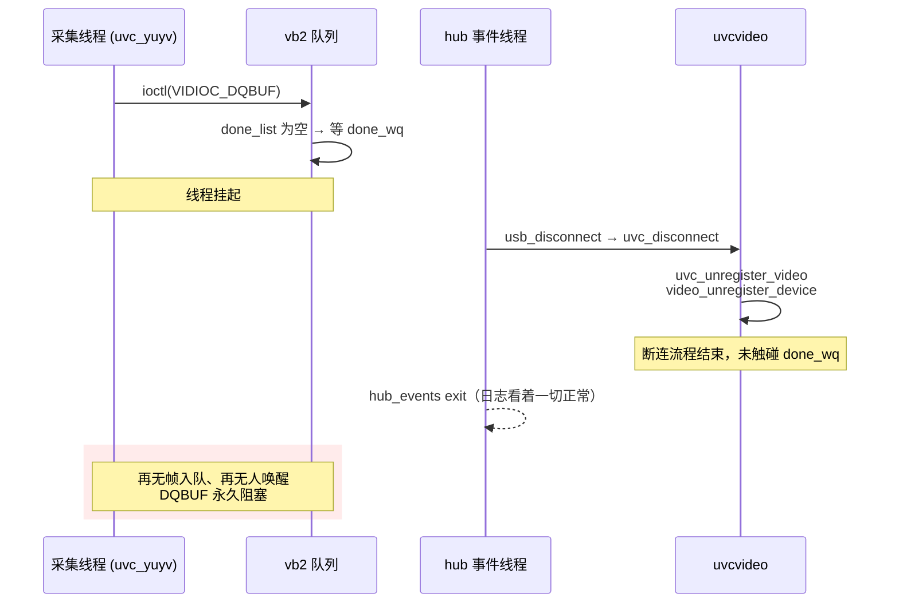

# UVC 摄像头拔出后 `VIDIOC_DQBUF` 不返回

> **环境**：eCos USB Host 上移植的 Linux USB / V4L2 协议栈 · UVC 摄像头（YUYV 640×480）· 对照 Ubuntu `5.15.0-139`（20.04 HWE）、上游 Linux 5.15 与 Linux 5.4  
> **关联**：[UVC 驱动分析](/analysis/kernel/usb/uvc-driver) · [V4L2 设备注册](/analysis/kernel/media/v4l2-device-registration) · [videobuffer2：Buffer 状态机与双链表](/analysis/kernel/media/v4l2-vb2-queue)  
> **状态**：已解决（断连时调 `vb2_queue_error()` 唤醒等待者，不销毁队列）

---

## 目录

- [1. 现象](#1-现象)
- [2. 结论先行](#2-结论先行)
- [3. 复现](#3-复现)
- [4. 卡在哪一行](#4-卡在哪一行)
- [5. vb2 本来留了三个出口](#5-vb2-本来留了三个出口)
- [6. 谁负责在断连时置位](#6-谁负责在断连时置位)
- [7. 照搬 Ubuntu 改法会撞上二次释放](#7-照搬-ubuntu-改法会撞上二次释放)
- [8. 采用的修法](#8-采用的修法)
- [9. 小结](#9-小结)
- [附录 A 三个内核对照](#附录-a-三个内核对照)
- [附录 B 源码索引](#附录-b-源码索引)
- [附录 C 要点速记](#附录-c-要点速记)

---

## 1. 现象

采集过程中拔掉 UVC 摄像头，反复两三次后系统进入一种**局部卡死**：应用层遥控器不再响应、调试终端敲不进命令，但正在播放的视频节目还在继续。

拔出瞬间的日志本身是正常的，断连路径跑完了：

```text
<3>uvcvideo: Failed to resubmit video URB (-19).
usb 1-2.1: USB disconnect, address 3
usb 1-2.1: unregistering device
usb 1-2.1: usb_disable_device nuking all URBs
usb 1-2.1: unlink qh4-0001/0xb0196f00 start 3 [1/0 us]
<4>uvcvideo: Non-zero status (-310) in status completion handler.
usb 1-2.1: unregistering interface 1-2.1:1.0
uvc_report_hotplug_out>>>>>>>>>>>>>>>>>>>>>>>>>>, /dev/video0, 1-2.1:1.0
usb 1-2.1: unregistering interface 1-2.1:1.1
...
hub_events exit.
Error queuing buffer: No such device
Error stopping capture: No such device
```

再插上去，重新枚举也是正常的，`uvcvideo` 照常 probe、`/dev/video0` 照常回来。**但终端从此不再回显命令**。

关键的对比是：**内核侧的断连流程全部走完了，卡住的是采集应用**。所以问题不在 USB 断连处理，而在断连之后没人管的那个应用线程。

---

## 2. 结论先行

| 问题 | 答案 |
|------|------|
| 到底卡在哪 | 采集线程的 `ioctl(VIDIOC_DQBUF)` 停在 `__vb2_wait_for_done_vb()`，等一个再也不会有人发的信号量 |
| 为什么内核日志看着正常 | 断连路径（`uvc_disconnect` → `usb_unbind_interface`）跑完了，它只是**没有唤醒**等在 `done_wq` 上的线程 |
| vb2 没有留退路吗 | 留了。`q->error` 一旦置位，`__vb2_wait_for_done_vb()` 就返回 `-EIO`；缺的只是断连时有人去置这个标志 |
| 为什么 Ubuntu 内核不复现 | 它的 `uvc_unregister_video()` 里多了一次 `uvc_queue_release()`，顺带唤醒了等待者 |
| 直接抄 Ubuntu 的改法行不行 | 不行。`uvc_v4l2_release()` 里也会调 `uvc_queue_release()`，两处都调有二次释放风险 |
| 最终怎么改 | 参照 `gspca` 的做法，在断连处调 `vb2_queue_error()`：**只置错误标志并唤醒，不销毁队列** |

---

## 3. 复现

采集起来之后拔线即可，两三次内必现：

```bash
usbinit          # 起 USB 主机栈
uvc_yuyv         # 640x480 YUYV 连续采集，循环 QBUF / DQBUF
# 采集过程中拔掉摄像头
```

正常采集时的循环打印：

```text
Read buffer 0, length: 614400
Read buffer 1, length: 614400
Read buffer 2, length: 614400
Read buffer 3, length: 614400
```

拔线后这四行停住，终端也一并停住。

同样的现象在 **STM32MP157 + Linux 5.4** 上复现，说明它不是某个移植栈特有的问题，而是那一代 `uvcvideo` 断连路径的共性。

---

## 4. 卡在哪一行

应用调 `VIDIOC_DQBUF` 取一帧，最终落到 vb2 的等待函数。移植栈里这个函数被简化成了一个纯等待：

```c
static int __vb2_wait_for_done_vb(struct vb2_queue *q, int nonblocking)
{
	for (;;) {
		cyg_semaphore_wait(&q->done_wq);
	}
	return 0;
}
```

设备拔出后，URB 全部被 `usb_disable_device()` 撤销，不会再有帧进 `done_list`，也就不会再有人 post 这个信号量。循环没有任何退出条件，线程就永久停在这里。

它拿着的锁与终端命令处理共用，于是表现成"整机像死了，但视频还在播"。



---

## 5. vb2 本来留了三个出口

对照主线的同名函数（`drivers/media/common/videobuf2/videobuf2-core.c`），等待循环里其实有三处提前返回：

```c
static int __vb2_wait_for_done_vb(struct vb2_queue *q, int nonblocking)
{
	for (;;) {
		int ret;

		if (!q->streaming)
			return -EINVAL;          /* 出口一：已停流 */

		if (q->error)
			return -EIO;             /* 出口二：队列被标记为错误 */

		if (q->last_buffer_dequeued)
			return -EPIPE;           /* 出口三：最后一帧已取走 */

		if (!list_empty(&q->done_list))
			break;
		/* ... nonblocking 分支省略 ... */

		ret = wait_event_interruptible(q->done_wq,
				!list_empty(&q->done_list) || !q->streaming ||
				q->error);
		/* ... */
	}
	return 0;
}
```

**出口二就是为设备突然消失准备的。** 置位它的接口是 `vb2_queue_error()`，一共只做两件事：

```c
void vb2_queue_error(struct vb2_queue *q)
{
	q->error = 1;

	wake_up_all(&q->done_wq);
}
```

所以这个问题不是"vb2 少了机制"，而是**机制在，调用方没用**。移植时把循环里那三个条件删成只剩信号量等待，等于把出口一并封死了——这一点即使不涉及断连，也值得回头补上。

---

## 6. 谁负责在断连时置位

`uvcvideo` 的断连路径是 `uvc_disconnect()` → `uvc_unregister_video()`。同一个函数在三个内核上形态不同。

**Ubuntu `5.15.0-139`（不复现）** —— 多了一次 `uvc_queue_release()`：

```c
static void uvc_unregister_video(struct uvc_device *dev)
{
	struct uvc_streaming *stream;

	list_for_each_entry(stream, &dev->streams, list) {
		if (!video_is_registered(&stream->vdev))
			continue;

		/* 1. Take a reference to vdev */
		get_device(&stream->vdev.dev);

		/* 2. Ensure that no new ioctls can be called. */
		video_unregister_device(&stream->vdev);

		/* 3. Wait for old ioctls to finish. */
		mutex_lock(&stream->mutex);

		/* 4. Stop streaming. */
		uvc_queue_release(&stream->queue);   /* ← 顺带唤醒了等待者 */

		mutex_unlock(&stream->mutex);
		put_device(&stream->vdev.dev);

		vb2_video_unregister_device(&stream->meta.vdev);
		uvc_debugfs_cleanup_stream(stream);
	}
	/* ... */
}
```

**上游 5.15（复现）** —— 注销完设备节点就结束：

```c
static void uvc_unregister_video(struct uvc_device *dev)
{
	struct uvc_streaming *stream;

	list_for_each_entry(stream, &dev->streams, list) {
		if (!video_is_registered(&stream->vdev))
			continue;

		video_unregister_device(&stream->vdev);
		video_unregister_device(&stream->meta.vdev);

		uvc_debugfs_cleanup_stream(stream);
	}
	/* ... */
}
```

`video_unregister_device()` 保证之后不会有**新的** ioctl 进来，但对**已经进来并且睡着**的那个 `DQBUF` 无能为力。

Ubuntu 上用 ftrace 抓到的唤醒路径，正好落在多出来的那一句上：

```text
kworker/5:1-101   [005] 20321.227577: function: __vb2_queue_cancel
kworker/5:1-101   [005] 20321.227594: kernel_stack: <stack trace>
=> __vb2_queue_cancel
=> vb2_core_queue_release
=> vb2_queue_release
=> uvc_queue_release          ← Ubuntu 在 uvc_unregister_video 里加的这一步
=> uvc_unregister_video
=> uvc_disconnect
=> usb_unbind_interface
=> device_release_driver_internal
=> device_release_driver
=> bus_remove_device
=> device_del
=> usb_disable_device
=> usb_disconnect
=> hub_port_connect
=> port_event
=> hub_event
=> process_one_work
=> worker_thread
=> kthread
=> ret_from_fork
```

`__vb2_queue_cancel()` 在收尾时会把 buffer 归还并唤醒 `done_wq`，等待中的 `DQBUF` 因此得以返回。**Ubuntu 是靠"释放队列"这个副作用顺手解决的，并不是专门为唤醒而写。**

---

## 7. 照搬 Ubuntu 改法会撞上二次释放

把 `uvc_queue_release()` 直接搬进断连路径之前，先看另一处调用——关闭文件描述符时：

```c
static int uvc_v4l2_release(struct file *file)
{
	struct uvc_fh *handle = file->private_data;
	struct uvc_streaming *stream = handle->stream;

	/* Only free resources if this is a privileged handle. */
	if (uvc_has_privileges(handle))
		uvc_queue_release(&stream->queue);   /* ← 这里也调 */

	uvc_dismiss_privileges(handle);
	v4l2_fh_del(&handle->vfh);
	v4l2_fh_exit(&handle->vfh);
	kfree(handle);
	/* ... */
}
```

拔线唤醒 `DQBUF` 之后，应用拿到错误码通常紧接着 `close()`，于是 `uvc_queue_release()` 会被走**两遍**：一遍在断连、一遍在 release。Ubuntu 内核靠 `stream->mutex`、`get_device` / `put_device` 和 `video_is_registered()` 一起把这段收得比较紧；移植栈缺少这一整套配套，直接抄单独一行反而更容易出问题。

**断连时真正需要的只是"唤醒"，不是"释放"。** 两件事在这里被耦合在了同一个函数里。

---

## 8. 采用的修法

`gspca` 早就把这两件事分开了，断连处只置错误标志：

```c
/*
 * USB disconnection
 *
 * This function must be called by the sub-driver
 * when the device disconnects, after the specific resources are freed.
 */
void gspca_disconnect(struct usb_interface *intf)
{
	/* ... */
	vb2_queue_error(&gspca_dev->queue);
}
```

照此在 UVC 断连路径上调 `vb2_queue_error()`：队列结构不动，`q->error` 置位并 `wake_up_all(&q->done_wq)`，睡着的 `DQBUF` 从 [§5](#5-vb2-本来留了三个出口) 的出口二退出，返回 `-EIO`。

改后拔线的日志：

```text
usb 1-2: unregistering device
usb 1-2: usb_disable_device nuking all URBs
usb 1-2: unlink qh16-0001/0xb0196a20 start 15 [1/0 us]
<4>uvcvideo: Non-zero status (-310) in status completion handler.
usb 1-2: unregistering interface 1-2:1.0
Error dequeuing buffer: I/O error          ← DQBUF 返回 -EIO，不再阻塞
Error stopping capture: No such device
uvc_report_hotplug_out>>>>>>>>>>>>>>>>>>>>>>>>>>, /dev/video0, 1-2:1.0
usb 1-2: unregistering interface 1-2:1.1
usb 1-2: unregistering interface 1-2:1.2
usb 1-2: unregistering interface 1-2:1.3
eCosShell> hub 1-:1.0: debounce: port 2: total 100ms stable 100ms status 0x100
hub_events exit.

eCosShell>                                 ← 终端恢复
```

判据从"应用打印什么"变成两条可观测事实：`Error dequeuing buffer: I/O error` 出现，且提示符能继续接受输入。

---

## 9. 小结

- 拔线后 `DQBUF` 不返回，是因为断连路径**没有唤醒**等在 `done_wq` 上的线程，而不是断连本身失败。
- vb2 的 `q->error` 出口一直存在，`vb2_queue_error()` 就是为此准备的；上游 `uvc_unregister_video()` 当时没有调它。
- Ubuntu `5.15.0-139` 靠 `uvc_queue_release()` 的副作用规避了这个问题；上游 5.15 与 Linux 5.4 都会复现。
- 断连时需要的是**唤醒**而非**释放**；`uvc_v4l2_release()` 里已有一次释放，两处都释放有二次释放风险。
- 移植 vb2 时若把等待循环里的 `!q->streaming` / `q->error` / `last_buffer_dequeued` 三个条件删掉，等于封掉了所有异常出口，这类"设备突然消失"的场景都会挂死。

---

## 附录 A 三个内核对照

| 内核 | `uvc_unregister_video()` 里是否唤醒 | 拔线后 `DQBUF` |
|------|--------------------------------------|----------------|
| Ubuntu `5.15.0-139`（20.04 HWE） | 有（`uvc_queue_release()`，经 `__vb2_queue_cancel`） | 正常返回 |
| 上游 Linux 5.15 | 无 | 永久阻塞 |
| Linux 5.4（STM32MP157 实测） | 无 | 永久阻塞 |
| 移植到 eCos 的同代协议栈 | 无，且等待循环只剩信号量 | 永久阻塞，拖住终端 |

---

## 附录 B 源码索引

| 位置 | 内容 |
|------|------|
| `drivers/media/common/videobuf2/videobuf2-core.c` — `__vb2_wait_for_done_vb()` | 等待循环与三个提前返回出口 |
| 同文件 — `vb2_queue_error()` | 置 `q->error` 并 `wake_up_all(&q->done_wq)` |
| 同文件 — `__vb2_queue_cancel()` | 释放队列时归还 buffer，顺带唤醒 |
| `drivers/media/usb/uvc/uvc_driver.c` — `uvc_unregister_video()` / `uvc_disconnect()` | 断连路径 |
| `drivers/media/usb/uvc/uvc_v4l2.c` — `uvc_v4l2_release()` | 关闭句柄时的 `uvc_queue_release()` |
| `drivers/media/usb/gspca/gspca.c` — `gspca_disconnect()` | 只置错误标志、不销毁队列的参考实现 |

---

## 附录 C 要点速记

1. 内核断连日志齐全 ≠ 应用不会挂；**要单独确认阻塞中的 ioctl 有没有人唤醒**。
2. vb2 的异常出口是 `q->error`，置位入口是 `vb2_queue_error()`，返回值是 `-EIO`。
3. `video_unregister_device()` 只拦**新** ioctl，管不了**已经睡着**的那个。
4. "释放队列"能唤醒等待者，但那是副作用；断连场景应当只唤醒。
5. 移植 vb2 时优先保留等待循环里的全部退出条件，它们对应的都是设备异常场景。
