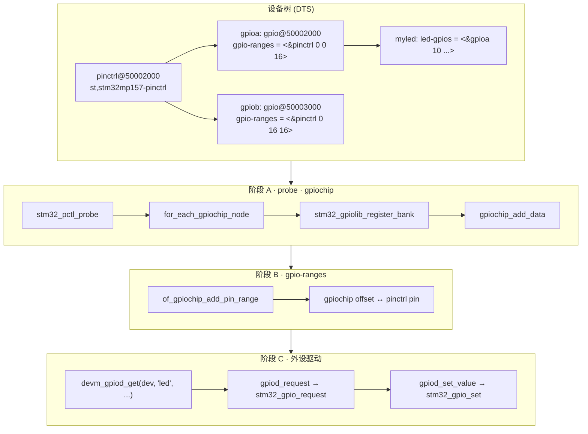
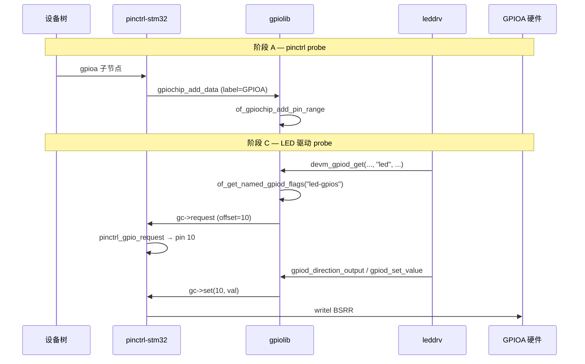

# STM32 GPIO：设备树、gpiochip 注册与驱动消费

> Linux 6.8 · `drivers/pinctrl/stm32/pinctrl-stm32.c`  
> **Linux 内核 · GPIO / Pinctrl 子系统**  
> 从设备树 `gpio-controller` 到 `gpiochip` 注册，再到外设 `led-gpios` 经 gpiolib 访问 PA10 的完整路径。  
> 与 [STM32 Pinctrl 分析](/analysis/kernel/pinctrl/stm32-pinctrl) 衔接：本文侧重 **GPIO 子系统**；引脚复用写 MODER/AFR 详见 Pinctrl 文档。

---

## 目录

- [1. 总览](#1-总览)
- [2. 设备树结构](#2-设备树结构)
- [3. 阶段 A：probe 注册 gpiochip](#3-阶段-a-probe-注册-gpiochip)
- [4. 阶段 B：`gpio-ranges` 与 pinctrl 映射](#4-阶段-b-gpio-ranges-与-pinctrl-映射)
- [5. 阶段 C：外设驱动消费 GPIO](#5-阶段-c-外设驱动消费-gpio)
- [6. gpio_chip 操作与硬件寄存器](#6-gpio-chip-操作与硬件寄存器)
- [附录 A：端到端数据对照（PA10）](#附录-a端到端数据对照pa10)
- [附录 B：源码索引](#附录-b源码索引)
- [附录 C：要点速记](#附录-c要点速记)

---

## 1. 总览 {#1-总览}

STM32 的 GPIO 与 Pinmux **共用同一套硬件 IP**，Linux 里由 **`pinctrl-stm32` 一个驱动** 同时注册 pinctrl 与 gpiochip。本文示例基于 **STM32MP157** 精简设备树：注册 `GPIOA` / `GPIOB` 两个 bank，LED 驱动通过 `led-gpios = <&gpioa 10 GPIO_ACTIVE_LOW>` 使用 **PA10**。

| 阶段 | 时机 | 关键对象 | 关键函数 |
|:----:|------|----------|----------|
| **A** | pinctrl 平台驱动 probe | `struct gpio_chip` / `stm32_gpio_bank` | `stm32_pctl_probe` → `stm32_gpiolib_register_bank` |
| **B** | gpiochip 注册后 | `gpio-ranges` → pinctrl pin 号 | `of_gpiochip_add_pin_range` → `gpiochip_add_pin_range` |
| **C** | 外设驱动 probe | `struct gpio_desc *` | `devm_gpiod_get` → `stm32_gpio_request` / `stm32_gpio_set` |

### 1.1 三阶段流程图



→ 阶段 A 详见 [§3](#3-阶段-a-probe-注册-gpiochip)，阶段 B 详见 [§4](#4-阶段-b-gpio-ranges-与-pinctrl-映射)，阶段 C 详见 [§5](#5-阶段-c-外设驱动消费-gpio)。

### 1.2 时序图（以 PA10 为例）



> **Mermaid 预览：** 本地 `npm run docs:dev`，或 [mermaid.live](https://mermaid.live)。

---

## 2. 设备树结构 {#2-设备树结构}

### 2.1 Pinctrl 节点与 GPIO bank 子节点

```dts
pinctrl: pin-controller@50002000 {
    #address-cells = <1>;
    #size-cells = <1>;
    compatible = "st,stm32mp157-pinctrl";
    ranges = <0 0x50002000 0xa400>;
    interrupt-parent = <&exti>;
    st,syscfg = <&exti 0x60 0xff>;
    hwlocks = <&hsem 0 1>;
    pins-are-numbered;

    gpioa: gpio@50002000 {
        gpio-controller;
        #gpio-cells = <2>;          /* <&gpioX pin flags> */
        interrupt-controller;
        #interrupt-cells = <2>;
        reg = <0x0 0x400>;
        clocks = <&rcc GPIOA>;
        st,bank-name = "GPIOA";
        status = "okay";
        ngpios = <16>;
        gpio-ranges = <&pinctrl 0 0 16>;
    };

    gpiob: gpio@50003000 {
        gpio-controller;
        #gpio-cells = <2>;
        interrupt-controller;
        #interrupt-cells = <2>;
        reg = <0x1000 0x400>;
        clocks = <&rcc GPIOB>;
        st,bank-name = "GPIOB";
        status = "okay";
        ngpios = <16>;
        gpio-ranges = <&pinctrl 0 16 16>;
    };
};
```

| 属性 | 含义 |
|------|------|
| `gpio-controller` + `#gpio-cells = <2>` | 声明为 GPIO 控制器。`#gpio-cells` 表示引用该节点时每个 GPIO 占 **2 个 cell**：第 1 个为 bank 内线号，第 2 个为 flags（如 `GPIO_ACTIVE_LOW`）；引用格式即 `<&gpioX line flags>` |
| `reg` | 相对 `ranges` 基址的 bank MMIO 偏移（GPIOA `0x0`，GPIOB `0x1000`） |
| `st,bank-name` | 人类可读标签，也作为 `gpio_chip.label`（如 `/sys/class/gpio/` 下可见） |
| `ngpios` | 本 bank 可用引脚数（MP157 每 bank 最多 16） |
| `gpio-ranges` | 将 **gpiochip 线号** 映射到 **pinctrl 全局 pin 号**（见 [§4](#4-阶段-b-gpio-ranges-与-pinctrl-映射)） |
| `clocks` | bank 时钟，probe 时 `clk_prepare_enable` |

Binding 详见 `Documentation/devicetree/bindings/pinctrl/st,stm32-pinctrl.yaml`。

### 2.2 GPIO 消费者节点

```dts
#include <dt-bindings/gpio/gpio.h>

myled {
    compatible = "100ask,leddrv";
    led-gpios = <&gpioa 10 GPIO_ACTIVE_LOW>;
};
```

| 字段 | 解析结果 |
|------|----------|
| `&gpioa` | 指向 `gpioa` gpiochip |
| `10` | bank 内 offset → **PA10** |
| `GPIO_ACTIVE_LOW`（值为 1） | 逻辑 1 = 物理低电平；`gpiod_set_value(1)` 实际拉低引脚 |

属性名 `led-gpios` 与驱动中 `devm_gpiod_get(dev, "led", ...)` 的 **`con_id = "led"`** 对应（`-gpios` 后缀由 gpiolib 约定匹配）。

---

## 3. 阶段 A：probe 注册 gpiochip {#3-阶段-a-probe-注册-gpiochip}

**调用链（阶段 A）：**

```text
stm32_pctl_probe()                           pinctrl-stm32.c
  ├── devm_pinctrl_register()                注册 pinctrl 核心
  ├── gpiochip_node_count() / for_each_gpiochip_node()
  │     └── of_clk_get_by_name / reset       每个 bank 预处理
  └── stm32_gpiolib_register_bank()          每个 gpio@ 子节点
        ├── devm_ioremap_resource(reg)       映射 MODER/IDR/BSRR 等
        ├── clk_prepare_enable()
        ├── 解析 st,bank-name / gpio-ranges / ngpios
        ├── irq_domain_create_hierarchy()    可选：GPIO 中断域
        └── gpiochip_add_data()              向 gpiolib 注册
              └── of_gpiochip_add_pin_range()  阶段 B
```

`stm32_gpiolib_register_bank` 核心逻辑（节选）：

```c
bank->gpio_chip = stm32_gpio_template;
fwnode_property_read_string(fwnode, "st,bank-name", &bank->gpio_chip.label);

/* gpio-ranges = <&pinctrl chip_offset pinctrl_base count> */
if (!fwnode_property_get_reference_args(fwnode, "gpio-ranges", NULL, 3, i, &args)) {
    bank_nr = args.args[1] / STM32_GPIO_PINS_PER_BANK;  /* 16 */
    /* npins 由 ranges 推导 */
}

bank->gpio_chip.ngpio = npins;
bank->bank_nr = bank_nr;
gpiochip_add_data(&bank->gpio_chip, bank);
```

注册完成后，内核 sysfs 中会出现 **`gpiochipN`**（N 为全局分配编号），其 label 为 `"GPIOA"` / `"GPIOB"`。这与 **bank 字母** 的对应关系由 `st,bank-name` 决定，而非 `gpiochipN` 的 N。

---

## 4. 阶段 B：`gpio-ranges` 与 pinctrl 映射 {#4-阶段-b-gpio-ranges-与-pinctrl-映射}

### 4.1 为什么需要 `gpio-ranges`？

内核里其实有 **两套编号**，说的是同一根物理引脚：

| 谁在用 | 编号方式 | 举例（PA10） |
|--------|----------|--------------|
| **GPIO 子系统**（gpiolib） | 每个 bank 各自从 0 数 | `&gpioa` 的 **offset 10** |
| **Pinctrl 子系统** | 整片芯片统一编号 | 全局 **pin 10** |

设备树里写 `led-gpios = <&gpioa 10 ...>` 时，用的是 **gpiochip 内部 offset**；但驱动申请引脚、切换输入/输出/复用时，pinctrl 认的是 **全局 pin 号**。

`gpio-ranges` 就是设备树里的一张 **对照表**，告诉内核：

> 「gpioa 的第几根线，等于 pinctrl 的第几号 pin。」

没有这张表，`stm32_gpio_request` 会找不到对应关系，报错 *pin not in range*。

### 4.2 三个数字怎么读

```dts
gpio-ranges = <&pinctrl  chip_offset  pinctrl_pin_base  count>;
/*  GPIOA 示例      0           0              16   */
```

| 参数 | GPIOA 的值 | 通俗理解 |
|------|:----------:|----------|
| `chip_offset` | `0` | 从 **本 gpiochip 的第几根线** 开始建立映射（GPIOA 从第 0 根即 PA0 起） |
| `pinctrl_pin_base` | `0` | 上面那根线，对应 **pinctrl 全局几号 pin**（PA0 = 0 号） |
| `count` | `16` | 从起点开始，**连续** 映射几根（16 根 = 整组 PA0～PA15） |

读成一句话就是：

> **「gpioa 从 offset 0 起，连续 16 根线，依次对应 pinctrl 的 pin 0～15。」**

对 `<&pinctrl 0 0 16>` 而言：gpioa offset 0 → pinctrl pin 0（PA0），并从此往后连续映射 16 个 pin。

### 4.3 GPIOA / GPIOB 对照表

```dts
gpioa: ... { gpio-ranges = <&pinctrl 0  0 16>; };  /* PA0～PA15 → pin 0～15  */
gpiob: ... { gpio-ranges = <&pinctrl 0 16 16>; };  /* PB0～PB15 → pin 16～31 */
```

注意 GPIOB 里第一个 `0` **不是** pin 16——它仍是「**gpiob 内部**从第 0 根（PB0）算起」；`16` 出现在第二个参数，表示 PB0 对应 pinctrl 全局 pin 16。

| gpiochip 内 offset | 物理引脚 | pinctrl 全局 pin |
|:------------------:|:--------:|:----------------:|
| gpioa `0` | PA0 | 0 |
| gpioa `10` | PA10 | 10 |
| gpioa `15` | PA15 | 15 |
| gpiob `0` | PB0 | 16 |
| gpiob `3` | PB3 | 19 |
| gpiob `15` | PB15 | 31 |

换算公式（连续映射、且 `chip_offset = 0` 时）：

```text
pinctrl_pin = pinctrl_pin_base + gpiochip_offset
```

### 4.4 例子：`<&gpioa 10>` 怎么走完阶段 B

```dts
led-gpios = <&gpioa 10 GPIO_ACTIVE_LOW>;
```

1. gpiolib 解析到：gpiochip = `gpioa`，**offset = 10**。
2. 查 `gpio-ranges = <&pinctrl 0 0 16>`：offset 10 在范围内 → 对应 **pinctrl pin 10**（PA10）。
3. 驱动 `request` 引脚时，`stm32_gpio_request` 用同样规则算出 pin 10：

```c
int pin = offset + (bank->bank_nr * 16);
/* GPIOA: 10 + 0*16 = 10  →  PA10 */
/* GPIOB:  3 + 1*16 = 19  →  PB3  */
```

4. 再调用 `pinctrl_gpio_request`，把 pin 10 **登记为 GPIO 用途**（后续配合 [Pinctrl 文档](/analysis/kernel/pinctrl/stm32-pinctrl) 里的 MODER 配置）。


### 4.5 内核里谁在做映射

`gpiochip` 注册完成后，`of_gpiochip_add_pin_range` 读取设备树里的 `gpio-ranges`，写入内核的对照关系：

```c
gpiochip_add_pin_range(chip, pinctrl_devname,
                       pinspec.args[0],   /* chip_offset：从 gpiochip 第几根起 */
                       pinspec.args[1],   /* pinctrl_pin_base：对应 pinctrl 几号 pin */
                       pinspec.args[2]);  /* count：连续几根 */
```

之后每次外设驱动申请 GPIO，gpiolib 和 pinctrl 都按这张表把 **bank 内 offset** 翻译成 **全局 pin 号**。  
（Binding 也允许不连续的映射，例如 `<&pinctrl 0 16 3>, <&pinctrl 14 30 2>`；本文示例是 MP157 最常见的 **整 bank 连续 16 脚** 写法。）

---

## 5. 阶段 C：外设驱动消费 GPIO {#5-阶段-c-外设驱动消费-gpio}

典型 LED 驱动 probe 片段（100ask 实验风格）：

```c
#include <linux/gpio/consumer.h>

static int leddrv_probe(struct platform_device *pdev)
{
    struct gpio_desc *led;

    led = devm_gpiod_get(&pdev->dev, "led", GPIOD_OUT_LOW);
    if (IS_ERR(led))
        return PTR_ERR(led);

    gpiod_set_value(led, 1);   /* ACTIVE_LOW → 物理拉低，LED 亮 */
    return 0;
}
```

**调用链（阶段 C）：**

```text
devm_gpiod_get(dev, "led", GPIOD_OUT_LOW)
  └─ gpiod_get_index()
       └─ gpiod_find_and_request()
            ├─ of_find_gpio()  → of_get_named_gpiod_flags("led-gpios", 0)
            │     └─ 解析 &gpioa 10 → 找到 gpiochip，offset=10
            ├─ gpiod_request_commit()
            │     └─ gc->request() → stm32_gpio_request()
            │           └─ pinctrl_gpio_request()
            └─ gpiod_configure_flags()  → gpiod_direction_output()
                  └─ gc->direction_output() → stm32_gpio_direction_output()
                        ├─ __stm32_gpio_set()        先写 BSRR
                        └─ pinctrl_gpio_direction_output()
                              └─ stm32_pmx_gpio_set_direction()
                                    └─ stm32_pmx_set_mode(MODER=输出)
```

要点：

1. **解析**：`led-gpios` 由 `gpiolib-of.c` 的 `of_get_named_gpiod_flags` 解析，flags 含 `GPIO_ACTIVE_LOW`。
2. **申请**：`gpiod_request` 触发 `stm32_gpio_request`，必须能在 pinctrl 中找到 pin 10 的 range，否则报错 *"pin not in range"*。
3. **方向**：`GPIOD_OUT_LOW` 在 request 阶段即配置为输出；方向切换最终写 **MODER**（经 pinctrl 的 `gpio_set_direction` 回调）。
4. **读写**：驱动应使用 **`gpiod_set_value` / `gpiod_get_value`**，不要直接 `writel` 寄存器；ACTIVE_LOW 由 gpiolib 在逻辑层处理。

---

## 6. gpio_chip 操作与硬件寄存器 {#6-gpio-chip-操作与硬件寄存器}

`stm32_gpio_template` 挂接的主要回调：

| 回调 | 作用 | 硬件 |
|------|------|------|
| `.request` | 关联 pinctrl pin | — |
| `.get` | 读输入电平 | `IDR` |
| `.set` | 写输出电平 | `BSRR`（置位/复位） |
| `.direction_output` | 输出 + 可选初值 | `BSRR` + MODER（经 pinctrl） |
| `.direction_input` | 输入 | MODER（经 pinctrl） |
| `.to_irq` | GPIO 中断 | EXTI 层次 irq_domain |

寄存器偏移（`pinctrl-stm32.c`）：

| 偏移 | 寄存器 | 用途 |
|:----:|--------|------|
| `0x00` | MODER | 输入/输出/复用/模拟 |
| `0x10` | IDR | 读 pin |
| `0x18` | BSRR | 原子置位/复位 ODR |

`__stm32_gpio_set` 通过 **BSRR** 写电平（set 用低 16 位，reset 用高 16 位），避免读-改-写 ODR 的竞争。

---

## 附录 A：端到端数据对照（PA10） {#附录-a端到端数据对照pa10}

| 环节 | gpiochip | offset | pinctrl pin | 引脚名 | 备注 |
|------|----------|:------:|:-----------:|--------|------|
| DT `led-gpios` | `&gpioa` | 10 | — | PA10 | `GPIO_ACTIVE_LOW` |
| `gpio-ranges` | GPIOA | 0…15 → pin 0…15 | 10 | PA10 | bank_nr = 0 |
| `stm32_gpio_request` | GPIOA | 10 | 10 | PA10 | `pin = 10 + 0*16` |
| pinctrl group | — | — | 10 | `"PA10"` | 与 [Pinctrl 文档](/analysis/kernel/pinctrl/stm32-pinctrl) group 一致 |
| sysfs | `gpiochipN` (label=GPIOA) | 10 | — | — | N 为全局编号，非 bank 字母 |

若改为 **`led-gpios = <&gpiob 3 GPIO_ACTIVE_HIGH>`**，则 offset 3 → 全局 pin **19**（PB3）。

---

## 附录 B：源码索引 {#附录-b源码索引}

| 内容 | 路径 |
|------|------|
| STM32 GPIO + pinctrl 驱动 | `drivers/pinctrl/stm32/pinctrl-stm32.c` |
| bank 注册 | `pinctrl-stm32.c` — `stm32_gpiolib_register_bank` |
| gpio_chip 模板 | `pinctrl-stm32.c` — `stm32_gpio_template` |
| probe 入口 | `pinctrl-stm32.c` — `stm32_pctl_probe` |
| SoC 匹配表 | `drivers/pinctrl/stm32/pinctrl-stm32mp157.c` |
| DT 解析 GPIO | `drivers/gpio/gpiolib-of.c` — `of_get_named_gpiod_flags` |
| gpio-ranges 注册 | `drivers/gpio/gpiolib-of.c` — `of_gpiochip_add_pin_range` |
| 消费者 API | `drivers/gpio/gpiolib.c` — `gpiod_get_index` |
| pinctrl 申请 GPIO | `drivers/pinctrl/core.c` — `pinctrl_gpio_request` |
| DT binding | `Documentation/devicetree/bindings/pinctrl/st,stm32-pinctrl.yaml` |
| GPIO 标志 | `include/dt-bindings/gpio/gpio.h` — `GPIO_ACTIVE_LOW` |
| 关联文档 | [STM32 Pinctrl 分析](/analysis/kernel/pinctrl/stm32-pinctrl) |

---

## 附录 C：要点速记 {#附录-c要点速记}

1. **一个驱动两套角色**：`pinctrl-stm32` 同时提供 pinmux/pinconf 与 `gpio_chip`。
2. **`gpio-ranges` 必不可少**（MP 系列）：把 `<&gpioa 10>` 的 offset 10 映射到 pinctrl 全局 pin 10，否则 `request` 失败。
3. **bank 内 offset，全局 pin 号**：`pin = offset + bank_nr * 16`；GPIOB 的 offset 0 = 全局 pin 16。
4. **驱动只用 gpiolib**：`devm_gpiod_get` + `gpiod_set_value`；`GPIO_ACTIVE_LOW` 在 gpiolib 层翻转逻辑值。
5. **方向与复用**：输出/输入最终写 MODER；纯 GPIO 对应 pinctrl function `"gpio"`（详见 Pinctrl 文档阶段 C）。
6. **`gpiochipN` 与 GPIOA 字母**：N 是注册顺序；查 bank 看 `st,bank-name` 或 `/sys/kernel/debug/gpio`。
