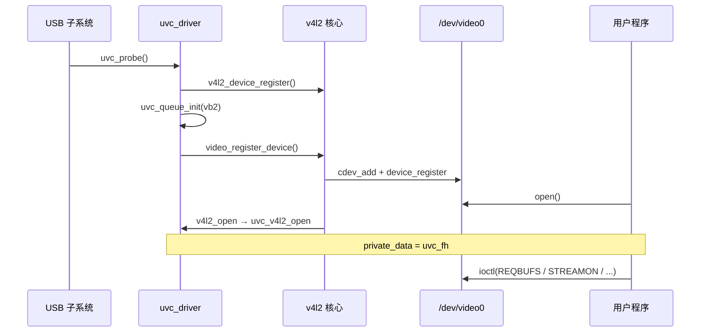

# V4L2 设备注册与 video 节点

> Linux 6.8 · `drivers/media/v4l2-core/v4l2-dev.c` — `__video_register_device`  
> **Linux 内核 · Media / V4L2 子系统**  
> 从 `uvc_probe` 到 `/dev/video0` 出现，以及 `open` 如何建立后续 `ioctl` 所需的上下文；以 UVC 为例。  
> 前置：[枚举与两轮 Probe](/analysis/kernel/usb/enumeration-and-probe) → [UVC 驱动分析](/analysis/kernel/usb/uvc-driver)。  
> 实践：[i.MX6ULL OV5640 DTS 与 video 节点](/analysis/kernel/media/imx6-ov5640-dts-video)（4.9.88 BSP `mx6s_capture` 注册 `/dev/video1`）。  
> 后续：[V4L2 ioctl 分发](/analysis/kernel/media/v4l2-ioctl-dispatch) → [videobuffer2：Buffer 状态机与双链表](/analysis/kernel/media/v4l2-vb2-queue)。  
> 实验：[`code/v4l2-virtual/`](https://github.com/dengtaowei/blogD/tree/main/code/v4l2-virtual)（`virtual_video_init` 同样走 `v4l2_device_register` + `video_register_device`）。

---

## 目录

- [1. 总览](#1-总览)
- [2. 两个核心结构体](#2-两个核心结构体)
- [3. 端到端流程](#3-端到端流程)
- [4. 两个注册函数](#4-两个注册函数)
- [5. open 与 ioctl 上下文](#5-open-与-ioctl-上下文)
- [6. 注销](#6-注销)
- [附录 A 源码索引](#附录-a-源码索引)
- [附录 B 平台驱动（UVC vs MIPI）](#附录-b-平台驱动uvc-vs-mipi)
- [附录 C 要点速记](#附录-c-要点速记)

---

## 1. 总览

本文覆盖 `open("/dev/video0")` **之前**的注册流程，以及 `open` 时内核如何定位驱动、建立后续 `ioctl` 所需的上下文。

| 阶段 | 关键函数 | 结果 |
|:----:|----------|------|
| USB probe | `uvc_probe` | 解析描述符，分配 `uvc_device` |
| V4L2 容器 | `v4l2_device_register` | 登记 `v4l2_device`，**尚无** `/dev` 节点 |
| 字符设备 | `video_register_device` | `cdev_add` + udev → **`/dev/video0`** |
| 用户 open | `v4l2_open` → `uvc_v4l2_open` | `file->private_data = uvc_fh` |
| 用户 ioctl | 见 [V4L2 ioctl 分发](/analysis/kernel/media/v4l2-ioctl-dispatch) | `vidioc_xxx` → vb2 |

```text
USB 插入 → uvc_probe
         → v4l2_device_register      （登记 V4L2 容器，此时还没有 /dev 节点）
         → video_register_device     （注册字符设备 → 出现 /dev/video0）
用户 open → v4l2_fops → uvc_v4l2_open → file->private_data = uvc_fh
用户 ioctl → ioctl 分发 → vb2 buffer 流转
```

---

## 2. 两个核心结构体

V4L2 把「一颗摄像头」和「用户能 open 的节点」分成两个结构体管理：

| 结构体 | 职责 | 用户能否直接看到 |
|--------|------|------------------|
| **`v4l2_device`** | 一颗摄像头的 V4L2 **总容器**：挂 subdev 链表、ctrl_handler、优先级等 | 否，没有对应的 `/dev` 文件 |
| **`video_device`** | 一个对外的 **视频字符设备节点**：fops、ioctl_ops、cdev | 是，对应 `/dev/videoX` |

UVC 中的嵌套关系：

```text
uvc_device（整颗 USB 摄像头）
  └─ v4l2_device vdev              ← 整颗摄像头共用一个 V4L2 容器
       └─ uvc_streaming（一路视频流）
            ├─ video_device vdev   → 用户看到的 /dev/video0
            └─ uvc_video_queue       → vb2_queue（probe 时 uvc_queue_init 初始化）
```

一颗摄像头对应一个 `v4l2_device`，但可注册多个 `video_device`（多路 stream、metadata 节点等）；用户 `open` 的是 `video_device` 对应的 `/dev/videoX`。

可选的 **`media_device`**（`/dev/media0`）描述 sensor → ISP → capture 的 pipeline 拓扑，与本文注册流程并行，属 media 框架范畴。

---

## 3. 端到端流程



→ 注册细节见 [§4](#4-两个注册函数)，`open` 见 [§5](#5-open-与-ioctl-上下文)。

> **Mermaid 预览：** 本地 `npm run docs:dev`，或 [mermaid.live](https://mermaid.live)。

### 3.1 框架预埋（任何摄像头驱动 probe 之前）

V4L2 核心模块加载时，`videodev_init()`（`v4l2-dev.c`）已经完成：

- 向内核申请主设备号 **`VIDEO_MAJOR = 81`**
- 注册 sysfs 设备类 **`video`**

此时系统里尚无 `/dev/videoX` 节点，仅完成主设备号与设备类的注册，待具体驱动 probe 时创建设备节点。

### 3.2 UVC probe 主路径

**文件**：`drivers/media/usb/uvc/uvc_driver.c` — `uvc_probe`

```text
uvc_probe()
  ├─ kzalloc(uvc_device)，解析 USB 描述符
  ├─ v4l2_device_register(&intf->dev, &dev->vdev)    // ① 登记 V4L2 容器
  ├─ uvc_ctrl_init_device()                          // 控制项（亮度等）
  └─ uvc_register_chains()
       └─ uvc_register_video_device()                 // 为每路 stream 注册节点
            ├─ uvc_queue_init(&stream->queue)         // 初始化 vb2 队列
            ├─ 填写 vdev->fops / ioctl_ops / device_caps
            ├─ video_set_drvdata(vdev, stream)       // 节点 → stream 的绑定
            └─ video_register_device(vdev, ...)      // ② 创建 /dev/videoX
```

---

## 4. 两个注册函数

`v4l2_device_register` 不创建 `/dev/video0`；设备节点由 `video_register_device` 创建。

### 4.1 `v4l2_device_register` — 只建容器，不出节点

**文件**：`drivers/media/v4l2-core/v4l2-device.c`

```c
v4l2_dev->dev = dev;                        /* 关联底层 struct device（USB 接口设备） */
INIT_LIST_HEAD(&v4l2_dev->subdevs);         /* 初始化 subdev 链表 */
v4l2_prio_init(&v4l2_dev->prio);            /* 优先级（多进程抢设备时用） */
dev_set_drvdata(dev, v4l2_dev);             /* 底层 device 反查 v4l2_device */
```

- **不会**出现新的 `/dev` 节点
- 后续 `video_device` 通过 `vdev->v4l2_dev = &dev->vdev` 指回这个容器

### 4.2 `video_register_device` — 真正创建 `/dev/video0`

驱动先填好 `struct video_device` 的字段，再交给框架注册（UVC 在 `uvc_register_video_device()` 里完成）：

```c
vdev->v4l2_dev    = &dev->vdev;             /* 指回 V4L2 容器 */
vdev->fops        = &uvc_fops;              /* open/read/poll → 最终走 video_ioctl2 */
vdev->ioctl_ops   = &uvc_ioctl_ops;         /* 各 VIDIOC_* 命令的分发表 */
vdev->device_caps = V4L2_CAP_VIDEO_CAPTURE | V4L2_CAP_STREAMING;
video_set_drvdata(vdev, stream);            /* 这个节点对应哪路 stream */

video_register_device(vdev, VFL_TYPE_VIDEO, -1);  /* nr=-1 表示自动分配编号 */
```

`__video_register_device()` 内部六步（`v4l2-dev.c`）：

| 步骤 | 做什么 | 结果 |
|:----:|--------|------|
| 1 | 根据类型确定设备名前缀 `"video"` | 节点基名为 `video` |
| 2 | 分配 `minor`（次设备号），`video_devices[minor] = vdev` | 全局索引表可查 |
| 3 | `cdev->ops = &v4l2_fops`；`cdev_add` | 字符设备可被 `open` |
| 4 | `device_register("video%d", num)` | **udev 在文件系统创建 `/dev/video0`** |
| 5 | 注册 media entity（若启用 media 框架） | pipeline 拓扑 |
| 6 | 置位 `V4L2_FL_REGISTERED` | 标记节点可用 |

**用户看到的 `video0` 由 `vdev->num` 决定**（自动分配时通常从 0 递增）。  
用户 `open("/dev/video0")` 时，内核从 inode 读出**次设备号 minor**，查表找回 `video_device`：

```c
struct video_device *video_devdata(struct file *file)
{
    return video_devices[iminor(file_inode(file))];
}
```

注册时将 `video_device` 存入 `video_devices[minor]`；`open` 时根据 inode 的次设备号查表取回。

---

## 5. open 与 ioctl 上下文

`open` 不开始采集，而是建立 `video_device` → `uvc_streaming` → `uvc_fh` 的关联，供后续 `ioctl` 定位 stream 与 queue。

```text
open("/dev/video0")
  → chrdev_open：filp->f_op = &v4l2_fops（所有 video 节点统一入口）
  → v4l2_open：
       vdev = video_devdata(filp);          // minor → video_device
       若驱动有 vdev->fops->open，则调用
  → uvc_v4l2_open：
       stream = video_drvdata(file);        // video_device → uvc_streaming
       v4l2_fh_init(&handle->vfh, vdev);  // 初始化 file handle
       v4l2_fh_add(&handle->vfh, vdev);
       file->private_data = handle;          // 后续 ioctl 的入口
```

三条关联路径（注册和 open 之后同时存在，各司其职）：

| 机制 | 何时设置 | 用途 |
|------|----------|------|
| `video_devices[minor] = vdev` | `video_register_device` | `open` / `ioctl` 时由 inode 找回 `video_device` |
| `video_set_drvdata(vdev, stream)` | 注册前 | `video_drvdata(file)` → 这路 `uvc_streaming` |
| `file->private_data = uvc_fh` | `uvc_v4l2_open` | `ioctl` → `handle->stream` → `stream->queue` |

后续 buffer 类 ioctl 在 UVC 上的路径（ioctl 框架分发详见 [V4L2 ioctl 分发](/analysis/kernel/media/v4l2-ioctl-dispatch)）：

```text
ioctl(VIDIOC_QBUF)
  → v4l2_fops.unlocked_ioctl → video_ioctl2
  → uvc_ioctl_ops.vidioc_qbuf → uvc_ioctl_qbuf
  → fh = file->private_data          // uvc_fh
  → stream = fh->stream
  → uvc_queue_buffer(&stream->queue, ...)   // 进入 vb2
```

vb2 状态机与 `queued_list` / `done_list` 详见 [videobuffer2：Buffer 状态机与双链表](/analysis/kernel/media/v4l2-vb2-queue)。

### UVC 与通用驱动的差异

很多平台驱动（如简单 MIPI capture）会写：

```c
vdev->queue = &vb_queue;
```

框架的通用 `v4l_reqbufs` / `v4l_qbuf` 直接从 `vdev->queue` 取 `vb2_queue`。

UVC 主视频节点在 `ioctl_ops` 里自行实现 `vidioc_reqbufs` / `vidioc_qbuf` / `vidioc_dqbuf`，经 `uvc_fh → stream->queue` 访问 vb2，不设置 `vdev->queue`。

---

## 6. 注销

```text
uvc_disconnect()
  → video_unregister_device(vdev)
       ├─ 清除 V4L2_FL_REGISTERED
       └─ device_unregister()        // /dev/video0 从文件系统消失
```

若用户此前已 `open` 且未 `close`，已打开的 fd **仍可使用**直到 `close`；新的 `open` 会返回 `-ENODEV`。

实验驱动 [`virtual_video.ko`](https://github.com/dengtaowei/blogD/tree/main/code/v4l2-virtual) 在 `rmmod` 时走 `video_unregister_device` + `v4l2_device_unregister`，行为类似。

---

## 附录 A 源码索引

| 主题 | 路径 |
|------|------|
| `VIDEO_MAJOR`、`struct video_device` | `include/media/v4l2-dev.h` |
| `__video_register_device`、`v4l2_open` | `drivers/media/v4l2-core/v4l2-dev.c` |
| `v4l2_device_register` | `drivers/media/v4l2-core/v4l2-device.c` |
| UVC probe / 注册 | `drivers/media/usb/uvc/uvc_driver.c` |
| UVC open / ioctl_ops | `drivers/media/usb/uvc/uvc_v4l2.c` |
| vb2 初始化 | `drivers/media/usb/uvc/uvc_queue.c` |

相关调用链：`v4l2-dev.c::__video_register_device` → `uvc_driver.c::uvc_probe` → `uvc_v4l2.c::uvc_v4l2_open`。

---

## 附录 B 平台驱动（UVC vs MIPI）

| 项目 | UVC | MIPI 典型 |
|------|-----|-----------|
| 入口 | `usb_probe` | `platform_probe` |
| `video_device` 数量 | 每路 stream 一个 | capture 节点 + 多个 subdev 节点 |
| `media_device` | 可选 | 几乎必有 |
| `vdev->queue` | 主节点走自定义 ioctl | 多数直接 `vdev->queue = &vb2_queue` |

`video_register_device` 这一层**完全相同**；差异在 probe 里如何组织 sensor、ISP、capture 的 pipeline。

---

## 附录 C 要点速记

| 问题 | 答案 |
|------|------|
| `/dev/video0` 谁创建？ | `video_register_device` → `device_register` |
| `v4l2_device_register` 创节点吗？ | 否，只建 V4L2 容器 |
| `open` 如何找到驱动？ | inode minor → `video_devices[]` → `video_device` |
| 驱动私有数据三条路？ | `video_devices[minor]`、`video_set_drvdata`、`private_data` |
| 下一步读什么？ | [V4L2 ioctl 分发](/analysis/kernel/media/v4l2-ioctl-dispatch) |
