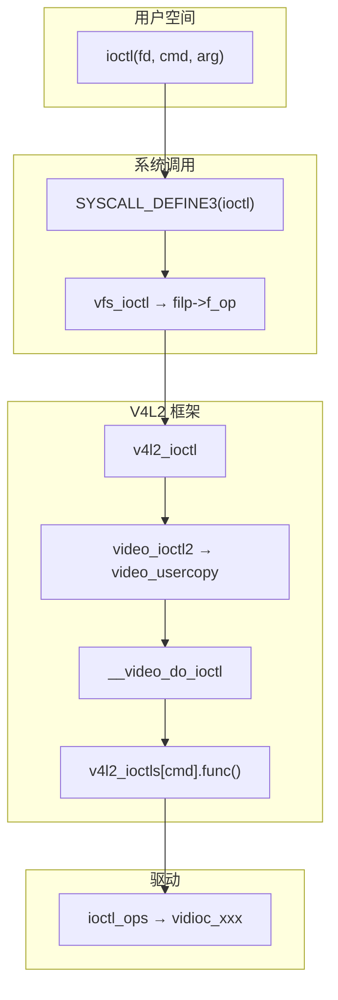

# V4L2 ioctl 分发：从系统调用到 vidioc_xxx

> Linux 6.8 · `drivers/media/v4l2-core/v4l2-ioctl.c` — `__video_do_ioctl`  
> **Linux 内核 · Media / V4L2 子系统**  
> 梳理 `ioctl(fd, VIDIOC_xxx, &arg)` 经 VFS、V4L2 框架查表到驱动 `vidioc_xxx` 的路径；以 UVC（`uvcvideo`）为例。  
> 前置：[V4L2 设备注册与 video 节点](/analysis/kernel/media/v4l2-device-registration)。  
> 关联 [UVC 驱动分析](/analysis/kernel/usb/uvc-driver)；实验代码见 [`code/v4l2-virtual/`](https://github.com/dengtaowei/blogD/tree/main/code/v4l2-virtual)。

---

## 目录

- [1. 总览](#1-总览)
- [2. ioctl 分发机制](#2-ioctl-分发机制)
- [3. 关键对象与 ops 分层](#3-关键对象与-ops-分层)
- [4. 完整路径示例](#4-完整路径示例)
- [附录 A 源码索引](#附录-a-源码索引)
- [附录 B 要点速记](#附录-b-要点速记)

---

## 1. 总览

注册与 `open` 上下文见 [V4L2 设备注册与 video 节点](/analysis/kernel/media/v4l2-device-registration)。下文从用户程序对 `/dev/video0` 调用 `ioctl(fd, VIDIOC_xxx, &arg)` 起，梳理内核主路径。

| 阶段 | 位置 | 关键函数 |
|:----:|------|----------|
| 系统调用 | `fs/ioctl.c` | `SYSCALL_DEFINE3(ioctl)` → `vfs_ioctl` |
| VFS 字符设备 | `filp->f_op` | `v4l2_ioctl` |
| V4L2 统一入口 | `v4l2-ioctl.c` | `video_ioctl2` → `video_usercopy` |
| 框架查表 | `v4l2-ioctl.c` | `__video_do_ioctl` → `v4l2_ioctls[]` → `v4l_xxx` |
| 驱动回调 | `uvc_v4l2.c` 等 | `ioctl_ops->vidioc_xxx` |

```text
用户态 ioctl()
  → SYSCALL_DEFINE3(ioctl)          fs/ioctl.c
  → vfs_ioctl()                     filp->f_op->unlocked_ioctl
  → v4l2_ioctl()                    v4l2-dev.c
  → video_ioctl2()                  v4l2-ioctl.c
  → video_usercopy()                copy_from_user / copy_to_user
  → __video_do_ioctl()              查 v4l2_ioctls[] 表
  → v4l_xxx()                       框架通用逻辑
  → vdev->ioctl_ops->vidioc_xxx()   驱动实现
```

### 1.1 流程图



→ 各层细节见 [§2](#2-ioctl-分发机制)、[§3](#3-关键对象与-ops-分层)。

> **Mermaid 预览：** 本地 `npm run docs:dev`，或 [mermaid.live](https://mermaid.live)。

### 1.2 open 与 ioctl

注册 video 设备时 `cdev->ops = &v4l2_fops`（`v4l2-dev.c` — `__video_register_device`）。用户 `open` 后 `filp->f_op` 指向 `v4l2_fops`；`ioctl` 经 `v4l2_ioctl()` 再转到 `vdev->fops->unlocked_ioctl`（驱动侧通常为 `video_ioctl2`）。

---

## 2. ioctl 分发机制

### 2.1 系统调用 → 设备 unlocked_ioctl

**文件**：`fs/ioctl.c`

```c
SYSCALL_DEFINE3(ioctl, unsigned int, fd, unsigned int, cmd, unsigned long, arg)
{
    struct fd f = fdget(fd);
    security_file_ioctl(f.file, cmd, arg);
    do_vfs_ioctl(f.file, fd, cmd, arg);      /* FIONBIO、FIOCLEX 等 */
    if (error == -ENOIOCTLCMD)
        vfs_ioctl(f.file, cmd, arg);
}
```

```c
long vfs_ioctl(struct file *filp, unsigned int cmd, unsigned long arg)
{
    return filp->f_op->unlocked_ioctl(filp, cmd, arg);
}
```

分发依据：命令是否为 VFS 已知的通用 `ioctl`；否则交给 `filp->f_op->unlocked_ioctl`。

### 2.2 v4l2_fops → video_ioctl2

**文件**：`drivers/media/v4l2-core/v4l2-dev.c` — `v4l2_ioctl`

```c
static long v4l2_ioctl(struct file *filp, unsigned int cmd, unsigned long arg)
{
    struct video_device *vdev = video_devdata(filp);

    if (vdev->fops->unlocked_ioctl && video_is_registered(vdev))
        return vdev->fops->unlocked_ioctl(filp, cmd, arg);
    return -ENOTTY;
}
```

驱动 `v4l2_file_operations` 里几乎总是：

```c
.unlocked_ioctl = video_ioctl2,
```

### 2.3 video_usercopy 与 __video_do_ioctl

**文件**：`drivers/media/v4l2-core/v4l2-ioctl.c`

```c
long video_ioctl2(struct file *file, unsigned int cmd, unsigned long arg)
{
    return video_usercopy(file, cmd, arg, __video_do_ioctl);
}
```

`video_usercopy()` 按 `_IOC_SIZE(cmd)` 分配内核缓冲区 → `copy_from_user` → `__video_do_ioctl()` → `copy_to_user`。驱动 `vidioc_xxx()` 只处理内核结构体，无需自行 `copy_from_user`。

`__video_do_ioctl()` 核心步骤：

1. `mutex_lock_interruptible(vdev->lock)`
2. `v4l2_is_known_ioctl(cmd)` 为真时，取 `info = &v4l2_ioctls[_IOC_NR(cmd)]`
3. `test_bit(_IOC_NR(cmd), vfd->valid_ioctls)` 过滤驱动未实现的命令
4. `info->func(ops, file, fh, arg)` 调用框架函数（如 `v4l_s_ctrl`），内部再调 `ops->vidioc_xxx()`
5. 未知命令走 `ops->vidioc_default()`

`v4l2_ioctls[]` 是框架的**命令分发表**（`struct v4l2_ioctl_info`），不是驱动 ops：

```c
struct v4l2_ioctl_info {
    unsigned int ioctl;
    u32 flags;
    const char * const name;
    int (*func)(const struct v4l2_ioctl_ops *ops, struct file *file,
                void *fh, void *p);
    void (*debug)(const void *arg, bool write_only);
};
```

| 命令 | 框架函数 | 驱动回调（UVC） |
|------|----------|-----------------|
| `VIDIOC_QUERYCAP` | `v4l_querycap` | `vidioc_querycap` |
| `VIDIOC_S_FMT` | `v4l_s_fmt` | `vidioc_s_fmt_vid_cap` |
| `VIDIOC_S_CTRL` | `v4l_s_ctrl` | `vidioc_s_ext_ctrls` |
| `VIDIOC_STREAMON` | `v4l_streamon` | `vidioc_streamon` |

---

## 3. 关键对象与 ops 分层

### 3.1 数据结构

```text
struct file
  ├─ f_op           → v4l2_fops
  └─ private_data   → 驱动 open 时设置（如 uvc_fh）

struct video_device          /* video_devdata(file) */
  ├─ fops           → uvc_fops 等
  ├─ ioctl_ops      → uvc_ioctl_ops
  ├─ lock
  └─ valid_ioctls   → determine_valid_ioctls() 生成
```

**文件**：`drivers/media/usb/uvc/uvc_v4l2.c`

```c
const struct v4l2_file_operations uvc_fops = {
    .open           = uvc_v4l2_open,
    .release        = uvc_v4l2_release,
    .unlocked_ioctl = video_ioctl2,
    .mmap           = uvc_v4l2_mmap,
    .poll           = uvc_v4l2_poll,
};

const struct v4l2_ioctl_ops uvc_ioctl_ops = {
    .vidioc_querycap        = uvc_ioctl_querycap,
    .vidioc_enum_fmt_vid_cap = uvc_ioctl_enum_fmt_vid_cap,
    .vidioc_s_fmt_vid_cap   = uvc_ioctl_s_fmt_vid_cap,
    .vidioc_streamon        = uvc_ioctl_streamon,
    .vidioc_s_ext_ctrls     = uvc_ioctl_s_ext_ctrls,
    .vidioc_default         = uvc_ioctl_default,
    /* ... */
};
```

注册时（`uvc_driver.c` — `uvc_register_video_device`）：`vdev->fops = fops`，`vdev->ioctl_ops = ioctl_ops`，再 `video_register_device()`。

### 3.2 ioctl 路径上的 ops

| 层 | 结构体 | 实例 | 访问 | ioctl 成员 |
|:--:|--------|------|------|------------|
| ① | `file_operations` | `v4l2_fops` | `filp->f_op` | `v4l2_ioctl` |
| ② | `v4l2_file_operations` | `uvc_fops` | `vdev->fops` | `video_ioctl2` |
| ③ | `v4l2_ioctl_ops` | `uvc_ioctl_ops` | `vdev->ioctl_ops` | `vidioc_xxx` |

① 与 `cdev->ops` 同源。`v4l2_ioctls[]` 夹在 ② 与 ③ 之间，是框架查表，**不算 ops 层**。

### 3.3 为何拆 fops 与 ioctl_ops？

两者**都由驱动提供**，职责不同：

| | `v4l2_file_operations` | `v4l2_ioctl_ops` |
|--|------------------------|------------------|
| 对应 | `open` / `mmap` / `poll` / `release` | 80+ 个 `VIDIOC_*` 子命令 |
| ioctl | 单一入口 `video_ioctl2` | 各命令的 `vidioc_xxx` |
| 框架 | `v4l2_ioctl()` → `vdev->fops->unlocked_ioctl` | `__video_do_ioctl()` → `ops->vidioc_xxx` |

`__video_do_ioctl()` 只读 `vfd->ioctl_ops`，不经过 `fops` 的 `open`/`mmap`。拆分原因：`VIDIOC_*` 数量大，需独立查表与 `valid_ioctls` 位图；同一驱动多个 `/dev/videoX` 节点时可混搭不同的 fops + ioctl_ops（如 UVC 视频节点与 metadata 节点）。

### 3.4 从注册到一次 ioctl

```text
video_register_device()
  ├─ vdev->fops / vdev->ioctl_ops        ← 驱动
  ├─ vdev->cdev->ops = &v4l2_fops        ← 框架
  └─ determine_valid_ioctls()

open("/dev/video0")
  └─ filp->f_op = v4l2_fops

ioctl(VIDIOC_S_CTRL, ...)
  ① v4l2_ioctl
  ② video_ioctl2 → video_usercopy → __video_do_ioctl
  → v4l2_ioctls[VIDIOC_S_CTRL].func → v4l_s_ctrl()
  ③ ops->vidioc_s_ext_ctrls()
```

---

## 4. 完整路径示例

### 4.1 VIDIOC_S_CTRL

用户态：

```c
struct v4l2_control c = { .id = V4L2_CID_BRIGHTNESS, .value = 99 };
ioctl(fd, VIDIOC_S_CTRL, &c);
```

内核路径：

```text
ioctl(fd, VIDIOC_S_CTRL, &c)
  └─ SYSCALL_DEFINE3(ioctl)                 fs/ioctl.c
       └─ vfs_ioctl()
            └─ v4l2_ioctl()                  v4l2-dev.c
                 └─ video_ioctl2()           v4l2-ioctl.c
                      └─ video_usercopy()
                           └─ __video_do_ioctl()
                                └─ v4l_s_ctrl()
                                     └─ ops->vidioc_s_ext_ctrls()
                                          └─ uvc_ioctl_s_ext_ctrls()
                                               └─ uvc_ctrl_commit()
```

**ops 层数**：① → ② → ③。

### 4.2 VIDIOC_STREAMON

```text
ioctl(fd, VIDIOC_STREAMON, &type)
  └─ ... 同上至 __video_do_ioctl()
       └─ v4l_streamon()
            └─ ops->vidioc_streamon()
                 └─ uvc_ioctl_streamon()
```

**ops 层数**：① → ② → ③。

---

## 附录 A 源码索引

| 文件 | 作用 |
|------|------|
| `fs/ioctl.c` | `SYSCALL_DEFINE3(ioctl)`、`vfs_ioctl` |
| `fs/char_dev.c` | `chrdev_open`，`filp->f_op` 绑定 |
| `drivers/media/v4l2-core/v4l2-dev.c` | `v4l2_fops`、`v4l2_ioctl`、设备注册 |
| `drivers/media/v4l2-core/v4l2-ioctl.c` | `video_ioctl2`、`__video_do_ioctl`、`v4l2_ioctls[]` |
| `drivers/media/usb/uvc/uvc_v4l2.c` | `uvc_fops`、`uvc_ioctl_ops` |
| `drivers/media/usb/uvc/uvc_driver.c` | 绑定 fops / ioctl_ops、`video_register_device` |
| `include/media/v4l2-dev.h` | `video_device`、`v4l2_file_operations` |
| `include/media/v4l2-ioctl.h` | `v4l2_ioctl_ops` |

---

## 附录 B 要点速记

| 层级 | 分发方式 | 依据 |
|------|----------|------|
| 系统调用 | 通用 cmd / `f_op` | `FIONBIO` 等 vs `-ENOIOCTLCMD` |
| 字符设备 | `filp->f_op->unlocked_ioctl` | `v4l2_fops` |
| V4L2 框架 | `v4l2_ioctls[_IOC_NR(cmd)].func` | 命令号查表 |
| V4L2 驱动 | `ioctl_ops->vidioc_xxx` | 函数指针 |

**一句话**：V4L2 ioctl 先按命令号查 `v4l2_ioctls[]` 进框架函数，再经 `ioctl_ops` 进驱动；`video_ioctl2` 统一完成用户态参数拷贝。
