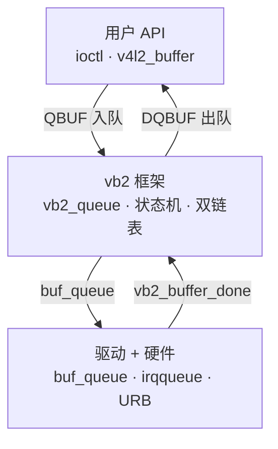
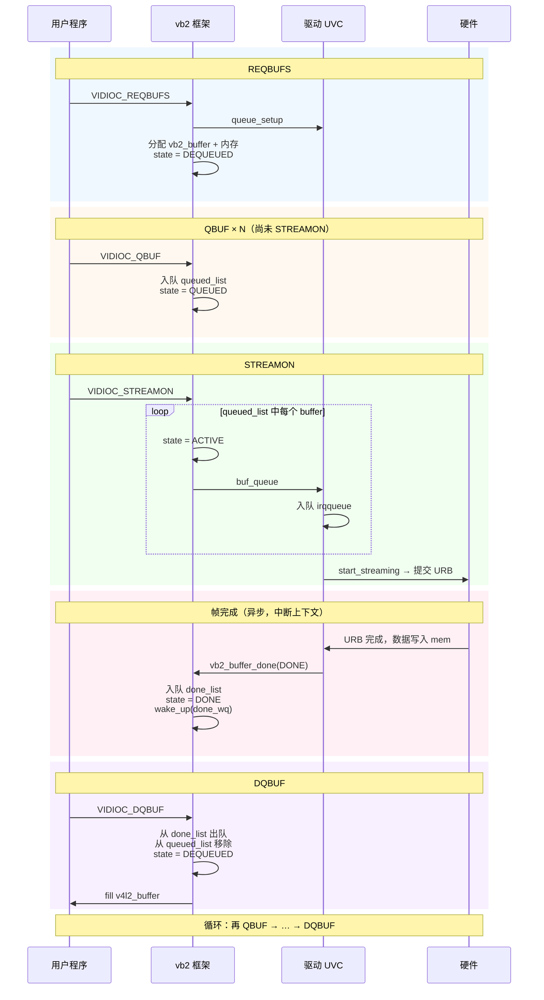
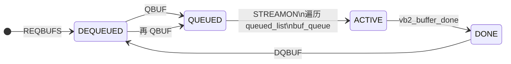
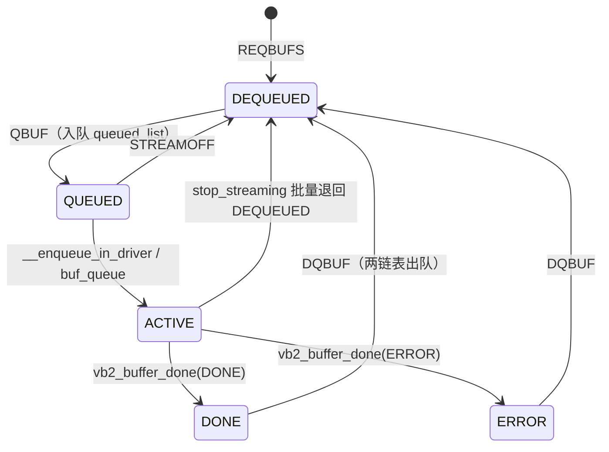

# videobuffer2：Buffer 状态机与双链表

> Linux 6.8 · `drivers/media/common/videobuf2/videobuf2-core.c` — `vb2_core_qbuf` / `vb2_buffer_done`  
> **Linux 内核 · Media / V4L2 子系统**  
> 梳理 `REQBUFS` / `QBUF` / `STREAMON` / `DQBUF` 在 vb2 框架内的状态机与 `queued_list` / `done_list` 双链表；以 UVC 为例。  
> 前置：[V4L2 设备注册与 video 节点](/analysis/kernel/media/v4l2-device-registration)（`uvc_queue_init`）→ [V4L2 ioctl 分发](/analysis/kernel/media/v4l2-ioctl-dispatch)（`vidioc_qbuf` 入口）。  
> 关联 [UVC 驱动分析](/analysis/kernel/usb/uvc-driver)；实验 [`code/v4l2-virtual/`](https://github.com/dengtaowei/blogD/tree/main/code/v4l2-virtual)（标准 `vb2_ioctl_*` 路径，可与 UVC 自定义 ioctl 对照）。

---

## 目录

- [1. 概述](#1-概述)
- [2. 三层模型](#2-三层模型)
- [3. 一帧的完整流程](#3-一帧的完整流程)
- [4. 关键数据结构](#4-关键数据结构)
- [5. 双链表为何重叠](#5-双链表为何重叠)
- [6. Buffer 状态机](#6-buffer-状态机)
- [7. STREAMON 与边界情况](#7-streamon-与边界情况)
- [8. UVC 驱动：buf_queue 到 vb2_buffer_done](#8-uvc-驱动buf_queue-到-vb2_buffer_done)
- [9. 与 ioctl 分发的衔接](#9-与-ioctl-分发的衔接)
- [附录 A 源码索引](#附录-a-源码索引)
- [附录 B 平台驱动（UVC vs 通用 vb2）](#附录-b-平台驱动uvc-vs-通用-vb2)
- [附录 C 要点速记](#附录-c-要点速记)

---

## 1. 概述

用户程序通过 `ioctl(REQBUFS / QBUF / STREAMON / DQBUF)` 管理视频缓冲区。这些调用进入内核后，buffer 的分配、`QBUF` 入队、驱动填数据、`DQBUF` 出队，均由 vb2（videobuffer2）框架统一调度。

驱动不直接维护 `queued` / `active` / `done` / `dequeued` 状态机，而是：

- 在 **`vb2_ops`** 回调里通过 `buf_queue` 接收 buffer、启动采集
- 硬件写完后调用 **`vb2_buffer_done()`**，将 buffer 放入 `done_list`，供 `DQBUF` 出队

probe 阶段 `uvc_queue_init` 初始化 `vb2_queue` 见 [V4L2 设备注册与 video 节点](/analysis/kernel/media/v4l2-device-registration)。

---

## 2. 三层模型



| 层次 | 核心结构 | 职责 |
|------|----------|------|
| **用户 API** | `v4l2_buffer` | `QBUF` / `DQBUF` |
| **vb2 框架** | `vb2_queue` | 状态机、`queued_list` / `done_list` |
| **驱动** | `vb2_ops`、`irqqueue` | 硬件写内存，完成后 `vb2_buffer_done` |

典型采集循环：

```text
REQBUFS → QBUF（重复 N 次）→ STREAMON → 硬件逐帧填数据 → DQBUF → 处理图像 → 再 QBUF → …
```

---

## 3. 一帧的完整流程

> **Mermaid 预览：** 本地 `npm run docs:dev`，或 [mermaid.live](https://mermaid.live)。

### 3.1 全流程（先 QBUF 再 STREAMON）



同一段流程，仅看 buffer 状态变化：



若尚未 `STREAMON` 就 `QBUF`，buffer 只进入 `queued_list`，状态停在 `QUEUED`；`STREAMON` 再遍历 `queued_list`，将全部 buffer 交给驱动。若先 `STREAMON` 再 `QBUF`，则每次 `QBUF` 会立刻调用 `buf_queue`（见 [7.1 两种 QBUF 顺序](#71-两种-qbuf-顺序)）。

### 3.2 分阶段对照

| 阶段 | 用户做了什么 | vb2 侧（状态 / 链表） | 驱动侧（UVC） |
|------|--------------|----------------------|---------------|
| REQBUFS | 申请 N 块 buffer | 分配内存；状态 `DEQUEUED` | `queue_setup` 返回每帧字节数 |
| QBUF | 填写 `v4l2_buffer.index`（如 0、1）并提交内核 | `QUEUED`，入 `queued_list` | 若已开流 → `ACTIVE`，入 `irqqueue` |
| STREAMON | 开始采集 | 批量 `ACTIVE` + `buf_queue` | `start_streaming`，提交 URB |
| 帧完成 | 可 `poll` 到可读 | `DONE`，同时在 `queued_list` 和 `done_list` | `vb2_buffer_done` |
| DQBUF | 读走一帧图像 | `DEQUEUED`，两链表皆无此 buffer | — |
| 再 QBUF | 循环使用同一块 buffer | 重复上述路径 | 重复上述路径 |

### 3.3 UVC 串联示例（单块 buffer，index = 0）

```text
QBUF(index=0)
  → vb2：queued_list 挂上 buf[0]，状态 QUEUED
  → STREAMON 后：ACTIVE，驱动 irqqueue 挂上 buf[0]，URB 开始往 buf[0] 的 mem 写数据

URB 完成（一帧结束）
  → uvc_queue_next_buffer：从 irqqueue 摘下 buf[0]
  → vb2_buffer_done(DONE)
  → vb2：buf[0] 仍在 queued_list，同时入 done_list；wake_up

DQBUF(index=0)
  → 用户读到图像；buf[0] 从两链表移除，状态回到 DEQUEUED

QBUF(index=0)  → 再次进入 pipeline
```

### 3.4 三层之间的数据交接

**用户 → 驱动**（`QBUF` / `STREAMON`）：

```text
v4l2_buffer → vb2_buffer → buf_queue() → irqqueue
```

**驱动 → 框架 → 用户**（异步，帧完成后）：

```text
驱动写 mem → vb2_buffer_done() → done_list → wake_up → DQBUF
```

**框架 → 用户**（`DQBUF`）：

```text
vb2_buffer → fill v4l2_buffer → 用户读 mmap 到的内存
```

---

## 4. 关键数据结构

### 4.1 vb2 框架层

```c
struct vb2_queue {
    const struct vb2_ops     *ops;       // 驱动实现：queue_setup, buf_queue, start_streaming...
    const struct vb2_mem_ops *mem_ops;   // 内存后端：alloc, mmap, dmabuf...
    struct list_head  queued_list;       // 已 QBUF、尚未 DQBUF 的 buffer（queued 阶段）
    struct list_head  done_list;         // 其中已完成、可 DQBUF 出队的子集
    atomic_t          owned_by_drv_count; // 当前由驱动持有的 ACTIVE buffer 个数
    wait_queue_head_t done_wq;           // DQBUF 阻塞时在此等待
    u32               min_queued_buffers; // 开流前至少要有几块 buffer 在 queued_list
};

struct vb2_buffer {
    enum vb2_buffer_state state;
    struct list_head queued_entry;  // 挂在 queued_list 上的链表节点
    struct list_head done_entry;    // 挂在 done_list 上的链表节点
    struct vb2_plane planes[VB2_MAX_PLANES];
};
```

每个 `vb2_buffer` 自带 `queued_entry` 和 `done_entry` 两个链表节点，因此可以同时挂在 `queued_list` 和 `done_list` 上（见 [5. 双链表为何重叠](#5-双链表为何重叠)）。

### 4.2 UVC 驱动层（嵌在 vb2 之上）

```c
struct uvc_video_queue {
    struct vb2_queue queue;       // vb2 框架队列（queued_list / done_list 在这里）
    struct list_head irqqueue;    // 驱动私有：等待 URB 使用的 buffer
    spinlock_t irqlock;
};

struct uvc_buffer {
    struct vb2_v4l2_buffer buf;   // 必须放第一成员，便于 container_of 还原
    struct list_head queue;       // 挂在 irqqueue 上的节点
    void *mem;
    unsigned int bytesused;
};
```

`buf` 必须为第一成员：`buf_queue` 回调收到 `struct vb2_buffer *`，驱动通过 `container_of(vb, struct uvc_buffer, buf.buf)` 还原 `uvc_buffer`，以访问 `mem`、`bytesused` 等字段。

### 4.3 双层链表关系

```text
vb2 框架：  queued_list ──────────────────► done_list
                │                                  ▲
                │ buf_queue                        │ vb2_buffer_done
                ▼                                  │
驱动私有：      irqqueue ── URB 写 mem ── 帧结束 ──┘
```

- **`queued_list` / `done_list`**：框架层，跟踪 buffer 在 pipeline 中的排队与完成状态
- **`irqqueue`**：驱动层，表示硬件当前使用的 buffer

二者通过 `buf_queue` 和 `vb2_buffer_done` 衔接，分属不同层次。

---

## 5. 双链表为何重叠

### 5.1 现象

硬件写完一帧后，该 buffer **同时**存在于：

- `queued_list`（已 `QBUF` 入队，尚未 `DQBUF` 出队）
- `done_list`（数据已就绪，可 `DQBUF` 出队）

这不是 bug，也不是「从一条链表搬到另一条」，而是**两条链表表达两种不同语义**。

### 5.2 两条链表各管什么

| 链表 | 回答的问题 | 从何时到何时 |
|------|------------|--------------|
| `queued_list` | 哪些 buffer 已入队、尚在 pipeline 中？ | 从 `QBUF` 到 `DQBUF` |
| `done_list` | 其中哪些已完成、可出队？ | 从 `vb2_buffer_done` 到 `DQBUF` |

因此 `done_list` 是 `queued_list` 在某一时刻的**子集**。帧完成后，子集里多了一块 buffer。

### 5.3 具体例子（2 块 buffer）

假设 `REQBUFS(2)`，已 `STREAMON`，两块都在采集中：

| 时刻 | buf[0] | buf[1] | queued_list | done_list |
|------|--------|--------|-------------|-----------|
| 两块都在写 | ACTIVE | ACTIVE | {0, 1} | {} |
| buf[0] 写完 | DONE | ACTIVE | {0, 1} | {0} |
| DQBUF buf[0] | DEQUEUED | ACTIVE | {1} | {} |
| buf[1] 写完 | DEQUEUED | DONE | {1} | {1} |

buf[0] 写完时仍在 `queued_list`，同时进入 `done_list`；`DQBUF` 后从两条链表一并移除。

### 5.4 为什么完成时不从 queued_list 移除？

**QBUF / DQBUF 语义**  
`QBUF` 将 buffer 入队交给 pipeline；`DQBUF` 出队后 buffer 回到 `DEQUEUED`（under userspace control）。帧完成到 `DQBUF` 之间，buffer 仍在 `queued_list` 上，`queued_count` 不应减少。

**STREAMON 批量提交**  
`STREAMON` 遍历 `queued_list` 将全部 buffer 交给驱动。若完成时就从 `queued_list` 移除，等于在 `DQBUF` 之前就结束 queued 状态，与语义不符。

**锁域分离**

| 代码路径 | 运行上下文 | 使用的锁 | 允许改的链表 |
|----------|------------|----------|--------------|
| `QBUF` / `DQBUF` | 进程上下文（ioctl） | `q->lock`（mutex，可睡眠） | `queued_list` |
| `vb2_buffer_done` | 中断 / 软中断（URB 回调） | `done_lock`（spinlock，不可睡眠） | **仅** `done_list` |

`vb2_buffer_done` 运行在中断里。若此时还要从 `queued_list` 删除节点，就必须拿 `q->lock`（mutex）。而用户线程可能在 `DQBUF` 里阻塞在 `done_wq` 上、正持有或未释放相关锁——**中断里拿 mutex 可能死锁**。

因此框架约定：

- **完成时**（中断）：只改 `done_list` 和状态，不动 `queued_list`
- **出队时**（进程）：`DQBUF` 一次性从两条链表都移除，状态变为 `DEQUEUED`

框架以此换取中断路径简单、避免死锁。

---

## 6. Buffer 状态机

### 6.1 各状态含义

| 状态 | 含义 | 在哪些链表上 |
|------|------|--------------|
| `DEQUEUED` | under userspace control，可以 `QBUF` | 无 |
| `QUEUED` | 已 `QBUF`，在 `queued_list`，尚未交给驱动 | `queued_list` |
| `ACTIVE` | 已 `buf_queue`，驱动/硬件正在使用 | `queued_list`；驱动侧还在 `irqqueue` |
| `DONE` | 硬件写完，`vb2_buffer_done` 已调用 | `queued_list` + `done_list` |
| `ERROR` | 出错结束，同样等用户 `DQBUF` | `queued_list` + `done_list` |
| `PREPARING` | `__buf_prepare` 过程中的短暂过渡 | 通常无 |

`IN_REQUEST` 用于 Media Request API，本文不涉及。

### 6.2 状态转移图



### 6.3 关键源码

```c
// ── QBUF：DEQUEUED → QUEUED ──
list_add_tail(&vb->queued_entry, &q->queued_list);
vb->state = VB2_BUF_STATE_QUEUED;
if (q->start_streaming_called)
    __enqueue_in_driver(vb);   // 已开流则立刻交给驱动

// ── __enqueue_in_driver：QUEUED → ACTIVE ──
vb->state = VB2_BUF_STATE_ACTIVE;
atomic_inc(&q->owned_by_drv_count);
call_void_vb_qop(vb, buf_queue, vb);   // 调用驱动的 buf_queue

// ── vb2_buffer_done：ACTIVE → DONE（中断上下文）──
list_add_tail(&vb->done_entry, &q->done_list);
vb->state = VB2_BUF_STATE_DONE;
atomic_dec(&q->owned_by_drv_count);
wake_up(&q->done_wq);

// ── DQBUF：DONE → DEQUEUED ──
list_del(&vb->queued_entry);   // 此处才从 queued_list 移除
__vb2_dqbuf(vb);               // 从 done_list 移除，state = DEQUEUED
```

### 6.4 `owned_by_drv_count`

记录当前由驱动持有的 ACTIVE buffer 数量：

- `__enqueue_in_driver` → `atomic_inc`
- `vb2_buffer_done` → `atomic_dec`
- `start_streaming(q, count)` 的 `count` 即开流时交给驱动的块数

驱动每 `buf_queue` 一次，最终须对应一次 `vb2_buffer_done`（或在 `stop_streaming` 中批量 `vb2_buffer_done`）；否则计数不平，框架认为仍有 buffer 留在驱动侧。

---

## 7. STREAMON 与边界情况

### 7.1 两种 QBUF 顺序

| 顺序 | 实际行为 |
|------|----------|
| **先 QBUF 再 STREAMON** | `QBUF` 只入 `queued_list`；`STREAMON` 遍历 `queued_list`，逐个 `buf_queue` |
| **先 STREAMON 再 QBUF** | `STREAMON` 设 `start_streaming_called = 1`；之后每次 `QBUF` 在入队后立刻 `__enqueue_in_driver` |

两种顺序最终效果相同，差别只在「交给驱动的时机」。

### 7.2 `min_queued_buffers`

`STREAMON` 在 `queued_count >= min_queued_buffers` 时才调用 `start_streaming()`。硬件开始 DMA 后须立即有 buffer 可写；若无可用 buffer 就开流，第一帧无处可写。UVC 等驱动通常设 `min_queued_buffers = 2`，使流水线中始终有备用块。

### 7.3 DQBUF 阻塞与 poll

- `done_list` 为空 → `DQBUF` 在 `done_wq` 上睡眠等待
- 设了 `O_NONBLOCK` → 直接返回 `-EAGAIN`，不阻塞
- `vb2_buffer_done` → `wake_up(&q->done_wq)` → 阻塞的 `DQBUF` 或 `poll()` 返回

### 7.4 异常路径

| 场景 | 正确做法 |
|------|----------|
| `start_streaming` 失败 | 驱动应对已 `buf_queue` 的 buffer 调 `vb2_buffer_done(QUEUED)` 退回；**不会**进入 `done_list` |
| `STREAMOFF` / `stop_streaming` | 驱动对所有仍 ACTIVE 的 buffer 调 `vb2_buffer_done(DONE 或 ERROR)` |
| `vb2_buffer_done` 的 state 参数 | `DONE`/`ERROR` → 入 `done_list`；`QUEUED` → 仅回退状态，用于启动失败等场景 |

---

## 8. UVC 驱动：buf_queue 到 vb2_buffer_done

UVC 通过 USB URB 收包，`irqqueue` 与 vb2 的衔接如下。注册阶段 `uvc_queue_init` 见 [V4L2 设备注册与 video 节点](/analysis/kernel/media/v4l2-device-registration)。

### 8.1 驱动把 buffer 交给硬件（`buf_queue`）

```c
// uvc_buffer_queue — vb2 的 buf_queue 回调
list_add_tail(&buf->queue, &queue->irqqueue);
// 之后 URB 提交时从 irqqueue 取 buffer，往 buf->mem 写数据
```

### 8.2 URB 完成（中断）

```c
// uvc_video_complete
buf = uvc_queue_get_current_buffer();   // 取 irqqueue 首节点（当前正在写的块）
stream->decode(urb, buf, ...);          // 解析 USB 包，写入 buf->mem
// 若本包是一帧最后一个包（EOF）→ uvc_queue_next_buffer(buf)
```

### 8.3 一帧结束，调用 vb2_buffer_done

```c
// uvc_queue_next_buffer
list_del(&buf->queue);                  // 从 irqqueue 摘下
uvc_queue_buffer_release(buf);          // kref 减到 0 → 回调下面函数

// uvc_queue_buffer_complete
vb2_buffer_done(&buf->buf.vb2_buf, VB2_BUF_STATE_DONE);
```

isoc 传输下，一帧可跨多个 URB；`irqqueue` 首节点在整帧 EOF 之前不移除，否则会在半帧时触发 `vb2_buffer_done`。

---

## 9. 与 ioctl 分发的衔接

| 用户 ioctl | vb2 入口 | 驱动回调 |
|------------|----------|----------|
| `VIDIOC_REQBUFS` | `vb2_core_reqbufs` | `queue_setup` |
| `VIDIOC_QBUF` | `vb2_core_qbuf` | `buf_prepare`、`buf_queue` |
| `VIDIOC_DQBUF` | `vb2_core_dqbuf` | `buf_finish` |
| `VIDIOC_STREAMON` | `vb2_core_streamon` | `start_streaming` |
| `VIDIOC_STREAMOFF` | `vb2_core_streamoff` | `stop_streaming` |

UVC 在 `uvc_ioctl_ops` 里包装上述流程（不经 `vdev->queue` 的通用路径），最终落到 `uvc_queue.c` 的 `uvc_queue_qops`。ioctl 查表与 `vidioc_xxx` 分发详见 [V4L2 ioctl 分发](/analysis/kernel/media/v4l2-ioctl-dispatch)。

---

## 附录 A 源码索引

| 主题 | 路径 |
|------|------|
| 状态枚举、结构体 | `include/media/videobuf2-core.h` |
| 状态机实现 | `drivers/media/common/videobuf2/videobuf2-core.c` |
| V4L2 封装 | `drivers/media/common/videobuf2/videobuf2-v4l2.c` |
| UVC vb2_ops | `drivers/media/usb/uvc/uvc_queue.c` |
| URB 完成 | `drivers/media/usb/uvc/uvc_video.c` |

相关函数调用链：`vb2_core_qbuf` → `__enqueue_in_driver` → `vb2_buffer_done` → `vb2_core_dqbuf` → `uvc_buffer_queue` → `uvc_video_complete`。

---

## 附录 B 平台驱动（UVC vs 通用 vb2）

| 驱动 | ioctl 路径 | 私有队列 | 完成回调 |
|------|------------|----------|----------|
| UVC | 自定义 `uvc_ioctl_ops` → `uvc_queue_qops` | `irqqueue` | `uvc_video_complete` |
| virtual_video | 标准 `vb2_ioctl_qbuf` 等 | 驱动 `buf_list`（timer 取 buffer） | timer → `vb2_buffer_done` |
| airspy | 标准 vb2 | `queued_bufs` | `airspy_urb_complete` |
| MIPI/CSI | 多数 `vdev->queue` + 标准 vb2 | `dma_queue` 等 | 帧中断 → `vb2_buffer_done` |

框架层状态机与双链表逻辑相同；差异在 `vb2_ops` 实现、ioctl 是否走 `vdev->queue`，以及私有队列命名。虚拟驱动示例见 [`code/v4l2-virtual/virtual_video.c`](https://github.com/dengtaowei/blogD/blob/main/code/v4l2-virtual/virtual_video.c)（`virtual_buf_queue` + timer 模拟硬件完成）。

---

## 附录 C 要点速记

| 主题 | 要点 |
|------|------|
| 双链表语义 | `queued_list`：QBUF→DQBUF 全程；`done_list`：完成子集，与前者可重叠 |
| 完成 vs 出队 | 中断里只改 `done_list`；`DQBUF` 才从两链表一并移除 |
| 状态主线 | DEQUEUED → QUEUED → ACTIVE → DONE → DEQUEUED |
| 驱动计数 | `owned_by_drv_count`：`buf_queue` 与 `vb2_buffer_done` 须成对 |
| ioctl 入口 | 用户 ioctl → [ioctl 分发](/analysis/kernel/media/v4l2-ioctl-dispatch) → `vb2_core_*` → `vb2_ops` |
