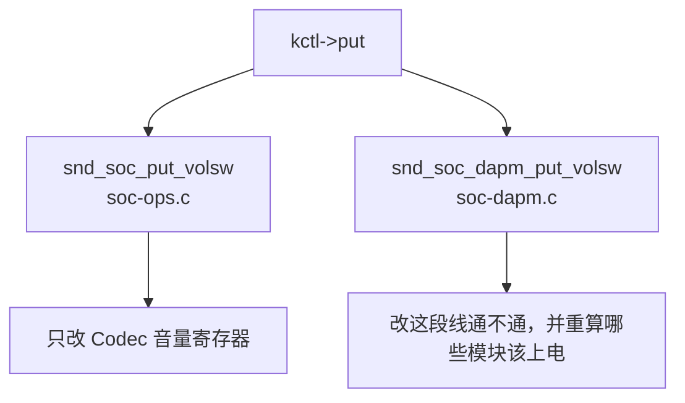

# amixer 改音量、拨开关：内核的不同调用

> **平台**：100ask i.MX6ULL Pro
> **内核**：百问 SDK **Linux-4.9.88**
> **本文**：`amixer sset` 之后，内核怎样更改对应的配置

---

## 目录

- [1. 本文要回答什么](#1-本文要回答什么)
- [2. 两条差不多的命令](#2-两条差不多的命令)
- [3. 进内核后先走同一段](#3-进内核后先走同一段)
- [4. 两个都叫 put_volsw 的函数](#4-两个都叫-put_volsw-的函数)
- [5. 改音量](#5-改音量)
- [6. 拨通路开关](#6-拨通路开关)
- [7. 插拔耳机谁在切通路](#7-插拔耳机谁在切通路)
- [8. 音量正常配置，无声音](#8-音量正常配置无声音)
- [9. 小结](#9-小结)
- [附录 A 源码索引](#附录-a-源码索引)

---

## 1. 本文要回答什么

> **`amixer sset` 时，内核怎样对上要改的哪一项配置？音量和通路开关为什么走两个不同的 `.put`？**

---

## 2. 两条差不多的命令

```bash
amixer -c 0 sset 'Headphone' 80%
amixer -c 0 sset 'Left Output Mixer PCM Playback Switch' on
```

`amixer` 允许用短名。你写 `'Headphone'`，它在用户态先对应到内核里的全名 **`Headphone Playback Volume`**（耳机播放音量）。

第二条命令没有更短的叫法，命令里写的就是内核全名：**`Left Output Mixer PCM Playback Switch`**。这是左声道输出混音器上「要不要把 PCM 接到后面」的开关，调的是电路的通断。

两条命令都对 `controlC0` 发同一种请求：`SNDRV_CTL_IOCTL_ELEM_WRITE`。进内核后先走同一段，调到 `.put` 才分开。

---

## 3. 进内核后先走同一段

```text
amixer sset
  → 用户态把短名 Headphone 换成 Headphone Playback Volume
  → ioctl(controlC0, SNDRV_CTL_IOCTL_ELEM_WRITE)     // sound/core/control.c
      → snd_ctl_ioctl
          → snd_ctl_elem_write_user
              → snd_ctl_elem_write
                  → snd_ctl_find_id(...)              // 按名字找到这一项
                  → kctl->put(kctl, control)          // ★ 从这里分开
                  → put 返回大于 0：通知「值已经变了」
```

`snd_ctl_find_id` 在这张卡已经挂上的控件列表里按名字查找。找到之后只调用这一项自己的 `.put`。

---

## 4. 两个都叫 `put_volsw` 的函数

`.put` 在驱动用宏声明这一项时就填好了，运行时不会改。本板这两条命令对应：



| 板端命令 | 内核里的全名 | 声明用的宏 | `.put` | 做完以后 |
|----------|--------------|------------|--------|----------|
| `sset 'Headphone' 80%` | `Headphone Playback Volume` | `SOC_DOUBLE_R_TLV` | `snd_soc_put_volsw` | 写 `WM8960_LOUT1` / `ROUT1` 的音量位 |
| `sset '… PCM Playback Switch' on` | `Left Output Mixer PCM Playback Switch` | `SOC_DAPM_SINGLE` | `snd_soc_dapm_put_volsw` | 这段模拟线接通或断开，并调用 `dapm_power_widgets` |

函数名都叫 `put_volsw`：`sound/soc/soc-ops.c` 里那个只改音量；`sound/soc/soc-dapm.c` 里那个还会改 DAPM 图（模拟通路怎么接、哪些块该上电）。宏分别在 `include/sound/soc.h` 和 `include/sound/soc-dapm.h`。

---

## 5. 改音量

`Headphone Playback Volume` 写在 `wm8960_snd_controls[]` 里：

```c
SOC_DOUBLE_R_TLV("Headphone Playback Volume", WM8960_LOUT1, WM8960_ROUT1,
		 0, 127, 0, out_tlv)
```

宏把 `.put` 设成 `snd_soc_put_volsw`，左右声道各用哪个寄存器、从哪一位开始、范围多大，都打包进 `private_value`（运行时按 `struct soc_mixer_control` 来解）。

```text
kctl->put
  → snd_soc_put_volsw                         // sound/soc/soc-ops.c
      → 从 private_value 取出寄存器号、移位、掩码
      → 把用户写入的左右整数值换成寄存器里要写的位
      → snd_soc_component_update_bits(…, WM8960_LOUT1, …)
      → snd_soc_component_update_bits(…, WM8960_ROUT1, …)
```

`snd_soc_component_update_bits`（`sound/soc/soc-io.c`）先读后改再写，经 I2C 写到 WM8960。这一路**只改音量**，模拟线通不通、哪些模块该上电，它都不管。

---

## 6. 拨通路开关

DAPM（Dynamic Audio Power Management）看的是：从正在播放或录音的那一头，到耳机、喇叭或麦克风，中间有没有一条接通的路 (complete path)；有，就给路上的模块上电。混音器上的开关决定其中某一段现在通不通。

本板左声道输出混音在 `wm8960.c`：

```c
static const struct snd_kcontrol_new wm8960_loutput_mixer[] = {
	SOC_DAPM_SINGLE("PCM Playback Switch", WM8960_LOUTMIX, 8, 1, 0),
	/* … */
};
```

`SOC_DAPM_SINGLE` 的 `.put` 是 `snd_soc_dapm_put_volsw`。这项挂在名叫 `Left Output Mixer` 的混音节点上。注册时 `dapm_create_or_share_kcontrol` 把节点名和开关短名拼在一起，用户看见的就是 **`Left Output Mixer PCM Playback Switch`**。

图上两个节点之间，跑起来之后的那一截连线叫 **path**；字段 **`connect`** 表示这一截现在通不通。

```text
kctl->put
  → snd_soc_dapm_put_volsw                    // sound/soc/soc-dapm.c
      → 用户写 0：断开；写非 0：接通
      → 寄存器位有变化，就记下，等后面上电时一并写 WM8960_LOUTMIX 的 bit 8
      → soc_dapm_mixer_update_power(...)
            → 这项对应的每一截 path：改 connect
            → dapm_power_widgets(...)          // 按整张图重算谁该上电
```

只把开关打开、还没有 `aplay` 开始播放时，数字音频那一头还没接上，沿途模块可以继续关着电。

---

## 7. 插拔耳机谁在切通路

有的板子会把「耳机插着 / 喇叭开着」做成 `amixer` 里能拨的开关（宏是 `SOC_DAPM_PIN_SWITCH`，写函数是 `snd_soc_dapm_put_pin_switch`：按节点名接上或断开，再 `snd_soc_dapm_sync` 去重算上电）。

本板板级文件 `imx-wm8960.c` 没有这样挂 `Headphone Jack`、`Ext Spk`，所以 `amixer controls` 里看不到 `Headphone Jack Switch`。它们只是 DAPM 图上的节点：

```c
/* sound/soc/fsl/imx-wm8960.c */
static const struct snd_soc_dapm_widget imx_wm8960_dapm_widgets[] = {
	SND_SOC_DAPM_HP("Headphone Jack", NULL),
	SND_SOC_DAPM_SPK("Ext Spk", NULL),
	SND_SOC_DAPM_MIC("Mic Jack", NULL),
	SND_SOC_DAPM_MIC("Main MIC", NULL),
};
```

插上或拔掉耳机时，`hp_jack_status_check` 根据检测 GPIO 直接调用 `snd_soc_dapm_enable_pin` / `disable_pin`（喇叭 `Ext Spk`、耳机麦 `Mic Jack`、板载麦 `Main MIC`）。后面同样会重算上电，只是入口是耳机检测，不是 `amixer`。

---

## 8. 音量正常配置，无声音

要出声，音量得合适，混音开关得接通，并且已经开始播放（数字音频那一头接上）。三条同时满足，从播放到喇叭才是一条通的路。

| 你做的事 | 内核改了什么 | 仍可能无声 |
|----------|----------------|------------|
| `sset 'Headphone' 80%` | 只改耳机音量寄存器 | 混音开关还断着，或还没 `aplay` |
| `sset '… PCM Playback Switch' on` | 这一截 path 接通，并重算上电 | 还没开始播放，数字那一头没接上 |
| `aplay` 开始播放 | 把播放端接上再给沿途上电 | 开关仍断着，或插拔耳机时把喇叭/耳机那一头断开了 |

`amixer` 列表里音量和开关排在一起。

---

## 9. 小结

- 两条 `sset` 都对 `controlC0` 发 `ELEM_WRITE`，从这一项配置自己的 `.put` 开始分开。  
- `Left Output Mixer PCM Playback Switch` 的 `.put` 是 `snd_soc_dapm_put_volsw`，改这一截通断，并调用 `dapm_power_widgets`。  
- `Headphone Jack` 由插拔耳机的检测回调来接上或断开，本板 `amixer` 列表里没有这一项。

---

## 附录 A 源码索引

| 文件 | 内容 |
|------|------|
| `sound/core/control.c` | `snd_ctl_ioctl`、`snd_ctl_elem_write`、`snd_ctl_find_id` |
| `include/sound/soc.h` | `SOC_DOUBLE_R_TLV` → `snd_soc_put_volsw` |
| `include/sound/soc-dapm.h` | `SOC_DAPM_SINGLE` / `SOC_DAPM_PIN_SWITCH` |
| `sound/soc/soc-ops.c` | `snd_soc_put_volsw` |
| `sound/soc/soc-io.c` | `snd_soc_component_update_bits` |
| `sound/soc/soc-dapm.c` | `snd_soc_dapm_put_volsw`、`soc_dapm_mixer_update_power`、`snd_soc_dapm_put_pin_switch`、`dapm_create_or_share_kcontrol` |
| `sound/soc/codecs/wm8960.c` | `wm8960_snd_controls[]`、`wm8960_loutput_mixer[]` |
| `sound/soc/fsl/imx-wm8960.c` | 板级节点、`hp_jack_status_check` |

---
