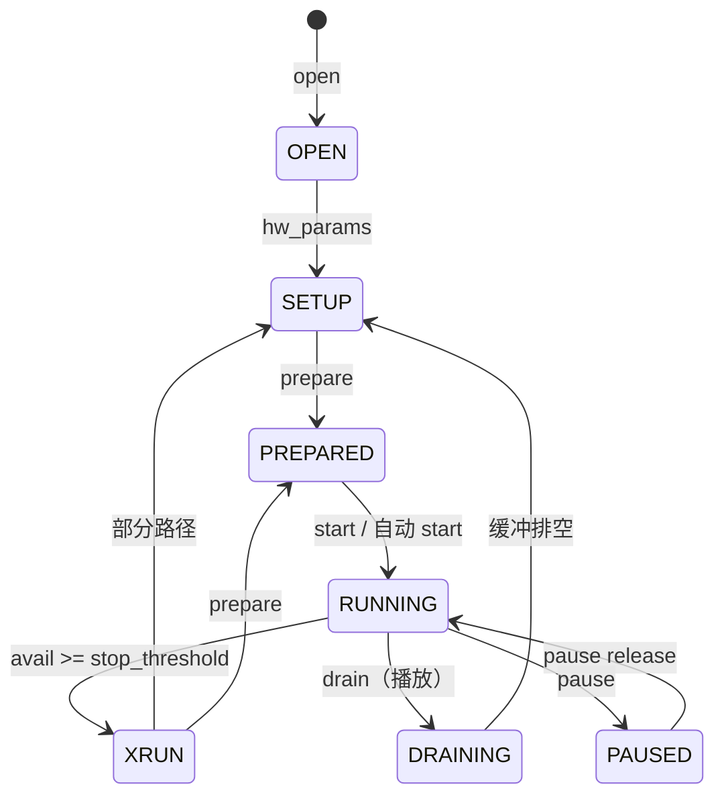
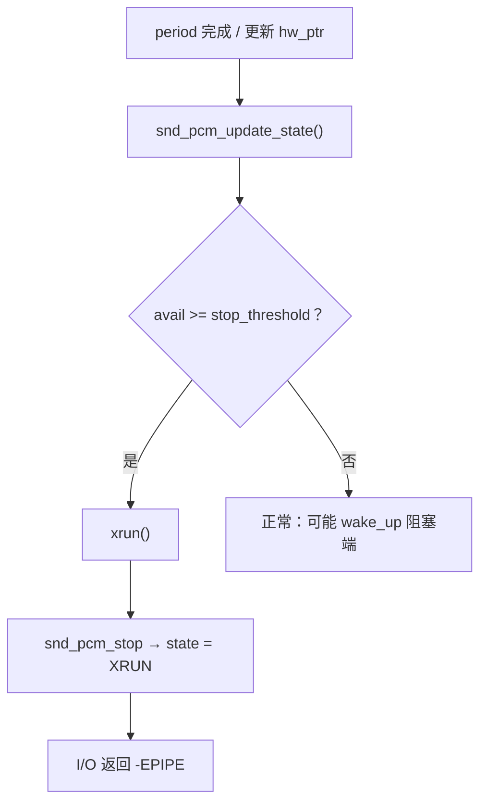

# ALSA PCM 状态机与 XRUN

> **内核**：对照 NXP BSP **Linux 4.9.88**（`sound/core/pcm_native.c`、`pcm_lib.c`）；状态枚举与主流内核一致，换板可直接对照  
> **关联**：[播放路径](/analysis/kernel/sound/imx6ull-audio-playback-flow) · [录音路径](/analysis/kernel/sound/imx6ull-audio-capture-flow) · [`/dev/snd` 设备节点](/analysis/kernel/sound/imx6ull-snd-devices)  
> **本文**：PCM 子流状态如何变迁、`start_threshold` / `stop_threshold` / `avail_min` 管什么、XRUN 如何判定与恢复

---

## 目录

- [1. 本文要回答什么](#1-本文要回答什么)
- [2. 状态一览](#2-状态一览)
- [3. 正常路径怎么走](#3-正常路径怎么走)
- [4. 环形缓冲与三个阈值](#4-环形缓冲与三个阈值)
- [5. XRUN：何时发生、内核做什么](#5-xrun何时发生内核做什么)
- [6. 应用侧怎么恢复](#6-应用侧怎么恢复)
- [7. 和播 / 录文的对照](#7-和播--录文的对照)
- [8. 小结](#8-小结)

---

## 1. 本文要回答什么

> **一次 `write` / `read` 为什么有时直接返回、有时阻塞、有时变成 `-EPIPE`？PCM 子流到底处在什么状态？**

[播放](/analysis/kernel/sound/imx6ull-audio-playback-flow) / [录音](/analysis/kernel/sound/imx6ull-audio-capture-flow) 讲的是数据怎么经过 ALSA → ASoC → DMA → SAI。本文补的是**同一条流上的状态约束**：哪些 ioctl / I/O 合法、缓冲空满如何反压、跟不上采样率时如何变成 XRUN。

状态存在 `runtime->status->state`（UAPI：`SNDRV_PCM_STATE_*`），与具体声卡芯片无关。

---

## 2. 状态一览

定义见 `include/uapi/sound/asound.h`：

| 状态 | 含义（粗） |
|------|------------|
| `OPEN` | 已 `open`，尚未完成参数设置 |
| `SETUP` | `hw_params` 已设，尚未 `prepare` |
| `PREPARED` | 已 `prepare`，可以 `start` / 自动 start |
| `RUNNING` | 已 trigger，DMA/硬件在传数 |
| `XRUN` | underrun（播）或 overrun（录），传输已停 |
| `DRAINING` | 播放侧把剩余数据播完再停 |
| `PAUSED` | 已 pause |
| `SUSPENDED` | 电源挂起相关 |
| `DISCONNECTED` | 设备断开 |

日常热路径主要碰前五个，外加播放结束时的 `DRAINING`。



非法状态下的操作会失败：例如不在 `PREPARED` 就 `start` → `-EBADFD`（见 `snd_pcm_pre_start`）。

---

## 3. 正常路径怎么走

以阻塞模式、`aplay` / `arecord` 直连为例（省略 libasound 细节）：

```text
open
  → state = OPEN
hw_params
  → state = SETUP（参数、缓冲大小等落定）
prepare
  → soc_pcm_prepare：STREAM_START，模拟电路上电
  → state = PREPARED（可以 start）
write / read
  → 若仍为 PREPARED 且满足 start_threshold
        → snd_pcm_start → ops->trigger(START)
        → state = RUNNING
  → RUNNING 下继续填/取环形缓冲
close / drain / drop
  → trigger(STOP) 停 DMA/SAI；soc_pcm_close：STREAM_STOP，模拟断电
```

`snd_pcm_start` 的门禁（`pcm_native.c`）：

```text
snd_pcm_pre_start
  → 必须是 PREPARED，否则 -EBADFD
  → 播放还要求缓冲里已有数据，否则 -EPIPE
snd_pcm_do_start
  → substream->ops->trigger(START)   // ASoC: soc_pcm_trigger
snd_pcm_post_start
  → state = RUNNING
```

播放文里「写够阈值再 start」、录音文里「读请求够阈值再 start」，都是在 **`PREPARED` → `RUNNING`** 这一跳上。

---

## 4. 环形缓冲与三个阈值

环形缓冲上有两个指针（简化）：

| 指针 | 谁推进 | 含义 |
|------|--------|------|
| `appl_ptr` | 应用（write/read） | 软件读写位置 |
| `hw_ptr` | 硬件/DMA（period 回调里更新） | 硬件消费/生产位置 |

由此得到「还可写 / 还可读」的帧数：

- 播放：`snd_pcm_playback_avail` ≈ 空闲可写帧数  
- 录音：`snd_pcm_capture_avail` ≈ 已录可读帧数  

三个常用阈值（`runtime` 里）：

| 参数 | 典型作用 |
|------|----------|
| `start_threshold` | 从 `PREPARED` 自动进入 `RUNNING` 的门槛（播：已写够；录：本次 read 请求够大） |
| `stop_threshold` | `RUNNING` 下 `avail` 达到此值 → 判 XRUN（默认常接近 `buffer_size`） |
| `avail_min` | 阻塞 wait 时，「至少有这么多 avail 才唤醒」 |

阻塞 `write`：`playback_avail` 不够 → `wait_for_avail`，等 DMA 消费出空位。  
阻塞 `read`：`capture_avail` 为 0 → 同样 wait，等 DMA 填数。

这解释了播/录流程图里的菱形分支，而不必再绑到某一款 Codec。

---

## 5. XRUN：何时发生、内核做什么

**XRUN = underrun（播放）或 overrun（录音）的统称。**

| 方向 | 现象 | `avail` 语义 |
|------|------|----------------|
| 播放 underrun | 应用写太慢，DMA 把缓冲抽空 | `playback_avail` 变得很大（几乎整缓冲可写） |
| 录音 overrun | 应用读太慢，DMA 把缓冲塞满 | `capture_avail` 变得很大（几乎整缓冲可读） |

判定入口在 `snd_pcm_update_state()`（`pcm_lib.c`）：period 完成更新 `hw_ptr` 后调用。

```text
snd_pcm_update_state
  → avail = playback_avail 或 capture_avail
  → 若 avail >= stop_threshold
        → xrun()
              → snd_pcm_stop(..., SNDRV_PCM_STATE_XRUN)
              → 返回 -EPIPE
```

`xrun()` 本身：

```text
xrun(substream)
  → snd_pcm_stop(substream, SNDRV_PCM_STATE_XRUN)
  → （若开了 XRUN debug）打警告 / 可选 dump stack
```

之后应用再 `write` / `read`，会在状态检查里看到 `XRUN`，同样拿到 `-EPIPE`（播录文调用栈里的 `case SNDRV_PCM_STATE_XRUN`）。

硬件侧也可能直接上报：更新指针时若得到 `SNDRV_PCM_POS_XRUN`，同样进 `xrun()`。



---

## 6. 应用侧怎么恢复

进入 `XRUN` 后，**不能**假装还在 `RUNNING` 里继续传。常见做法：

1. **`prepare` 再传**（`SNDRV_PCM_IOCTL_PREPARE` → `snd_pcm_prepare`）  
   回到可 trigger 的 `PREPARED`，再 `write`/`read`（或显式 `start`）。
2. **alsa-lib `snd_pcm_recover()`**  
   对 `-EPIPE` 做恢复封装（内部仍落到 prepare 一类路径）。
3. **调大缓冲 / period、提高写读节奏、降低负载**  
   减少再次踩 `stop_threshold`。

调试时可开 `CONFIG_SND_PCM_XRUN_DEBUG`，让 `xrun()` 打出流名甚至栈，便于确认是调度延迟还是缓冲太小。

---

## 7. 和播 / 录文的对照

| 话题 | 播 / 录文 | 本文 |
|------|-----------|------|
| `soc_pcm_prepare` / `STREAM_START` | prepare 节：模拟上电 | 状态机：`SETUP` → `PREPARED` |
| `soc_pcm_trigger` / DMA / SAI | 主线 | 仅作为 `RUNNING` 后的后台 |
| `start_threshold` 自动 start | 流程图菱形 | 状态机：`PREPARED` → `RUNNING` |
| `wait_for_avail` | 缓冲满/空则阻塞 | `avail` 与 `avail_min` |
| `-EPIPE` | 调用栈里带过 | `XRUN` + `stop_threshold` |
| 换板差异 | 有板级节点名作对照 | 几乎纯框架 |

读完播/录再读本文，可以把「正常热路径」和「状态 / 异常」拼成一张完整图。

---

## 8. 小结

- PCM 状态约束「现在能不能 start、能不能读写」；非法状态直接 `-EBADFD` / `-EPIPE`。  
- `start_threshold` 管何时进入 `RUNNING`；`stop_threshold` 管何时判 XRUN；`avail_min` 管阻塞唤醒粒度。  
- XRUN 由 `snd_pcm_update_state` 在 `avail` 过大时触发，经 `xrun()` → `state = XRUN`，I/O 见 `-EPIPE`；恢复通常要 `prepare`（或 lib 的 recover）。  

关键文件：`include/uapi/sound/asound.h`（状态枚举）、`sound/core/pcm_native.c`（start / prepare）、`sound/core/pcm_lib.c`（`update_state` / `xrun` / write·read 等待）。
