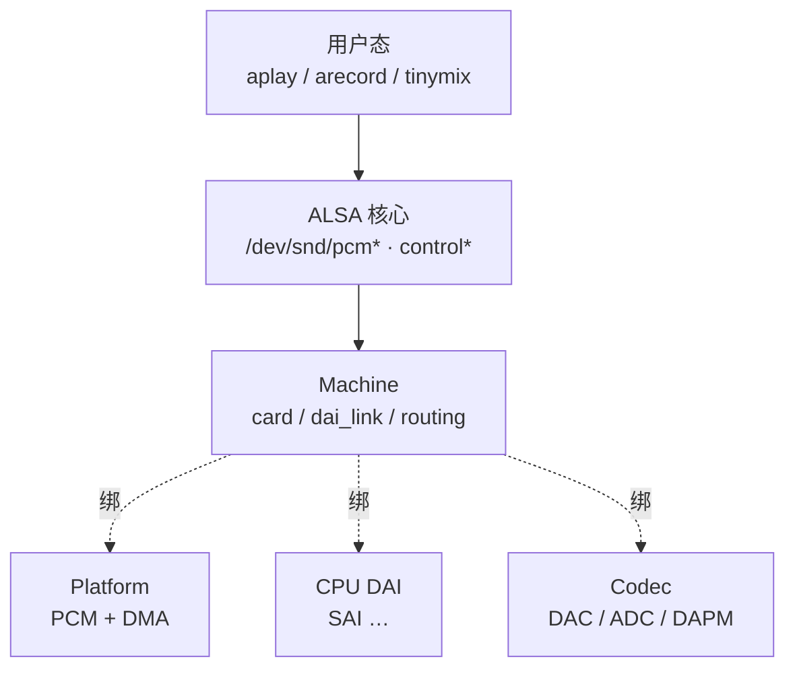

# ASoC 四层架构与 i.MX6ULL 驱动对照

> **平台**：100ask i.MX6ULL Pro（`wm8960-audio`，SAI2 + WM8960）  
> **内核**：NXP BSP **Linux 4.9.88**
> **本文**：ASoC 经典四层各自做什么，以及在本板上对应哪些驱动与设备树节点

---

## 目录

- [1. 本文要回答什么](#1-本文要回答什么)
- [2. ASoC 是什么](#2-asoc-是什么)
- [3. 经典四层与职责](#3-经典四层与职责)
- [4. 分层关系图](#4-分层关系图)
- [5. i.MX6ULL Pro 四层驱动对照](#5-imx6ull-pro-四层驱动对照)
- [6. 设备树如何组织四层](#6-设备树如何组织四层)
  - [6.1 Machine：`sound`](#61-machinesound)
  - [6.2 CPU DAI：`&sai2`](#62-cpu-daisai2)
  - [6.3 Codec：`wm8960@1a`](#63-codecwm89601a)
  - [6.4 Platform](#64-platform)
  - [6.5 内核如何管理这三层](#65-内核如何管理这三层)
  - [6.6 组卡：`soc_bind_dai_link` 与 `rtd`](#66-组卡soc_bind_dai_link-与-rtd)
- [7. Probe 顺序](#7-probe-顺序)
- [8. 小结](#8-小结)
- [附录 A 源码索引](#附录-a-源码索引)
- [附录 B 要点速记](#附录-b-要点速记)

---

## 1. 本文要回答什么

> **ASoC 一般分哪几层？每层做什么？**

---

## 2. ASoC 是什么

嵌入式 SoC 上，声卡往往由「控制器 + 编解码器 + DMA」组成，ASoC（ALSA System on Chip）把这些模块拆成可复用的驱动层，再由 **Machine** 组装声卡。

---

## 3. 经典四层与职责

| 层 | 职责 |
|----|------|
| **Machine** | 板级粘合：解析 DTS、`dai_link`、`audio-routing`、主从与时钟策略、耳机插入等；注册 `snd_soc_card` |
| **Platform** | PCM 设备与 DMA：环形缓冲、period、SDMA / DMA 把内存与 DAI FIFO 对接 |
| **CPU DAI** | SoC 侧数字音频接口：SSI / SAI / I2S 等，配置格式、时钟、触发收发 |
| **Codec** | 编解码器：I2C / SPI 控制、DAC / ADC、DAPM 模拟路由、音量 |

---

## 4. 分层关系图

用户态只看到 ALSA 提供的设备节点；Machine 把 Platform、CPU DAI、Codec 绑成一张声卡。



---

## 5. i.MX6ULL Pro 四层驱动对照

本板声卡名 `wm8960-audio`，CPU DAI 为 **SAI2**，Codec 为 **WM8960**。

| 层 | 本板驱动 | 源文件 | 设备树 / 绑定要点 |
|----|----------|--------|-------------------|
| **Machine** | `imx-wm8960` | `sound/soc/fsl/imx-wm8960.c` | `sound` 节点；`compatible` 匹配 `"fsl,imx-audio-wm8960"` |
| **Platform** | `imx-pcm-dma-v2` | `sound/soc/fsl/imx-pcm-dma-v2.c` | **无独立节点**；`fsl_sai` probe 末尾 `imx_pcm_platform_register()` |
| **CPU DAI** | `fsl_sai` | `sound/soc/fsl/fsl_sai.c` | `&sai2`；SoC 定义在 `imx6ull.dtsi`（`fsl,imx6ul-sai`） |
| **Codec** | `wm8960` | `sound/soc/codecs/wm8960.c` | `wm8960@1a`；`compatible = "wlf,wm8960"` |

辅助头文件：`sound/soc/fsl/fsl_sai.h`、`sound/soc/fsl/imx-pcm.h`。

---

## 6. 设备树如何组织四层

主板文件：`arch/arm/boot/dts/100ask_imx6ull-14x14.dts`（`#include "imx6ull.dtsi"`）。

### 6.1 Machine：`sound`

```txt
sound {
    compatible = "fsl,imx6ul-evk-wm8960",
                 "fsl,imx-audio-wm8960";
    model = "wm8960-audio";
    cpu-dai = <&sai2>;
    audio-codec = <&codec>;
    codec-master;
    gpr = <&gpr 4 0x100000 0x100000>;
    hp-det = <3 0>;          /* 片内 JD3，对应原理图 HPD */
    audio-routing =
        "Headphone Jack", "HP_L",
        "Headphone Jack", "HP_R",
        "Ext Spk", "SPK_LP",
        /* … SPK_LN / SPK_RP / SPK_RN … */
        "RINPUT1", "Main MIC",
        "RINPUT2", "Main MIC",
        "Main MIC", "MICB",
        /* … 其余边见 dts 源文件 … */;
};
```

| 属性 | 作用 |
|------|------|
| `cpu-dai` | 指向 CPU DAI（及 Platform 宿主）`&sai2` |
| `audio-codec` | 指向 Codec `&codec` |
| `codec-master` | WM8960 输出 BCLK / LRCLK，SAI 为 clock slave |
| `model` | 用户可见卡名 |
| `hp-det` | 片内耳机检测脚；本板 `<3 0>` 选 JD3（原理图 `HPD` → `RINPUT3/JD3`） |
| `audio-routing` | 板级端点名（`Headphone Jack`、`Main MIC` 等）接到 Codec 脚名 |

### 6.2 CPU DAI：`&sai2`

`imx6ull.dtsi` 给出 SAI2 的寄存器和 DMA 通道，默认关掉：

```txt
sai2: sai@0202c000 {
    compatible = "fsl,imx6ul-sai",
                 "fsl,imx6sx-sai";
    reg = <0x0202c000 0x4000>;
    dma-names = "rx", "tx";
    dmas = <&sdma 37 24 0>, <&sdma 38 24 0>;
    status = "disabled";
};
```

板级 dts 打开时钟、配好引脚，并启用该节点：

```txt
&sai2 {
    pinctrl-names = "default";
    pinctrl-0 = <&pinctrl_sai2>;
    assigned-clocks = <&clks IMX6UL_CLK_SAI2_SEL>,
                      <&clks IMX6UL_CLK_SAI2>;
    assigned-clock-parents = <&clks IMX6UL_CLK_PLL4_AUDIO_DIV>;
    assigned-clock-rates = <0>, <12288000>;
    status = "okay";
};
```

`sound` 节点用 `cpu-dai` 指向这个设备：

```txt
sound {
    cpu-dai = <&sai2>;
    ...
};
```

Machine 驱动 `imx_wm8960_probe` 读出这个 phandle，找到 SAI 的 platform 设备：

```c
cpu_np = of_parse_phandle(pdev->dev.of_node, "cpu-dai", 0);
cpu_pdev = of_find_device_by_node(cpu_np);
```

`fsl_sai_probe` 末尾把 CPU DAI 登记进 ASoC：

```c
ret = devm_snd_soc_register_component(&pdev->dev, &fsl_component,
                &fsl_sai_dai, 1);
```

传入的 `fsl_sai_dai` 是静态 `snd_soc_dai_driver`；core 据此创建运行时 `snd_soc_dai`（挂链见 [6.5](#65-内核如何管理这三层)）：

```c
static struct snd_soc_dai_driver fsl_sai_dai = {
	.probe = fsl_sai_dai_probe,   /* 绑卡后：复位 SAI、装 DMA 参数 */
	.playback = {                 /* 播放方向能力：通道 / 速率 / 格式 */
		.stream_name = "CPU-Playback",
		.channels_min = 1,
		.channels_max = 32,
		.rate_min = 8000,
		.rate_max = 2822400,
		.rates = SNDRV_PCM_RATE_KNOT,
		.formats = FSL_SAI_FORMATS,
	},
	.capture = {                  /* 录音方向能力，字段含义同 playback */
		.stream_name = "CPU-Capture",
		.channels_min = 1,
		.channels_max = 32,
		.rate_min = 8000,
		.rate_max = 2822400,
		.rates = SNDRV_PCM_RATE_KNOT,
		.formats = FSL_SAI_FORMATS,
	},
	.resume  = fsl_sai_dai_resume, /* 恢复时切回正确 pinctrl 状态 */
	.ops = &fsl_sai_pcm_dai_ops,  /* 见下表：时钟 / 格式 / PCM 回调 */
};
```

`.ops` 指向的 `fsl_sai_pcm_dai_ops`：

```c
static const struct snd_soc_dai_ops fsl_sai_pcm_dai_ops = {
	.set_sysclk   = fsl_sai_set_dai_sysclk,   /* 选 SAI 内部时钟源 / 分频相关 */
	.set_fmt      = fsl_sai_set_dai_fmt,      /* I2S / 主从、极性等总线格式 */
	.set_tdm_slot = fsl_sai_set_dai_tdm_slot, /* TDM 槽数与槽宽 */
	.hw_params    = fsl_sai_hw_params,        /* 按 rate/channels/format 写寄存器 */
	.hw_free      = fsl_sai_hw_free,          /* 释放本流占用的 SAI 配置 */
	.trigger      = fsl_sai_trigger,          /* start/stop：开停 TX/RX */
	.startup      = fsl_sai_startup,          /* open 时约束与准备 */
	.shutdown     = fsl_sai_shutdown,         /* close 时清理流状态 */
};
```

同一 probe 里随后 `imx_pcm_platform_register()` 挂上 Platform（见 [6.4](#64-platform)）。

### 6.3 Codec：`wm8960@1a`

```txt
codec: wm8960@1a {
    compatible = "wlf,wm8960";
    reg = <0x1a>;
    clocks = <&clks IMX6UL_CLK_SAI2>;
    clock-names = "mclk";
    wlf,shared-lrclk;
};
```

`sound` 里 `audio-codec = <&codec>`，Machine 组卡时通过该 phandle 找到 Codec 芯片。`wm8960_i2c_probe` 把 Codec 注册进 ASoC：

```c
ret = snd_soc_register_codec(&i2c->dev,
                &soc_codec_dev_wm8960, &wm8960_dai, 1);
```

`wm8960_dai` 是 Codec 侧静态 `snd_soc_dai_driver`，core 据此建运行时 Codec DAI（挂链见 [6.5](#65-内核如何管理这三层)）：

```c
static struct snd_soc_dai_driver wm8960_dai = {
	.name = "wm8960-hifi",        /* dai_link 匹配用的 Codec DAI 名 */
	.playback = {                 /* 播放方向能力 */
		.stream_name = "Playback",
		.channels_min = 1,
		.channels_max = 2,
		.rates = WM8960_RATES,
		.formats = WM8960_FORMATS,
	},
	.capture = {                  /* 录音方向能力 */
		.stream_name = "Capture",
		.channels_min = 1,
		.channels_max = 2,
		.rates = WM8960_RATES,
		.formats = WM8960_FORMATS,
	},
	.ops = &wm8960_dai_ops,       /* 见下：格式 / 时钟 / mute */
	.symmetric_rates = 1,         /* 录放共用同一采样率 */
};
```

`.ops` 指向的 `wm8960_dai_ops`：

```c
static const struct snd_soc_dai_ops wm8960_dai_ops = {
	.hw_params    = wm8960_hw_params,      /* 按 rate/format 配接口与分频 */
	.hw_free      = wm8960_hw_free,        /* 释放本流相关配置 */
	.digital_mute = wm8960_mute,           /* DAC 数字静音，减切换爆音 */
	.set_fmt      = wm8960_set_dai_fmt,    /* I2S / 主从等（与 SAI 对齐） */
	.set_clkdiv   = wm8960_set_dai_clkdiv, /* 各类分频寄存器 */
	.set_pll      = wm8960_set_dai_pll,    /* 片内 PLL */
	.set_sysclk   = wm8960_set_dai_sysclk, /* 系统时钟源选择 */
};
```

### 6.4 Platform

DTS 没有专门配置 Platform 层的节点。DMA 通道写在 [§6.2](#62-cpu-daisai2) 的 `sai2` 节点上。

Platform 在 `fsl_sai_probe` 末尾、与 CPU DAI **同一次 probe、同一个 `pdev->dev`** 上注册：

```c
if (sai->soc->imx)
        return imx_pcm_platform_register(&pdev->dev);
```

```c
int imx_pcm_platform_register(struct device *dev)
{
        return devm_snd_soc_register_platform(dev, &imx_soc_platform);
}
```

### 6.5 内核如何管理这三层

这里的「三层」指 `dai_link` 上的 **CPU DAI、Codec、Platform**（Machine 是 `snd_soc_card`，另论）。注册入口不同，ASoC core（`sound/soc/soc-core.c`）用链表把运行时对象管起来，Machine 组卡时再按设备和名字匹配。

| 层 | 注册入口（本板） | 运行时对象 |
|----|------------------|------------|
| **CPU DAI** | `snd_soc_register_component`（`fsl_sai`） | `snd_soc_dai` |
| **Codec** | `snd_soc_register_codec`（`wm8960`） | `snd_soc_codec` + Codec DAI |
| **Platform** | `snd_soc_register_platform`（`imx_pcm_platform_register`） | `snd_soc_platform` |

三层注册调用栈（本板路径）：

```text
CPU DAI
  fsl_sai_probe
    → devm_snd_soc_register_component          /* soc-devres.c */
        → snd_soc_register_component           /* soc-core.c */
            → snd_soc_component_initialize
            → snd_soc_register_dais
            │     → soc_add_dai
            │           → list_add(&dai->list, &component->dai_list)
            │           → component->num_dai++
            → snd_soc_component_add
                  → list_add(&component->list, &component_list)

Codec
  wm8960_i2c_probe
    → snd_soc_register_codec                   /* soc-core.c */
        → snd_soc_component_initialize（codec->component）
        → snd_soc_register_dais
        │     → soc_add_dai
        │           → list_add(..., &codec->component.dai_list)
        → snd_soc_component_add_unlocked
        → list_add(&codec->list, &codec_list)

Platform
  fsl_sai_probe
    → imx_pcm_platform_register                /* imx-pcm-dma-v2.c */
        → devm_snd_soc_register_platform       /* soc-devres.c */
            → snd_soc_register_platform        /* soc-core.c */
                → snd_soc_add_platform
                      → snd_soc_component_initialize（platform->component）
                      → snd_soc_component_add_unlocked → component_list
                      → list_add(&platform->list, &platform_list)
```

### 6.6 组卡：`soc_bind_dai_link` 与 `rtd`

Machine 把「CPU DAI、Codec、Platform 怎么接」写成 `snd_soc_dai_link` 数组。本板在 `imx-wm8960.c`：

```c
static struct snd_soc_dai_link imx_wm8960_dai[] = {
	{
		.name = "HiFi",
		.stream_name = "HiFi",
		.codec_dai_name = "wm8960-hifi",
		.ops = &imx_hifi_ops,
	},
	/* [1] HiFi-ASRC-FE、[2] HiFi-ASRC-BE */
};
```

数组只写了名字和 Codec DAI 名。`imx_wm8960_probe` 把 [§6.2](#62-cpu-daisai2) 解析到的节点填进 `imx_wm8960_dai[0]`，再把数组挂到 card 上：

```c
data->card.dai_link = imx_wm8960_dai;

imx_wm8960_dai[0].codec_of_node = codec_np;              /* &codec */
imx_wm8960_dai[0].cpu_dai_name = dev_name(&cpu_pdev->dev); /* SAI 设备名 */
imx_wm8960_dai[0].platform_of_node = cpu_np;             /* &sai2 */
```

三层登记进链表之后，`devm_snd_soc_register_card` → `snd_soc_instantiate_card` 按 `num_links` 循环，每一条 `dai_link` 绑一次：

```c
/* snd_soc_instantiate_card */
for (i = 0; i < card->num_links; i++) {
        ret = soc_bind_dai_link(card, &card->dai_link[i]);
        if (ret != 0)
                goto base_error;
}
```

**一条 `dai_link` 对应一个 `rtd`（`struct snd_soc_pcm_runtime`）**。`rtd` 是该 link 的运行时上下文：挂上已匹配的 `cpu_dai` / `codec_dai` / `platform`，以及稍后创建的 `snd_pcm`；PCM 回调经 `rtd` 找到各层。

`soc_bind_dai_link` 对单条 link 做的事：

```text
soc_bind_dai_link(card, dai_link)
  │
  ├─ 已绑定则返回
  ├─ soc_new_pcm_runtime → 分配 rtd
  ├─ snd_soc_find_dai（CPU）     → rtd->cpu_dai
  ├─ snd_soc_find_dai（各 Codec） → rtd->codec_dais[] / codec_dai / codec
  ├─ 遍历 platform_list
  │     按 platform_of_node（或名字）匹配 → rtd->platform
  └─ soc_add_pcm_runtime
        → list_add_tail(&rtd->list, &card->rtd_list)
```

任一层尚未注册，返回 **`-EPROBE_DEFER`**：释放本次 `rtd`，Machine probe 延后重试。
---

## 7. Probe 顺序

```text
开机 OF 枚举
  │
  ├─ i2c2 + wm8960@1a
  │     wm8960_i2c_probe
  │       → snd_soc_register_codec（DAI 名 wm8960-hifi）
  │
  ├─ sai@…（SAI2）
  │     fsl_sai_probe
  │       → snd_soc_register_component（CPU DAI）
  │       → imx_pcm_platform_register（Platform）
  │
  └─ platform「sound」（imx-wm8960）
        imx_wm8960_probe
          → 解析 cpu-dai / audio-codec / routing
          → snd_soc_register_card（wm8960-audio）
               → instantiate_card → soc_bind_dai_link（见 [6.6](#66-组卡soc_bind_dai_link-与-rtd)）
```

Machine 若早于 Codec / SAI 就绪，`soc_bind_dai_link` 返回 `-EPROBE_DEFER`，属正常现象。

---

## 8. 小结

- ASoC 经典 **四层** 架构：Machine（组卡）、Platform（PCM/DMA）、CPU DAI（数字音频接口）、Codec（编解码）。
- 本板对应：`imx-wm8960.c` / `imx-pcm-dma-v2.c` / `fsl_sai.c` / `wm8960.c`。
- DTS 用 `sound` 的 phandle 把 SAI 与 WM8960 绑在一起；Platform 挂在 SAI 上注册，无单独节点。


---

## 附录 A 源码索引

| 文件 | 层 / 角色 |
|------|-----------|
| `sound/soc/fsl/imx-wm8960.c` | Machine |
| `sound/soc/fsl/imx-pcm-dma-v2.c` | Platform（本板 SAI） |
| `sound/soc/fsl/fsl_sai.c` | CPU DAI |
| `sound/soc/codecs/wm8960.c` | Codec |
| `arch/arm/boot/dts/100ask_imx6ull-14x14.dts` | 板级 `sound` / `wm8960` / `&sai2` |
| `arch/arm/boot/dts/imx6ull.dtsi` | SAI 控制器定义 |
| `Documentation/devicetree/bindings/sound/imx-audio-wm8960.txt` | Machine 绑定说明 |
| `Documentation/devicetree/bindings/sound/fsl-sai.txt` | SAI 绑定说明 |

---

## 附录 B 要点速记

1. 四层职责：组卡 / 搬数 / 数字口 / 编解码。  
2. imx6ull Pro 板：Machine=`imx-wm8960`，Platform=`imx-pcm-dma-v2`，CPU DAI=`fsl_sai`（SAI2），Codec=`wm8960`。  
3. Platform 无 DTS 节点；随 SAI probe 注册。  
