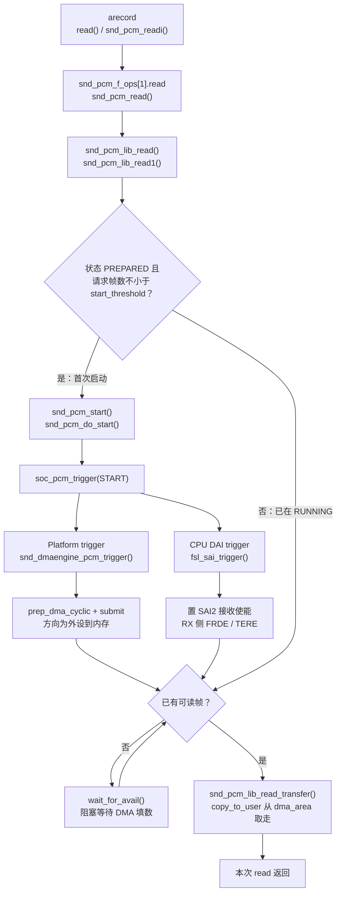
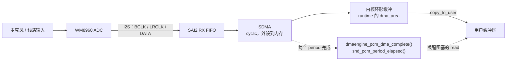

# i.MX6ULL 声卡录音路径

> **平台**：100ask i.MX6ULL Pro
> **内核**：NXP BSP **Linux 4.9.88**
> **本文**：`arecord` 录音的分层路径、HiFi（`pcmC0D0c`）内核调用栈，以及 prepare 上电、close 断电

---

## 目录

- [1. 本文要回答什么](#1-本文要回答什么)
- [2. 七层概览](#2-七层概览)
- [3. 录音内核调用栈](#3-录音内核调用栈)
  - [3.1 open](#31-open打开设备)
  - [3.2 hw_params](#32-hw_paramsioctl与播放共用-machine)
  - [3.3 prepare](#33-prepare模拟通路上电)
  - [3.4 read + 首次 start](#34-read--首次-start数据期主路径)
  - [3.5 period 完成回调](#35-period-完成回调异步唤醒阻塞的-read)
  - [3.6 对照简图](#36-对照简图)
  - [3.7 close](#37-close停-dma-与模拟断电)
- [4. 分层流程图](#4-分层流程图)
- [5. 简化分层与源文件](#5-简化分层与源文件)
- [6. 小结](#6-小结)

---

## 1. 本文要回答什么

> `arecord -D hw:0,0` 录音时，PCM 如何从 codec ADC 进到用户态？

本文以 **HiFi / `pcmC0D0c`** 为例。

录音可以看成：硬件按采样率把 ADC 采样搬进内核环形缓冲，应用用 `read()` 取走。ALSA PCM / ASoC / dmaengine 框架与播放共用，差异主要在**数据方向**与 **RX 侧使能**。

模拟输入选哪路麦、左右声道是否都有信号，取决于板级接线与 Codec DAPM。本板：耳机麦进 **LINPUT1**，板载麦克风进 **RINPUT1 / RINPUT2**（见 [DAPM 路由 §5.3](/analysis/kernel/sound/wm8960-dapm-routes#53-本板原理图与脚位)）。

---

## 2. 七层概览

1. **应用层**  
   `arecord` 等录音程序打开声卡，设好采样率 / 通道 / 格式，再不断从设备读出 PCM 样本。

2. **ALSA 设备接口**  
   用户态打开的是 `/dev/snd/pcmC0D0c`。内核在这里接收「设参数、准备、开始」等控制，以及后续的读数据；prepare 完成后模拟通路已上电，PCM 进入可录状态。

3. **ALSA PCM 核心**  
   管理内存环形缓冲区：DMA 往里填数，应用往外取；缓冲空了就让读阻塞等待；读请求达到启动阈值后，正式开始录音（常为一读即启动）。

4. **ASoC 汇总**  
   收到「开始」后，按 Codec → Platform → CPU DAI → Machine 的顺序通知各层。

5. **DMA**  
   配置并启动 SDMA：按 period 把 SAI2 RX FIFO 里的 PCM 搬进环形缓冲。搬完一段就回调，唤醒还在等数据的读操作。

6. **CPU DAI / Codec**  
   SAI 打开接收，经 I2S 收下 WM8960 ADC 送来的数字音频；麦侧模拟经 ADC 变成数字。ADC、输入 PGA 等在 prepare 时已上电，这里主要是打开 SAI 接收。

7. **硬件数据通路**

```text
麦/线路 ──► WM8960 ADC ──I2S──► SAI2 RX FIFO ──SDMA──► 内存环形缓冲 ──read──► 应用
```

节奏仍由采样率 / I2S 时钟决定；缓冲空时阻塞 `read` 等待 DMA 填数据。

---

## 3. 录音内核调用栈

以 `arecord -D hw:0,0` 为例。先 open、设参数、prepare，再进入 read 取数；和播放同属配置期，只是方向为 capture。

### 3.1 open（打开设备）

```text
sys_open("/dev/snd/pcmC0D0c")
  → snd_open → replace_fops → snd_pcm_f_ops[1]
  → snd_pcm_capture_open                          // sound/core/pcm_native.c
      → snd_pcm_open(..., CAPTURE)
          → substream->ops->open
              → soc_pcm_open
                  → fsl_sai_startup               // CPU DAI
                  → imx_pcm_open                  // Platform（RX / SDMA）
                  → imx_hifi_startup              // Machine
```

### 3.2 hw_params（ioctl，与播放共用 Machine）

```text
sys_ioctl(SNDRV_PCM_IOCTL_HW_PARAMS)
  → snd_pcm_capture_ioctl → … → soc_pcm_hw_params
      → imx_hifi_hw_params / fsl_sai_hw_params / wm8960_hw_params
```

格式、采样率、主从时钟在此配置；本板仍是 codec 输出 BCLK/FSYNC、SAI 作为从设备。播录共用一套 I2S 时钟时，Machine 里常有「另一方向已在用则跳过改时钟」的逻辑。参数设完，PCM 进入 `SETUP`。接下来 `arecord` 会做 prepare。

### 3.3 prepare（模拟通路上电）

```text
sys_ioctl(SNDRV_PCM_IOCTL_PREPARE)
  → snd_pcm_capture_ioctl
      → snd_pcm_prepare                            // sound/core/pcm_native.c
          → snd_pcm_do_prepare
              → substream->ops->prepare
                  → soc_pcm_prepare                // sound/soc/soc-pcm.c
                      → machine / platform / codec / cpu 的 .prepare
                      → snd_soc_dapm_stream_event(..., STREAM_START)
                      → snd_soc_dai_digital_mute(..., 0)   // 解除数字静音
          → snd_pcm_post_prepare                   // 状态 → PREPARED
```

`arecord` 设完采样率之后同样会再做一次 prepare，PCM 从 `SETUP` 进入 `PREPARED`。

和播放走同一个 `soc_pcm_prepare`，本板同样没有各层自己的 prepare 函数。录音时这条 DAI 在图上是音频入口。麦到 ADC 的开关已经打开的话，ADC、输入 PGA 在这一步上电。

### 3.4 read + 首次 start（数据期主路径）

```text
sys_read(pcmC0D0c, buf, len)
  → snd_pcm_f_ops[1].read = snd_pcm_read          // sound/core/pcm_native.c
      → snd_pcm_lib_read                          // sound/core/pcm_lib.c
          → snd_pcm_lib_read1
              → 若 PREPARED 且 size >= start_threshold:
                    snd_pcm_start
                      → snd_pcm_do_start
                          → ops->trigger(START)
                              → soc_pcm_trigger
                                  → platform: snd_dmaengine_pcm_trigger
                                      → prep_dma_cyclic + issue_pending
                                      → 方向: DMA_DEV_TO_MEM（SAI RX → 内存）
                                  → cpu_dai: fsl_sai_trigger
                                      → tx=false → 开 RX 侧 FRDE/TERE
              → 无 avail 则 wait_for_avail
              → snd_pcm_lib_read_transfer
                  → copy_to_user ← runtime->dma_area
```

与播放的关键差别：

- 启动条件在 **`read` 侧**（`snd_pcm_lib_read1`），不是 `write`  
- 传输是 **`copy_to_user`**，不是 `copy_from_user`  
- DMA 是 **设备到内存**；SAI 使能的是 **RX**（`FSL_SAI_xCSR(false, …)`）

### 3.5 period 完成回调（异步，唤醒阻塞的 read）

```text
SDMA period 完成
  → dmaengine_pcm_dma_complete    // sound/core/pcm_dmaengine.c（本板 imx-pcm-dma-v2）
      → snd_pcm_period_elapsed
          → 更新硬件指针 / 唤醒 wait_for_avail 中的读端
```

与播放同一回调路径，只是唤醒的是 `read` 等待者。

### 3.6 对照简图

```text
配置期:
  open → hw_params → prepare
    prepare: soc_pcm_prepare → STREAM_START（模拟上电）→ PREPARED

read:
  snd_pcm_read
    → snd_pcm_lib_read1
        → [首次] snd_pcm_start
              → soc_pcm_trigger
                  → snd_dmaengine_pcm_trigger → SDMA (DEV_TO_MEM)
                  → fsl_sai_trigger           → SAI2 RX
        → copy_to_user(dma_area → 用户缓冲)

异步反馈:
  SDMA → dmaengine_pcm_dma_complete → period_elapsed → 唤醒 read

退出:
  drop → trigger(STOP) 停 DMA/SAI RX
  close → soc_pcm_close → STREAM_STOP（马上断电）
```

### 3.7 close（停 DMA 与模拟断电）

`arecord` 结束时，内核同样先停 DMA/SAI，再进 `soc_pcm_close`。

```text
soc_pcm_close
  → fsl_sai_shutdown / imx_hifi_shutdown
  → platform close（释放 SDMA 通道）
  → snd_soc_dapm_stream_event(..., STREAM_STOP)   // 马上断电
```

录音在 `soc_pcm_close` 里马上发出 `STREAM_STOP`，ADC 和麦偏置立刻断电。播放默认再等 5 秒。

---

## 4. 分层流程图

### 4.1 调用流程（软件，一次 `read`）



### 4.2 数据通路（硬件）



---

## 5. 简化分层与源文件

```text
应用层      arecord / read(PCM)
   ↓
ALSA fops   snd_pcm_read / ioctl
   ↓
PCM 核心    空则 wait；够阈值则 start；copy_to_user
   ↓
ASoC        prepare：STREAM_START（模拟上电）
            trigger：soc_pcm_trigger
   ├─ Platform : SDMA DEV_TO_MEM
   └─ CPU DAI  : SAI2 打开接收
   ↓
硬件        麦 ──► ADC ──I2S──► SAI RX ──SDMA──► 内存 ──► 应用
```

| 层级 | 文件 |
|------|------|
| capture fops / start | `sound/core/pcm_native.c` |
| read / 环形缓冲 | `sound/core/pcm_lib.c` |
| ASoC prepare / trigger / close | `sound/soc/soc-pcm.c` |
| DMA 方向 | `sound/core/pcm_dmaengine.c`（`DMA_DEV_TO_MEM`；Platform 为 `imx-pcm-dma-v2`） |
| SAI RX | `sound/soc/fsl/fsl_sai.c` — `fsl_sai_trigger` |
| Machine / Codec | `imx-wm8960.c`、`wm8960.c`（与播放共用；输入路由另见 DAPM） |

---

## 6. 小结

- 录音与播放共用 ASoC / dmaengine / SAI 驱动入口，差别在 **fops 下标、读写方向、DMA 方向、SAI TX/RX**。  
- 首次启动常发生在 **`read` 且请求帧数 ≥ `start_threshold`**，之后阻塞等待 DMA 填满可读区域。  
- prepare 时调用 `STREAM_START`，给 ADC 一侧上电；第一次 `read` 里的 `trigger(START)` 打开 DMA 和 SAI 接收。关掉录音后马上断电。  
