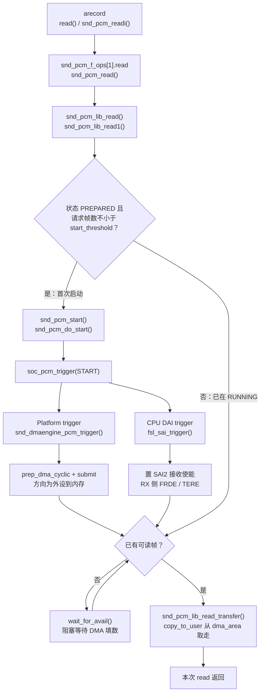
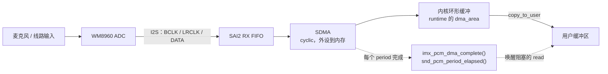

# i.MX6ULL 声卡录音路径

> **平台**：100ask i.MX6ULL Pro（SAI2 + WM8960）作对照实例  
> **内核**：NXP BSP **Linux 4.9.88**；ALSA / ASoC 调用链与主流内核同构，换板时改的主要是 Machine / Codec / 模拟路由  
> **关联**：[播放路径](/analysis/kernel/sound/imx6ull-audio-playback-flow) · [`/dev/snd` 设备节点](/analysis/kernel/sound/imx6ull-snd-devices) · [PCM 状态机与 XRUN](/analysis/kernel/sound/alsa-pcm-state-xrun)  
> **本文**：`arecord` 录音的分层路径、HiFi（`pcmC0D0c`）内核调用栈，以及与播放的对称差异

---

## 目录

- [1. 本文要回答什么](#1-本文要回答什么)
- [2. 与播放的对称关系](#2-与播放的对称关系)
- [3. 七层概览](#3-七层概览)
- [4. 录音内核调用栈](#4-录音内核调用栈hifi--pcmc0d0c)
- [5. 分层流程图](#5-分层流程图)
- [6. 简化分层与源文件](#6-简化分层与源文件)
- [7. 小结](#7-小结)

---

## 1. 本文要回答什么

> **一次 `arecord -D hw:0,0`，PCM 如何从 codec ADC 进到用户态？和播放比，内核里哪些地方对称、哪些方向相反？**

设备节点见 [`/dev/snd` 设备节点](/analysis/kernel/sound/imx6ull-snd-devices)；播放热路径见 [声卡播放路径](/analysis/kernel/sound/imx6ull-audio-playback-flow)。本文以 **HiFi / `pcmC0D0c`** 为准。

录音可以看成：硬件按采样率把 ADC 采样搬进内核环形缓冲，应用用 `read()` 取走。ALSA PCM / ASoC / dmaengine 框架与播放共用，差异主要在**数据方向**与 **RX 侧使能**。

模拟输入选哪路麦、左右声道是否都有信号，取决于 Codec DAPM / `audio-routing` 与板级接线，属于板级配置，本文不展开；框架路径换板仍可对照。

---

## 2. 与播放的对称关系

| 项目 | 播放（`pcmC0D0p`） | 录音（`pcmC0D0c`） |
|------|--------------------|--------------------|
| 字符设备 fops | `snd_pcm_f_ops[0]` | `snd_pcm_f_ops[1]` |
| 用户态 I/O | `write` / `copy_from_user` | `read` / `copy_to_user` |
| 环形缓冲角色 | 应用填、DMA 消费 | DMA 填、应用消费 |
| 首次 start | 写够 `start_threshold` | 读请求 ≥ `start_threshold`（常为 1，一读即 start） |
| DMA 方向 | `DMA_MEM_TO_DEV` | `DMA_DEV_TO_MEM` |
| SAI | TX FIFO / 发送使能 | RX FIFO / 接收使能（`xCSR` 用 `tx=false`） |
| Codec | DAC → 耳机/喇叭 | 麦 → ADC → I2S |

`soc_pcm_trigger`、`snd_dmaengine_pcm_trigger`、`fsl_sai_trigger` **同一套函数**，靠 `substream->stream` 区分方向。

---

## 3. 七层概览

1. **应用层**  
   `arecord` 等通过 ALSA 库 `read()` / `snd_pcm_readi()` 取 PCM；采样率等仍走 `ioctl`。

2. **ALSA 设备接口**  
   `/dev/snd/pcmC0D0c` → `snd_pcm_f_ops[1]`：`read` → `snd_pcm_read()`，`ioctl` 仍负责 `hw_params` / `prepare` / `start`。

3. **ALSA PCM 核心**  
   `snd_pcm_lib_read()` → `snd_pcm_lib_read1()`：  
   - 若状态为 `PREPARED` 且本次请求帧数 ≥ `start_threshold`，先 `snd_pcm_start()`  
   - 无数据则 `wait_for_avail` 阻塞  
   - 有数据则 `copy_to_user` 从 `dma_area` 拷出

4. **ASoC 汇总**  
   `snd_pcm_start()` → `soc_pcm_trigger(START)`：Codec → Platform(DMA) → CPU DAI(SAI)。有效的仍是 DMA 与 SAI RX。

5. **DMA 平台**  
   `snd_dmaengine_pcm_trigger()` 配 **DEV_TO_MEM** cyclic DMA：SAI RX FIFO → 内存。period 完成回调唤醒阻塞的 `read`。

6. **CPU DAI / Codec**  
   `fsl_sai_trigger()` 对 RX 置 `FRDE` / `TERE` 等；WM8960 ADC 经 I2S 送出数字音频（具体输入脚由 DAPM 决定）。

7. **硬件数据通路**

```text
麦/线路 ──► WM8960 ADC ──I2S──► SAI2 RX FIFO ──SDMA──► 内存环形缓冲 ──read──► 应用
```

节奏仍由采样率 / I2S 时钟决定；缓冲空时阻塞 `read` 等待 DMA 填数。

---

## 4. 录音内核调用栈（HiFi / `pcmC0D0c`）

以 `arecord -D hw:0,0` 为例。open / hw_params 与播放同属配置期，仅 stream 为 capture。

### 4.1 open（打开设备）

```text
sys_open("/dev/snd/pcmC0D0c")
  → snd_open → replace_fops → snd_pcm_f_ops[1]
  → snd_pcm_capture_open                          // sound/core/pcm_native.c
      → snd_pcm_open(..., CAPTURE)
          → substream->ops->open
              → soc_pcm_open
                  → fsl_sai_startup               // CPU DAI
                  → dmaengine_pcm_open            // 申请 RX DMA 通道
                  → imx_hifi_startup              // Machine
```

### 4.2 hw_params（ioctl，与播放共用 Machine）

```text
sys_ioctl(SNDRV_PCM_IOCTL_HW_PARAMS)
  → snd_pcm_capture_ioctl → … → soc_pcm_hw_params
      → imx_hifi_hw_params / fsl_sai_hw_params / wm8960_hw_params
```

格式、采样率、主从时钟在此配置；本板仍是 codec 出 BCLK/FSYNC、SAI 从。播录共用一套 I2S 时钟时，Machine 里常有「另一方向已在用则跳过改时钟」的逻辑。

### 4.3 read + 首次 start（数据期主路径）

```text
sys_read(pcmC0D0c, buf, len)
  → snd_pcm_f_ops[1].read = snd_pcm_read          // sound/core/pcm_native.c
      → snd_pcm_lib_read                          // sound/core/pcm_lib.c
          → snd_pcm_lib_read1
              → 若 PREPARED 且 size >= start_threshold:
                    snd_pcm_start
                      → snd_pcm_do_start
                          → ops->trigger(START)
                              → soc_pcm_trigger
                                  → platform: snd_dmaengine_pcm_trigger
                                      → prep_dma_cyclic + issue_pending
                                      → 方向: DMA_DEV_TO_MEM（SAI RX → 内存）
                                  → cpu_dai: fsl_sai_trigger
                                      → tx=false → 开 RX 侧 FRDE/TERE
              → 无 avail 则 wait_for_avail
              → snd_pcm_lib_read_transfer
                  → copy_to_user ← runtime->dma_area
```

与播放的关键差别：

- 启动条件在 **`read` 侧**（`snd_pcm_lib_read1`），不是 `write`  
- 传输是 **`copy_to_user`**，不是 `copy_from_user`  
- DMA 是 **设备到内存**；SAI 使能的是 **RX**（`FSL_SAI_xCSR(false, …)`）

### 4.4 period 完成回调（异步，唤醒阻塞的 read）

```text
SDMA period 完成
  → imx_pcm_dma_complete
      → snd_pcm_period_elapsed
          → 更新硬件指针 / 唤醒 wait_for_avail 中的读端
```

与播放同一回调路径，只是唤醒的是 `read` 等待者。

### 4.5 对照简图

```text
read 热路径:
  snd_pcm_read
    → snd_pcm_lib_read1
        → [首次] snd_pcm_start
              → soc_pcm_trigger
                  → snd_dmaengine_pcm_trigger → SDMA (DEV_TO_MEM)
                  → fsl_sai_trigger           → SAI2 RX
        → copy_to_user(dma_area → 用户缓冲)

异步反馈:
  SDMA → imx_pcm_dma_complete → period_elapsed → 唤醒 read
```

---

## 5. 分层流程图

与播放文同样分成两张：软件调用链、硬件数据通路。注意与播放相比，判断启动的位置在**取数之前**，数据方向也相反。

### 5.1 调用流程（软件，一次 `read`）



### 5.2 数据通路（硬件）



---

## 6. 简化分层与源文件

```text
应用层      arecord / read(PCM)
   ↓
ALSA fops   snd_pcm_read / ioctl
   ↓
PCM 核心    空则 wait；够阈值则 start；copy_to_user
   ↓
ASoC        soc_pcm_trigger
   ├─ Platform : SDMA DEV_TO_MEM
   └─ CPU DAI  : SAI2 打开接收
   ↓
硬件        麦 ──► ADC ──I2S──► SAI RX ──SDMA──► 内存 ──► 应用
```

| 层级 | 文件 |
|------|------|
| capture fops / start | `sound/core/pcm_native.c` |
| read / 环形缓冲 | `sound/core/pcm_lib.c` |
| ASoC trigger | `sound/soc/soc-pcm.c` |
| DMA 方向 | `sound/core/pcm_dmaengine.c`（`DMA_DEV_TO_MEM`） |
| SAI RX | `sound/soc/fsl/fsl_sai.c` — `fsl_sai_trigger` |
| Machine / Codec | `imx-wm8960.c`、`wm8960.c`（与播放共用；输入路由另见 DAPM） |

---

## 7. 小结

- 录音与播放共用 ASoC / dmaengine / SAI 驱动入口，差别在 **fops 下标、读写方向、DMA 方向、SAI TX/RX**。  
- 首次启动常发生在 **`read` 且请求帧数 ≥ `start_threshold`**，之后阻塞等待 DMA 填满可读区域。  
- 换板时优先复用本文调用链；麦通路、声道有无声属于 Codec 路由与硬件，宜单独对照 `audio-routing` / DAPM，不必和 PCM 热路径绑死。
