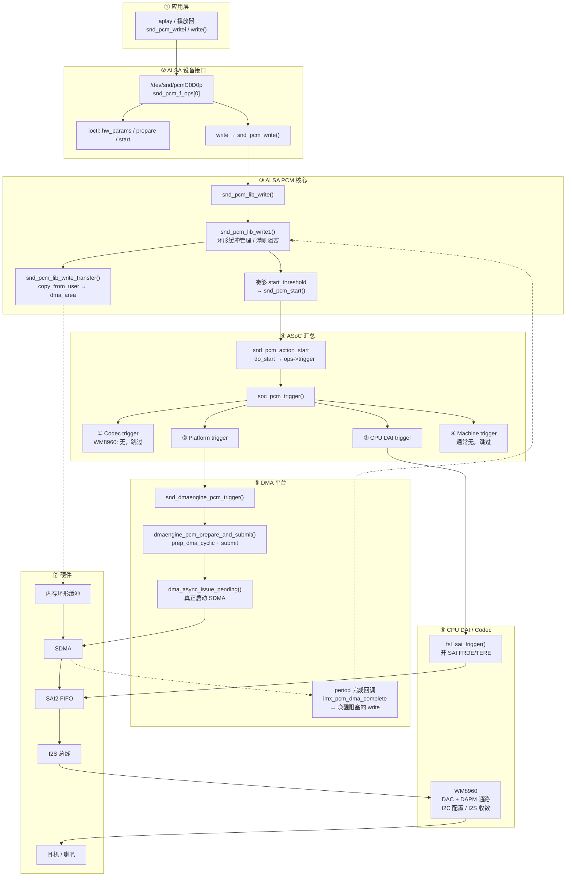

# i.MX6ULL 声卡播放路径

> **平台**：100ask i.MX6ULL Pro（SAI2 + WM8960）  
> **内核**：NXP BSP **Linux 4.9.88**（`imx-wm8960` / `fsl_sai` / `imx-pcm-dma` / `wm8960`）；与站点多数 6.8 文路径不同，差异处另行注明  
> **关联**：[`/dev/snd` 设备节点](/analysis/kernel/sound/imx6ull-snd-devices)  
> **本文**：`aplay` 播放的七层路径、HiFi（`pcmC0D0p`）内核调用栈、关键源文件

---

## 目录

- [1. 本文要回答什么](#1-本文要回答什么)
- [2. 七层概览](#2-七层概览)
- [3. 播放内核调用栈](#3-播放内核调用栈hifi--pcmc0d0p)
- [4. 分层流程图](#4-分层流程图)
- [5. 简化分层与源文件](#5-简化分层与源文件)
- [6. 小结](#6-小结)

---

## 1. 本文要回答什么

> **一次 `aplay -D hw:0,0`，PCM 如何从用户态写到耳机/喇叭？内核调用栈经过哪些函数？**

设备节点与 `dai_link` 含义见 [`/dev/snd` 设备节点](/analysis/kernel/sound/imx6ull-snd-devices)。本文以 **HiFi / `pcmC0D0p`** 直连通路为准。

一次播放可以看成：软件把 PCM 送进内核环形缓冲，硬件按采样率把数据搬出去变成声音。

---

## 2. 七层概览

1. **应用层**  
   播放器用 ALSA 库打开声卡，通过 `write()` / `snd_pcm_writei()` 连续写入 PCM 数据。控制参数（采样率、通道、格式）走 `ioctl`。

2. **ALSA 设备接口**  
   用户态落到 `/dev/snd/pcmC0D0p`，对应内核 `snd_pcm_f_ops[0]`：`write` 进 `snd_pcm_write()`，`ioctl` 负责 `hw_params` / `prepare` / `start` 等。

3. **ALSA PCM 核心**  
   `snd_pcm_lib_write()` → `snd_pcm_lib_write1()` 管理环形缓冲：  
   - `copy_from_user` 把用户 PCM 拷到 `dma_area`  
   - 缓冲满了，阻塞 `write` 会等待  
   - 第一次写够 `start_threshold` 后调用 `snd_pcm_start()` 启动播放

4. **ASoC 汇总**  
   `snd_pcm_start()` 最终进入 `soc_pcm_trigger()`，按顺序通知：  
   Codec → Platform(DMA) → CPU DAI(SAI) → Machine。  
   本板 WM8960 无 codec trigger，Machine 一般也无；真正有效的是 DMA 和 SAI。

5. **DMA 平台**  
   `snd_dmaengine_pcm_trigger()` 准备 cyclic DMA 描述符并 `issue_pending`，SDMA 开始把内存中的 PCM 搬到 SAI2 FIFO。每个 period 完成会回调，唤醒阻塞中的 `write`。

6. **CPU DAI / Codec**  
   `fsl_sai_trigger()` 打开 SAI 发送（FRDE/TERE 等）；WM8960 通过 I2S 收数字音频，DAC 转成模拟，再经 DAPM 路由到耳机或喇叭。

7. **硬件数据通路**

```text
内存环形缓冲 ──SDMA──► SAI2 FIFO ──I2S──► WM8960 DAC ──► 耳机/喇叭
```

播放节奏由采样率和 I2S 时钟决定；应用写得再快也会被环形缓冲反压住。

---

## 3. 播放内核调用栈（HiFi / `pcmC0D0p`）

下面以 `aplay -D hw:0,0` 直连通路为例。配置期（open / hw_params）和数据期（write / start）分开列出。

### 3.1 open（打开设备）

```text
sys_open("/dev/snd/pcmC0D0p")
  → snd_fops.open = snd_open                          // sound/core/sound.c
      → replace_fops → snd_pcm_f_ops[0]
      → snd_pcm_playback_open                         // sound/core/pcm_native.c
          → snd_pcm_open(..., PLAYBACK)
              → snd_pcm_open_file
                  → snd_pcm_open_substream
                      → substream->ops->open
                          → soc_pcm_open              // sound/soc/soc-pcm.c
                              → fsl_sai_startup       // CPU DAI
                              → dmaengine_pcm_open    // Platform / DMA 通道
                              → imx_hifi_startup      // Machine
```

此阶段主要占设备、加约束、申请 DMA 通道；一般不启动传输。

### 3.2 hw_params（配置参数，ioctl）

```text
sys_ioctl(SNDRV_PCM_IOCTL_HW_PARAMS)
  → snd_pcm_playback_ioctl
      → snd_pcm_common_ioctl1 / hw_params 处理
          → substream->ops->hw_params
              → soc_pcm_hw_params                     // sound/soc/soc-pcm.c
                  → codec/cpu/platform/machine hw_params
                      → imx_hifi_hw_params            // 设 I2S 格式、主从、PLL
                      → fsl_sai_hw_params
                      → wm8960_hw_params
```

此阶段配置采样率、格式、时钟等。

### 3.3 write + 首次 start（数据期主路径）

```text
sys_write(pcmC0D0p, buf, len)
  → snd_pcm_f_ops[0].write = snd_pcm_write            // sound/core/pcm_native.c
      → snd_pcm_lib_write                             // sound/core/pcm_lib.c
          → snd_pcm_lib_write1
              → transfer = snd_pcm_lib_write_transfer
                  → copy_from_user → runtime->dma_area
              → （缓冲满则 wait_for_avail 阻塞）
              → 若 PREPARED 且写够 start_threshold:
                    snd_pcm_start
                      → snd_pcm_action(&snd_pcm_action_start)
                          → snd_pcm_action_single
                              → snd_pcm_pre_start
                              → snd_pcm_do_start
                                  → substream->ops->trigger(START)
                                      → soc_pcm_trigger           // sound/soc/soc-pcm.c
                                          → codec trigger         // WM8960: 无，跳过
                                          → platform->trigger
                                              → snd_dmaengine_pcm_trigger  // sound/core/pcm_dmaengine.c
                                                  → dmaengine_pcm_prepare_and_submit
                                                      → dmaengine_prep_dma_cyclic
                                                      → dmaengine_submit
                                                          → vchan_tx_submit  // SDMA/virt-dma
                                                  → dma_async_issue_pending  // 启动 SDMA
                                          → cpu_dai->trigger
                                              → fsl_sai_trigger   // 开 SAI FRDE/TERE
                                          → machine trigger       // 通常无
                              → snd_pcm_post_start   // 状态 → RUNNING
```

之后再次 `write` 只继续往环形缓冲填数，不再走 `snd_pcm_start`；DMA 按采样率持续消费。

### 3.4 period 完成回调（异步，唤醒阻塞的 write）

```text
SDMA period 完成中断
  → imx_pcm_dma_complete          // sound/soc/fsl/imx-pcm-dma.c
      → snd_pcm_period_elapsed
          → 更新硬件指针 / 唤醒 wait_for_avail 中的写端
```

### 3.5 对照简图

```text
write 热路径:
  snd_pcm_write
    → snd_pcm_lib_write1
        → copy_from_user(dma_area)
        → [首次] snd_pcm_start
              → soc_pcm_trigger
                  → snd_dmaengine_pcm_trigger → SDMA
                  → fsl_sai_trigger           → SAI2

异步反馈:
  SDMA → imx_pcm_dma_complete → period_elapsed → 唤醒 write
```

---

## 4. 分层流程图



---

## 5. 简化分层与源文件

```text
应用层      aplay / write(PCM)
   ↓
ALSA fops   snd_pcm_write / ioctl
   ↓
PCM 核心    拷入环形缓冲；满则 wait；够阈值则 start
   ↓
ASoC        soc_pcm_trigger
   ├─ Platform : SDMA cyclic 传输启动
   └─ CPU DAI  : SAI2 打开发送
   ↓
硬件        内存 ──SDMA──► SAI FIFO ──I2S──► WM8960 ──► 耳机/喇叭
```

| 层级 | 文件 |
|------|------|
| ALSA fops / start | `sound/core/pcm_native.c` |
| write / 环形缓冲 | `sound/core/pcm_lib.c` |
| ASoC trigger | `sound/soc/soc-pcm.c` |
| Machine | `sound/soc/fsl/imx-wm8960.c` |
| DMA PCM | `sound/soc/fsl/imx-pcm-dma.c`、`sound/core/pcm_dmaengine.c` |
| SAI | `sound/soc/fsl/fsl_sai.c` |
| Codec | `sound/soc/codecs/wm8960.c` |
| 设备树 | `arch/arm/boot/dts/100ask_imx6ull-14x14.dts` |

---

## 6. 小结

- 播放速度由采样率 / I2S 时钟决定，不是由 `write` 快慢决定。
- 环形缓冲满时，阻塞模式下 `write` 会等待 DMA 消费出空位。
- `soc_pcm_trigger` 中 WM8960 无 codec trigger；有效的是 Platform（DMA）和 CPU DAI（SAI）。
