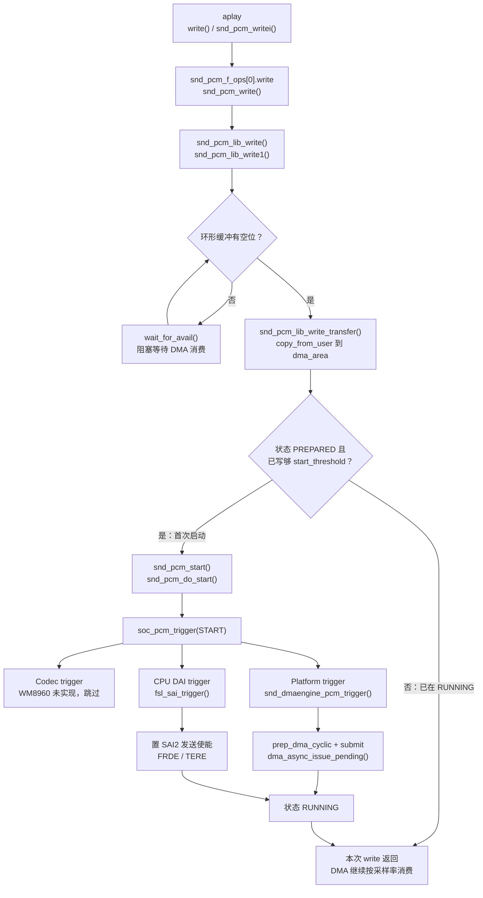
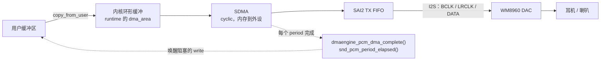

# i.MX6ULL 声卡播放路径

> **平台**：100ask i.MX6ULL Pro
> **内核**：NXP BSP **Linux 4.9.88**
> **本文**：`aplay` 播放的七层路径、HiFi（`pcmC0D0p`）内核调用栈，以及 prepare 上电、close 断电

---

## 目录

- [1. 本文要回答什么](#1-本文要回答什么)
- [2. 七层概览](#2-七层概览)
- [3. 播放内核调用栈](#3-播放内核调用栈hifi--pcmc0d0p)
  - [3.1 open](#31-open打开设备)
  - [3.2 hw_params](#32-hw_params配置参数ioctl)
  - [3.3 prepare](#33-prepare模拟通路上电)
  - [3.4 write + 首次 start](#34-write--首次-start数据期主路径)
  - [3.5 period 完成回调](#35-period-完成回调异步唤醒阻塞的-write)
  - [3.6 对照简图](#36-对照简图)
  - [3.7 drain / close](#37-drain--close停-dma-与模拟通路断电)
- [4. 分层流程图](#4-分层流程图)
- [5. 简化分层与源文件](#5-简化分层与源文件)
- [6. 小结](#6-小结)

---

## 1. 本文要回答什么

> **`aplay -D hw:0,0` 播放时，PCM 数据如何从用户态传到耳机/喇叭？内核调用栈经过哪些函数？**

设备节点与 `dai_link` 含义见 [`/dev/snd` 设备节点](/analysis/kernel/sound/imx6ull-snd-devices)。本文以 **HiFi / `pcmC0D0p`** 直连通路为准。

播放可以看成：软件把 PCM 送进内核环形缓冲区，硬件按采样率把数据搬出去变成声音。

---

## 2. 七层概览

1. **应用层**  
   `aplay` 等播放器打开声卡，设好采样率 / 通道 / 格式，再不断把 PCM 样本写进设备。

2. **ALSA 设备接口**  
   用户态打开的是 `/dev/snd/pcmC0D0p`。内核在这里接收「设参数、准备、开始」等控制，以及后续的写数据；prepare 完成后模拟通路已上电，PCM 进入可播状态。

3. **ALSA PCM 核心**  
   管理内存环形缓冲：把用户态数据拷进来；缓冲满了就让写阻塞等待；攒够启动阈值后，正式开始播放。

4. **ASoC 汇总**  
   收到「开始」后，按 Codec → Platform → CPU DAI → Machine 的顺序通知各层。

5. **DMA**  
   配置并启动 SDMA：按 period 把环形缓冲里的 PCM 搬进 SAI2 的 FIFO。搬完一段就回调，唤醒还在等空位的写操作。

6. **CPU DAI / Codec**  
   SAI 打开发送，把 FIFO 里的数字音频经 I2S 送给 WM8960；芯片侧 DAC 转成模拟，再出到耳机或喇叭。DAC 等在 prepare 时已上电，这里主要是打开 SAI 发送。

7. **硬件数据通路**

```text
内存环形缓冲 ──SDMA──► SAI2 FIFO ──I2S──► WM8960 DAC ──► 耳机/喇叭
```

播放节奏由采样率和 I2S 时钟决定；应用写得再快也会被环形缓冲反压住。

---

## 3. 播放内核调用栈（HiFi / `pcmC0D0p`）

下面以 `aplay -D hw:0,0` 直连通路为例。先 open、设参数、prepare，再进入 write / start 搬数据。

### 3.1 open（打开设备）

```text
sys_open("/dev/snd/pcmC0D0p")
  → snd_fops.open = snd_open                          // sound/core/sound.c
      → replace_fops → snd_pcm_f_ops[0]
      → snd_pcm_playback_open                         // sound/core/pcm_native.c
          → snd_pcm_open(..., PLAYBACK)
              → snd_pcm_open_file
                  → snd_pcm_open_substream
                      → substream->ops->open
                          → soc_pcm_open              // sound/soc/soc-pcm.c
                              → fsl_sai_startup       // CPU DAI
                              → imx_pcm_open          // Platform（imx-pcm-dma-v2）
                              → imx_hifi_startup      // Machine
```

此阶段主要占设备、加约束、申请 DMA 通道；一般不启动传输。

### 3.2 hw_params（配置参数，ioctl）

```text
sys_ioctl(SNDRV_PCM_IOCTL_HW_PARAMS)
  → snd_pcm_playback_ioctl
      → snd_pcm_common_ioctl1 / hw_params 处理
          → substream->ops->hw_params
              → soc_pcm_hw_params                     // sound/soc/soc-pcm.c
                  → codec/cpu/platform/machine hw_params
                      → imx_hifi_hw_params            // 设 I2S 格式、主从、PLL
                      → fsl_sai_hw_params
                      → wm8960_hw_params
```

此阶段配置采样率、格式、时钟等。参数设完，PCM 进入 `SETUP`。

### 3.3 prepare（模拟通路上电）

```text
sys_ioctl(SNDRV_PCM_IOCTL_PREPARE)
  → snd_pcm_playback_ioctl
      → snd_pcm_prepare                            // sound/core/pcm_native.c
          → snd_pcm_do_prepare
              → substream->ops->prepare
                  → soc_pcm_prepare                // sound/soc/soc-pcm.c
                      → machine / platform / codec / cpu 的 .prepare
                      → snd_soc_dapm_stream_event(..., STREAM_START)
                      → snd_soc_dai_digital_mute(..., 0)   // 解除数字静音
          → snd_pcm_post_prepare                   // 状态 → PREPARED
```

`aplay` 设完采样率之后一定会再做一次 prepare，PCM 从 `SETUP` 进入 `PREPARED`，这之后才能 start。

本板的 Codec、DMA、SAI、Machine 都没有自己的 prepare 函数。内核进入公共的 `soc_pcm_prepare`，在这里调用 `snd_soc_dapm_stream_event(..., STREAM_START)`：等于告诉 DAPM「播放流开始了」。混音开关已经打开的话，DAC、输出混音这些模拟硬件模块就在这一步上电。

此时还没开始播放数据。SDMA 和 SAI 要等到下面第一次 `write` 里的 `trigger(START)` 才打开。

### 3.4 write + 首次 start（数据期主路径）

```text
sys_write(pcmC0D0p, buf, len)
  → snd_pcm_f_ops[0].write = snd_pcm_write            // sound/core/pcm_native.c
      → snd_pcm_lib_write                             // sound/core/pcm_lib.c
          → snd_pcm_lib_write1
              → transfer = snd_pcm_lib_write_transfer
                  → copy_from_user → runtime->dma_area
              → （缓冲满则 wait_for_avail 阻塞）
              → 若 PREPARED 且写够 start_threshold:
                    snd_pcm_start
                      → snd_pcm_action(&snd_pcm_action_start)
                          → snd_pcm_action_single
                              → snd_pcm_pre_start
                              → snd_pcm_do_start
                                  → substream->ops->trigger(START)
                                      → soc_pcm_trigger           // sound/soc/soc-pcm.c
                                          → codec trigger         // WM8960: 无，跳过
                                          → platform->trigger
                                              → snd_dmaengine_pcm_trigger  // sound/core/pcm_dmaengine.c
                                                  → dmaengine_pcm_prepare_and_submit
                                                      → dmaengine_prep_dma_cyclic
                                                      → dmaengine_submit
                                                          → vchan_tx_submit  // SDMA/virt-dma
                                                  → dma_async_issue_pending  // 启动 SDMA
                                          → cpu_dai->trigger
                                              → fsl_sai_trigger   // 开 SAI FRDE/TERE
                                          → machine trigger       // 通常无
                              → snd_pcm_post_start   // 状态 → RUNNING
```

之后再次 `write` 只继续往环形缓冲填数，不再走 `snd_pcm_start`；DMA 按采样率持续消费。

### 3.5 period 完成回调（异步，唤醒阻塞的 write）

```text
SDMA period 完成中断
  → dmaengine_pcm_dma_complete    // sound/core/pcm_dmaengine.c
      → snd_pcm_period_elapsed
          → 更新硬件指针 / 唤醒 wait_for_avail 中的写端
```

### 3.6 对照简图

```text
配置期:
  open → hw_params → prepare
    prepare: soc_pcm_prepare → STREAM_START（模拟通路上电）→ PREPARED

write:
  snd_pcm_write
    → snd_pcm_lib_write1
        → copy_from_user(dma_area)
        → [首次] snd_pcm_start
              → soc_pcm_trigger
                  → snd_dmaengine_pcm_trigger → SDMA
                  → fsl_sai_trigger           → SAI2

异步反馈:
  SDMA → dmaengine_pcm_dma_complete → period_elapsed → 唤醒 write

退出:
  drain / drop → trigger(STOP) 停 DMA/SAI
  close → soc_pcm_close → STREAM_STOP（模拟大约 5 秒后断电）
```

### 3.7 drain / close（停 DMA 与模拟通路断电）

wav 播完后，`aplay` 会先等环形缓冲里剩下的数据都送出去（`drain`），再关掉设备。内核 `snd_pcm_release_substream`（`pcm_native.c`）的顺序是：

```text
snd_pcm_drop
  → 若仍 RUNNING：ops->trigger(STOP)
      → soc_pcm_trigger(STOP)
          → snd_dmaengine_pcm_trigger  // 停 SDMA cyclic
          → fsl_sai_trigger            // 清 SAI FRDE/TERE
ops->hw_free
  → soc_pcm_hw_free
      → imx_hifi_hw_free / fsl_sai_hw_free
ops->close
  → soc_pcm_close
      → fsl_sai_shutdown / imx_hifi_shutdown
      → platform close（释放 SDMA 通道）
      → 排队 delayed_work，默认 5000 ms 后 STREAM_STOP
```

`trigger(STOP)` 停掉 SDMA 和 SAI，数字通路不再传数。耳机/喇叭模拟电路的断电发生在 `soc_pcm_close` 里的 `STREAM_STOP`。

本板日常用的 HiFi（`hw:0,0`）默认再等 5000 毫秒才断电（`pmdown_time`，减轻开关机时的爆破音）。所以命令行已经回到提示符，Codec 模拟口还会保持上电一小会儿。

---

## 4. 分层流程图

### 4.1 调用流程（软件，一次 `write`）



### 4.2 数据通路（硬件）



---

## 5. 简化分层与源文件

```text
应用层      aplay / write(PCM)
   ↓
ALSA fops   snd_pcm_write / ioctl
   ↓
PCM 核心    拷入环形缓冲；满则 wait；够阈值则 start
   ↓
ASoC        prepare：STREAM_START（模拟上电）
            trigger：soc_pcm_trigger
   ├─ Platform : SDMA cyclic 传输启动
   └─ CPU DAI  : SAI2 打开发送
   ↓
硬件        内存 ──SDMA──► SAI FIFO ──I2S──► WM8960 ──► 耳机/喇叭
```

| 层级 | 文件 |
|------|------|
| ALSA fops / start | `sound/core/pcm_native.c` |
| write / 环形缓冲 | `sound/core/pcm_lib.c` |
| ASoC prepare / trigger / close | `sound/soc/soc-pcm.c` |
| Machine | `sound/soc/fsl/imx-wm8960.c` |
| DMA PCM | `sound/soc/fsl/imx-pcm-dma-v2.c`、`sound/core/pcm_dmaengine.c` |
| SAI | `sound/soc/fsl/fsl_sai.c` |
| Codec | `sound/soc/codecs/wm8960.c` |
| 设备树 | `arch/arm/boot/dts/100ask_imx6ull-14x14.dts` |

---

## 6. 小结

- 播放速度由采样率 / I2S 时钟决定，不是由 `write` 快慢决定。
- 环形缓冲满时，阻塞模式下 `write` 会等待 DMA 消费出空位。
- prepare 时调用 `STREAM_START`，给模拟电路上电；第一次写够数据后 `trigger(START)` 打开 DMA 和 SAI。本板 Codec / DMA / SAI 没有自己的 prepare 回调。
- `soc_pcm_trigger` 中 WM8960 无 codec trigger；有效的是 Platform（DMA）和 CPU DAI（SAI）。
- 关掉播放后，DMA 和 SAI 马上停；模拟电路默认再过 5 秒才断电。
