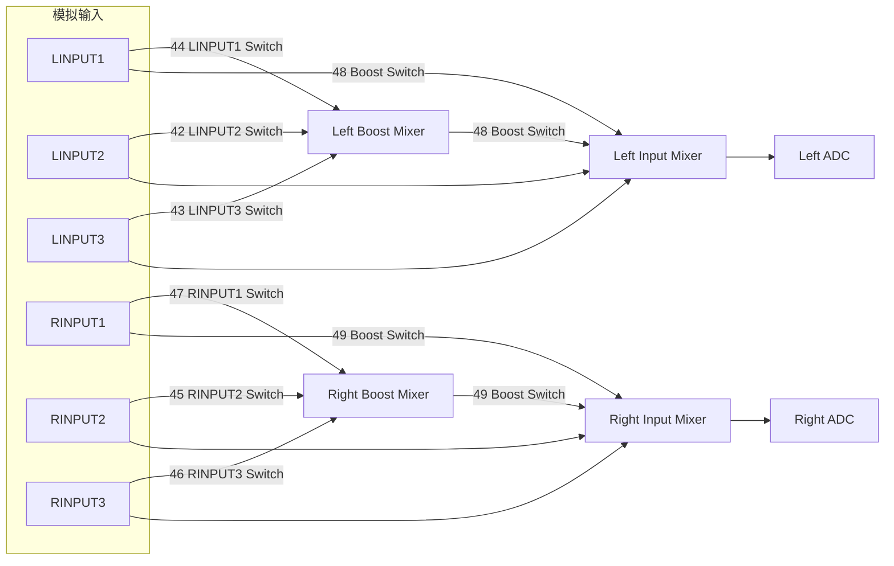
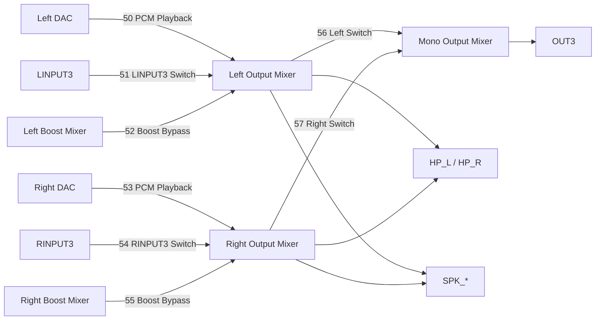
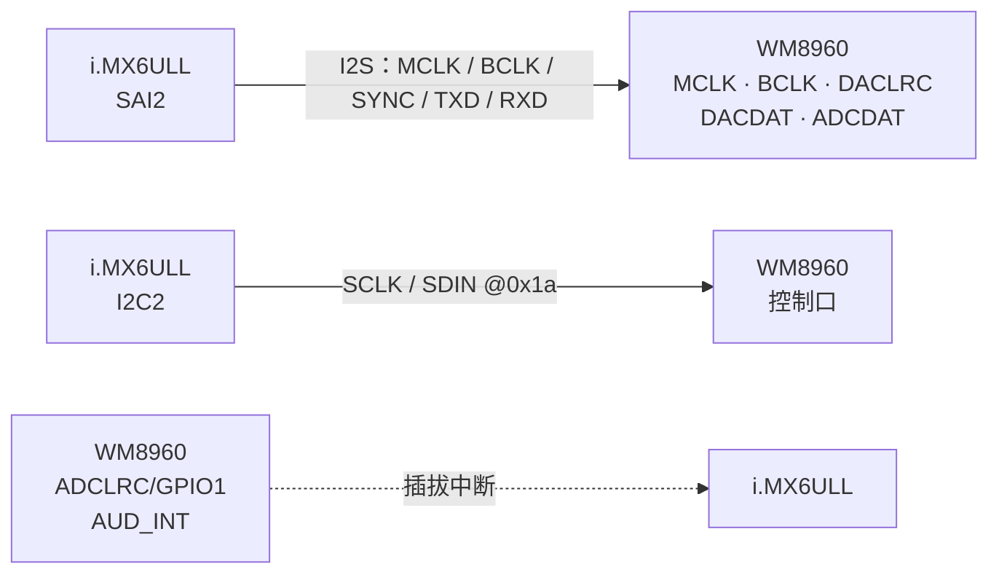
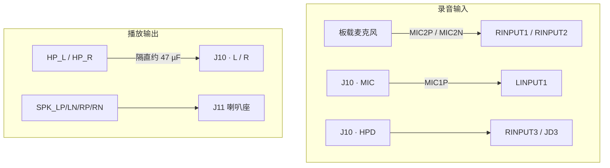

# 从 tinymix 到 WM8960 DAPM 路由

> **平台**：100ask i.MX6ULL Pro（声卡 `wm8960-audio`，Codec WM8960）  
> **内核**：NXP BSP **Linux 4.9.88**（`sound/soc/codecs/wm8960.c`）  
> **本文**：用板子上的 `tinymix` 输出对照 Codec 内模拟路由图，再落到 `snd_soc_dapm_route` / mixer widget 源码

---

## 目录

- [1. 本文要回答什么](#1-本文要回答什么)
- [2. 先建立图像：读后续所需概念](#2-先建立图像读后续所需概念)
- [3. tinymix：清单与状态](#3-tinymix清单与状态)
- [4. 两类控件：音量与路由开关](#4-两类控件音量与路由开关)
- [5. 按开关画出路由图](#5-按开关画出路由图)
  - [5.1 录音（Capture）](#51-录音capture)
  - [5.2 播放（Playback）](#52-播放playback)
  - [5.3 本板原理图与脚位](#53-本板原理图与脚位)
- [6. 源码：路由写在哪个结构体](#6-源码路由写在哪个结构体)
- [7. 一个开关挂两条边](#7-一个开关挂两条边)
- [8. 小结](#8-小结)
- [附录 A 源码索引](#附录-a-源码索引)
- [附录 B 要点速记](#附录-b-要点速记)

---

## 1. 本文要回答什么

> **`tinymix controls` 里那一长串名字是什么？其中带 Mixer / Switch 的项如何对应 WM8960 内部连线？驱动里用哪个结构体声明这些连线？**

范围限定 **Codec 内 DAPM 图**（widget + route + mixer 开关）以及如何用 `tinymix` 观察；[§5.3](#53-本板原理图与脚位) 对照本板插座与板载麦克风接到哪些输入脚。不展开 PCM DMA / SAI 数据面，也不展开 `SOC_*` 音量宏的逐字段展开。

---

## 2. 先建立图像：读后续所需概念

把 Codec 里的模拟音频想成一座**小城市供电网络**。后文会反复出现下面这些词，先对齐含义：

| 概念 | 形象 | 在驱动 / 用户态里是什么 |
|------|------|-------------------------|
| **DAPM** | 整座城的调度所：谁在用电就给谁通电 | Dynamic Audio Power Management：按**是否存在 complete path** 给 widget 上电 / 断电 |
| **widget** | 一座变电站 / 路口 | 图上的**节点**（`snd_soc_dapm_widget`）：DAC、ADC、Mixer、`HP_L` 等，常绑一颗电源位 |
| **route** | 图纸上画好的「应从 A 到 B」 | 驱动里的**静态声明**（`snd_soc_dapm_route` / 本驱动的 `audio_paths[]`）：`{ sink, control, source }` |
| **path** | 两站之间真正铺好的**一段电线** | route 注册后的**运行时边**（`snd_soc_dapm_path`）；字段 `connect` 表示这段当前是否接通 |
| **DAPM kcontrol** | 电线上的**闸刀** | 挂在 MIXER 等 widget 上的开关（常 `SOC_DAPM_SINGLE`）；`tinymix` 里名字多含 `… Mixer … Switch` |
| **普通 kcontrol** | 变电站里的**旋钮**（音量等） | 改增益 / 静音 / ALC，一般**不决定**边通不通；与闸刀出现在同一张 `tinymix` 列表里 |
| **complete path** | 从发电厂一直通到用户家的**整条线路** | 端点有效（在播 / 在录）且中间每一段 path 的 `connect` 都为真 |

关系可以记成一句话：

> 驱动用 **route** 画图纸 → 内核建成 **path** → **DAPM kcontrol** 决定某段 path 是否 `connect` → 若拼出 **complete path**，沿线 **widget** 才由 **DAPM** 供电。

播放时心里可以记这一条：

```text
Left DAC ──path──► Left Output Mixer ──path──► … ──path──► HP_L
   ▲                      ▲
widget                 widget
   │                      │
   │         闸刀 = DAPM kcontrol
   │         （如 PCM Playback Switch）
   └──────── complete path（整条都通才算）────────┘

图纸上的一笔 = route：{ "Left Output Mixer", "PCM Playback Switch", "Left DAC" }
```

几个易混点：

- **route 与 path**：route 是源码里的静态表项；path 是跑起来之后的边。后文画图、谈通断，说的是 path；落到 `audio_paths[]`，说的是 route。  
- **DAPM kcontrol 与普通 kcontrol**：都在 `tinymix` 里，但前者管「路通不通」，后者管「声音大小 / 参数」。只拧音量、闸刀断开 → **complete path 断了** → 常见「音量有、喇叭无声」。  
- **`control == NULL` 的 route**：图纸上规定常通，没有闸刀，注册后 path 一直 `connect`。  
- 内核在 `dapm_power_widgets` 里扫描的，正是 complete path（DAC→输出脚、输入脚→ADC、旁路、环回等）。

后文先用 `tinymix` 认出闸刀，再按闸刀画出播 / 录两张图，最后对照 `audio_paths[]` 与 widget 上的开关表。

---

## 3. tinymix：清单与状态

本板 `tinymix` 默认操作 card 0。两个常用子命令职责不同：

| 命令 | 作用 |
|------|------|
| `tinymix controls` | 只列控件：**编号 / 类型 / 通道数 / 名字**，**不含当前值** |
| `tinymix contents` | 在清单基础上再读出当前值（BOOL 为 `On`/`Off`，INT 带 range） |
| `tinymix get '名字'` | 读单个控件 |

只跑 `controls` 时看不到开关是开还是关，这是命令语义，不是驱动没暴露状态。看路由开关请用：

```bash
tinymix contents
tinymix get 'Left Output Mixer PCM Playback Switch'
```

本板枚举结果约为 **58** 个控件。其中编号约 **42～57** 的 BOOL，名字形如 `Left Output Mixer PCM Playback Switch`，正是后文路由图上的边开关。

---

## 4. 两类控件：音量与路由开关

同一声卡的 mixer 列表里混着两类东西，宜分开看：

| 类型 | 典型名字 | 作用 |
|------|----------|------|
| 普通 mixer | `Speaker Playback Volume`、`Capture Volume`、ALC / 3D 等 | 改增益、静音、算法参数；多数来自 `wm8960_snd_controls[]` |
| DAPM mixer 开关 | `… Mixer … Switch`（约 ctl 42～57） | 选模拟支路是否接通；来自 widget 上挂的 `SOC_DAPM_SINGLE` |

音量旋钮拧对了仍可能无声：若 **PCM Playback Switch** 等路径开关未接通，或 DAPM 未上电，数字通路与喇叭之间仍断开。本文后面只画 **路由开关** 对应的图。

板子上与路由直接相关的 BOOL（`tinymix controls` 摘录）：

```text
42  Left Boost Mixer LINPUT2 Switch
43  Left Boost Mixer LINPUT3 Switch
44  Left Boost Mixer LINPUT1 Switch
45  Right Boost Mixer RINPUT2 Switch
46  Right Boost Mixer RINPUT3 Switch
47  Right Boost Mixer RINPUT1 Switch
48  Left Input Mixer Boost Switch
49  Right Input Mixer Boost Switch
50  Left Output Mixer PCM Playback Switch
51  Left Output Mixer LINPUT3 Switch
52  Left Output Mixer Boost Bypass Switch
53  Right Output Mixer PCM Playback Switch
54  Right Output Mixer RINPUT3 Switch
55  Right Output Mixer Boost Bypass Switch
56  Mono Output Mixer Left Switch
57  Mono Output Mixer Right Switch
```

---

## 5. 按开关画出路由图

图中边上的标注对应上表 ctl 编号；**无编号的边**在驱动里 `control` 字段为 `NULL`，表示常通（不经 tinymix 开关）。

读 DAPM 录音图之前，可先对照芯片手册里的模拟前端（本板耳机麦走 **LINPUT1** 这一路）：


> 图源：Cirrus Logic *WM8960 Datasheet* Figure 8（版权归原厂商）。完整 PDF 见仓库 [`refs/datasheets/WM8960.pdf`](https://github.com/dengtaowei/blogD/blob/main/refs/datasheets/WM8960.pdf)。

手册链（左声道）可记成：

`LINPUT1` →（**LMN1**）→ Left Input PGA →（**LMICBOOST**）→（**LMIC2B**）→ Left Boost Mixer → Left ADC  

控件位与 `tinymix`：

| 手册 | 本板日常对照 |
|------|----------------|
| **LMN1** | `Left Boost Mixer LINPUT1 Switch`（约 ctl **44**） |
| **LMIC2B** | `Left Input Mixer Boost Switch`（约 ctl **48**） |
| **LMICBOOST** | `Left Input Boost Mixer LINPUT1 Volume`（粗档再放大） |
| **LINVOL** | `Capture Volume` 等 PGA 细调增益 |

手册方块名与驱动 widget 名**同名不一定同物**。手册没有 `Left Input Mixer` 这一块；驱动为挂电源位 / 开关另起了两个 MIXER 名。对照时以寄存器位为准：

| 手册 Figure 8 | 驱动 `wm8960.c` DAPM |
|-----------|----------------------|
| Left Input PGA 一侧（选脚 **LMN1** 等）+ **AINL** 电源域 | widget **`Left Boost Mixer`**（其上挂 LINPUT1/2/3 Switch） |
| **LMIC2B** | 挂在 **`Left Input Mixer`** 上的 Boost Switch |
| 手册里的 **Left Boost Mixer**（求和后进 ADC） | 图上更接近 **`Left Input Mixer` → Left ADC** 这一段 |

驱动链顺序是：`Left Boost Mixer` →（48）→ `Left Input Mixer` → ADC；与手册「PGA → LMIC2B → Boost Mixer → ADC」的命名左右对调。下文 Mermaid / `tinymix` 仍用驱动原名；**48** 还会同时出现在 `LINPUT1 → Left Input Mixer` 上（见 [§7](#7-一个开关挂两条边)）。

### 5.1 录音（Capture）

模拟输入 → Boost Mixer / Input Mixer → ADC。相关开关主要是 **42～49**。



要点：

- `LINPUT2` / `LINPUT3`（及右侧对称）进入 **Input Mixer** 的边在驱动里是常通。  
- 走 **Boost** 支路时，需打开对应 `LINPUT`/`RINPUT` Switch，并打开 **48 / 49**（Boost Switch）。  
- **48** 同时出现在两条边上（Boost Mixer→Input Mixer，以及 LINPUT1→Input Mixer），见 [§7](#7-一个开关挂两条边)。  
- 本板插座 / 板载麦克风接到哪几个输入脚，见 [§5.3](#53-本板原理图与脚位)。

### 5.2 播放（Playback）

DAC / 旁路 → Output Mixer → 耳机 / 喇叭（驱动里还可经 Mono Mixer 到 OUT3）。相关开关主要是 **50～57**。



日常数字播放：至少需要 **50 / 53**（`PCM Playback Switch`）打开，使 Left/Right DAC 进入 Output Mixer；再经常通边到 `HP_*` / `SPK_*`。  
**51 / 54**、**52 / 55** 是模拟旁路；**56 / 57** 服务 Mono / OUT3。本板耳机走 `HP_L` / `HP_R` 隔直输出，OUT3 未接到插座，日常播放一般只用到 **50 / 53** 这一路。

### 5.3 本板原理图与脚位

百问底板原理图（`100ask_imx6ull_v1.1.pdf` 音频页，U17 WM8960）省略电阻、去耦与电源后，可以分成数字、模拟两张看：

**数字口（SoC ↔ Codec）**



**模拟口（Codec ↔ 板级）**



两路麦还共用 Codec 的 `MICBIAS` 偏置（图中略）。

| 板级通路 | 接到 WM8960 | 用 `tinymix` 时 |
|----------|-------------|-----------------|
| 3.5 mm 耳机麦（J10 → `MIC1P`） | **`LINPUT1`**（耦合电容） | 打开左侧 Boost 相关开关（如 **44** `LINPUT1 Switch`、**48** `Boost Switch`） |
| 板载麦克风（`MIC2P` / `MIC2N`） | **`RINPUT2` / `RINPUT1`**（差分） | 打开右侧 Boost（**45～47**、**49**） |
| 耳机左右 | `HP_L` / `HP_R` → 约 47 µF 隔直 → J10 | 数字播放经 Output Mixer 常通边到 `HP_*` |
| 外接喇叭 | `SPK_LP/LN/RP/RN` 差分 → 喇叭座 | 与耳机共用 Output Mixer 之后的喇叭功放脚 |
| 耳机插入检测 `HPD` | **`RINPUT3` / JD3**；`ADCLRC/GPIO1` 作 `AUD_INT` | Machine 用 `hp-det = <3 0>` 选片内 JD |
| OUT3 | 未外接 | 驱动另有 Mono / capless 附加表；本板日常走 `HP_*` / `SPK_*` |

`audio-routing` 用 `Mic Jack`、`Main MIC`、`Headphone Jack` 等名字挂到这些 Codec 脚；DAPM / `tinymix` 里看到的仍是 `LINPUT*`、`HP_*` 一类芯片侧名字。Machine 侧 `sound` 节点写法见 [ASoC 四层 §6.1](/analysis/kernel/sound/imx6ull-asoc-layers#61-machine-sound)。

---

## 6. 源码：路由写在哪个结构体

### 6.1 边：`struct snd_soc_dapm_route`

本驱动主路由表是 `audio_paths[]`：

```c
/* sound/soc/codecs/wm8960.c */
static const struct snd_soc_dapm_route audio_paths[] = {
	{ "Left Boost Mixer", "LINPUT1 Switch", "LINPUT1" },
	{ "Left Boost Mixer", "LINPUT2 Switch", "LINPUT2" },
	{ "Left Boost Mixer", "LINPUT3 Switch", "LINPUT3" },

	{ "Left Input Mixer", "Boost Switch", "Left Boost Mixer" },
	{ "Left Input Mixer", "Boost Switch", "LINPUT1" },
	{ "Left Input Mixer", NULL, "LINPUT2" },
	{ "Left Input Mixer", NULL, "LINPUT3" },
	/* 右侧对称 … */

	{ "Left ADC", NULL, "Left Input Mixer" },
	{ "Right ADC", NULL, "Right Input Mixer" },

	{ "Left Output Mixer", "LINPUT3 Switch", "LINPUT3" },
	{ "Left Output Mixer", "Boost Bypass Switch", "Left Boost Mixer" },
	{ "Left Output Mixer", "PCM Playback Switch", "Left DAC" },
	/* 右侧对称 … */

	{ "LOUT1 PGA", NULL, "Left Output Mixer" },
	/* … → HP_L / SPK_* … */
};
```

每个元素三个字段：

| 字段 | 含义 |
|------|------|
| `sink` | 下游 widget 名（字符串，须与 widget 名一致） |
| `control` | 边上开关名；`NULL` = 常通 |
| `source` | 上游 widget 名 |

有名字的 `control` 必须与某个 **MIXER widget 上挂的 DAPM kcontrol 名字**一致，否则边无法受 tinymix 控制。

OUT3 / capless 等模式另有 `audio_paths_out3[]`、`audio_paths_capless[]`，在 `wm8960_add_widgets` 里按平台数据追加。本板耳机走 `HP_*` 隔直、OUT3 未外接，日常 complete path 一般落在 `audio_paths[]` 主表。

### 6.2 点：`struct snd_soc_dapm_widget`

节点在 `wm8960_dapm_widgets[]`，例如：

```c
SND_SOC_DAPM_INPUT("LINPUT1"),
SND_SOC_DAPM_MIXER("Left Boost Mixer", WM8960_POWER1, 5, 0,
		   wm8960_lin_boost, ARRAY_SIZE(wm8960_lin_boost)),
SND_SOC_DAPM_MIXER("Left Input Mixer", WM8960_POWER3, 5, 0,
		   wm8960_lin, ARRAY_SIZE(wm8960_lin)),
SND_SOC_DAPM_ADC("Left ADC", "Capture", WM8960_POWER1, 3, 0),
SND_SOC_DAPM_DAC("Left DAC", "Playback", WM8960_POWER2, 8, 0),
SND_SOC_DAPM_MIXER("Left Output Mixer", WM8960_POWER3, 3, 0,
		   wm8960_loutput_mixer, ARRAY_SIZE(wm8960_loutput_mixer)),
/* … PGA / OUTPUT … */
```

`SND_SOC_DAPM_MIXER` 的后两个参数是该 mixer 的开关表及其长度。

### 6.3 开关表：`SOC_DAPM_SINGLE`

例如输出混音与输入 Boost：

```c
static const struct snd_kcontrol_new wm8960_lin_boost[] = {
	SOC_DAPM_SINGLE("LINPUT2 Switch", WM8960_LINPATH, 6, 1, 0),
	SOC_DAPM_SINGLE("LINPUT3 Switch", WM8960_LINPATH, 7, 1, 0),
	SOC_DAPM_SINGLE("LINPUT1 Switch", WM8960_LINPATH, 8, 1, 0),
};

static const struct snd_kcontrol_new wm8960_loutput_mixer[] = {
	SOC_DAPM_SINGLE("PCM Playback Switch", WM8960_LOUTMIX, 8, 1, 0),
	SOC_DAPM_SINGLE("LINPUT3 Switch", WM8960_LOUTMIX, 7, 1, 0),
	SOC_DAPM_SINGLE("Boost Bypass Switch", WM8960_BYPASS1, 7, 1, 0),
};
```

用户态看到的长名字是 **widget 名 + 控件短名** 拼出来的，例如：

`Left Output Mixer` + `PCM Playback Switch`  
→ `Left Output Mixer PCM Playback Switch`（ctl 50）。

### 6.4 注册入口

```c
snd_soc_dapm_new_controls(dapm, wm8960_dapm_widgets,
			  ARRAY_SIZE(wm8960_dapm_widgets));
snd_soc_dapm_add_routes(dapm, audio_paths, ARRAY_SIZE(audio_paths));
```

顺序上：先建 widget（含 mixer 开关），再 `add_routes` 把字符串形式的边挂进 DAPM 图。开关因此出现在同一张声卡的 `controlC0` 上，才能被 `tinymix` 枚举。

---

## 7. 一个开关挂两条边

录音图里 **48** 标在两条边上，对应源码：

```c
{ "Left Input Mixer", "Boost Switch", "Left Boost Mixer" },
{ "Left Input Mixer", "Boost Switch", "LINPUT1" },  /* Really Boost Switch */
```

同一 `Boost Switch`（ctl **48**）被两行 `snd_soc_dapm_route` 引用，一次 `tinymix set` 两条边一起通断。右侧 **49** 对 `RINPUT1` / Right Boost Mixer 同理。源码注释 `Really Boost Switch` 标明第二行边的硬件语义仍是该 Boost 位（手册 **LMIC2B**）。

---

## 8. 小结

- **widget = 点，path = 边，route = 图纸，DAPM kcontrol = 闸刀，complete path = 端到端通电线路**。  
- `tinymix controls` 只给清单；看开关状态用 `contents` / `get`。  
- 列表里约 42～57 的 BOOL 是 DAPM 路由开关；前面多为音量 / 算法类控件。  
- 播 / 录应分开看图：录音盯 Boost / Input Mixer（42～49）；播放盯 Output Mixer 的 PCM / Bypass（50～57）。  
- 本板：耳机麦进 **LINPUT1**，板载麦克风进 **RINPUT1/2**，耳机 / 喇叭走 `HP_*` / `SPK_*`；OUT3 未外接。  
- 边在 `audio_paths[]`（`struct snd_soc_dapm_route`）；点在 `wm8960_dapm_widgets[]`；开关短名在 `SOC_DAPM_SINGLE` 表里，经 `snd_soc_dapm_add_routes` 挂上。

---

## 附录 A 源码索引

| 位置 | 内容 |
|------|------|
| `sound/soc/codecs/wm8960.c` — `wm8960_lin_boost` / `wm8960_lin` / `wm8960_loutput_mixer` 等 | mixer 开关短名与寄存器位 |
| 同文件 — `wm8960_dapm_widgets[]` | DAPM 节点 |
| 同文件 — `audio_paths[]` / `audio_paths_out3[]` | 路由边 |
| 同文件 — `wm8960_add_widgets` | `dapm_new_controls` + `dapm_add_routes` |
| `include/sound/soc-dapm.h` | `snd_soc_dapm_route` / widget 宏 |
| 仓库 [`refs/datasheets/WM8960.pdf`](https://github.com/dengtaowei/blogD/blob/main/refs/datasheets/WM8960.pdf) | 芯片手册 |
| `/files/wm8960-fig8-mic-input-pga.png` | 手册 Figure 8 摘图 |

---

## 附录 B 要点速记

1. **DAPM** 按 complete path 供电；**route → path**；**DAPM kcontrol** 是闸刀，**普通 kcontrol** 多是旋钮。  
2. **widget / path / complete path** ≈ 变电站 / 一段电线 / 整条通电线路。  
3. **controls ≠ 当前值**；状态看 **contents**。  
4. 路由三件套：**widget + route +（可选）DAPM kcontrol**。  
5. `route = { sink, control, source }`；`control == NULL` 常通。  
6. 数字播放关键开关：`Left/Right Output Mixer PCM Playback Switch`（50 / 53）。  
7. 同一 `control` 字符串可出现在多行 route 里，对应一次开关、多条边。  
8. 本板耳机麦 → LINPUT1，板载麦克风 → RINPUT1/2；播放走 HP_* / SPK_*。
