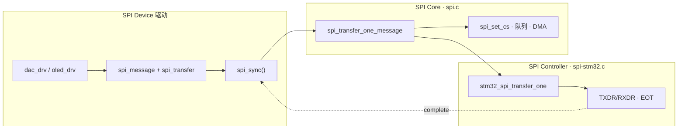
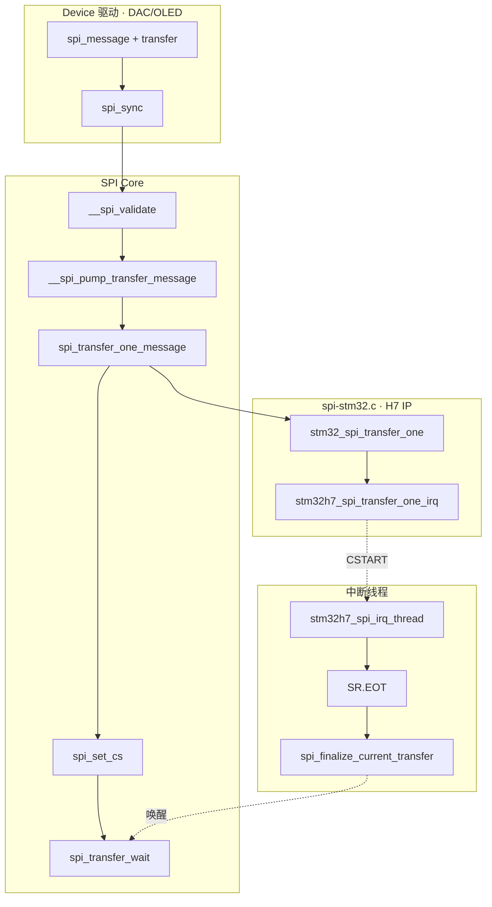

# STM32MP157 SPI 子系统分析

> Linux 6.8 · `drivers/spi/spi.c` + `drivers/spi/spi-stm32.c`  
> **Linux 内核 · SPI 子系统**  
> 基于 STM32MP157 与内核 6.8 源码，梳理 **驱动模型 → 设备树 → `spi_sync` 调用链**。

---

## 目录

1. [三个重点](#1-三个重点)
2. [驱动模型：Controller / Device / Driver](#2-驱动模型controller--device--driver)
3. [设备树与注册流程](#3-设备树与注册流程)
4. [数据组织：transfer → message → queue](#4-数据组织transfer--message--queue)
5. [Master 传输：`transfer_one` 与队列](#5-master-传输transfer_one-与队列)
6. [设备驱动侧：`spi_sync` 完整调用链](#6-设备驱动侧spi_sync-完整调用链)
7. [STM32 控制器：硬件完成路径](#7-stm32-控制器硬件完成路径)
8. [附录：源码索引与速记](#8-附录源码索引与速记)

---

## 1. 三个重点

读 SPI 子系统，先抓住三件事：

| 重点 | 一句话 | 本文章节 |
|:----:|--------|----------|
| **① 驱动模型** | **Controller 驱动**（`spi-stm32.c`）提供传输能力；**Device 驱动**（DAC/OLED 等）知道怎么跟芯片说话，并调用 Controller | [§2](#2-驱动模型controller--device--driver) |
| **② 设备树** | Controller 节点 + **`cs-gpios`**；子节点描述从设备（`compatible` / `reg` / `spi-max-frequency`）；probe 后 core 自动创建 `spi_device` | [§3](#3-设备树与注册流程) |
| **③ 传输路径** | 设备驱动组 **`spi_message`** → core **`spi_sync`** → 默认 **`spi_transfer_one_message`** → MP157 上 **`stm32_spi_transfer_one`** → 中断线程 **`spi_finalize_current_transfer`** | [§6](#6-设备驱动侧spi_sync-完整调用链) · [§7](#7-stm32-控制器硬件完成路径) |



---

## 2. 驱动模型：Controller / Device / Driver

SPI 子系统与「平台总线设备驱动模型」同构：**Controller 侧**像 `platform_driver`，**Device 侧**像挂在其下的外设驱动。

### 2.1 两类硬件

```text
        ┌─────────────────┐
        │  SPI Controller │  ← SoC 片上 SPI1～6（MP157）
        │  (Master/Host)  │
        └───┬───┬───┬─────┘
            │   │   │  CS0 / CS1 / …（GPIO，cs-gpios）
            ▼   ▼   ▼
         [DAC] [OLED] [传感器]   ← SPI 从设备
```

| 内核对象 | 头文件 | 谁来实现 | 职责 |
|----------|--------|----------|------|
| **`spi_controller`** | `include/linux/spi/spi.h` | `spi-stm32.c` | 注册总线、实现 `transfer_one`、管理队列 |
| **`spi_device`** | 同上 | core 根据 DT 创建 | 记录片选、`max_speed_hz`、`mode` |
| **`spi_driver`** | 同上 | 模块作者 | `probe` 里调用 `spi_sync` 访问硬件 |

### 2.2 Controller 驱动：平台 probe → 注册 host

MP157 上 **`compatible = "st,stm32h7-spi"`** 匹配 `spi-stm32.c` 的 `platform_driver`：

```text
stm32_spi_probe()
  ├── 映射寄存器、申请 IRQ、clk、dmamux DMA
  ├── ctrl->transfer_one = stm32_spi_transfer_one
  ├── ctrl->use_gpio_descriptors = true
  └── spi_register_controller()                    spi.c
        ├── spi_get_gpio_descs()                   cs-gpios → num_chipselect
        ├── device_add(&ctlr->dev)                 → spi0
        ├── spi_controller_initialize_queue()        kthread「spi0」
        └── of_register_spi_devices()                见下文
              for_each_available_child_of_node(...)
                └── of_register_spi_device()
                      ├── spi_alloc_device()
                      ├── of_spi_parse_dt()          reg / mode / spi-max-frequency
                      └── spi_add_device()
                            └── __spi_add_device()
                                  ├── spi_set_csgpiod()   cs_gpiods[reg]
                                  ├── spi_setup()
                                  └── device_add() → spi_probe → driver.probe()
```

**子节点解析由 SPI core 完成**（`spi.c`），`spi-stm32.c` 只负责调 `spi_register_controller()`；Controller 注册末尾 core 遍历 DT **available 子节点**，为每个从设备创建 `spi_device` 并挂到 `spi` 总线。

| 子节点属性 | 写入 `spi_device` |
|------------|-------------------|
| `reg = <N>` | 片选号 N，对应 **`cs-gpios[N]`** |
| `compatible` | `modalias`，供 `spi_match_device()` 匹配驱动 |
| `spi-max-frequency` | `max_speed_hz` |
| `spi-cpol` / `spi-cpha` 等 | `mode` 各位 |

例如 §3.1 中 `icm20608@0`（`reg = <0>`）注册后 sysfs 出现 **`spi0.0`**，并 bind `invensense,icm20608` 驱动。

### 2.3 Device 驱动：注册 `spi_driver` + `probe`

典型 SPI 设备驱动写法（`spi_sync` 全双工传 2 字节）：

```c
/* 构造 transfer → 挂到 message → 同步发出 */
xfer[0].tx_buf = tx_buf;
xfer[0].rx_buf = rx_buf;
xfer[0].len = 2;

spi_message_init(&msg);
spi_message_add_tail(&xfer[0], &msg);
status = spi_sync(spi, &msg);
```

Device 驱动**不碰寄存器**；只组 message，由 core 回调 Controller 的 `transfer_one`。

---

## 3. 设备树与注册流程

### 3.1 板级示例

MP157 板级 DTS 中，SPI5 接 ICM20608（带 **`cs-gpios`**）：

```dts
&spi5 {
    pinctrl-names = "default", "sleep";
    pinctrl-0 = <&spi5_pins_a>;
    pinctrl-1 = <&spi5_sleep_pins_a>;
    cs-gpios = <&gpioh 5 GPIO_ACTIVE_LOW>;   /* 片选 PH5 */
    status = "okay";

    icm20608@0 {
        compatible = "invensense,icm20608";
        reg = <0>;                             /* cs-gpios[0] */
        spi-max-frequency = <8000000>;
        interrupt-parent = <&gpioz>;
        interrupts = <0 IRQ_TYPE_EDGE_FALLING>;
    };
};
```

多从设备、多片选示例：

```dts
&spi1 {
    pinctrl-0 = <&spi1_pins_a>;
    cs-gpios = <&gpioz 3 GPIO_ACTIVE_LOW>, <&gpioa 4 GPIO_ACTIVE_LOW>;
    status = "okay";

    dac@0 {
        compatible = "vendor,dac";
        reg = <0>;
        spi-max-frequency = <10000000>;
    };
};
```

MP157 SoC 级 SPI1 节点（`stm32mp151.dtsi`）：

```dts
spi1: spi@44004000 {
    compatible = "st,stm32h7-spi";
    reg = <0x44004000 0x400>;
    interrupts = <GIC_SPI 35 IRQ_TYPE_LEVEL_HIGH>;
    clocks = <&rcc SPI1_K>;
    dmas = <&dmamux1 37 0x400 0x05>, <&dmamux1 38 0x400 0x05>;
    dma-names = "rx", "tx";
    #address-cells = <1>;
    #size-cells = <0>;
    status = "disabled";
};
```

### 3.2 属性速查

**Controller 节点（`&spiN`）**

| 属性 | 必选 | 含义 |
|------|:----:|------|
| `#address-cells = <1>` | ✓ | 子节点 `reg` 用 1 个 cell 表示片选号 |
| `#size-cells = <0>` | ✓ | SPI 子节点无地址空间 |
| `compatible` | ✓ | MP157：`st,stm32h7-spi` |
| `pinctrl-0` | 实践上必需 | SCK/MISO/MOSI 复用（**不含 CS**） |
| **`cs-gpios`** | 启用时必需 | GPIO 片选列表；core 据此设 `num_chipselect` |

**Device 子节点**

| 属性 | 必选 | 含义 |
|------|:----:|------|
| `compatible` | ✓ | 匹配 `spi_driver.of_match_table` |
| `reg` | ✓ | 使用 `cs-gpios` 中第几个 CS |
| `spi-max-frequency` | ✓ | 该芯片允许的最高 SCK |
| `spi-cpol` / `spi-cpha` | 可选 | 空属性 → MODE 位（见 §8.2） |

### 3.3 为何 CS 在 `cs-gpios` 而不在 pinctrl？

| 信号 | 配置方式 |
|------|----------|
| SCK / MISO / MOSI | `pinctrl-0 = <&spi5_pins_a>` → AF 复用 |
| **CS** | **`cs-gpios`** 写在 **Controller 节点** |

H7 SPI 主机模式配 **软件 NSS**（`CFG2.SSM`）；`spi1_pins_a` 等 pinctrl 只有三线。  
`use_gpio_descriptors = true` 时，`spi_get_gpio_descs()` 解析 `cs-gpios`，`spi_set_cs()` 在每条 message 首尾 **`gpiod_set_value()`**。

---

## 4. 数据组织：transfer → message → queue

内核中的数据层次（自底向上）：

```text
spi_controller.queue          ← 同一总线上多条 message 排队
  └── spi_message             ← 一次 SPI 事务（CS 通常全程有效）
        └── spi_transfer[]    ← 一段 TX/RX：tx_buf / rx_buf / len / speed_hz
```

| 结构体 | 关键字段 | 谁填充 |
|--------|----------|--------|
| **`spi_transfer`** | `tx_buf`、`rx_buf`、`len`、`speed_hz`、`cs_change` | Device 驱动 |
| **`spi_message`** | `transfers` 链表、`complete` 回调 | Device 驱动 |
| **`spi_controller`** | `queue`、`transfer_one`、`cur_msg` | core + Controller 驱动 |

一条 message 可含多个 transfer（例如 OLED 先写命令再写数据，中间 **`cs_change`** 控制 CS 是否翻转）。

---

## 5. Master 传输：`transfer_one` 与队列

### 5.1 老方法 vs 新方法

| | **老方法** | **新方法**（MP157 实际使用） |
|---|-----------|------------------------------|
| 回调 | `controller->transfer()` 处理整条 message | `controller->transfer_one()` 处理 **单个** transfer |
| core 配合 | 驱动自己管 CS、sleep | 默认 **`spi_transfer_one_message()`** 管 CS、`spi_transfer_wait` |
| 状态 | 已废弃（注册时会 warn） | `spi-stm32.c`、`spi-gpio` bitbang 等均走此路径 |

`spi_register_controller()` 若发现只有 `transfer_one`，会：

```text
spi_controller_initialize_queue()
  ├── ctlr->transfer = spi_queued_transfer
  ├── ctlr->transfer_one_message = spi_transfer_one_message   （若驱动未自定义）
  └── kthread_run(..., "spi0")   ← 后台泵 message 队列
```

### 5.2 默认 `spi_transfer_one_message` 做什么

对每个 `spi_transfer`：

1. **`spi_set_cs(enable)`** — 拉低/拉高 GPIO CS  
2. **`ret = ctlr->transfer_one(...)`** — 交给硬件  
3. 若 `ret > 0` → **`spi_transfer_wait()`** 等 `xfer_completion`  
4. 处理 **`cs_change`、delay**  
5. message 结束 → **`spi_set_cs(disable)`** → **`spi_finalize_current_message()`**

---

## 6. 设备驱动侧：`spi_sync` 完整调用链

以 Device 驱动调用 **`spi_sync(spi, &msg)`**，经 **MP157 片上 SPI** 下行为例。

### 6.1 总览调用栈

```text
【Device 驱动 · 任务上下文】
spi_sync()
  └── __spi_sync()                              [持 bus_lock_mutex]
        ├── __spi_validate()
        └── queue_empty ?
              ├─ 是 → __spi_transfer_message_noqueue()
              └─ 否 → spi_async_locked() + wait_for_completion()

__spi_transfer_message_noqueue()
  └── __spi_pump_transfer_message()
        ├── pm_runtime_get_sync()
        ├── ctlr->prepare_message()             stm32_spi_prepare_msg (CPOL/CPHA…)
        ├── spi_map_msg()                       DMA 映射
        └── spi_transfer_one_message()          spi.c 默认实现
              ├── spi_set_cs(true)              gpiod CS 拉有效
              ├── foreach xfer:
              │     ├── stm32_spi_transfer_one()
              │     │     ├── transfer_one_setup (CFG1.MBR/DSIZE, CR2.TSIZE)
              │     │     └── stm32h7_spi_transfer_one_irq()
              │     │           SPE + 预填 TXDR + CR1.CSTART → return 1
              │     └── spi_transfer_wait()     阻塞等 xfer_completion
              ├── spi_set_cs(false)
              └── spi_finalize_current_message()
                    └── unprepare_message()     stm32h7_spi_disable()
```

### 6.2 流程图



### 6.3 `transfer_one` 返回值（必记）

| 返回值 | 含义 |
|:------:|------|
| **0** | 已在当前上下文传完（poll 等） |
| **1** | 硬件异步；**必须**在完成后调 `spi_finalize_current_transfer()` |
| **< 0** | 错误 |

MP157 H7 中断模式固定 **return 1**；core 随后 **`spi_transfer_wait()`**。

### 6.4 上下文对照

| 阶段 | 上下文 | 说明 |
|------|--------|------|
| `spi_sync` / `transfer_one` | 任务上下文 | 可睡眠 |
| `stm32h7_spi_irq_thread` | **中断线程** | MP157 无 hardirq top-half |
| `spi_finalize_current_transfer` | 中断线程 | `complete(&xfer_completion)` |
| `spi_transfer_wait` 返回 | 任务上下文 | 继续下一 xfer 或结束 message |

---

## 7. STM32 控制器：硬件完成路径

### 7.1 probe 挂接（`stm32_spi_probe`）

```c
ctrl->prepare_message = stm32_spi_prepare_msg;
ctrl->transfer_one    = stm32_spi_transfer_one;
ctrl->unprepare_message = stm32_spi_unprepare_msg;
ctrl->use_gpio_descriptors = true;
if (spi->dma_tx || spi->dma_rx)
    ctrl->can_dma = stm32_spi_can_dma;
spi_register_controller(ctrl);
```

### 7.2 启动一次 transfer（IRQ 模式）

```c
/* stm32h7_spi_transfer_one_irq：使能 IER → 预填 TXDR → CSTART */
stm32_spi_enable(spi);
if (spi->tx_buf)
    stm32h7_spi_write_txfifo(spi);
stm32_spi_set_bits(spi, STM32H7_SPI_CR1, STM32H7_SPI_CR1_CSTART);
writel_relaxed(ier, spi->base + STM32H7_SPI_IER);
return 1;
```

### 7.3 中断线程完成

```c
/* stm32h7_spi_irq_thread：EOT → 读 RXFIFO → disable → finalize */
if (sr & STM32H7_SPI_SR_EOT) { ... end = true; }
if (end) {
    stm32h7_spi_disable(spi);
    spi_finalize_current_transfer(ctrl);
}
```

### 7.4 H7 关键寄存器

| 寄存器 | 作用 |
|--------|------|
| **CFG1** | DSIZE（位宽）、MBR（波特率）、DMA 使能 |
| **CFG2** | CPOL/CPHA、Master、SSM |
| **CR2.TSIZE** | 本次传输帧数 |
| **CR1.CSTART** | 主机启动 |
| **TXDR / RXDR** | FIFO |
| **SR.EOT** | 传输结束 |

DMA 路径：`stm32_spi_transfer_one_dma()` + dmamux；失败 fallback 到 IRQ。

---

## 8. 附录：源码索引与速记

### 8.1 源码索引

| 文件 | 函数 / 对象 |
|------|-------------|
| `drivers/spi/spi.c` | `of_register_spi_devices`、`of_register_spi_device`、`of_spi_parse_dt`、`__spi_add_device`、`spi_match_device`、`spi_register_controller`、`spi_sync`、`spi_transfer_one_message` |
| `drivers/spi/spi-stm32.c` | `stm32_spi_probe`、`stm32_spi_transfer_one`、`stm32h7_spi_transfer_one_irq`、`stm32h7_spi_irq_thread` |
| `arch/arm/boot/dts/st/stm32mp151.dtsi` | `spi1`～`spi6` |
| `include/linux/spi/spi.h` | `spi_controller`、`spi_device`、`spi_message`、`spi_transfer` |
| `drivers/spi/spidev.c` | 用户态 `/dev/spidev*` |

### 8.2 SPI MODE 速记

| CPOL | CPHA | 模式 | 常用场景 |
|:----:|:----:|:----:|----------|
| 0 | 0 | MODE 0 | 多数传感器 |
| 0 | 1 | MODE 1 | |
| 1 | 0 | MODE 2 | |
| 1 | 1 | MODE 3 | OLED 等常于上升沿采样 |

DT 空属性：`spi-cpol`、`spi-cpha` → 对应位为 1。

### 8.3 QuadSPI 说明

板载大容量 NOR（如 STM32MP157C-EV1 的 `flash0`）走 **QuadSPI**（`spi-stm32-qspi.c` + `spi_mem`），**不经过**本文 `spi_sync` → `transfer_one` 路径；外接 DAC/OLED/IMU 等才用 SPI1～6。

---

*Linux 6.8 · STM32MP157 · `st,stm32h7-spi`*
