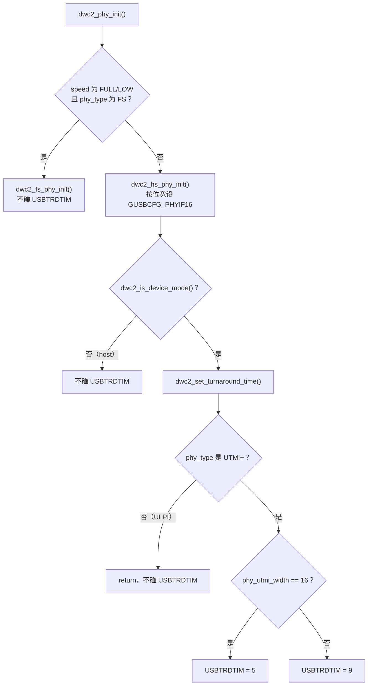

# DWC2 turnaround time：`GUSBCFG.USBTRDTIM` 的选值

> **内核版本**：Linux 6.8（`drivers/usb/dwc2/`）· 对照 STM32Cube HAL `stm32f7xx_ll_usb.c`  
> **子系统**：USB Gadget / DWC2 UDC  
> **摘要**：同一个 4 位寄存器字段，Linux 只看 UTMI+ 数据位宽给出 5 或 9，ST HAL 在全速下按 AHB 时钟频率查一张表。两种策略背后是对"这个字段在补偿什么"的不同假设。  
> **关联**：[DWC2 Gadget 三层接口总览](/analysis/kernel/usb/gadget-dwc2-interface) · [Gadget UDC bind 与 connect](/analysis/kernel/usb/gadget-udc-core-bind) · [Gadget composite EP0 与枚举](/analysis/kernel/usb/gadget-composite-ep0)

---

## 目录

- [1. USBTRDTIM 是什么](#1-usbtrdtim-是什么)
- [2. Linux dwc2 的选值：只看数据位宽](#2-linux-dwc2-的选值只看数据位宽)
- [3. 三道门：device 模式、HS PHY、UTMI+](#3-三道门device-模式hs-phyutmi)
- [4. phy_utmi_width 从哪里来](#4-phy_utmi_width-从哪里来)
- [5. 折算成时间：5 和 9 其实是同一个量](#5-折算成时间5-和-9-其实是同一个量)
- [6. 另一种策略：ST HAL 按 AHB 频率查表](#6-另一种策略st-hal-按-ahb-频率查表)
- [7. 两种策略的分歧点](#7-两种策略的分歧点)
- [8. 落到 STM32MP157：两个节点走两条路](#8-落到-stm32mp157两个节点走两条路)
- [9. 小结](#9-小结)
- [附录 A 端到端数据对照](#附录-a-端到端数据对照)
- [附录 B 源码索引](#附录-b-源码索引)
- [附录 C 要点速记](#附录-c-要点速记)

---

## 1. USBTRDTIM 是什么

`GUSBCFG` 是 DWC2 的全局 USB 配置寄存器，`USBTRDTIM` 是其中 **bit 13:10 的 4 位字段**：

```c
#define GUSBCFG_USBTRDTIM_MASK		(0xf << 10)
#define GUSBCFG_USBTRDTIM_SHIFT		10
```

字段单位是 **PHY 时钟周期数**，取值范围 0～15。它约束的是控制器**在 device 模式下响应 IN token 的周转时间**：主机发来 IN token 之后，控制器要从 Data FIFO 把数据取出来送上总线，这段准备时间就由 `USBTRDTIM` 拉开。

ST 在 HAL 里对这个字段写了一段很直白的注释，说明了它到底在补偿什么：

```c
/* The USBTRD is configured according to the tables below, depending on AHB frequency
used by application. In the low AHB frequency range it is used to stretch enough the USB response
time to IN tokens, the USB turnaround time, so to compensate for the longer AHB read access
latency to the Data FIFO */
```

**要补偿的是"从 Data FIFO 读数据的 AHB 访问延迟"。** 记住这一句，后面两种选值策略的分歧就都能解释了。

---

## 2. Linux dwc2 的选值：只看数据位宽

主线的实现在 `drivers/usb/dwc2/core.c`，整个函数只有十几行：

```c
static void dwc2_set_turnaround_time(struct dwc2_hsotg *hsotg)
{
	u32 usbcfg;

	if (hsotg->params.phy_type != DWC2_PHY_TYPE_PARAM_UTMI)
		return;

	usbcfg = dwc2_readl(hsotg, GUSBCFG);

	usbcfg &= ~GUSBCFG_USBTRDTIM_MASK;
	if (hsotg->params.phy_utmi_width == 16)
		usbcfg |= 5 << GUSBCFG_USBTRDTIM_SHIFT;
	else
		usbcfg |= 9 << GUSBCFG_USBTRDTIM_SHIFT;

	dwc2_writel(hsotg, usbcfg, GUSBCFG);
}
```

只有两个可能的值：**UTMI+ 数据通路 16 位写 5，否则写 9**。没有频率、没有设备树属性、没有运行时调整。

值得注意的是它**不看 AHB 时钟**——而 [§1](#1-usbtrdtim-是什么) 里 ST 的注释说这个字段正是用来补偿 AHB 延迟的。这处不一致先放着，[§7](#7-两种策略的分歧点) 再回来看。

---

## 3. 三道门：device 模式、HS PHY、UTMI+

这个函数不是每次初始化都会执行。调用点在同文件的 `dwc2_phy_init()`：

```c
int dwc2_phy_init(struct dwc2_hsotg *hsotg, bool select_phy)
{
	/* ... */
	if ((hsotg->params.speed == DWC2_SPEED_PARAM_FULL ||
	     hsotg->params.speed == DWC2_SPEED_PARAM_LOW) &&
	    hsotg->params.phy_type == DWC2_PHY_TYPE_PARAM_FS) {
		/* If FS/LS mode with FS/LS PHY */
		retval = dwc2_fs_phy_init(hsotg, select_phy);
		if (retval)
			return retval;
	} else {
		/* High speed PHY */
		retval = dwc2_hs_phy_init(hsotg, select_phy);
		if (retval)
			return retval;

		if (dwc2_is_device_mode(hsotg))
			dwc2_set_turnaround_time(hsotg);
	}
	/* ... */
}
```

连上函数内部的提前返回，一共要过三道门：

| 门 | 条件 | 不满足时 |
|----|------|----------|
| 1 | 走 **HS PHY** 分支（不是 FS/LS 速度 + FS PHY 的组合） | 走 `dwc2_fs_phy_init()`，**完全不设** |
| 2 | `dwc2_is_device_mode(hsotg)` 为真 | host 模式**不设** |
| 3 | `params.phy_type == DWC2_PHY_TYPE_PARAM_UTMI` | ULPI PHY 直接 `return`，**不设** |



三道门里最容易被忽略的是第二道：**host 模式下这个字段保持复位值或 bootloader 留下的值**，主线不去动它。这也符合字段语义——它约束的是对 IN token 的响应，只有做 device 时才需要。

顺带说明同一个 `phy_utmi_width` 在相邻函数里的另一处用途，在 `dwc2_hs_phy_init()` 中它决定 PHY 接口位宽选择位：

```c
	case DWC2_PHY_TYPE_PARAM_UTMI:
		/* UTMI+ interface */
		dev_dbg(hsotg->dev, "HS UTMI+ PHY selected\n");
		usbcfg &= ~(GUSBCFG_ULPI_UTMI_SEL | GUSBCFG_PHYIF16);
		if (hsotg->params.phy_utmi_width == 16)
			usbcfg |= GUSBCFG_PHYIF16;
		break;
```

**`GUSBCFG_PHYIF16` 与 `USBTRDTIM` 是同一个参数派生出的两处写入**，一个告诉控制器 PHY 通路多宽，一个据此给出周转时间。两者必须一致，所以它们共用 `params.phy_utmi_width`。

---

## 4. `phy_utmi_width` 从哪里来

既然结果完全由这一个参数决定，就得看它是怎么定下来的。入口是 `drivers/usb/dwc2/params.c` 的 `dwc2_init_params()`，一共四步，后面的可以覆盖前面的：

```c
int dwc2_init_params(struct dwc2_hsotg *hsotg)
{
	set_params_cb set_params;

	dwc2_set_default_params(hsotg);        /* 1. 按硬件配置寄存器推默认值 */
	dwc2_get_device_properties(hsotg);     /* 2. 读设备树属性 */

	set_params = device_get_match_data(hsotg->dev);
	if (set_params) {
		set_params(hsotg);             /* 3. 按 compatible 的平台 quirk */
	} else {
		/* ... PCI 分支省略 ... */
	}

	dwc2_check_params(hsotg);              /* 4. 与硬件能力校验，不合法则回退 */

	return 0;
}
```

**第 1 步**，`dwc2_set_default_params()` 调 `dwc2_set_param_phy_utmi_width()`，值来自硬件配置寄存器 `GHWCFG4`，再让通用 PHY 框架有机会修正：

```c
static void dwc2_set_param_phy_utmi_width(struct dwc2_hsotg *hsotg)
{
	int val;

	val = (hsotg->hw_params.utmi_phy_data_width ==
	       GHWCFG4_UTMI_PHY_DATA_WIDTH_8) ? 8 : 16;

	if (hsotg->phy) {
		/*
		 * If using the generic PHY framework, check if the PHY bus
		 * width is 8-bit and set the phyif appropriately.
		 */
		if (phy_get_bus_width(hsotg->phy) == 8)
			val = 8;
	}

	hsotg->params.phy_utmi_width = val;
}
```

`GHWCFG4` 里这个字段有三种取值，注意**"8 或 16 皆可"是独立的一种**：

```c
#define GHWCFG4_UTMI_PHY_DATA_WIDTH_MASK	(0x3 << 14)
#define GHWCFG4_UTMI_PHY_DATA_WIDTH_SHIFT	14
#define GHWCFG4_UTMI_PHY_DATA_WIDTH_8		0
#define GHWCFG4_UTMI_PHY_DATA_WIDTH_16		1
#define GHWCFG4_UTMI_PHY_DATA_WIDTH_8_OR_16	2
```

综合上面两段：硬件报 `_8` 才取 8，报 `_16` 或 `_8_OR_16` 都先取 16；只有挂了通用 PHY 且它自报 8 位总线宽度时才降回 8。

**第 2 步**读设备树。这里有一个容易误判的地方：`dwc2_get_device_properties()` 只读 `g-rx-fifo-size`、`g-np-tx-fifo-size`、`g-tx-fifo-size` 等 FIFO 属性和 `disable-over-current`，**没有任何设备树属性能直接改 `phy_utmi_width`**。想在板级改这个值，只能通过通用 PHY 的 bus width，或者第 3 步的平台表。

**第 3 步**是按 `compatible` 匹配到的平台函数，`dwc2_of_match_table[]` 里若干平台就是在这里硬写位宽的，例如：

```c
static void dwc2_set_loongson_params(struct dwc2_hsotg *hsotg)
{
	struct dwc2_core_params *p = &hsotg->params;

	p->phy_utmi_width = 8;
	p->power_down = DWC2_POWER_DOWN_PARAM_PARTIAL;
}
```

**第 4 步**校验。`dwc2_check_param_phy_utmi_width()` 把参数与 `GHWCFG4` 对一遍，不合法就丢弃、退回第 1 步的推导值：

```c
static void dwc2_check_param_phy_utmi_width(struct dwc2_hsotg *hsotg)
{
	int valid = 0;
	int param = hsotg->params.phy_utmi_width;
	int width = hsotg->hw_params.utmi_phy_data_width;

	switch (width) {
	case GHWCFG4_UTMI_PHY_DATA_WIDTH_8:
		valid = (param == 8);
		break;
	/* ... */
	case GHWCFG4_UTMI_PHY_DATA_WIDTH_8_OR_16:
		valid = (param == 8 || param == 16);
		break;
	}

	if (!valid)
		dwc2_set_param_phy_utmi_width(hsotg);
}
```

也就是说，**平台表里写的值也不是最终说了算**——若与硬件综合出来的能力冲突，会被静默改回去。排查这个字段时，光看平台函数里写了什么并不够。

---

## 5. 折算成时间：5 和 9 其实是同一个量

`5` 和 `9` 单看是两个魔数，换算成时间就有了意义。UTMI+ 在高速（480 Mbps）下，数据通路位宽与 PHY 时钟是配套的：

- 8 位通路：`8 bit × 60 MHz = 480 Mbps` → PHY 时钟 60 MHz
- 16 位通路：`16 bit × 30 MHz = 480 Mbps` → PHY 时钟 30 MHz

字段单位是 PHY 时钟周期，于是：

| 数据通路 | PHY 时钟 | `USBTRDTIM` | 折算时间 |
|----------|----------|-------------|----------|
| 8 位 | 60 MHz | 9 | 9 ÷ 60 MHz = **150 ns** |
| 16 位 | 30 MHz | 5 | 5 ÷ 30 MHz ≈ **167 ns** |

**两个值对应的是同一个数量级的墙上时间。** 位宽窄一半、时钟快一倍，要维持同样长的周转时间就得多给几个周期，所以 8 位那边反而是更大的数字 9。这一步换算也反过来印证了"单位是 PHY 时钟周期"这个前提没理解错。

---

## 6. 另一种策略：ST HAL 按 AHB 频率查表

同样是 DWC2 内核（STM32 的 OTG 控制器是 Synopsys 授权核），ST 在 `stm32f7xx_ll_usb.c` 里的做法完全不同：

```c
HAL_StatusTypeDef USB_SetTurnaroundTime(USB_OTG_GlobalTypeDef *USBx,
                                        uint32_t hclk, uint8_t speed)
{
  uint32_t UsbTrd;

  if (speed == USBD_FS_SPEED)
  {
    if ((hclk >= 14200000U) && (hclk < 15000000U))
    {
      /* hclk Clock Range between 14.2-15 MHz */
      UsbTrd = 0xFU;
    }
    /* ... 中间八档省略 ... */
    else /* if(hclk >= 32000000) */
    {
      /* hclk Clock Range between 32-200 MHz */
      UsbTrd = 0x6U;
    }
  }
  else if (speed == USBD_HS_SPEED)
  {
    UsbTrd = USBD_HS_TRDT_VALUE;
  }
  else
  {
    UsbTrd = USBD_DEFAULT_TRDT_VALUE;
  }

  USBx->GUSBCFG &= ~USB_OTG_GUSBCFG_TRDT;
  USBx->GUSBCFG |= (uint32_t)((UsbTrd << 10) & USB_OTG_GUSBCFG_TRDT);

  return HAL_OK;
}
```

写的是同一个位置（`<< 10`，同一个 4 位字段），入参却是 **AHB 时钟频率 `hclk`**。全速下 AHB 越慢、`UsbTrd` 给得越大，正好对上 [§1](#1-usbtrdtim-是什么) 那句注释：AHB 慢则读 FIFO 慢，需要把周转时间拉更长。

高速走的是常量：

```c
#define USBD_HS_TRDT_VALUE                     9U
#define USBD_FS_TRDT_VALUE                     5U
#define USBD_DEFAULT_TRDT_VALUE                9U
```

**`USBD_HS_TRDT_VALUE` 就是 9**，与 Linux 在 8 位数据通路下给的值一致——两边在这一档上是对齐的，只是到达方式不同。

全速档同样可以折算成时间。STM32 的全速 PHY 时钟为 48 MHz：

| `hclk` 区间 | `UsbTrd` | 折算时间 |
|-------------|----------|----------|
| 14.2–15 MHz | `0xF`（15） | 312.5 ns |
| 20–21.8 MHz | `0xA`（10） | 208.3 ns |
| 24–27.7 MHz | `0x8`（8） | 166.7 ns |
| ≥ 32 MHz | `0x6`（6） | 125.0 ns |

AHB 从 32 MHz 降到 14.2 MHz，周转时间被拉长到两倍半。

---

## 7. 两种策略的分歧点

把两边并排：

| | Linux dwc2 | STM32Cube HAL |
|---|-----------|---------------|
| 选值依据 | UTMI+ 数据通路位宽 | 速度 + AHB 时钟频率 |
| 取值 | 16 位→5，其余→9 | FS：按 `hclk` 十档查表（`0xF`～`0x6`）；HS：固定 9 |
| 何时执行 | 仅 device 模式、HS PHY、UTMI+ | 由应用在初始化时显式调用 |
| ULPI PHY | 提前返回，不设置 | 不区分 |
| 随时钟变化 | 否 | 全速档是 |

分歧的根源是对"这个字段补偿什么"的取舍不同。ST 把它当作 **AHB 侧延迟的补偿旋钮**，所以必须把 `hclk` 纳进来；Linux 只把它当作 **PHY 侧时钟域的换算**，默认 AHB 足够快，给一个够用的常数即可。

对绝大多数跑 Linux 的 SoC 来说，后一个假设是成立的——AHB 通常在几十上百 MHz，远在 ST 那张表需要补偿的区间之外。但这个前提值得写下来：**主线的常数不随 AHB 频率变化**，如果某个平台的总线频率明显偏低，或者到 Data FIFO 的访问路径上有额外延迟，主线不会自动补偿这一部分。ST 的那张表恰好给出了"要补多少"的量化参考。

---

## 8. 落到 STM32MP157：两个节点走两条路

`dwc2_of_match_table[]` 里 ST 平台占了五项：

```c
	{ .compatible = "st,stm32f4x9-fsotg",
	  .data = dwc2_set_stm32f4x9_fsotg_params },
	{ .compatible = "st,stm32f4x9-hsotg" },
	{ .compatible = "st,stm32f7-hsotg",
	  .data = dwc2_set_stm32f7_hsotg_params },
	{ .compatible = "st,stm32mp15-fsotg",
	  .data = dwc2_set_stm32mp15_fsotg_params },
	{ .compatible = "st,stm32mp15-hsotg",
	  .data = dwc2_set_stm32mp15_hsotg_params },
```

拿 STM32MP157 的两个节点对照，结果正好落在 [§3](#3-三道门device-模式hs-phyutmi) 那三道门的两侧。

**`st,stm32mp15-fsotg`** 的平台函数把速度和 PHY 类型都钉死在全速：

```c
static void dwc2_set_stm32mp15_fsotg_params(struct dwc2_hsotg *hsotg)
{
	struct dwc2_core_params *p = &hsotg->params;
	/* ... */
	p->speed = DWC2_SPEED_PARAM_FULL;
	/* ... */
	p->phy_type = DWC2_PHY_TYPE_PARAM_FS;
	p->i2c_enable = false;
	p->activate_stm_fs_transceiver = true;
	/* ... */
}
```

`speed == FULL` 且 `phy_type == FS`，`dwc2_phy_init()` 走进 `dwc2_fs_phy_init()` 分支——**第一道门就没过，`USBTRDTIM` 全程不被写入**。

**`st,stm32mp15-hsotg`** 则完全不碰 `speed` / `phy_type` / `phy_utmi_width`：

```c
static void dwc2_set_stm32mp15_hsotg_params(struct dwc2_hsotg *hsotg)
{
	struct dwc2_core_params *p = &hsotg->params;

	p->otg_caps.hnp_support = false;
	p->otg_caps.srp_support = false;
	p->otg_caps.otg_rev = 0x200;
	p->activate_stm_id_vb_detection = !device_property_read_bool(hsotg->dev, "usb-role-switch");
	p->host_rx_fifo_size = 440;
	p->host_nperio_tx_fifo_size = 256;
	p->host_perio_tx_fifo_size = 256;
	/* ... */
}
```

这三个参数就保持 [§4](#4-phy_utmi_width-从哪里来) 第 1 步从 `GHWCFG4` 推出来的结果。于是这个节点在 device 模式下会走完三道门，最终值取决于该片子综合出来的 UTMI+ 位宽。

**同一颗 SoC 上的两个 USB 控制器，一个根本不执行这段代码，一个执行**。查这个字段时先确认自己在哪个节点上，比直接去读寄存器更省事。

---

## 9. 小结

- `USBTRDTIM` 是 `GUSBCFG` 的 bit 13:10，单位是 PHY 时钟周期，约束 device 模式下对 IN token 的响应周转时间。
- 主线只在**device 模式 + HS PHY + UTMI+** 三个条件同时成立时写这个字段，host 模式和 ULPI 都不写。
- 主线取值只有两个：UTMI+ 16 位写 5，其余写 9；折算成时间分别约 167 ns 和 150 ns，是同一个量级。
- `phy_utmi_width` 由 `GHWCFG4` 推导，可被通用 PHY 的 bus width 和 compatible 平台表覆盖，最后还要过一遍 `dwc2_check_param_phy_utmi_width()` 校验；**没有设备树属性能直接改它**。
- ST HAL 写同一个字段，全速下按 AHB 频率查十档表，把它当作 AHB 读 FIFO 延迟的补偿；高速固定为 9，与主线 8 位分支一致。
- 两种策略的差别在于是否把 AHB 频率纳入考虑。主线假定 AHB 足够快，这个假设在低总线频率的平台上需要自己确认。

---

## 附录 A 端到端数据对照

| 场景 | PHY 类型 | 数据通路 | PHY 时钟 | `USBTRDTIM` | 折算时间 |
|------|----------|----------|----------|-------------|----------|
| Linux · HS device | UTMI+ | 16 位 | 30 MHz | 5 | ≈167 ns |
| Linux · HS device | UTMI+ | 8 位 | 60 MHz | 9 | 150 ns |
| Linux · HS device | ULPI | — | — | 不写入 | — |
| Linux · host 模式 | 任意 | — | — | 不写入 | — |
| Linux · FS 速度 + FS PHY | FS | — | — | 不写入 | — |
| ST HAL · HS device | — | — | — | 9 | — |
| ST HAL · FS，`hclk` ≥ 32 MHz | FS | — | 48 MHz | `0x6` | 125.0 ns |
| ST HAL · FS，`hclk` 24–27.7 MHz | FS | — | 48 MHz | `0x8` | 166.7 ns |
| ST HAL · FS，`hclk` 20–21.8 MHz | FS | — | 48 MHz | `0xA` | 208.3 ns |
| ST HAL · FS，`hclk` 14.2–15 MHz | FS | — | 48 MHz | `0xF` | 312.5 ns |

---

## 附录 B 源码索引

| 位置 | 内容 |
|------|------|
| `drivers/usb/dwc2/hw.h` — `GUSBCFG_USBTRDTIM_MASK` / `_SHIFT` | 字段定义：`0xf << 10` |
| 同文件 — `GHWCFG4_UTMI_PHY_DATA_WIDTH_*` | 硬件综合出的位宽能力：`_8` / `_16` / `_8_OR_16` |
| `drivers/usb/dwc2/core.c` — `dwc2_set_turnaround_time()` | 按位宽写 5 或 9 |
| 同文件 — `dwc2_phy_init()` | 三道门：HS 分支、device 模式、UTMI+ |
| 同文件 — `dwc2_hs_phy_init()` | 同一参数派生的 `GUSBCFG_PHYIF16` |
| `drivers/usb/dwc2/params.c` — `dwc2_init_params()` | 参数四步：默认 → 设备树 → 平台表 → 校验 |
| 同文件 — `dwc2_set_param_phy_utmi_width()` | 由 `GHWCFG4` 与通用 PHY bus width 推导 |
| 同文件 — `dwc2_check_param_phy_utmi_width()` | 与硬件能力校验，不合法则回退 |
| 同文件 — `dwc2_of_match_table[]` | `st,stm32mp15-fsotg` / `-hsotg` 等平台入口 |
| STM32Cube HAL `Src/stm32f7xx_ll_usb.c` — `USB_SetTurnaroundTime()` | 按 `hclk` 查表的另一种策略 |
| STM32Cube HAL `Inc/stm32f7xx_ll_usb.h` | `USBD_HS_TRDT_VALUE` = 9、`USBD_FS_TRDT_VALUE` = 5 |

---

## 附录 C 要点速记

1. 字段位置 `GUSBCFG[13:10]`，单位是 **PHY 时钟周期**，不是纳秒——比较不同位宽的值之前先折算。
2. 主线只在 device 模式写它；**host 模式下读到的值不是驱动设的**。
3. ULPI PHY 走 `phy_type != UTMI` 的提前返回，主线完全不管这个字段。
4. 想改 `phy_utmi_width` 没有设备树属性可用，路径是通用 PHY 的 bus width 或 compatible 平台表，且会被 `dwc2_check_param_phy_utmi_width()` 复核。
5. `GUSBCFG_PHYIF16` 与 `USBTRDTIM` 同源于 `phy_utmi_width`，两者必须一致。
6. 主线的常数不随 AHB 频率变化；ST HAL 的十档表可作为"低 AHB 频率下要补多少"的量化参考。
