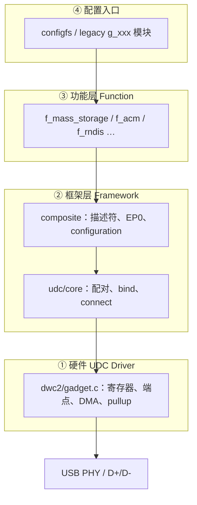

# Linux USB Gadget 子系统概览

> **内核**：Linux 5.4 源码（dwc2 dual-role 平台对照）；路径与 Linux 6.8 同源，差异处另行注明  
> **子系统**：USB Gadget（Device 侧）· UDC / composite / configfs  
> **关联**：[USB 2.0 枚举流程](/analysis/kernel/usb/usb-enumeration) · [枚举与两轮 Probe](/analysis/kernel/usb/enumeration-and-probe)（Host 侧对照）· [Configfs 组装分析](/analysis/kernel/usb/gadget-configfs-assembly) · [Gadget CDC ACM 串口实践](/analysis/kernel/usb/gadget-cdc-acm)

---

## 目录

- [1. 核心问题](#1-核心问题)
- [2. 四层架构](#2-四层架构)
- [3. 四个关键对象](#3-四个关键对象)
- [4. 两阶段生命周期](#4-两阶段生命周期)
- [5. 三条「绑定链」](#5-三条绑定链勿混为一谈)
- [6. configfs 与 gadget_info](#6-configfs-与-struct-gadget_info)
- [7. 控制面 vs 数据面](#7-控制面-vs-数据面)
- [8. 与 Host 侧的对称](#8-与-host-侧hcd的对称)
- [9. 源码阅读顺序](#9-源码阅读顺序按设计非按目录)
- [10. 关键函数速查](#10-关键函数速查)
- [11. 总览图](#11-总览图)
- [12. 三句话总结](#12-三句话总结)
- [13. 关联文档](#13-关联文档)

---

## 1. 核心问题

USB Gadget 子系统要回答：

> **一块 USB 控制器硬件，如何在内核里变成 Host 可枚举、可使用的 USB 从机设备？**

设计答案：**分层 + 延迟绑定**——硬件先注册，功能后装配，两者在运行时配对；pullup 在装配完成后再接通。

## 2. 四层架构



| 层 | 主要路径 | 职责 | 不应做 |
|---|---|---|---|
| 硬件 UDC | `drivers/usb/dwc2/gadget.c` | 端点、EP0、中断、pullup、Buffer DMA | 不知道自己是 U 盘还是串口 |
| 框架 | `drivers/usb/gadget/udc/core.c`<br>`drivers/usb/gadget/composite.c` | UDC 配对、EP0 分发、描述符框架 | 不实现具体 USB 类协议 |
| 功能 Function | `drivers/usb/gadget/function/f_*.c` | USB 类协议与业务逻辑 | 不直接写 SoC 寄存器 |
| 配置入口 | `drivers/usb/gadget/configfs.c`<br>`drivers/usb/gadget/legacy/` | 用户决定「扮演什么设备」 | 不参与 bulk/int 传输 |

**抽象边界**：功能层只通过 `usb_gadget`、`usb_ep`、`usb_request` 访问硬件（`include/linux/usb/gadget.h`），与具体 UDC 驱动解耦。

## 3. 四个关键对象

每个对象只回答一个问题：

| 对象 | 回答的问题 | 谁创建 | 生命周期 |
|---|---|---|---|
| `struct usb_gadget` | 这块硬件有哪些端点、能跑多快？ | UDC 驱动（dwc2） | 随 UDC probe/remove |
| `struct usb_udc` | 内核如何管理、sysfs 暴露、绑定功能驱动？ | `usb_add_gadget_udc()` | 与 `usb_gadget` 1:1 |
| `struct usb_gadget_driver` | 这块硬件要扮演什么 USB 设备？ | configfs / legacy 模块 | 写 UDC / insmod 时绑定 |
| `struct usb_composite_dev` | 枚举需要哪些描述符、config、function？ | `bind()` 回调内装配 | bind 期间建立，unbind 销毁 |

关系：

```text
usb_udc  ──管理──► usb_gadget
usb_gadget_driver  ──绑定到──► usb_udc
usb_composite_dev  ──挂在──► usb_gadget（bind 时）
usb_function  ──属于──► usb_configuration
```

`usb_udc` 定义于 `drivers/usb/gadget/udc/core.c`（非公开头文件）；`usb_gadget` 内嵌 `struct usb_udc *udc` 反向指针。

## 4. 两阶段生命周期

### 4.1 阶段 A：硬件注册（boot / dwc2 probe）

```text
dwc2_driver_probe()                    // platform.c
  … dr_mode 判定、dwc2_get_hwparams …
  if (dr_mode != HOST)
      dwc2_gadget_init()               // gadget.c
          初始化 hsotg->gadget、端点
          usb_add_gadget_udc(dev, &hsotg->gadget)
              创建 usb_gadget + usb_udc
              加入 udc_list
              /sys/class/udc/<name> 出现
  if (dr_mode != PERIPHERAL)
      dwc2_hcd_init()
  dwc2_drd_init()                      // OTG + role-switch
```

此时：**有控制器抽象，无 USB 设备功能**，通常尚未 pullup。

双角色 OTG：`dr_mode = "otg"` 时 Gadget 与 HCD **均初始化**；运行期 Host/Device 切换由 `usb-role-switch`（及 extcon 等）完成（`drd.c`）。

### 4.2 阶段 B：功能绑定（用户写 UDC / insmod）

```text
echo "<udc-name>" > .../UDC              // configfs；名见 /sys/class/udc/
  gadget_dev_desc_UDC_store()           // configfs.c
    usb_gadget_probe_driver(&gi->composite.gadget_driver)
      udc_bind_to_driver(udc, driver)   // udc/core.c
        ① udc->driver = driver
        ② driver->bind(gadget, driver)  // configfs_composite_bind
        ③ usb_gadget_udc_start()        // dwc2: hsotg->driver = driver
        ④ usb_udc_connect_control()     // pullup
```

**设计意图**：

- 功能驱动与 UDC 驱动 **probe 顺序无关** → `gadget_driver_pending_list`（`udc/core.c`）
- pullup 在 bind 成功 **之后**，避免 Host 枚举半成品

### 4.3 probe 顺序无关：pending 列表

| 谁先发生 | 行为 |
|---|---|
| 功能驱动先（insmod / 写 UDC 时 UDC 未就绪） | `usb_gadget_probe_driver()` → 加入 `gadget_driver_pending_list` |
| UDC 后（`usb_add_gadget_udc`） | `check_pending_gadget_drivers()` 补绑 |
| UDC 删除时仍有绑定驱动 | `usb_del_gadget_udc()` → unbind 后驱动重新入 pending |

## 5. 三条「绑定链」（勿混为一谈）

| 链 | 位置 | 绑定内容 |
|---|---|---|
| ① UDC 管理 | `udc_bind_to_driver()` 1352–1354 行 | `udc->driver`、`gadget->dev.driver` |
| ② Composite 装配 | `driver->bind()` → `configfs_composite_bind()` | `cdev->gadget`、`usb_add_function()`、描述符/端点 |
| ③ 硬件 dispatch | `usb_gadget_udc_start()` → dwc2 `udc_start()` | `hsotg->driver`（EP0 中断调 `->setup()`） |

```text
① 管理关系（谁驱动这块 UDC）
② 软件装配（Host 看到什么设备）
③ 硬件回调（中断里找 setup）
④ pullup（物理可见）—— 在 ②③ 之后
```

## 6. configfs 与 `struct gadget_info`

configfs 是功能层的 **动态配置前端**，不是硬件层。

### 6.1 目录与内核对象

```text
/sys/kernel/config/usb_gadget/g1/
├── idVendor, idProduct, …     → gi->cdev.desc
├── UDC                        → gadget_dev_desc_UDC_store
├── functions/
│   └── mass_storage.0/        → usb_function_instance
├── configs/
│   └── c.1/                   → config_usb_cfg → gi->cdev.configs
│       └── mass_storage.0 →   → cfg->func_list（symlink）
└── strings/
```

用户 `mkdir usb_gadget/g1` → `gadgets_make()` → 分配 **`struct gadget_info`**：

- configfs 目录树（`group`、`functions_group`、`configs_group` …）
- 内嵌 `usb_composite_dev cdev`、`usb_composite_driver composite`
- 写 UDC 时用 `composite.gadget_driver`（模板 `configfs_driver_template`）注册

### 6.2 `gi->cdev.configs` 从哪来

| 操作 | 内核路径 |
|---|---|
| `mkdir configs/c.1` | `config_desc_make()` → `usb_add_config_only(&gi->cdev, &cfg->c)` |
| `ln -s …/functions/xxx configs/c.1/` | `config_usb_cfg_link()` → `cfg->func_list` |
| 写 UDC | `configfs_composite_bind()` → `usb_add_function()` → 各 `function->bind()` |

### 6.3 UDC 文件：启停开关

`gadget_dev_desc_UDC_store()`（写 `/UDC` 时）：

- 非空 UDC 名 → `usb_gadget_probe_driver()` → 整条 bind 链
- 空字符串 → `usb_gadget_unregister_driver()` → 解绑

## 7. 控制面 vs 数据面

### 7.1 控制面（枚举，EP0）

```text
Host Setup Token
  → dwc2 EP0 中断
  → dwc2 处理 SET_ADDRESS、GET/SET_FEATURE 等
  → hsotg->driver->setup()          // composite_setup
  → GET_DESCRIPTOR / SET_CONFIGURATION / SET_INTERFACE
  → function 描述符与 set_alt
```

EP0 Control Write/Read 阶段机（Setup / Data / Status）待单独成文迁入。

### 7.2 数据面（bulk / interrupt / isoch）

```text
Host IN/OUT
  → dwc2 端点中断
  → usb_request.complete 回调
  → f_mass_storage / f_acm 等业务逻辑
```

## 8. 与 Host 侧（HCD）的对称

| | Host 侧 | Device 侧（Gadget） |
|---|---|---|
| 硬件驱动 | `dwc2/hcd.c` | `dwc2/gadget.c` |
| 核心框架 | `usbcore`、`hub` | `udc/core`、`composite` |
| 「设备驱动」 | `usb-storage`、`cdc_acm` | `f_mass_storage`、`f_acm` |
| 枚举 | Host 发 Setup | Device 回描述符 |
| 绑定回调 | `usb_probe()` / `probe()` | `driver->bind()` |

同一块 DWC2：`dr_mode=otg` 时两套栈均初始化，role-switch 切换。

## 9. 源码阅读顺序（按设计，非按目录）

| 顺序 | 文件 | 关注点 |
|---|---|---|
| 1 | `include/linux/usb/gadget.h` | `usb_gadget`、`usb_ep`、`usb_gadget_driver` 抽象 |
| 2 | `drivers/usb/gadget/udc/core.c` | `usb_add_gadget_udc`、`udc_bind_to_driver`、pending 列表 |
| 3 | `drivers/usb/gadget/composite.c` | `usb_add_config_only`、`usb_add_function`、`composite_setup` |
| 4 | `drivers/usb/gadget/configfs.c` | `gadget_info`、`gadget_dev_desc_UDC_store`、`configfs_composite_bind` |
| 5 | `drivers/usb/dwc2/gadget.c` | `dwc2_gadget_init`、`udc_start`、`setup` 转发、pullup |
| 6 | `drivers/usb/dwc2/platform.c` | probe 中 Gadget/HCD/DRD 分支 |
| 7 | `drivers/usb/gadget/function/f_mass_storage.c` | 单一 function 示例 |

## 10. 关键函数速查

| 函数 | 文件 | 作用 |
|---|---|---|
| `dwc2_get_dr_mode()` | `dwc2/platform.c` | 确定 `hsotg->dr_mode` |
| `dwc2_gadget_init()` | `dwc2/gadget.c` | 初始化 gadget、注册 UDC |
| `usb_add_gadget_udc()` | `udc/core.c` | 创建 `usb_udc`，加入 `udc_list` |
| `gadget_dev_desc_UDC_store()` | `configfs.c` | 写 UDC → probe/unregister driver |
| `usb_gadget_probe_driver()` | `udc/core.c` | 匹配 UDC 或入 pending |
| `udc_bind_to_driver()` | `udc/core.c` | 管理绑定 + 调 `bind` + `udc_start` + connect |
| `configfs_composite_bind()` | `configfs.c` | 装配 composite、function、描述符 |
| `usb_add_function()` | `composite.c` | function bind、端点 autoconfig |
| `composite_setup()` | `composite.c` | EP0 标准请求分发 |
| `dwc2_hsotg_ep0_setup()` | `dwc2/gadget.c` | 硬件 EP0 → `driver->setup()` |

## 11. 总览图

```text
[用户] configfs 配置 + echo UDC
           │
           ▼
[gadget_info] ──gadget_driver──► usb_gadget_probe_driver
           │                              │
           │                      udc_bind_to_driver
           │                       ├─ udc ↔ driver
           │                       ├─ bind: cdev/function/EP
           │                       ├─ udc_start: hsotg->driver
           │                       └─ connect: pullup
           ▼
[Host EP0] ──setup──► composite_setup ──► function
[Host 数据] ──bulk/int──► dwc2 EP ──request──► function
```

## 12. 三句话总结

1. **硬件与功能解耦**：UDC 驱动只提供 `usb_gadget`；U 盘/串口由 function 决定。
2. **注册与绑定分离**：`usb_add_gadget_udc` 先注册硬件；`bind` 后装配软件；pullup 最后。
3. **控制与数据分离**：EP0 走 composite 统一枚举；数据 EP 各 function 独立 queue request。

`gadget_info`、`gadget_driver_pending_list`、`dr_mode` 等均服务于 **动态配置、probe 顺序无关、双角色**，宜在此框架下理解，而非孤立记 API。

## 13. 关联文档

| 文档 | 内容 |
|---|---|
| [Configfs 组装分析](/analysis/kernel/usb/gadget-configfs-assembly) | `gadget_info` / `cdev` / `composite` 脚本拼装与 bind |
| [Gadget CDC ACM 串口实践](/analysis/kernel/usb/gadget-cdc-acm) | configfs ACM、`ttyGS0` 与 Host `cdc_acm` |
| dwc2 OTG 深读（待迁入） | dwc2 probe、时钟、DRD、role-switch |
| dwc2_gadget_control_write_analysis（待迁入） | EP0 Control Write/Read、Setup/Data/Status |
| dwc2_gadget_dma_analysis（待迁入） | Buffer DMA、DxEPDMA |
| dwc2_gadget_soft_connect_analysis（待迁入） | soft_connect、DCTL.SFTDISCON |
