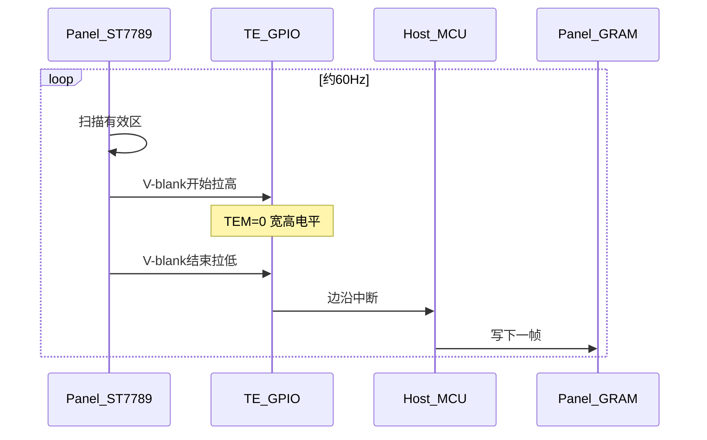

# ST7789 TE 信号：作用、配置与逻辑分析仪实测

> **平台**：MCU + ST7789 类面板（i8080 / SPI 写 GRAM）  
> **工具**：DSLogic 逻辑分析仪（采样率 1 MHz）  
> **内核对照**：Linux 6.8 · `drivers/staging/fbtft/fb_st7789v.c`  
> **本文**：TE 是什么、屏侧如何打开、`TEM=0/1` 波形差异、主机抓沿；Linux 写屏前会等一次 TE

---

## 目录

- [1. TE 用来做什么](#1-te-用来做什么)
- [2. 屏侧如何打开 TE](#2-屏侧如何打开-te)
- [3. TEM=0：只出场消隐](#3-tem0只出场消隐)
- [4. TEM=1：场消隐 + 行消隐](#4-tem1场消隐--行消隐)
- [5. 主机该抓上升沿还是下降沿](#5-主机该抓上升沿还是下降沿)
  - [5.1 写得快用 1× 上升沿，写得慢用 2× 下降沿](#51-写得快用-1-上升沿写得慢用-2-下降沿)
- [6. Linux 6.8 如何处理 TE](#6-linux-68-如何处理-te)
- [7. 刷图时怎么用 TE](#7-刷图时怎么用-te)
- [8. 小结](#8-小结)

---

## 1. TE 用来做什么

**TE（Tearing Effect）** 是面板输出给主机的同步信号，用来降低写 GRAM 时的画面撕裂。

屏按自己的节奏扫描 GRAM 并点亮像素。主机在扫描途中改写显存时，同一帧画面可能上下两截分属新旧内容，这就是撕裂。TE 标出相对安全的相位（典型是垂直消隐），主机在对应边沿启动下一帧写入。

一句话：**TE 是屏侧给出的写 GRAM 节拍。**

---

## 2. 屏侧如何打开 TE

初始化时向屏写入（命令字节为 ST7789 手册编号）：

```text
PORCTRL  (0xB2)  ← 0x0C, 0x0C, 0x00, 0x33, 0x33   # 前后 porch 等
FRCTRL2  (0xC6)  ← 0x0F                           # 帧率档位，约 60 Hz
TEON     (0x35)  ← 0x00                           # 打开 TE，TEM=0
```

| 命令 | 本次取值 | 含义 |
|------|----------|------|
| `TEON (0x35)` | 参数 `0` | 打开 TE，`TEM=0`：只输出场消隐信息 |
| `STE (0x44)` | 未配置 | 使用默认 tear scanline（多为 0） |
| `FRCTRL2 (0xC6)` | `0x0F` | 标称约 60 Hz，决定 TE 出现周期 |
| `PORCTRL (0xB2)` | `BPA/FPA=0x0C` | 前后 porch 各约 12 行，影响 V-blank 宽度 |

主机侧把 TE 脚配成 GPIO 输入，在边沿上进中断，再决定是否启动一帧写屏。

---

## 3. TEM=0：只出场消隐

`TEM=0` 时，TE 大致行为：

1. 屏约 60 Hz 扫 GRAM  
2. **进入垂直消隐（V-blank）→ TE 拉高**  
3. **离开 V-blank、开始扫有效区 → TE 拉低**  
4. 每帧基本只有 **一个较宽的正脉冲**

### 3.1 实测波形


光标量到的典型值（一次抓取，见上图）：

| 测量项 | 约值 | 含义 |
|--------|------|------|
| 上升沿 → 下降沿 | **1.157 ms** | TE 高电平 ≈ V-blank |
| 下降沿 → 下一上升沿 | **15.691 ms** | TE 低电平 ≈ 有效扫描区 |
| 二者之和（帧周期） | **≈ 16.85 ms** | ≈ **59.4 Hz** |

帧周期取同名沿间隔（上升→上升或下降→下降）；上表用高、低电平相加，与另一次测得的下降沿间隔约 **16.831 ms**（≈ 59.4 Hz）一致。手册「60 Hz」是标称档位，内部 OSC、porch、总行数会让实测周期落在附近。

### 3.2 高电平为何约 1.16 ms

`TEM=0` 下，高电平时段对应 V-blank。porch 约 24 行、有效区按 320 行估：

```text
V-blank ≈ 24 / (320 + 24) × 16.8 ms ≈ 1.17 ms
```

与测到的 ~1.16 ms 同量级。

---

## 4. TEM=1：场消隐 + 行消隐

把 `TEON` 参数改为 `1`（`TEM=1`）后，TE 在有效扫描区还会于 **每行消隐（H-blank）** 拉高一小段：

```text
一行内：
|---- 有效像素显示 ----|---- H-blank ----|
TE: ________低_________|______高________|
```

因此一帧内会出现 **大量窄脉冲**（数量接近屏高）。

### 4.1 实测波形


同一次测量里，光标跨度约 **16.563 ms**（约一帧），其间上升沿约 **321** 次，与 320 行量级一致。时间轴较宽时，窄脉冲会糊成「实心白块」。

平均行周期约：

```text
16.563 ms / 321 ≈ 51.6 μs/行
```

整帧刷屏通常只需要场消隐节拍，用 `TEM=0` 即可；`TEM=1` 适合按行对齐的局部更新。

---

## 5. 主机该抓上升沿还是下降沿

主机用 GPIO 边沿中断对齐 TE。`TEM=0` 时 TE 在 V-blank 为高：

| 沿 | 时刻 | 常见用法 |
|----|------|----------|
| 上升沿 | V-blank **开始** | 写得快：在消隐内起笔，本帧扫描尽快读到新数据 |
| 下降沿 | V-blank **结束** / 有效区开扫 | 写得慢：写指针跟在扫描线后面，本帧仍显示旧内容，新内容留给下一帧 |

选型可对照 SSD1963 应用笔记、ST7789 手册「MPU 快/慢于 panel read」两例，以及乐鑫 TE 防撕裂说明：

1. 先开 TE（`0x35`，整帧刷屏常用 `TEM=0`）；需要时用 `0x44` 调 tear scanline。  
2. **抓哪条沿看写速相对扫描速**：快路径用上升沿抢消隐；慢路径用下降沿跟在扫描后面写。  
3. TE 标的是**起笔相位**；一帧写完还依赖总线带宽。乐鑫在 TE 已同步、读写同向的模型里，写速大约不低于扫描速的一半，写指针与扫描线就不容易在 GRAM 中段交叉。  
4. 最终以运动画面实测为准；带宽偏紧时可提高总线时序、缩小更新区域，或降低换帧率。

### 5.1 写得快用 1× 上升沿，写得慢用 2× 下降沿

乐鑫 `lcd_with_te` 一类示例在初始化注释里，按「传完时间是否小于刷新窗口 `time_Tvdl`」给出抓沿与周期：

| 总线 / 假设 | 抓沿 | 注释大意 |
|-------------|------|----------|
| I80，传完时间 **小于** 刷新窗口 | 上升沿（`GPIO_INTR_POSEDGE`） | 采用 **1×** 场周期，在上升沿开传 |
| QSPI，传完时间 **超过** 刷新窗口 | 下降沿（`GPIO_INTR_NEGEDGE`） | 采用 **2×** 场周期，在下降沿开传 |

「2× 周期」是工程折中：单帧传不完一场的安全窗时，用更稀的对齐节奏，让写指针更稳地落在扫描线后面。TE 决定**从哪个相位起笔**；整帧 DMA / 总线时间与一场扫描的快慢关系，仍由写屏带宽决定。

---

## 6. Linux 6.8 如何处理 TE

Linux 6.8 的 `fb_st7789v`（`drivers/staging/fbtft/fb_st7789v.c`）在配置了 `te-gpios` 时，每次经 `write_vmem` 写屏前会先等一次 TE 上升沿，再把 framebuffer 脏区经 SPI 写入屏 GRAM：

```c
/* drivers/staging/fbtft/fb_st7789v.c — write_vmem() */
if (irq_te) {
	enable_irq(irq_te);
	reinit_completion(&panel_te);
	ret = wait_for_completion_timeout(&panel_te,
					  msecs_to_jiffies(PANEL_TE_TIMEOUT_MS));
	if (ret == 0)
		dev_err(dev, "wait panel TE timeout\n");

	disable_irq(irq_te);
}

/* 随后 fbtft_write_vmem16_bus8/9/16(...) 经 SPI 写 GRAM */
```

上升沿中断里只做 `complete(&panel_te)`：

```c
static irqreturn_t panel_te_handler(int irq, void *data)
{
	complete(&panel_te);
	return IRQ_HANDLED;
}
```

---

## 7. 刷图时怎么用 TE

TE 路径上常见两步：

| 动作 | 作用 |
|------|------|
| 准备下一帧 | 在内存里画好 / 换好缓冲 |
| TE 中断里启动写屏 | 经 i8080 / SPI 把当前帧写入屏 GRAM |

也可每 N 个 TE 才写一帧：屏 TE ≈ 60 Hz、N=3 时，换图大约 20 次/秒。TE 管**相位与节拍**；单帧能否在下一拍前送完，看写屏带宽。



---

## 8. 小结

1. **TE** 由屏在扫描节拍下产生，供主机对齐写 GRAM，减轻撕裂。  
2. **`TEON` + `TEM=0`**：每帧一个宽脉冲，高电平 ≈ V-blank（实测约 1.16 ms）；周期落在标称 60 Hz 附近。  
3. **`TEM=1`**：叠加行消隐窄脉冲（实测约 321 次/帧）；整帧刷屏用 `TEM=0` 即可。  
4. **抓沿**：按写速相对扫描速选型；快路径常见 1× + 上升沿，慢路径常见 2× + 下降沿。  
5. **Linux 6.8 fbtft**：写屏前等一次 TE，再经 SPI 写 GRAM。  
6. **工程上**：TE 管相位；写速与扫描速匹配（乐鑫模型里约写速 ≳ 扫速一半）再配合实测画面。

---

## 参考

- Sitronix ST7789 数据手册：`TEON (35h)` / `TEOFF (34h)` / `STE (44h)`，以及 TE 章节中 MPU 快/慢于 panel read 的示例  
- Linux 6.8：`drivers/staging/fbtft/fb_st7789v.c` — `write_vmem` 写屏前等 TE  
- [Espressif：LCD Screen Tearing](https://docs.espressif.com/projects/esp-iot-solution/zh_CN/release-v2.0/display/lcd/lcd_screen_tearing.html) — TE 同步与写/读速度关系  
- Espressif `lcd_with_te` 示例：`bsp_display_lcd_init` 中 I80 1× 上升沿 / QSPI 2× 下降沿注释  
- Solomon SSD1963 Tearing Effect 应用笔记 — 快 MCU 抓上升沿、慢 MCU 抓下降沿  
- 附件波形：[tem_0.png](/files/tem_0.png)（`TEM=0`）、[tem_1.png](/files/tem_1.png)（`TEM=1`）
