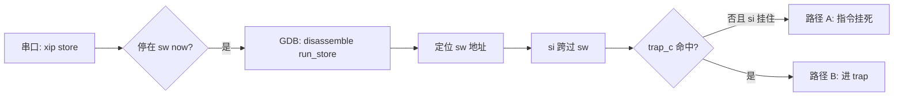

# Cursor 协助定位一次 I-BUS XIP 写挂死

> **平台**：RISC-V MCU（E906 类核），Flash XIP 映射在 I-BUS  
> **现象**：向 XIP 地址执行 `store` 后串口停住，无异常打印  
> **本文**：记录如何用 Cursor 设计验证方案、读反汇编、把现象收敛到具体指令  
> **材料**：最小 `xip store` 测试命令与 GDB 会话记录

---

## 目录

- [1. 现象](#1-现象)
- [2. 验证方案](#2-验证方案)
- [3. 串口实验](#3-串口实验)
- [4. GDB：从函数断点到具体 sw](#4-gdb从函数断点到具体-sw)
- [5. Cursor 在哪些环节有用](#5-cursor-在哪些环节有用)
- [6. 结论](#6-结论)
- [附录 A 测试代码片段](#附录-a-测试代码片段)
- [附录 B GDB 命令速查](#附录-b-gdb-命令速查)

---

记录一次用 cursor 协助验证某个问题的过程。本人是一点也不懂 riscv 汇编的，甚至都不怎么懂得搭建 gdb 的调试环境，但是通过和 cursor 交互，即使不懂，也能把问题搞定。
让 cursor 来设计实验方案，让 cursor 来教我怎么搭建 gdb 调试环境，gdb 跑起来之后，直接把控制台的输出给 cursor 让他告诉我下一步怎么做，就能一步步得到想要的结果。
甚至我不懂汇编，也能让 cursor 现给我翻译......包括这篇文章，除了这段话，都是 cursor 帮忙生成的......

## 1. 现象

测试命令在真正发 `sw` 前后各打一行串口日志，用来判断 CPU 停在哪一阶段：

- `sw now`：紧挨在内联 `sw` **之前**打印；若能看到这行、后面再无输出，说明程序已执行到写指令入口
- `UNEXPECTED: store returned`：在 `sw` **之后**打印；若出现，说明 store 指令已退休并返回到 C 代码

向 I-BUS 上的 Flash XIP 窗口（示例地址 `0x13000100`）执行一次 32 位写，串口输出如下：

```text
I-BUS Flash load 0x13000100 = 0x100001bc
I-BUS store 0x13000100 val=0xa5a5a5a5
dcache off
sw now
```

I-BUS 路径停在 `sw now`：写指令前的打点已出现，`CPU Exception` 与 `UNEXPECTED: store returned` 均未出现。

| 路径 | 地址 | 串口末尾 |
|------|------|----------|
| I-BUS Flash XIP | `0x13000100` | 停在 `sw now` |
| D-BUS Flash 窗 | `0x21000100` | 出现 `UNEXPECTED: store returned`，回到命令行 |

待验证的问题：**CPU 是卡在即将执行的 `sw` 上，还是已经进了 trap？**

---

## 2. 验证方案

两条路径互斥，各配一种观测手段：

| 路径 | 含义 | 观测方式 |
|------|------|----------|
| A | `store` 在 LSU/总线事务里挂住，指令未退休 | 串口停在 `sw now`；GDB 对 `sw` 执行 `si` 后长时间不返回 |
| B | `store` 触发 access fault，进入 M-mode trap | 串口或 trap 处理函数打印 `CPU Exception: NO.7`；GDB 命中 `trap_c` |

实验分两层：

1. **串口打点**：在 `sw` 前后各打一行，必要时 `fflush`，确认卡点窗口。
2. **GDB 单步**：在 `run_store` 反汇编里找到真正的 `sw`，用 `tbreak` + `si` 跨过该指令，同时下 `b trap_c` 观察是否进异常。



---

## 3. 串口实验

测试命令只做三件事：先 `load` 确认可读，再关 D-Cache，最后用内联汇编发一条 `sw`：

```c
static void xip_store32(uint32_t addr, uint32_t val)
{
	__asm__ volatile(
		".option push\n"
		".option norvc\n"
		"sw %0, 0(%1)\n"
		".option pop\n"
		:
		: "r"(val), "r"(addr)
		: "memory");
}
```

打点顺序：`store ...` → `dcache off` → `sw now` →（若返回）`UNEXPECTED: store returned`。

I-BUS 路径稳定停在 `sw now`；D-BUS 路径能走到 `UNEXPECTED`。  
串口实验把范围缩到 **`sw` 执行瞬间**，但尚不能区分路径 A/B——需要 GDB 看指令是否退休。

---

## 4. GDB：从函数断点到具体 sw

调试服务器连上后（`target remote 127.0.0.1:1025`），在测试函数上下断点：

```gdb
b do_xip
b run_store
b trap_c
c
```

串口触发 `xip store 0`（关闭 WDT，避免复位打断现场）后，GDB 依次命中 `do_xip`、`run_store`。

### 4.1 反汇编里找 store

```gdb
disassemble /m run_store
```

末尾几行（地址随链接变化，偏移稳定）：

```text
0x10005fe8 <+188>:   lui     a5,0xa5a5a
0x10005fec <+192>:   addi    a5,a5,1445    # 0xa5a5a5a5
0x10005ff0 <+196>:   sw      a5,0(s1)
0x10005ff4 <+200>:   ...
```

在 `sw` 前一条下临时断点，单步进入写指令：

```gdb
tbreak *0x10005fec
c
x/i $pc          # => addi a5,a5,1445
si               # => 0x10005ff0
x/i $pc          # => sw a5,0(s1)
info reg s1      # s1 = 0x13000100
si               # 此处挂住，GDB 不返回；或 Target disconnected
```

全程 `trap_c` 未命中。

### 4.2 读 $pc 与单步

| 命令 | 作用 |
|------|------|
| `x/i $pc` | 显示 PC 指向的那条汇编 |
| `si` | 执行一条机器指令（含 `sw`） |
| `ni` | 执行一条源码行（跨函数时用） |
| `tbreak *addr` | 在绝对地址停一次，命中后自动删除 |

`si` 在 `sw a5,0(s1)` 上执行后，调试链路失去响应（`Target disconnected`），与串口停在 `sw now` 一致。  
证据链：**目标地址 `s1=0x13000100`，卡点指令为 `run_store+196` 的 `sw`，未进入 `trap_c`。**

---

## 5. Cursor 在哪些环节有用

这次排查里，Cursor 主要承担三类工作：

**设计验证方案**  
把「系统卡住了」拆成路径 A/B，并给出串口打点 + GDB 单步的组合；例如 WDT 兜底与 `xip store 0` 的选择、D-BUS 对照实验的意义。

**读 RISC-V 反汇编**  
解释 `disassemble /m run_store` 输出：哪条是拼常量、哪条是 `sw`、`s1` 为何等于目标地址；根据偏移建议 `tbreak *0x10005fec` 这类绝对地址断点。

**解读 GDB 行为**  
`si` 在 `sw` 上挂住、`Ctrl+C` 后 `Target disconnected` 分别说明什么；`The program is not being run` 时先 `target remote` 再 `c`；pending breakpoint 与内联导致符号缺失时的替代做法。

上述环节依赖板端日志与 GDB 输出的交叉核对，Cursor 负责把汇编语义和实验设计对齐，结论仍由实测给出。

---

## 6. 结论

| 观测 | 结果 |
|------|------|
| 串口 I-BUS `xip store` | 停在 `sw now`，无 `CPU Exception` |
| 串口 D-BUS `xip store_dbus` | 打印 `UNEXPECTED: store returned` |
| GDB `s1` | `0x13000100` |
| GDB 单步 `sw a5,0(s1)` | `si` 不返回，`trap_c` 未命中 |

归纳：**向 I-BUS Flash XIP 地址 `0x13000100` 的 `sw` 在总线事务阶段挂住，CPU 未进入 M-mode trap。**  
文档若定义该 XIP 区域为只读，则现象与「写请求被接受、后端无法完成」的硬件行为一致；「总线挂死」一句来自上述串口与 GDB 实测，非文档原文。

进了 trap 之后如何读 `mcause` / `mtval` / `mepc` / `mexstatus.BUSERR` 和 PMP 表项，见 [PMP 与访问错误寄存器](/notes/riscv/pmp-access-fault)。

---

## 附录 A 测试代码片段

```c
#define XIP_STORE_OFF  0x100

static void xip_store32(uint32_t addr, uint32_t val)
{
	__asm__ volatile(
		".option push\n"
		".option norvc\n"
		"sw %0, 0(%1)\n"
		".option pop\n"
		:
		: "r"(val), "r"(addr)
		: "memory");
}

/* 命令侧：load → dcache off → log "sw now" → xip_store32(addr, 0xA5A5A5A5) */
```

---

## 附录 B GDB 命令速查

```gdb
target remote 127.0.0.1:1025
b do_xip
b run_store
b trap_c
c
# 串口: xip store 0

disassemble /m run_store
tbreak *<sw 前一条地址>
c
x/i $pc
info reg s1
si
x/i $pc
si
```
