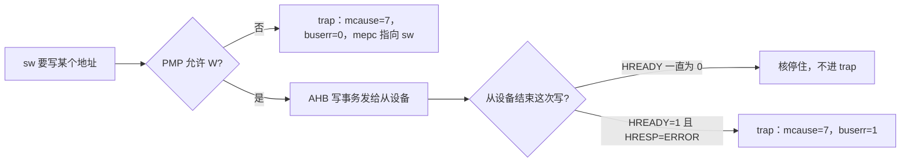

# PMP 与访问错误寄存器：从 Flash XIP 的一次 store 读起

> **平台**：E906 类核，Flash 映射在指令总线（I-BUS）的 XIP 窗口  
> **读者**：不必自己跑过实验；能看懂一份 trap 打印、知道 `sw` 是 32 位写指令即可  
> **本文**：把 PMP 和访问错误相关 CSR 收到「向 XIP 窗口写一个字」这条路径上  
> **定位卡住本身**：[Cursor 协助定位 I-BUS XIP 写挂死](/notes/riscv/cursor-locate-xip-store-hang)

---

## 目录

- [1. 先看一份 trap 打印](#1-先看一份-trap-打印)
- [2. 访问错误相关寄存器](#2-访问错误相关寄存器)
- [3. PMP：发总线之前的地址权限表](#3-pmp发总线之前的地址权限表)
- [4. 同一条 sw 的三种结局](#4-同一条-sw-的三种结局)
- [5. 读 dump 的顺序](#5-读-dump-的顺序)
- [附录 A 寄存器速查](#附录-a-寄存器速查)

---

向 Flash 的 XIP 窗口执行一条 `sw`（store word），现场只会出现三种情况：核停住、进 trap 且 `buserr=1`、进 trap 且 `buserr=0`。后面两节把打印出来的每个字段对上这三种情况。

XIP 的意思是 CPU 把 Flash 的某一段当成普通内存去取指。本文的窗口在 **I-BUS** 上。同一颗核往往还有数据总线（D-BUS）；两段窗口的地址不同，PMP 也按地址分别匹配。

## 1. 先看一份 trap 打印

核没有卡住、走进了异常处理时，一份有用的打印长这样：

```text
CPU Exception: NO.7
store access fault
mtval     : 0x1300....          ← 这次访存的目标地址
mexstatus : ........ buserr=0   ← 0=核内拦住，1=已经上了总线
mepc      : 0x1000....          ← 异常时记录的 PC
pmpcfg0   : ........            ← 当前 PMP 表项
```

`NO.7` 是 RISC-V 的 store access fault。下面每个字段对应一个 CSR（Control and Status Register，核内的控制和状态寄存器）。核若在 `sw` 上停住、根本不进 trap，这些行都不会出现——那种情况放到第 4 节。

## 2. 访问错误相关寄存器

| 寄存器 | 日志里看什么 | 作用 |
|--------|----------------|------|
| `mcause` | `CPU Exception: NO.n` | 异常原因。`7` = store 访问错误，`5` = load，`1` = 取指 |
| `mtval` | `mtval : ...` | 出错的访存地址。应对齐到你以为在写的那扇窗口 |
| `mepc` | `mepc : ...` | 进入异常时记下的 PC。精确异常时指向那条 `sw`；非精确时可能偏后 |
| `mexstatus` | `buserr=0/1` | E906 扩展。bit 8 为 BUSERR：核内拦截还是总线回了 ERROR |
| `MHINT` | 通常不打印 | 其中的精确异常使能位（文档常记 AEE）决定 **总线访问错误** 是否精确；默认关闭 |

`mstatus` 也会进 trap 现场，用来看特权级和中断使能。判断「这次 store 为什么失败」时，上面五个更直接。

**精确 / 非精确**只回答一个问题：`mepc` 是不是那条惹事的指令。

- E906 默认把 **load/store 的总线访问错误** 做成非精确：`mepc` 可能已经跑到 `sw` 后面，`mtval` 仍是目标地址。
- **PMP 违规始终精确**，与 AEE 无关：`mepc` 指向那条 `sw`。
- 打开 AEE 之后，总线访问错误也可以变成精确。本文的对照都在默认（AEE 关闭）下做。

**`buserr` 回答的是另一件事：请求有没有上总线。**

| `buserr` | 含义 |
|----------|------|
| 0 | 核内检查未过（首先怀疑 PMP）。`sw` 没有发到 AHB，从设备给不出 `HRESP` |
| 1 | 事务已经上总线，从设备以 ERROR 结束 |

两者独立：`buserr=1` 时 `mepc` 往往偏后；`buserr=0` 时 `mepc` 落在 `sw` 上。读 dump 先看 `buserr`，再看 `mepc` 是否对齐。

## 3. PMP：发总线之前的地址权限表

PMP（Physical Memory Protection）是 RISC-V 核内的物理地址权限检查。一条 load/store/取指在出核之前，会拿 **指令给出的地址** 去对表：这块地址允不允许 R / W / X。



表在 CSR 里：每个表项一对 `pmpcfg` + `pmpaddr`。E906 这类核常见 4 或 8 或 16 项，编号从 0 开始，**低编号先匹配**。

`pmpcfg` 一个字节里的域：

| 域 | 含义 |
|----|------|
| R / W / X | 允许读 / 写 / 执行 |
| A | 匹配方式：`OFF` 关闭；`TOR` 上界；`NAPOT` 2 的幂次大小的块 |
| L | 锁定。置 1 后复位前改不掉 |

**M 模式（机器模式，固件常用的特权级）下，`L=0` 的表项不限制 RWX。** 只配了 R/W/X、没置 L，看起来像锁了，对正在跑的固件其实没有约束。要在 M 模式拦写，必须 `L=1`；代价是这条表项要等复位才能改。

TOR：表项 *i* 覆盖 `[pmpaddr[i-1]<<2, pmpaddr[i]<<2)`。常用来划一段连续窗口，例如整段 Flash XIP。  
NAPOT：一块对齐的 2ⁿ 字节。E906 的粒度是 128 字节，适合锁一小段探测代码。

PMP 匹配的是指令给出的地址。同一份内容若在 I-BUS 和 D-BUS 上有两个窗口，只锁其中一个，另一次 `sw` 仍可能上总线。

## 4. 同一条 sw 的三种结局

测试固件在 `sw` 前后各打一行串口。向 I-BUS 上的 XIP 窗口写一个字：

| 结局 | 串口 | trap | `buserr` | `mepc` |
|------|------|------|----------|--------|
| 从设备不结束写 | 停在 `sw` 前那一行 | 无 | 看不到 | 看不到 |
| 从设备回 ERROR | 出现 `NO.7` | 有 | 1 | 默认往往偏到 `sw` 之后 |
| PMP 不允许写 | 出现 `NO.7` | 有 | 0 | 指向这条 `sw` |

第一种需要一点 AHB-Lite 背景。一次写分成地址阶段和数据阶段，Master 必须等到从设备拉高 `HREADY`，这一拍才算完成；`HRESP` 标明 OK 还是 ERROR。`HREADY` 一直为 0 时，`sw` 不能退休（指令没有从流水线里真正结束），PC 停在这条写附近，异常处理走不到，上面那些 CSR 也就没有新值可读。

第二种：从设备拉了 `HREADY`，同时 `HRESP=ERROR`。写事务结束，核进 `store access fault`，`buserr=1`。这是「请求已经离开了核」。

第三种：PMP 在核内把 W 挡掉，请求到不了 AHB，`buserr=0`。

## 5. 读 dump 的顺序

1. **有没有 `CPU Exception`？** 没有，且停在 `sw` 前的打点 → 先问这次 AHB 写有没有被从设备结束，再查 PMP。
2. **`mcause` 是不是 7？** 对上 store 访问错误。
3. **`mtval` 是不是你以为在写的窗口？** 对不上就先查地址，别先改 PMP。
4. **`buserr`？** 0 → 核内，去对 `pmpcfg`/`pmpaddr` 是否覆盖 `mtval`，并确认 `L=1`。1 → 请求已上总线，去看 XIP 从设备怎样结束这次写。
5. **`mepc` 是否落在那条 `sw`？** 与第 4 步交叉：PMP 路径应对齐；默认 AEE 下的总线错误常常偏后。

---

## 附录 A 寄存器速查

| 名称 | 标准 / 扩展 | 本文用到的位或值 |
|------|-------------|------------------|
| `mcause` | RISC-V | 7 = store access fault |
| `mtval` | RISC-V | 出错地址 |
| `mepc` | RISC-V | 异常 PC；是否指向 `sw` = 是否精确 |
| `mexstatus` | E906 扩展 | bit 8 BUSERR |
| `MHINT` | E906 扩展 | 精确异常使能（AEE），默认关 |
| `pmpcfg*` | RISC-V | L / A / X / W / R |
| `pmpaddr*` | RISC-V | TOR 上界或 NAPOT 块；地址在 CSR 里右移了 2 位 |

access fault 处理函数至少打印：`mcause`、`mtval`、`mexstatus`（含 BUSERR）、`mepc`、若干 `pmpcfg`/`pmpaddr`。缺 `buserr` 时，PMP 拦截和总线 ERROR 会糊成同一种 `NO.7`。
